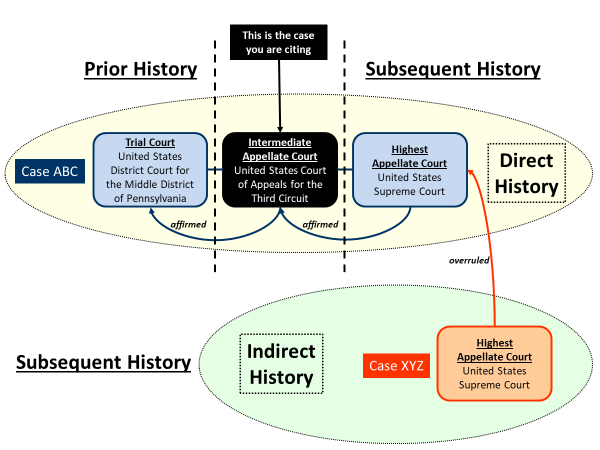

> **Conversion note:** This Markdown edition preserves the book's textual content and its substantive diagram. Repeated decorative icons are omitted. Page markers refer to pages in the source PDF.

## Contents

- [Front Matter](#front-matter)
- [Chapter 1: Legal Citations](#chapter-1-legal-citations)
- [Chapter 2: Cases - Full Citation](#chapter-2-cases---full-citation)
- [Chapter 3: Cases - Short Citation](#chapter-3-cases---short-citation)
- [Chapter 4: Statutes](#chapter-4-statutes)
- [Chapter 5: Other Primary Authority](#chapter-5-other-primary-authority)
- [Chapter 6: Court & Litigation Documents](#chapter-6-court--litigation-documents)
- [Chapter 7: Secondary Authority](#chapter-7-secondary-authority)
- [Chapter 8: Cases - Prior & Subsequent History](#chapter-8-cases---prior--subsequent-history)
- [Chapter 9: Cases - Parallel Citation](#chapter-9-cases---parallel-citation)
- [Chapter 10: Parentheticals](#chapter-10-parentheticals)
- [Chapter 11: Nonprint Sources](#chapter-11-nonprint-sources)
- [Chapter 12: Quotations](#chapter-12-quotations)
- [Chapter 13: String Citations](#chapter-13-string-citations)
- [Chapter 14: Introductory Signals](#chapter-14-introductory-signals)
- [Chapter 15: Pinpoint Information](#chapter-15-pinpoint-information)
- [Chapter 16: Capitalization](#chapter-16-capitalization)
- [Chapter 17: Comprehensive Exercise](#chapter-17-comprehensive-exercise)
- [Appendix: Differences in Rules for Scholarly Writing](#appendix-differences-in-rules-for-scholarly-writing)
- [Index](#index)

---

# Front Matter

<!-- Source PDF page 1 -->

# The Bluebook Uncovered

## A Practical Guide to Mastering Legal Citation

_(Twenty-Second Edition of The Bluebook)_

##### **DIONNE E. ANTHON**

_<u>[dionne.anthon.bbu@gmail.com](mailto:dionne.anthon.bbu@gmail.com)</u>_


---

<!-- Source PDF page 2 -->

© 2025 Dionne E. Anthon. All rights reserved.


---

<!-- Source PDF page 3 -->

For


Mom, Dad, Dean, Aaron, Maria, Vivian, Isabella, Ava, & Mia


Thank you for your constant
love, inspiration, and guidance.


---

<!-- Source PDF page 4 -->


---

<!-- Source PDF page 5 -->

About the Author


Dionne E. Anthon is currently the Communications Manager at the Eden Resort
& Suites in Lancaster, Pennsylvania. Prior to her current position, Professor Anthon taught legal research and writing at Florida International University College
of Law and at Widener University Commonwealth Law School. Professor Anthon
has presented on citation, teaching, assessment, and technology topics at numerous regional and national conferences.


Professor Anthon graduated from the University of Pennsylvania Law School,
where she was an Arthur Littleton and H. Clayton Louderback Legal Writing Instructor and a Production Editor of the Journal of Constitutional Law. After graduating from law school, Professor Anthon clerked for United States District Judge
Christopher C. Conner of the Middle District of Pennsylvania. Before law school,
Professor Anthon worked in information technology consulting, primarily
developing training materials and teaching consultants and clients the
programming language for a business management software package. She earned
a Master of Business Administration degree from the McDonough School of
Business at Georgetown University and a Bachelor of Science in Economics degree
from the Wharton School of Business at the University of Pennsylvania.


---

<!-- Source PDF page 6 -->


---

<!-- Source PDF page 7 -->

### **Summary of Contents**

_Contents ............................................................................................................................. iii_


_Preface ................................................................................................................................ ix_


_Acknowledgments .............................................................................................................. xi_


_Conventions Used in This Book ....................................................................................... xiii_


**PART I** **INTRODUCTION ............................................................... 1**

Chapter 1 Legal Citations ........................................................................................ 3


**PART II** **BASIC CITATION INFORMATION ................................. 13**

Chapter 2 Cases: Full Citation .............................................................................. 15
Chapter 3 Cases: Short Citation ........................................................................... 47
Chapter 4 Statutes .................................................................................................. 61
Chapter 5 Other Primary Authority .................................................................... 81
Chapter 6 Court & Litigation Documents ........................................................... 93
Chapter 7 Secondary Authority ......................................................................... 107


**PART III** **ADDITIONAL CITATION INFORMATION ................... 121**

Chapter 8 Cases: Prior & Subsequent History ................................................. 123
Chapter 9 Cases: Parallel Citation ...................................................................... 137
Chapter 10 Parentheticals ..................................................................................... 151
Chapter 11 Nonprint Sources ............................................................................... 175


**PART IV** **OTHER BLUEBOOK TOPICS ........................................ 189**

Chapter 12 Quotations ........................................................................................... 191
Chapter 13 String Citations ................................................................................... 211
Chapter 14 Introductory Signals .......................................................................... 219
Chapter 15 Pinpoint Information ......................................................................... 233
Chapter 16 Capitalization ..................................................................................... 257


**PART V** **BLUEBOOK RULES IN CONTEXT ................................. 265**

Chapter 17 Comprehensive Exercise ................................................................... 267


_Appendix: Differences in Rules for Scholarly Writing ................................................... 295_


_Index ............................................................................................................................... 303_


---

<!-- Source PDF page 8 -->


---

<!-- Source PDF page 9 -->

### **Contents**

_Preface ................................................................................................................................ ix_


_Acknowledgments .............................................................................................................. xi_


_Conventions Used in This Book ....................................................................................... xiii_


**PART I** **INTRODUCTION ............................................................... 1**

Chapter 1 Legal Citations ........................................................................................ 3
A. Why You Must Cite ............................................................................................ 3
B. The Bluebook ....................................................................................................... 3
C. Jurisdiction- or Court-Specific Citation Rules ................................................. 7
D. Where to Put Citations ....................................................................................... 8
E. Underlining or Italics........................................................................................ 10
F. Common Rules & Tables ................................................................................. 11


**PART II** **BASIC CITATION INFORMATION ................................. 13**

Chapter 2 Cases: Full Citation .............................................................................. 15
A. Introduction ....................................................................................................... 15
B. Case Name ......................................................................................................... 16
C. Case Location ..................................................................................................... 20

1. Volume & Reporter .................................................................................... 22
2. Starting Page & Pinpoint Information ..................................................... 24
3. Public Domain Format ............................................................................... 26
D. Court & Date ...................................................................................................... 28

1. Court ............................................................................................................. 28
a. Jurisdiction Omission .......................................................................... 30

(1) Federal Cases ................................................................................. 30
(2) State Cases ...................................................................................... 30
b. Name of Court Omission .................................................................... 31
2. Date ............................................................................................................... 33
3. Public Domain Format ............................................................................... 33
E. Common Rules & Tables ................................................................................. 33
F. Exercise ............................................................................................................... 34

1. Case Name ................................................................................................... 35
2. Case Location .............................................................................................. 39
3. Court & Date ............................................................................................... 42
4. Full Citation ................................................................................................. 44
Chapter 3 Cases: Short Citation ........................................................................... 47
A. When to Use a Short Citation .......................................................................... 47


---

<!-- Source PDF page 10 -->

B. How to Short Cite ............................................................................................. 48

1. <u>Id. .................................................................................................................. 49</u>
2. Other Short Form ........................................................................................ 51
a. Shortened Case Name ......................................................................... 52
b. Entire Decision ..................................................................................... 54
3. Pinpoint Page(s) .......................................................................................... 54
C. Common Rules & Tables ................................................................................. 55
D. Exercise ............................................................................................................... 55
Chapter 4 Statutes .................................................................................................. 61
A. Full Citation ....................................................................................................... 61

1. Federal Statutes ........................................................................................... 61
2. State Statutes ............................................................................................... 63
3. Year of Code Parenthetical ........................................................................ 65
4. Jurisdiction- or Court-Specific Citation Rules ........................................ 67
B. Short Citation ..................................................................................................... 67

1. When to Short Cite ..................................................................................... 67
2. How to Short Cite ....................................................................................... 69
a. <u>Id............................................................................................................. 70</u>
b. Other Short Forms ............................................................................... 72
C. Pinpoint Information ........................................................................................ 73
D. Statute References in Textual Sentences ........................................................ 75
E. Common Rules & Tables ................................................................................. 75
F. Exercise ............................................................................................................... 75
Chapter 5 Other Primary Authority .................................................................... 81
A. Introduction ....................................................................................................... 81
B. Constitutions...................................................................................................... 81

1. Full Citation ................................................................................................. 81
2. Short Citation .............................................................................................. 83
C. Rules.................................................................................................................... 84

1. Full Citation ................................................................................................. 84
2. Short Citation .............................................................................................. 85
D. Administrative Regulations ............................................................................ 86

1. Full Citation ................................................................................................. 86
2. Short Citation .............................................................................................. 87
E. Common Rules & Tables ................................................................................. 88
F. Exercise ............................................................................................................... 89
Chapter 6 Court & Litigation Documents ........................................................... 93
A. Introduction ....................................................................................................... 93
B. Full Citation ....................................................................................................... 94

1. Document Name/Title .............................................................................. 95
2. Pinpoint Information ................................................................................. 96


---

<!-- Source PDF page 11 -->

3. Date ............................................................................................................... 98
4. Electronic Case Filing (ECF) Number ...................................................... 98
C. Short Citation ..................................................................................................... 99

1. When to Short Cite ..................................................................................... 99
2. How to Short Cite ..................................................................................... 100
D. Parentheses ...................................................................................................... 101
E. Common Rules & Tables ............................................................................... 102
F. Exercise ............................................................................................................. 103
Chapter 7 Secondary Authority ......................................................................... 107
A. Introduction ..................................................................................................... 107
B. Books ................................................................................................................. 107

1. Full Citation ............................................................................................... 107
a. Authors ................................................................................................ 108
b. Title ...................................................................................................... 109
2. Short Citation ............................................................................................ 110
C. Periodicals ........................................................................................................ 111

1. Full Citation ............................................................................................... 111
a. Consecutively Paginated Periodical ................................................ 112
b. Non-Consecutively Paginated Periodical ....................................... 112
c. Authors & Title ................................................................................... 113
d. Abbreviation for Name of Periodical .............................................. 113
2. Short Citation ............................................................................................ 114
D. Common Rules & Tables ............................................................................... 115
E. Exercise ............................................................................................................. 116


**PART III** **ADDITIONAL CITATION INFORMATION ................... 121**

Chapter 8 Cases: Prior & Subsequent History ................................................. 123
A. Introduction ..................................................................................................... 123
B. Direct History .................................................................................................. 125

1. Direct Subsequent History ...................................................................... 125
a. When to Include Direct Subsequent History ................................. 125
b. Basic Citation Format ........................................................................ 126
c. Years of Decisions .............................................................................. 127
2. Direct Prior History .................................................................................. 127
a. When to Include Direct Prior History ............................................. 127
b. Basic Citation Format ........................................................................ 128
c. Years of Decisions .............................................................................. 128
3. Prior & Subsequent History .................................................................... 129
4. Changes to Case Names .......................................................................... 129
C. Indirect History ............................................................................................... 130
D. Common Rules & Tables ............................................................................... 130


---

<!-- Source PDF page 12 -->

E. Exercise ............................................................................................................. 131
Chapter 9 Cases: Parallel Citation ...................................................................... 137
A. Introduction ..................................................................................................... 137
B. When to Use a Parallel Citation .................................................................... 137
C. How to Include a Parallel Citation ............................................................... 139

1. Full Citation ............................................................................................... 139
2. Short Citation ............................................................................................ 141
D. Common Rules & Tables ............................................................................... 142
E. Exercise ............................................................................................................. 143
Chapter 10 Parentheticals ..................................................................................... 151
A. Introduction ..................................................................................................... 151
B. Weight of Authority Parenthetical (Case Citations Only)......................... 152

1. Types of Weight of Authority ................................................................. 153
a. General Weight of Authority Information ..................................... 153
b. Not a Single, Clear Holding of Majority ......................................... 153
2. Weight of Authority & Short Citations ................................................. 155
3. Weight of Authority of Case History ..................................................... 157
C. Quoting/Citing Parenthetical ....................................................................... 158
D. Explanatory Parenthetical .............................................................................. 160

1. Quoted Sentence(s) Form ........................................................................ 161
2. Present Participial Phrase Form ............................................................. 162
3. Short Statement Form .............................................................................. 164
E. Order of Parentheticals .................................................................................. 165
F. Common Rules & Tables ............................................................................... 166
G. Exercise ............................................................................................................. 166
Chapter 11 Nonprint Sources ............................................................................... 175
A. Introduction ..................................................................................................... 175
B. Citations to Cases & Statutes in Commercial Electronic Databases ........ 175

1. Cases ........................................................................................................... 175
a. Full Citation ........................................................................................ 176
b. Short Citation ...................................................................................... 178
2. Statutes ....................................................................................................... 179
C. Citations to Internet Sources ......................................................................... 180

1. When to Include the URL in a Citation ................................................. 180
2. How to Include the URL in a Full Citation ........................................... 182
D. Common Rules & Tables ............................................................................... 185
E. Exercise ............................................................................................................. 185


**PART IV** **OTHER BLUEBOOK TOPICS ........................................ 189**

Chapter 12 Quotations ........................................................................................... 191
A. Introduction ..................................................................................................... 191


---

<!-- Source PDF page 13 -->

B. Formatting Quotations ................................................................................... 192

1. Quotations with Fifty or More Words ................................................... 192
2. Quotations with Forty-Nine or Fewer Words ...................................... 193
3. Citations of Quotations within Quotations ........................................... 194
C. Omissions in Quotations ................................................................................ 195

1. Omissions at the Beginning of or Within a Quotation ........................ 196
2. Omissions at the End of a Quotation ..................................................... 196
3. Omissions When Using More Than One Sentence of Quoted
Language ................................................................................................... 198
4. Omissions Necessitating Alterations ..................................................... 200
5. Omissions of Citations within Quoted Language ............................... 200
D. Alterations in Quotations ............................................................................... 200

1. Changing Letters or Words & Removing Letters ................................ 201
2. Indicating Emphasis Added & Alterations in Quoted Language ..... 202
3. Indicating Mistakes .................................................................................. 203
4. Modifying for Clarity ............................................................................... 204
E. Common Rules & Tables ............................................................................... 204
F. Exercise ............................................................................................................. 204
Chapter 13 String Citations ................................................................................... 211
A. Introduction ..................................................................................................... 211
B. How to String Cite .......................................................................................... 211
C. Order of Authorities Within a String Citation ............................................ 212
D. String Citations & the Use of Id. ................................................................... 213
E. Common Rules & Tables ............................................................................... 214
F. Exercise ............................................................................................................. 214
Chapter 14 Introductory Signals .......................................................................... 219
A. Signals Basics ................................................................................................... 219
B. Categories of Signals ...................................................................................... 220

1. Signals Indicating Support ...................................................................... 221
2. Signal Suggesting a Useful Comparison ............................................... 222
3. Signals Indicating Contradiction ............................................................ 222
4. Signal Indicating Background Material ................................................ 223
C. Signals & String Citations .............................................................................. 223

1. Order & Format of Multiple Authorities Within One Signal ............. 224
2. Order & Format of Different Signals from One Category .................. 224
3. Order & Format of Signals from Different Categories ........................ 225
a. Citation Sentence ................................................................................ 226
b. Citation Clause ................................................................................... 226
D. Common Rules & Tables ............................................................................... 227
E. Exercise ............................................................................................................. 228


---

<!-- Source PDF page 14 -->

Chapter 15 Pinpoint Information ......................................................................... 233
A. Introduction ..................................................................................................... 233
B. Pages in General .............................................................................................. 233

1. Page Numbers for Main Text .................................................................. 233
2. Footnotes or Endnotes Only ................................................................... 235
3. Main Text & Footnotes or Endnotes ...................................................... 237
C. Pages from Electronic Databases .................................................................. 237
D. Sections & Paragraphs .................................................................................... 244
E. Common Rules & Tables ............................................................................... 248
F. Exercise ............................................................................................................. 248

1. Pages ........................................................................................................... 249
2. Sections & Paragraphs ............................................................................. 254
Chapter 16 Capitalization ..................................................................................... 257
A. Capitalization in Textual Sentences ............................................................. 257
B. Common Rules & Tables ............................................................................... 261
C. Exercise ............................................................................................................. 261


**PART V** **BLUEBOOK RULES IN CONTEXT ................................. 265**

Chapter 17 Comprehensive Exercise ................................................................... 267
A. Instructions ...................................................................................................... 267
B. Document to Review for Bluebook Errors .................................................. 269
C. Library of Statute & Cases Used in Document to Review ........................ 272


_Appendix: Differences in Rules for Scholarly Writing ................................................... 295_


_Index ............................................................................................................................... 303_


---

<!-- Source PDF page 15 -->

### **Preface**

Students and practitioners are often frustrated when trying to apply Bluebook
rules in their writing. My goal with this book is to provide an easy to understand
guide to the rules that alleviates those frustrations and allows students and practitioners to spend more time on other aspects of their writing and on research and
analysis. And to do so for free—and, thanks to West Academic, I am able to do so.


This book is designed to help first-year law students master the fundamental Bluebook citation rules that will be needed in legal research and writing courses and
in legal practice. It can also act as a Bluebook refresher for other law students,
clerks, attorneys, judges, and paralegals.


This book presents the detailed citation rules that are scattered throughout numerous sections of the Bluebook in an organized and easily accessible manner. In addition, this book includes exercises to aid in understanding and mastering the
rules.


Part I of this book provides an introduction to legal citations. Part II covers basic
citations to the most commonly cited primary authority (cases, statutes, constitutions, rules, administrative regulations, and court and litigation documents) and
secondary authority (books and periodicals). Part III addresses additional information that may be included on basic citations—case history, parallel citations,
parenthetical information, and information regarding nonprint sources. Part IV
presents Bluebook topics that are not specific to just one citation or one type of
authority—quotations, string citations, introductory signals, pinpoint information, and capitalization.


Part V of this book has a comprehensive exercise that incorporates concepts from
many of the chapters in the previous parts. The comprehensive exercise puts citations in the context of a legal document, requiring the type of review and editing
necessary in legal research and writing courses and in practice.


[I welcome any feedback on this book (dionne.anthon.bbu@gmail.com).](mailto:dionne.anthon.bbu@gmail.com)


Dionne E. Anthon
August 2025


---

<!-- Source PDF page 16 -->


---

<!-- Source PDF page 17 -->

### **Acknowledgments**

**Current Edition of This Book (for the Twenty-Second Edition of The Bluebook):**


I would like to thank Professor Elisabeth Keller at Boston College Law School
for providing her thoughts on reorganizing the “Why You Must Cite” section
in Chapter 1.


All errors are my own, and I would appreciate being alerted to any. I can be
[reached at dionne.anthon.bbu@gmail.com.](mailto:dionne.anthon.bbu@gmail.com)


**Second Edition of This Book (for the Twenty-First Edition of The Bluebook):**


I need to thank West Academic for agreeing to release the copyright of this
book back to me so that I could make this book available for free.


I also thank Aaron Anthon for reviewing this edition. All remaining errors are
my own.


**First Edition of This Book (for the Twentieth Edition of The Bluebook):**


I need to thank many people who contributed to this book. Professors Anna
Hemingway and Amanda Sholtis encouraged me to transform my course materials into this book. They, along with Professor Jennifer Lear, provided invaluable feedback on early drafts.


Other legal research and writing professors—those at Widener University
Commonwealth Law School and Florida International University College of
Law—also provided feedback. In addition, I received student perspectives and
feedback from the first-year students at Widener University Commonwealth
Law School and Florida International University College of Law.


I also thank Mac Soto, Carol Logue, Louis Higgins, and Christopher Hart at
West Academic for their help and guidance in the publishing process. In addition, I would like to thank the countless others there who worked behind the
scenes to help publish this book.


Last, but certainly not least, I must thank Alexander Sharpe. Without his meticulous review, edits, and suggestions involving the prior edition of this book,
this book and corresponding Teacher’s Manual would not be possible. Thank
you, Alex.


---

<!-- Source PDF page 18 -->


---

<!-- Source PDF page 19 -->

### **Conventions** **Used in This Book**

This book uses the following icons and text boxes to convey particular information:


This icon represents a note or additional information
regarding a particular Bluebook rule or concept.


This icon represents a useful tip.


This icon represents navigation information—i.e.,
where you can find information in other chapters of the
book.


This icon represents a warning.


---

<!-- Source PDF page 20 -->

Throughout this book, examples of citations, quotations, and text are in a `mono-`
`spaced font` to enable you to determine more easily where there are, and are
not, spaces. For example:

```
  Burck v. Mars, Inc., 571 F. Supp. 2d 446, 453-54
  (S.D.N.Y. 2008); see also Lombardo v. Doyle, Dane &
  Bernbach, Inc., 396 N.Y.S.2d 661, 665 (App. Div. 1977).

```


---

<!-- Source PDF page 21 -->

## **The Bluebook Uncovered**


---

<!-- Source PDF page 22 -->


---

<!-- Source PDF page 23 -->

# Part I: Introduction


---

<!-- Source PDF page 24 -->


---

<!-- Source PDF page 25 -->

# Chapter 1: Legal Citations

**A.** **Why You Must Cite**


In legal writing, citing your authorities (or sources) of information is crucial because it adds credibility to your analysis of the legal issues you are addressing. To
be able to trust your analysis, your reader (e.g., a supervising attorney or judge)
will want to know that it is based on valid law and relevant legal authority. Your
citations provide that assurance and allow the reader to verify your analysis. The
importance of citing your authorities cannot be overstated.


You also provide citations so that you do not plagiarize someone else’s work or
ideas. According to the Legal Writing Institute, you should provide citations in
five situations: “(1) acknowledge direct use of someone else’s words,
(2) acknowledge any paraphrase of someone else's words, (3) acknowledge direct
use of someone else’s idea, (4) acknowledge a source when your own analysis or
conclusion builds on that source, and (5) acknowledge a source when your idea
about a legal opinion came from a source other than the opinion itself.” <sup>1</sup>


**B.** **The Bluebook**


There are two main sources of rules for citing to legal authority: (1) The Bluebook:
<u>A Uniform System of Citation (22nd ed. 2025) and (2) ALWD Citation Manual: A</u>
<u>Professional System of Citation (7th ed. 2021).</u>


This book covers <u>The Bluebook</u> (22nd edition).
Specifically, it covers the first version of the 22nd
edition of <u>The Bluebook, which was released in June</u>
2025. At times, the editors of The Bluebook make slight
changes and updates before publishing a new edition.
For past editions of <u>The Bluebook, the editors have</u>
indicated such changes and updates on The Bluebook’s
[website: https://www.legalbluebook.com.](https://www.legalbluebook.com/)


1 Legal Writing Inst., _Law School Plagiarism v. Proper Attribution_ 4 (2003), <u>[https://staging-](https://staging-mp6ykpkm7cbbg.us.platform.sh/sites/default/files/policy%20%281%29.pdf)</u>
<u>[mp6ykpkm7cbbg.us.platform.sh/sites/default/files/policy (1).pdf.](https://staging-mp6ykpkm7cbbg.us.platform.sh/sites/default/files/policy%20%281%29.pdf)</u>


---

<!-- Source PDF page 26 -->

To master the fundamental Bluebook citation rules,
your goal should not be to memorize all of the rules.
Your goal should be to become familiar with the
different types of citations and rules so that you can
easily look up and apply the applicable rules.


The Bluebook consists of three main parts (in this order):


1. The Bluepages
2. The Rules (i.e., the “Whitepages”)
3. The Tables


Look through your Bluebook as you read the descriptions below of these three
main parts.


<u>The Bluepages: The Bluepages contain the citation rules and tables applicable to</u>
the types of documents that one would write in practice (e.g., a brief, a memo, or
an opinion), which are the subject of this book. The Bluebook sometimes refers to
these types of documents as “non-academic legal documents.” Do not be confused
by this term. It is referring to the types of documents that you will write in your
legal research and writing courses and in practice, so you will follow the Bluepages
rules.


---

<!-- Source PDF page 27 -->

In the Bluebook, “academic publications” or “academic
legal documents” refers to the scholarly writing you
find in law reviews and journals. In law school, you will
write and edit such documents if you join one of your
school’s journals or law review. You will also typically
write such a document to fulfill your school’s writing
requirement, which is often accomplished in a seminar
course. When writing such academic legal documents,
you will use only the rules in the Whitepages, not the
Bluepages.


Even when writing non-academic legal documents that
follow the Bluepages rules, you will still need to consult
the Whitepages rules because those rules are the basis
for the Bluepages rules, and they provide more details.
In fact, a Bluepages rule will often refer you to related
Whitepages rule(s).


The Appendix covers the main ways that citations in
academic legal documents (i.e., scholarly writing) differ
from citations in non-academic legal documents. If you
are participating in a competition to join the law review
or a journal at your law school or you are writing a
seminar paper, this Appendix will help you understand
how the citations differ from those you used in your
legal research and writing courses.


Bluepages Rules B1 through B9 are general rules, and Bluepages Rules B10
through B21 are rules that are specific to particular types of authority. For example,
Bluepages Rule B5 involves quotations, and Bluepages Rule B10 involves cases.


<u>The Whitepages: The Whitepages contain 21 rules, the topics of which mirror those</u>
in the Bluepages. For example, both Bluepages Rule B10 and Whitepages Rule 10
involve (or pertain to) citations of cases. The Whitepages rules contain more details
than the Bluepages rules.


---

<!-- Source PDF page 28 -->

Although the Whitepages rules contain more details,
you should generally begin your search for answers in
the Bluepages because they contain the most common
rules needed for the types of documents that you will
write in your legal research and writing course and in
practice, and they refer you to additional details in the
Whitepages.


<u>The Tables: Supplementing the citation rules in the Bluepages and Whitepages are</u>
tables that provide additional information for the rules. For example, Table T6 contains a list of words that you should abbreviate in case names, institutional author
names, and periodical titles in citations. The rules will refer you to the applicable
table(s).


Always review the general information at the
beginning of a table to guide your use of that table.


Most tables come after the Whitepages, but the Bluepages have two tables at the
end of the Bluepages.


This book refers to a rule in the Bluepages as “BP Rule
Bx” and a rule in the Whitepages as “Rule x” (where “x”
is the rule number). Likewise, this book refers to a table
in the Bluepages as “BP Table BTx” and a table after the
Whitepages as “Table Tx” (where “x” is the table
number).


To help you find the rules relevant to a particular authority you wish to cite, you
can use the Contents pages that appear before the Bluepages or the Index that appears after the tables. In addition, you can use the Quick Reference guide on the
inside _back_ cover of the Bluebook to view some common citation forms and their
applicable rules (note: the inside _front_ cover has examples for citations in law reviews, journals, and other academic legal documents).


---

<!-- Source PDF page 29 -->

When you consult the rules in the Whitepages and the
tables after the Whitepages, be aware that the
examples conform to the standards for law reviews
and journals, not the “non-academic legal documents”
that you will be writing in practice or in your legal
research and writing class. You always need to check
the Bluepages rules to determine what, if any, changes
are appropriate for your writing.


For example, a case name in the Whitepages and tables
may not be underlined or italicized, but, according to
BP Rule B2, the Bluepages require a case name to be
underlined or italicized.


When citing to authority, do not rely on the citations
that you see in other sources (e.g., citations that you
see in cases). Likewise, do not rely on any citation help
features of electronic databases such as Westlaw,
Lexis, and Bloomberg Law.


Although such citations may appear to be, or are
supposed to be, in Bluebook format, often they are not.
You will have to use your Bluebook to ensure proper
citation format.


**C.** **Jurisdiction- or Court-Specific Citation Rules**


Some jurisdictions or courts have their own specific citation rules that take precedence over Bluebook rules. These citation rules may be found in a jurisdiction’s
court rules, style guide, or other jurisdiction- or court-specific documents. When
preparing a legal document in practice, be sure to follow any of these specific citation rules.


---

<!-- Source PDF page 30 -->

Your professor may require you to follow jurisdictionor court-specific citation rules. Generally, such rules do
not differ significantly from Bluebook rules, and often
they do not encompass everything covered in Bluebook
rules. Therefore, you will normally also need to learn
Bluebook rules.


You can use BP Table BT2 to determine whether a jurisdiction or court has any
specific citation rules or style guides. For example, the Florida state court listing in
this table has the following entry:


 - Fla. R. App. P. 9.800 (citation of various types of legal authority)


Given this entry, you would need to review Rule 9.800 of the Florida Rules of Appellate Procedure, which gives some specific citation rules and indicates that citations not covered by this rule should follow Bluebook rules or, if no appropriate
Bluebook rule exists, the Florida Style Manual.


BP Table BT2 comprises three subparts—BT2.1 involves federal courts, BT2.2 involves state courts, and BT2.3 involves territories.


This book does not cover any jurisdiction- or courtspecific citation rules; it covers only Bluebook rules.


**D.** **Where to Put Citations**


For the types of documents that you will write in your legal research and writing
course (i.e., non-academic legal documents), your citations should appear directly
within the main text of your document, not in footnotes as Rule 1.1 requires for
academic legal documents, unless jurisdiction- or court-specific citation rules permit or require citations to be in footnotes (see BP Rule B1.1).


Because you will generally put your citations directly with your text, you should
understand three phrases you will encounter throughout the Bluebook:


  - <u>Textual sentence – This phrase refers to</u> _your_ sentence. In other words,
it is essentially any of your writing that is not a citation.


---

<!-- Source PDF page 31 -->

- <u>Citation sentence – This phrase refers to a citation that is contained in</u>
a separate sentence after a textual sentence (i.e., your textual sentence
should end with a period and then your citation sentence should begin
with a capital letter and end with a period). A citation sentence should
be used to cite to a particular authority or authorities that relate to the
entire preceding textual sentence. To illustrate, imagine that you write
a sentence (a textual sentence) that gives part of a rule, and you got
that part from one case. After your sentence, you would need to cite
to that case, and you would do so in a citation sentence after your textual sentence.


- <u>Citation clause – This phrase refers to a citation that is contained</u> _within_
your textual sentence. Unlike a citation sentence, it does not automatically begin with a capital letter (unless the first letter would otherwise
be capitalized according to the rules), nor does it automatically end
with a period. Citation clauses should be used to cite to a particular
authority or authorities that relate to only part of a textual sentence,
and they should immediately follow that part of the sentence and be
set off by commas (unless the citation clause is at the end of the textual
sentence, in which case a period should be used at the end of the clause
to represent the end of the textual sentence).


You should use citation sentences, not clauses,
whenever possible because citation clauses break up
the flow of your textual sentence and make reading it
more difficult.


This book uses one space between sentences—textual
and citation sentences. If you use two spaces between
sentences, you do so between all sentences, whether
textual or citation sentences.


---

<!-- Source PDF page 32 -->

BP Rule B1.1 discusses the distinction between citation sentences and clauses. The
following example illustrates all three phrases:

```
   Under Pennsylvania’s right-of-publicity statute, a
  person’s “name or likeness” cannot be “used for any
  commercial or advertising purposes” without that
  person’s written consent if that person’s “name or
  likeness has commercial value.” 42 Pa. Cons. Stat.
  § 8316 (2007). A well-known chef’s name may have
  commercial value, Lewis v. Marriott Int’l, Inc., 527
  F. Supp. 2d 422, 428 (E.D. Pa. 2007), but a well  known intellectual property attorney could not prove
  that his name did, Tillery v. Leonard & Sciolla, LLP,
  437 F. Supp. 2d 312, 318, 329 (E.D. Pa. 2006).

```

In this example, the first sentence (which starts with “Under Pennsylvania’s rightof publicity statute”) is a _textual_ sentence. Notice that the sentence ends with a
period. Immediately following this textual sentence is a citation to section 8316 of
title 42 of the Pennsylvania Consolidated Statutes. It is a citation _sentence_, and the
sentence ends with a period (after the year parenthetical). Following this citation
sentence is another textual sentence with two citation _clauses_ within that sentence—one to the Lewis case and one to the Tillery case. Notice that commas set
off these citation clauses; the Tillery citation ends with a period instead of a comma
because that citation is at the end of the entire sentence.


Although the example above uses real legal authority,
many examples and exercises in the book use fictional
authority.


**E.** **Underlining or Italics**


In the Bluepages rules, you will see examples with underlining. Similar examples
in the Whitepages use italics. Although the Whitepages require italics in law reviews and journals, BP Rule B2 allows either italics or underlining in non-academic legal documents. Such documents, however, should consistently use one or
the other (i.e., one such document should not use both italics and underlining).


---

<!-- Source PDF page 33 -->

Although many readers prefer italics to underlining,
this book uses underlining so that you can more easily
see when text needs to be underlined or italicized. If
your professor, supervisor, or any jurisdiction- or
court-specific rules require italics, you should use italics
in all instances where underlining is used in this book.


**F.** **Common Rules & Tables**


The following table provides the common Bluebook rules and tables for legal citations in general:


**Rule or Table** **Description**


BP Rule B1.1 Citation Sentences & Clauses


BP Rule B2 Typeface Conventions (i.e., underlining & italics)


Jurisdiction- or Court-Specific Citation Rules &
BP Table BT2

<u>Style Guides</u>


---

<!-- Source PDF page 34 -->


---

<!-- Source PDF page 35 -->

# Part II: Basic Citation Information


---

<!-- Source PDF page 36 -->


---

<!-- Source PDF page 37 -->

# Chapter 2: Cases - Full Citation

**A.** **Introduction**


Unless a short citation to a case is permitted (see Chapter 3), you should use a full
citation. A citation is “full” when you include all of the information that the reader
would want to know about the case. The basic information that is included in a
full case citation is the following:


  - who the parties to the case are (i.e., the case name);

  - where the case can be found (i.e., the case location); and

  - what the “weight,” or precedential value, of the case is (i.e., the court
and date).


A full case citation may also include the history of the case, if any, and other parenthetical information. The descriptions, examples, and exercise in this chapter assume that no such additional information is required in the case citation.


Chapter 8 covers case history, and Chapter 10 covers
parenthetical information.


Here is an example full case citation sentence (note: the period at the end of the
citation represents the end of the citation sentence and is not otherwise part of the
citation):

```
   Panei v. Perez, 68 A.2d 2, 5 (Pa. Super. Ct. 1996).

```

Case Name Case Location Court & Date


---

<!-- Source PDF page 38 -->

When you are drafting a document, you should not
stop to ensure perfect Bluebook format; otherwise, you
will likely lose your writing momentum. Instead, use
shorthand notations that will enable you to go back and
“Bluebook” your citations at the end. Be sure to leave
enough time at the end for this task and, in your
shorthand notations, include the appropriate pinpoint
information so that you do not have to take time to hunt
for it at the end. For example, for a case, your shorthand
notation should include at least one of the party’s
names and the pinpoint page(s) for the specific
information you are citing.


**B.** **Case Name**


The “case name” portion of a full citation includes the names of the parties in the
case. Most case names that you will find in the caption of an opinion, however,
contain more information than is necessary for a full citation. For example, if a
party is an individual, you should use only the last name of the individual (see
BP Rule B10.1.1(ii)). Likewise, you should use only the first party’s name on each
side of the “v.” (see BP Rule B10.1.1(i)).


For example, if a case caption indicates Anna Hemingway, Ann Fruth, and David
Raeker-Jordan, Plaintiffs, v. Amanda Sholtis and Jennifer Lear, Defendants, the
case name would be the following:

```
  Hemingway v. Sholtis

```


---

<!-- Source PDF page 39 -->

Always underline the entire case name (see BP Rule
B2). Do not, however, underline the comma that
belongs after the case name and before the case location
in a citation.


You must also underline case names in textual sentences, even if they are used without an immediate citation. Do not, however, underline a party name when
referring to the actual party, not the case. For example:

```
            In Lear, the court held that the
            employer wrongfully terminated Lear.
            [Citation omitted.]

```

Recall that BP Rule B2 allows underlining or italics, but
this book uses underlining so that you can more easily
see when text needs to be underlined or italicized.


Rule 10.2 has detailed rules for case names. It comprises two subsections. The first
one (Rule 10.2.1) covers case names in textual sentences and citations. The second
one (Rule 10.2.2) includes additional rules for case names in citations only. In other
words, for case names in citations, you need to follow both subsections.


Keep in mind that the examples of case names you see
in Rule 10.2.1 may not be correct for case names in
citations because case names in citations must also
follow the additional rules in Rule 10.2.2.


Although using two subsections may seem confusing at first, the only distinction
between case names in textual sentences and case names in citations is the level of
abbreviation required. According to Rule 10.2.2, in citations, you need to abbreviate more words than in textual sentences.


There is a limited list of abbreviations that are appropriate for textual sentences
(see BP Rule B10.1.1(vi) and Rule 10.2.1(c)). Along with widely known acronyms
(see Rule 6.1(b)), the following eight words should be abbreviated in textual sentences, unless they are the first word of a party’s name:


---

<!-- Source PDF page 40 -->

- and (&)

  - Association (Ass’n)

  - Brothers (Bros.)

  - Company (Co.)

  - Corporation (Corp.)

  - Incorporated (Inc.)

  - Limited (Ltd.)

  - Number (No.)


According to Rule 10.2.2, for case names in citations, you must also abbreviate any
word listed in Table T6, unless the word is part of a geographical location (e.g., a
state or country) and that geographical location is the entire party name.


When using Tables in <u>The Bluebook, review the</u>
information at the beginning of each table to
understand how to use each table and to learn any
important general information or rules regarding the
table.


The following example illustrates the difference in the abbreviations used in a textual sentence versus a citation. In a case of Southern Hospital versus Medical Supplies, Incorporated, the following case names would be correct:


For a textual sentence:

```
   Southern Hospital v. Medical Supplies, Inc.

```

For a citation:

```
   S. Hosp. v. Med. Supplies, Inc.

```

For case names in citations, Table T6 also allows, but
does not require, you to abbreviate other words that are
eight or more letters “if substantial space is thereby
saved and the result is unambiguous in context.” This
book, however, does not use any such discretionary
abbreviations.


---

<!-- Source PDF page 41 -->

According to Rule 10.2.2, in addition to abbreviating words according to Table T6,
in citations (not textual sentences), you must abbreviate geographical locations
listed in Table T10, unless that geographic location is the entire name of the party.


For example, in a case of Jennifer Dorfmeister versus the University of Pennsylvania, the following case names would be correct:


For a textual sentence:

```
   Dorfmeister v. University of Pennsylvania

```

For a citation:

```
   Dorfmeister v. Univ. of Pa.

```

But, in a case of Elliot Avidan versus the United States, the following case name
would be correct in a textual sentence and a citation (because, although Table T10.3
indicates that “United States” should be abbreviated as “U.S.,” United States is the
entire party name):

```
  Avidan v. United States

```

Be aware that your word processor may automatically
capitalize the first letter of any word after a period. Because many of the abbreviations in Table T6 and Table
T10 end with a period, this automatic capitalization
may capitalize another word in the case name that
should not be capitalized. For example:


<u>`Brown v. Bd. Of Educ.`</u>  incorrect

<u>`Brown v. Bd. of Educ.`</u> ✓ correct


Rule 10.2.1 has many other detailed rules for case names. One such rule involves
whether and how to include geographical terms. “State of,” “Commonwealth of,”
and “People of” should be omitted, except when citing decisions of courts of that
state. When citing decisions of courts of that state, only ‘State,” “Commonwealth,”
or “People” should be used. See Rule 10.2.1(f) . For example:

```
  Miranda v. Arizona, 384 U.S. 436 (1966).

  State v. Jones, 216 A.3d 907 (Md. 2019).

```

In the first example above, the full name of second party is State of Arizona. Because the deciding court is not an Arizona state court (it is the U.S. Supreme


---

<!-- Source PDF page 42 -->

Court), the “State of” is omitted from the party name. In the second example
above, the full name of the first party is State of Maryland. Because the deciding
court is a Maryland state court, only “State” is used as the party name.


See Rule 10.2.1 for many other detailed rules for case
names that apply to both textual sentences and citations
(but remember for citations to also apply the additional
abbreviation rules in Rule 10.2.2). The exercise for this
chapter will teach you many of these other rules by
requiring you to apply them to answer the questions.


**C.** **Case Location**


The “case location” portion of a full citation indicates where the reader can find
the case. This chapter covers cases published in reporters and in a public domain
format.


Chapter 11 covers cases published only in electronic
sources.


Different jurisdictions have their cases published in different reporters, and many
jurisdictions have their cases published in multiple reporters. Therefore, one case
may be located in multiple reporters. Some states require that you use parallel citations for cases from that state that are located in multiple reporters. The descriptions, examples, and exercise in this chapter assume that a parallel citation to multiple reporters is not required.


---

<!-- Source PDF page 43 -->

Chapter 9 covers parallel citations involving multiple
reporters.


Each reporter has many volumes to contain the numerous cases published in it. In
addition, many reporters have a number of series. For example, the Atlantic Reporter has three series—Atlantic Reporter; Atlantic Reporter, Second Series; and
Atlantic Reporter, Third Series. Each series of a reporter begins with volume 1.


For cases published in reporters, you must indicate the following information
when specifying the location of a case in a basic full citation (see BP Rule B10.1.2
and Rule 10.3):


  - volume number;

  - reporter abbreviation;

  - starting page number; and

  - pinpoint information (“pincite”) when citing material located on a
specific page(s) of the case.


The first three pieces of information above allow the reader to find the case. The
pinpoint information allows the reader to find the exact location in the case that
supports the proposition for which you are citing the case. Not only will this information allow the reader to find the case in the print reporter, but it will also
allow the reader to find the case in an electronic service (e.g., Westlaw, Lexis, and
Bloomberg Law).


Let’s look at the case location information from the example citation sentence from
Section A:

```
   Panei v. Perez, 68 A.2d 2, 5 (Pa. Super. Ct. 1996).

```

Case Location


“68” is the volume number, “A.2d” is the reporter abbreviation (it refers to the
Atlantic Reporter, Second Series), “2” is the starting page number, and “5” is the
pinpoint information. Therefore, the reader can find the case in volume 68 of the
Atlantic Reporter, Second Series. The case starts on page 2 of that reporter, and
page 5 contains the specific information being cited.


---

<!-- Source PDF page 44 -->

Notice in the example above that the case location
information immediately follows a comma and space
after the case name.


**1.** **Volume & Reporter**


If a case is published in multiple reporters, you first need to determine which reporter to cite. <sup>1</sup> Table T1 provides that information and indicates the appropriate
abbreviation for the reporter. Table T1 comprises four subparts arranged by jurisdiction. The first two subparts involve the federal jurisdiction—T1.1 for federal
judicial and legislative material and T1.2 for federal administrative and executive
material. T1.3 involves the states, and T1.4 involves other U.S. jurisdictions, such
as Puerto Rico and the Virgin Islands. Finally, T1.5, which is new in the 22nd edition of The Bluebook, involves tribal nations.


The example citation above is to a case from the Superior Court of Pennsylvania.
Assume that this case is published in two reporters: (1) volume 68 of the Atlantic
Reporter, Second Series, and (2) volume 454 of the Pennsylvania Superior Court
Reports. The example citation uses the Atlantic Reporter, Second Series, because
the entry for Pennsylvania in Table T1.3 indicates that the Atlantic Reporter is the
preferred reporter.


Here is the entry for the Pennsylvania Superior Court in Table T1.3:


**Superior Court** (Pa. Super. Ct.): Cite to A., A.2d, or A.3d, if therein. For cases
decided after December 31, 1998, use the following public domain citation
format:


  - Rapagnani v. Judas Co., 1999 PA Super 203, ¶ 3.


 - Atlantic Reporter 1931-date A., A.2d, A.3d

 - Pennsylvania Superior Court 1895-1997 Pa. Super.
Reports


1 As noted above, you will sometimes be required to include multiple reporters in one citation in a
parallel citation, but this chapter assumes that a parallel citation is not required.


---

<!-- Source PDF page 45 -->

This entry in Table T1.3 indicates that you should cite to A., A.2d, or A.3d (i.e.,
Atlantic Reporter; Atlantic Reporter, Second Series; or Atlantic Reporter, Third Series) for a Pennsylvania Superior Court case, if the case is published there. <sup>2</sup> In addition, in the entry, that reporter is listed before the Pennsylvania Superior Court
Reports (i.e., the other reporter that contains Pennsylvania Superior Court cases),
so the Atlantic Reporter is the preferred reporter for a citation to a Pennsylvania
Superior Court case.


Because each series of a particular reporter starts at
volume 1, the volume number alone does not
distinguish which series contains the case (e.g., all three
series of the Atlantic Reporter contain a volume 10).
You need to ensure that you indicate the correct series
in the reporter abbreviation.


Some reporter abbreviations do not include spaces. For example:

```
  A.2d
  F.3d

```

Rule 6.1(a) indicates that you should not use spaces between words within an abbreviation that are adjacent single capital letters and that you should consider numerals and ordinals as a single capital letter. Therefore, the two reporter abbreviations above do not contain any spaces.


The following are examples of reporter abbreviations that contain spaces between
words because the abbreviations do not contain adjacent single capital letters (see
Rule 6.1(a)):

```
  Cal. App. 3d
  F. Supp. 2d

```

2 The entry also indicates that the public domain format should be used for cases decided after December 31, 1998 (note: Sections C.3 and D.3 below cover the public domain format).


---

<!-- Source PDF page 46 -->

Court rules often impose word limits on documents
submitted to the court. Be aware that abbreviations
with spaces will count as more than one word (e.g., Cal.
App. 3d is three words). Recognizing this word count
issue, BP Rule B6 allows, but does not require, “abbreviations in reporter names [to] be closed to conserve
space.” For example, the abbreviations above could be
closed as follows:

```
            Cal.App.3d
            F.Supp.2d

```

The examples in this book will not close such
abbreviations.


This allowance of closing reporter abbreviations was
new in the 21st edition of The Bluebook (2020), so many
current lawyers and judges may not be aware of it.


**2.** **Starting Page & Pinpoint Information**


Each volume of a reporter has many pages and cases, so your full citation to a case
must indicate the page on which the case starts. It should also include the page(s)
that contain the specific information you are citing.


Including the pinpoint information (“pincite”) is very
important for the reader. A case can be many pages, and
the reader will want to be able to go directly to the
information you are citing. By not including a pincite,
you will force the reader to review the entire case to find
the information. The reader will not be left with a good
impression of you if you do not respect his or her time.
In fact, you could be reprimanded, or worse, by a
supervisor or court for a failure to pincite.


The format for including this information is to put the starting page number after
the reporter abbreviation (note that there should be a space between the reporter


---

<!-- Source PDF page 47 -->

abbreviation and the starting page number. To add pinpoint information, the starting page number is followed by a comma and space and then the pinpoint information. For example, if the starting page is 1152 and the pincite is to page 1155,
the following would be correct after the reporter abbreviation and a space:

```
  1152, 1155

```

The pincite can contain numerous pages. The following rules apply to pincites of
multiple pages (see BP Rule B10.1.2 and Rule 3.2(a)).


For non-consecutive pinpoint pages, you should separate them by commas and
spaces. Using 1152 as the starting page, if the pincite is to pages 1155, 1157, and
1160, the following would be correct after the reporter abbreviation and a space:

```
  1152, 1155, 1157, 1160

```

For consecutive pinpoint pages, you should include the first and last page of
the range, separated with a hyphen or en dash. <sup>3</sup> If the last page number of a
range is more than two digits, you should drop any repetitive digits except
the last two. Using 1152 as the starting page, if the pincite is to pages 1159
through 1161, the following would be correct after the reporter abbreviation
and a space:

```
  1152, 1159–61

```

You can also have a combination of non-consecutive and consecutive pincites. Using 1152 as the starting page, if the pincite is to pages 1155 and 1159 through 1161,
the following would be correct after the reporter abbreviation and a space:

```
  1152, 1155, 1159–61

```

If the pincite is the same as the starting page number, you still need to include it:

```
  1152, 1152

```

3 An en dash is a “mid-sized dash (longer than a hyphen but shorter than an em dash) that is mostly
used to show ranges in numbers and dates.” Catherine Traffis, <u>En Dash, Grammarly Blog,</u>
<u>[https://www.grammarly.com/blog/en-dash](https://www.grammarly.com/blog/en-dash/)</u> (last visited June 28, 2025).


---

<!-- Source PDF page 48 -->

Be careful pinciting to the initial page(s) of a case. If the
case has a summary and headnotes written by the
publisher, those components are not part of the actual
opinion (i.e., they are not the law) because they are not
written by the court. Therefore, you should not cite
them. In most jurisdictions, the actual opinion (i.e.,
what is written by the court) starts after the name(s) of
the judge(s) who wrote the opinion.


Chapter 15 covers pinpoint information in more detail,
including how to determine the pinpoint page(s) when
you use the version of a case from an electronic
database such as Westlaw, Lexis, or Bloomberg Law.


**3.** **Public Domain Format**


Some courts now use a public domain format for the case location. Table T1 indicates which jurisdictions and courts require a public domain format for cases decided after a certain date. For example, the Pennsylvania Superior Court entry in
Table T1.3 requires the following public domain format for cases decided after December 31, 1998:

```
  Rapagnani v. Judas Co., 1999 PA Super 203, ¶ 3.

```

Unless a court’s entry in Table T1 gives a different public domain format, the general public domain format is as follows (see Rule 10.3.3):


1. Case name;

2. Year of decision;

3. The jurisdiction’s two-character postal code or abbreviation;

4. Court abbreviation from Table T7 (unless the court is the state’s highest court);

5. Sequential number of the decision; and

6. If the decision is unpublished, a capital “U” after the sequential number of the decision.


---

<!-- Source PDF page 49 -->

A court’s entry in Table T1 will indicate whether that
court requires a public domain format and, if so, what
that format should be. If the format differs from the
general public domain format above, you should follow
the format listed in Table T1 for a particular court.


If a public domain is appropriate for a citation, Rule 10.3.3 indicates that a parallel
citation to the regional reporter should be provided, if available. For example:

```
  Rapagnani v. Judas Co., 1999 PA Super 203, ¶ 7, 690
  A.2d 125, 128.

```

The example above illustrates the parallel citation to the regional reporter (690
A.2d 125) and pinpoint information (¶ 7 for the public domain and page 128 for
the regional reporter). Notice that the parallel citation to the regional reporter follows the public domain format (and is separated from it by a comma and space).
According to Rule 10.3.3, when providing pinpoint information for a public domain format, you should refer to the paragraph number, unless the court’s public
domain listing in Table T1 indicates another format for pinpoint information.


To pincite to one paragraph, use one paragraph symbol
(¶); use two paragraph symbols (¶¶) for multiple paragraphs.


You should always use a space between a paragraph
symbol (¶) and the corresponding number. See Rule
6.2(c).


With this space, a paragraph symbol could be at the end
of one line in your document and the paragraph number(s) at the beginning of the next line. To avoid this
awkward split, you can use a non-breaking space between the paragraph symbol and the number(s).


Your word processor should allow you to add nonbreaking spaces. For example, in Microsoft Word, a
non-breaking space is a symbol, and you can find it in
the “Special Characters” section when choosing to
insert a symbol, or you can press Ctrl+Shift+Space (PC)
or Option+Space (Mac) to insert a non-breaking space.


---

<!-- Source PDF page 50 -->

**D.** **Court & Date**


Along with the case name and location, a full citation to a case also includes information about the court and date. Let’s look again at the example citation sentence
from Section A:

```
   Panei v. Perez, 68 A.2d 2, 5 (Pa. Super. Ct. 1996).

```

Court & Date


Notice in the example above that the information about
the court and date is contained in parentheses that
immediately follow the case location and a space. If
punctuation is required at the end of the court-and-date
parenthetical (e.g., a period to end a citation sentence as
in the example above), the punctuation should
immediately follow the closing parenthesis (i.e., there
should not be a space before the punctuation).


**1.** **Court**


The first piece of information in the court-and-date parenthetical is the court that
decided the case (see BP Rule B10.1.3 and Rule 10.4), i.e., the court that issued the
document you are citing. This court information generally includes abbreviations
for (1) the jurisdiction and (2) the name of the court. Table T1 provides these abbreviations for all major U.S. jurisdictions, and such abbreviations are included in
parenthesis after the name of the court. If you cannot find such abbreviations in
Table T1, use Table T7 and Table T10 to determine the appropriate abbreviations.


Here is the entry in Table T1.3 for the Court of Appeals in North Carolina:


**Court of Appeals** (N.C. Ct. App.): . . . .


This entry indicates that a citation to a case decided by this court would include
“N.C. Ct. App.” in the court-and-date parenthetical, unless other Bluebook rules
indicate that any part of this court information should be omitted (note: Sections
D.1.a and D.1.b below cover these omission rules). This entry illustrates both parts
of the court information: (1) “N.C.” (for North Carolina) is the jurisdiction and
(2) “Ct. App.” (for Court of Appeals) is the name of the court.


---

<!-- Source PDF page 51 -->

For a particular jurisdiction (e.g., North Carolina),
Table T1 lists the courts in their hierarchical order, with
the highest court (i.e., the “court of last resort”) first.


The rules for whether spaces are required between words of an abbreviation for
the jurisdiction or name of court are the same as for reporter abbreviations (see
Section C.1 above), except that abbreviations with spaces may not be closed for
court abbreviations as they are with reporter abbreviations. As the following examples illustrate, you should not use spaces between words within an abbreviation that are adjacent single capital letters (see BP Rule B10.1.3 and Rule 6.1(a)):

```
  S.D.N.Y.
  D.N.J.

```

You should, however, use spaces between words within an abbreviation that are
not adjacent single capital letters (see BP Rule B10.1.3 and Rule 6.1(a)). For example:

```
  M.D. Pa.
  D. Del.

```

Some court names include ordinals (e.g., 5th Cir.). Rule 6.2(b) has information
about using ordinals. For example, do not use superscript with ordinals:


`5` <sup>`th`</sup>  incorrect
`5th` ✓ correct


Although ordinals ending in “st” and “th” are written
as expected (e.g., 1st, 4th, 10th), ordinals ending in “nd”
or “rd” are not for citations. For example, you should
use “2d” or “3d,” not “2nd” or “3rd,” in citations (see
Rule 6.2(b)).


Although the court information generally includes abbreviations for (1) the jurisdiction and (2) the name of the court, under certain circumstances, the jurisdiction
and/or the name of the court are omitted. The basic rules for such omission are as
follows (see BP Rule B10.1.3 and Rule 10.4):


---

<!-- Source PDF page 52 -->

- Omit the jurisdiction if the reporter abbreviation in the case location
information unambiguously conveys the jurisdiction (see Section
D.1.a below); and


  - Omit the name of the court if the reporter abbreviation in the case location information unambiguously conveys the court or when the
court is the highest court of the jurisdiction (see Section D.1.b below).


**_a._** **_Jurisdiction Omission_**


The jurisdiction component of the court information should be omitted if the reporter abbreviation in the case location information unambiguously conveys the
jurisdiction (see BP Rule B10.1.3 and Rule 10.4).


**_(1)_** **_Federal Cases_**


For federal cases, the U.S. jurisdiction is almost always unambiguously conveyed
by the reporter abbreviation, and, therefore, the U.S. jurisdiction should be omitted in such situations (see BP Rule B10.1.3(i)-(iii) and Rule 10.4(a)). The reporters
for U.S. District Court and Courts of Appeals cases—Federal Supplement (F. Supp.
and F. Supp. 2d) and Federal Reporter (F., F.2d, and F.3d), respectively—unambiguously convey the U.S. jurisdiction, so case citations to these reporters should
not include the jurisdiction. For example:

```
  Bernard v. United States, 25 F.3d 98, 100–03 (2d Cir.
  1994).

  Blakeman v. Walt Disney Co., 613 F. Supp. 2d 288, 294
  (E.D.N.Y. 2009).

```

The first two preferred reporters for U.S. Supreme Court cases—United States Reports (U.S.) and Supreme Court Reporter (S. Ct.)—also unambiguously convey the
U.S. jurisdiction, so case citations to these reporters should not include the jurisdiction. In such instances, the second rule of omission regarding the highest court
would also apply (see example below in the “Name of Court Omission” section).


**_(2)_** **_State Cases_**


For state cases, the preferred reporter for a citation is a regional reporter, which
does not unambiguously convey the jurisdiction because many states’ cases are
published in a single regional reporter. If, however, a state case is not published in
a regional reporter, the citation will be to the state’s official reporter. A state’s of


---

<!-- Source PDF page 53 -->

ficial reporter likely unambiguously conveys the jurisdiction (because the jurisdiction will be part of the reporter abbreviation), so a case citation to that reporter
should not include the jurisdiction. See BP Rule B10.1.3(iv)-(v) and Rule 10.4(b).
For example:


A regional reporter that does not unambiguously convey the jurisdiction
(Md.):

```
   Mitchell v. Balt. Sun Co., 883 A.2d 1008, 1015 (Md.
   Ct. Spec. App. 2005).

```

A state’s official reporter that unambiguously conveys the jurisdiction (Md.):

```
   Furman v. Sheppard, 130 Md. App. 67, 76, 78–79 (Ct.
   Spec. App. 2000).

```

**_b._** **_Name of Court Omission_**


There are two instances when the name of the court component of the court information should be omitted. First, it should be omitted if the reporter abbreviation
in the case location information unambiguously conveys the court. For example,
the court—the Appellate Court of Connecticut—is omitted in the following citation because the reporter unambiguously conveys it:

```
  Branigan v. Cohen, 3 Conn. App. 580, 581 (1985).

```

In the example above, not only is the name of the court omitted from the parenthetical, but the jurisdiction is also omitted because it is unambiguously conveyed
by the reporter abbreviation (see Section D.1.a above). Therefore, only the year is
included in the parenthetical.


The second instance that requires omission of the name of the court is when the
court is the highest court of the jurisdiction. For example, a citation to a case decided by the U.S. Supreme Court would not include the name of the court in the
court-and-date parenthetical:

```
  Brown v. Bd. of Educ., 347 U.S. 483, 495 (1954).

```

In the example above, not only is the name of the court omitted from the parenthetical, but the U.S. jurisdiction is also omitted because it is unambiguously conveyed by the reporter abbreviation (see Section D.1.a above). Therefore, only the
year is included in the parenthetical.


---

<!-- Source PDF page 54 -->

In a citation to a case decided by a state’s highest court, the name of the court
should also be omitted. For the following two examples, assume that the Pennsylvania Supreme Court decided the case:

```
  Karoly v. Mancuso, 65 A.3d 301, 311 (Pa. 2013).

  Welch v. Palka, 603 Pa. 152, 154-55 (2009).

```

In both examples, the name of the court is omitted because it is the highest court
of the jurisdiction. In the second example only, the jurisdiction is also omitted because it is unambiguously conveyed by the reporter abbreviation (see Section D.1.a
above).


Some jurisdictions have more than one court at the highest appellate level. In such
instances, the name of the court should be omitted only for the court listed first in
Table T1. For example, Texas has two courts at the highest appellate level—the
Supreme Court and the Court of Criminal Appeals. Here is the entry in Table T1.3
for Texas:


**Supreme Court** (Tex.): . . . .

. . . .


**Court of Criminal Appeals** (Tex. Crim. App.): . . . .


Because the Table T1.3 entry lists the Supreme Court first, only that court name
should be omitted under the “highest court” omission rule.


As the Texas example illustrates, the court abbreviations in Table T1 indicate whether the court name
should be included in a citation. For the first court listed
under Texas, only the jurisdiction is listed in parentheses after the court name. For the second court listed, the
abbreviation for the court name is also included.


This tip applies regardless of whether the jurisdiction
has more than one court at the highest appellate level.
For example, Pennsylvania has one court at the highest
level, the Supreme Court, and its entry in Table T1.3 is
as follows:

```
            Supreme Court (Pa.): . . . .

```


---

<!-- Source PDF page 55 -->

**2.** **Date**


The second piece of information in the court-and-date parenthetical is the date.
For cases that are published in reporters, you should use the year that the case was
decided, if it is available (see BP Rule B10.1.3 and Rule 10.5(a)). At times, a case
will indicate numerous dates (e.g., date argued and date decided). For your full
citation, use the year of the date decided.


**3.** **Public Domain Format**


As you learned in Section C.3 above, some state courts require a public domain
format, and, where possible, a parallel citation to the regional reporter at the end
of a citation with a public domain (see Rule 10.3.3). Often, the information included for the public domain includes the jurisdiction, court abbreviation, and
year of the decision. In such circumstances, the court-and-date parenthetical
should not be included on the parallel citation to the regional reporter. For example:

```
  Rapagnani v. Judas Co., 1999 PA Super 203, ¶ 7, 690
  A.2d 125, 128.

```

In the example above, the public domain information includes the jurisdiction
(PA), the court abbreviation (Super), and the year of the decision (1999), so the
court-and-date parenthetical is not included after the parallel citation to the regional reporter.


**E.** **Common Rules & Tables**


The following table provides the common Bluebook rules and tables for basic full
case citations:


**Rule or Table** **Description**


BP Rule B6 Abbreviations & Spacing


BP Rule B10.1.1 Case Names


BP Rule B10.1.2 Reporter & Pinpoint Citation (for case location)


BP Rule B10.1.3 Court & Year of Decision


Rule 3.2(a) Pages, etc. (for pinpoint information)


---

<!-- Source PDF page 56 -->

**Rule or Table** **Description**


Spacing (for reporter & jurisdiction/court
Rule 6.1(a)

<u>abbreviations)</u>


Rule 6.2(b) Ordinals


Rule 10.2 Case Names


Rule 10.3 Reporters and Other Sources (for case location)


Rule 10.4 Court & Jurisdiction


Rule 10.5 Date or Year


Jurisdictions
Table T1
<u>(information regarding courts & reporters)</u>


Table T6 Abbreviations (for case names)


Geographic Abbreviations
Table T10
<u>(for case names & jurisdictions)</u>


**F.** **Exercise**


Along with using the information in this chapter, you should use your Bluebook
when answering these questions (note: do not use any jurisdiction- or court-specific citation rules, which are covered in Section C of Chapter 1 and are set forth in
BP Table BT2). Some questions may require you to find and apply rules that were
not specifically discussed in this chapter.


For all answers, use only ordinary or underlined typeface. That is, do not use _italics_
or LARGE AND SMALL CAPS typeface.


As with some of the examples in this chapter, some of the legal authority used in
these questions may be fictional authority designed to test various Bluebook rules.


This exercise is split into the following categories:


1. Case Name
2. Case Location
3. Court & Date
4. Full Citation


---

<!-- Source PDF page 57 -->

**1.** **Case Name**


1. What is the correct case name in a full citation for a case of Amanda L. Sholtis,
et al., Plaintiffs v. Anna P. Hemingway, a/k/a The Director, Defendant?

```
  A. Amanda L. Sholtis, et al., Plaintiffs v. Anna P.
    Hemingway, a/k/a The Director, Defendant

  B. Amanda L. Sholtis, et al. v. Anna P. Hemingway, a/k/a
    The Director

  C. Amanda L. Sholtis v. Anna P. Hemingway

  D. Amanda Sholtis, et al. v. Anna Hemingway

  E. Amanda Sholtis v. Anna Hemingway

  F. Sholtis, et al. v. Hemingway

  G. Sholtis v. Hemingway

```

2. What is the correct case name in a full citation for a case of Amanda L. Sholtis
& Jennifer M. Lear v. Anna P. Hemingway & Ann E. Fruth?

```
  A. Sholtis v. Hemingway

  B. Sholtis & Lear v. Hemingway & Fruth

  C. Sholtis-Lear v. Hemingway-Fruth

```

3. What is the correct case name in a full citation for a case of Lindsay Lohan v.
The Lancaster Herald?

```
  A. Lohan v. The Lancaster Herald

  B. Lohan v. Lancaster Herald

```


---

<!-- Source PDF page 58 -->

4. What is the correct case name in a _textual_ sentence for a case of David RaekerJordan v. Philadelphia Investment Company?

```
  A. Raeker-Jordan v. Philadelphia Investment Company

  B. Raeker-Jordan v. Philadelphia Investment Co.

  C. Raeker-Jordan v. Philadelphia Investment

  D. Raeker-Jordan v. Phila. Inv. Co.

  E. Raeker-Jordan v. Phila. Inv.

```

5. What is the correct case name in a full citation for a case of Bella George v.
Central Education Company, Incorporated?

```
  A. George v. Central Education Co., Inc.

  B. George v. Central Education Co.

  C. George v. Cent. Educ. Co., Inc.

  D. George v. Cent. Educ. Co.

```

6. What is the correct case name in a full citation for a case of Aaron Thomas v.
International Services for Corrections?

```
  A. Thomas v. Int’l Servs. for Corrs.

  B. Thomas v. Int’l. Servs. for Corrs.

  C. Thomas v. Int’l Servs. for Corr.

  D. Thomas v. Int’l. Servs. for Corr.

  E. Thomas v. Int’l Serv. for Corr.

  F. Thomas v. Int’l. Serv. for Corrs.

```

7. What is the correct case name in a full citation for a case of Aaron Thomas on
behalf of Ava Thomas v. Jackson Co.?

```
  A. Thomas v. Jackson Co.

  B. Thomas ex rel. Thomas v. Jackson Co.

```


---

<!-- Source PDF page 59 -->

8. What is the correct case name in a full citation for a case of Commonwealth of
Pennsylvania v. Michael Howard, which was decided by the Superior Court
of Pennsylvania?

```
  A. Commonwealth of Pennsylvania v. Howard

  B. Commonwealth of Pa. v. Howard

  C. Commw. of Pa. v. Howard

  D. Pennsylvania v. Howard

  E. Pa. v. Howard

  F. Commonwealth v. Howard

  G. Commw. v. Howard

```

9. What is the correct case name in a full citation for a case of Commonwealth of
Pennsylvania v. Jennifer Lear, which was decided by the United States Supreme Court?

```
  A. Commonwealth of Pennsylvania v. Lear

  B. Commonwealth of Pa. v. Lear

  C. Commw. of Pa. v. Lear

  D. Pennsylvania v. Lear

  E. Pa. v. Lear

  F. Commonwealth v. Lear

  G. Commw. v. Lear

```


---

<!-- Source PDF page 60 -->

10. What is the correct case name in a full citation for a case of Mayor of the City
of Harrisburg v. Patriot News?

```
  A. Mayor of the City of Harrisburg v. Patriot News

  B. Mayor of Harrisburg v. Patriot News

  C. Mayor v. Patriot News

  D. City of Harrisburg v. Patriot News

  E. Harrisburg v. Patriot News

```

11. What is the correct case name in a full citation for a case of Cristina Perez v.
City of Miami?

```
  A. Perez v. City of Miami

  B. Perez v. Miami

```

12. What is the correct case name in a full citation for a case of Cory Walsh v. City
of Harrisburg, Pennsylvania?

```
  A. Walsh v. City of Harrisburg, Pennsylvania

  B. Walsh v. City of Harrisburg, Pa.

  C. Walsh v. City of Harrisburg

  D. Walsh v. Harrisburg, Pennsylvania

  E. Walsh v. Harrisburg, Pa.

  F. Walsh v. Harrisburg

```


---

<!-- Source PDF page 61 -->

13. What is the correct case name in a full citation for a case of Peter Anthony v.
Board of Commissioners of Lancaster?

```
  A. Anthony v. Bd. of Comm’rs of Lancaster

  B. Anthony v. Bd. of Comm’rs

```

**2.** **Case Location**


14. You want to cite a case that was decided by the New York Court of Appeals.
The case is published in the North Eastern Reporter, Second Series. How
should you abbreviate that reporter (note: you should not close any spaces that
would otherwise be required)?

```
  A. N. E. 2d

  B. N.E. 2d

  C. N.E.2d

```

15. You want to cite a case that was decided by the Louisiana Supreme Court. The
case is published in the Southern Reporter, Second Series. How should you
abbreviate that reporter (note: you should not close any spaces that would otherwise be required)?

```
  A. So. 2d

  B. So.2d

```


---

<!-- Source PDF page 62 -->

16. You want to cite a case that is published in volume 71 of the Atlantic Reporter,
Second Series, starting on page 113 (the specific information cited is on page
115). Which of the following is the correct case location information for the full
citation?

```
  A. 71 A.2d 113

  B. 71 A.2d 115

  C. 71 A.2d 113, 115

  D. 71 A.2d 113–115

  E. 71 A.2d 113–15

  F. 71 A.2d 113–5

```

17. You want to cite a case that is published in volume 71 of the Atlantic Reporter,
Second Series, starting on page 113 (the specific information cited is on page
113). Which of the following is the correct case location information for the full
citation?

```
  A. 71 A.2d 113

  B. 71 A.2d 113, 113

```

18. You want to cite a case that is published in volume 71 of the Atlantic Reporter,
Second Series, starting on page 113 (the specific information cited is on pages
115 and 117). Which of the following is the correct case location information
for the full citation?

```
  A. 71 A.2d 113, 115, 117

  B. 71 A.2d 113, 115–117

  C. 71 A.2d 113, 115–17

  D. 71 A.2d 113, 115–7

```


---

<!-- Source PDF page 63 -->

19. You want to cite a case that is published in volume 71 of the Atlantic Reporter,
Second Series, starting on page 113 (the specific information cited is on pages
115 through 117). Which of the following is the correct case location information for the full citation?

```
  A. 71 A.2d 113, 115, 116, 117

  B. 71 A.2d 113, 115–117

  C. 71 A.2d 113, 115–17

  D. 71 A.2d 113, 115–7

```

20. You want to cite a case that was decided by the Wisconsin Supreme Court. The
case is published in two reporters: (1) volume 12 of the North Western Reporter, Second Series, starting on page 18 (the specific information cited is on
page 20) and (2) volume 244 of the Wisconsin Reports, starting on page 251
(the specific information cited is on page 254). Which of the following should
you use as the case location information in the full citation (assuming you will
cite to only one reporter)?

```
  A. 12 N.W.2d 18, 20

  B. 244 Wis. 251, 254

  C. Either of the above case locations can be used.

```


---

<!-- Source PDF page 64 -->

**3.** **Court & Date**


21. You want to cite a case that decided whether to grant the defendant’s motion
for summary judgment. The court heard oral argument on the motion on November 1, 2012, and decided to grant the motion on February 4, 2013. The case
is published in the Southern Reporter, Third Series. Which date should you
use in the court-and-date parenthetical at the end of the full case citation?

```
  A. November 1, 2012

  B. Nov. 1, 2012

  C. 2012

  D. February 4, 2013

  E. Feb. 4, 2013

  F. 2013

```

22. You want to cite a case that was decided by the Superior Court of Delaware in
2012. You will cite to the Atlantic Reporter, Third Series (A.3d). Which of the
following is the court-and-date parenthetical you should use in the full citation?

```
  A. (2012)

  B. (Del. 2012)

  C. (Super. Ct. 2012)

  D. (Del. Super. Ct. 2012)

```


---

<!-- Source PDF page 65 -->

23. You want to cite a case that was decided by the Court of Appeals of Arizona
in 1980. If you cite to the Arizona Reports (abbreviated as “Ariz.”), which of
the following is the court-and-date parenthetical you should use in the full citation?

```
  A. (1980)

  B. (Ariz. 1980)

  C. (Ct. App. 1980)

  D. (Ariz. Ct. App. 1980)

```

24. You want to cite a case that was decided by the Court of Appeals of New York
in 2012. You will cite to the North Eastern Reporter, Second Series (N.E.2d).
Which of the following is the court-and-date parenthetical you should use in
the full citation?

```
  A. (2012)

  B. (N.Y. 2012)

  C. (Ct. App. 2012)

  D. (N.Y. Ct. App. 2012)

```

25. You want to cite a case that was decided by the California Supreme Court in
2012. You will cite to the California Reports, Fourth Series (Cal. 4th). Which of
the following is the court-and-date parenthetical you should use in the full citation?

```
  A. (2012)

  B. (Cal. 2012)

  C. (Sup. Ct. 2012)

  D. (Cal. Sup. Ct. 2012)

```


---

<!-- Source PDF page 66 -->

26. You want to cite a case that was decided by the United States District Court for
the District of Maryland. You will cite to the Federal Supplement, Second Series (F. Supp. 2d). Which of the following is the correct court for the court-anddate parenthetical in the full citation (note: you should not close any spaces
that would otherwise be required)?

```
  A. D. M.d.

  B. D.M.D.

  C. D. Md.

  D. D. MD

  E. D.Md.

  F. D.MD

```

**4.** **Full Citation**


27. You want to cite the case of Cecala v. Sharpe. The Utah Court of Appeals decided the case on February 14, 2004. The case is published in volume 99 of the
Pacific Reporter, Third Series, starting on page 152 (the specific information
you are citing is in paragraph 11 of the opinion, which is on page 155). The case
was given the sequential number 33 by the court. Which of the following is the
correct full citation to the case?

```
  A. Cecala v. Sharpe, 99 P.3d 152, 155 (Utah Ct. App.
    2004).

  B. Cecala v. Sharpe, 2004 UT Ct. App. 33, ¶ 11, 99 P.3d
    152, 155.

  C. Cecala v. Sharpe, 2004 UT App 33, ¶ 11, 99 P.3d 152,
    155.

  D. Cecala v. Sharpe, 2004 UT App 33, ¶ 11, 99 P.3d 152,
    155 (Ct. App.).

  E. Cecala v. Sharpe, 2004 UT Ct. App. 33, ¶ 11.

  F. Cecala v. Sharpe, 2004 UT App 33, ¶ 11.

```


---

<!-- Source PDF page 67 -->

28. Which of the following is a correct full citation sentence to a case?

```
  A. Holbert v. Byrd,23 A.3d 43, 46-47 (Pa. 2012).

  B. Holbert v. Byrd,23 A.3d 43, 46-47 (Pa. 2012).

  C. Holbert v. Byrd, 23 A.3d 43, 46-47(Pa. 2012).

  D. Holbert v. Byrd, 23 A.3d 43, 46-47(Pa. 2012).

  E. Holbert v. Byrd, 23 A.3d 43, 46-47 (Pa. 2012).

  F. Holbert v. Byrd, 23 A.3d 43, 46-47 (Pa. 2012).

```

29. You want to cite the case of State of Maine versus Sean P. Lewis. The Supreme
Judicial Court of Maine decided the case on July 17, 1992. The case is published
in volume 611 of the Atlantic Reporter, Second Series, starting on page 69 (the
specific information you are citing is on page 70). Provide the correct full citation sentence (note: you should not close any spaces that would otherwise be
required):


30. You want to cite the case of Kenneth R. Villanova versus Innovative Investments, Inc. The Intermediate Court of Appeals of Hawaii decided the case on
July 9, 2001. The case is published in volume 96 of West’s Hawaii Reports,
starting on page 353 (the specific information you are citing is on pages 360
and 362 through 364). Provide the correct full citation sentence (note: you
should not close any spaces that would otherwise be required):


---

<!-- Source PDF page 68 -->

31. You want to cite the case of Gary Edward Brown versus Pennsylvania State
Department of Health and Doylestown Hospital. The United States District
Court for the Middle District of Pennsylvania decided the case on September
18, 2007. The case is published in volume 514 of the Federal Supplement, Second Series, starting on page 675 (the specific information you are citing is on
pages 679 through 680). Provide the correct full citation sentence (note: you
should not close any spaces that would otherwise be required):


32. You want to cite the case of Robert Shaw versus Kevin Murphy. The United
States Supreme Court decided the case on April 18, 2001. The case is published
in volume 532 of the United States Reports, starting on page 223 (the specific
information you are citing is on page 229). Provide the correct full citation sentence (note: you should not close any spaces that would otherwise be required):


---

<!-- Source PDF page 69 -->

# Chapter 3: Cases - Short Citation

**A.** **When to Use a Short Citation**


According to BP Rule B10.2, after you have provided a full citation to a case, subsequent citations to the same case can use a short form of the citation if the following conditions are met:


1. the reader will be able to identify the referenced case clearly;
2. the full citation to the case falls in the same general discussion; and
3. the reader will be able to locate the full citation to the case easily.


Although BP Rule B10.2 sets forth these conditions for
when you _may_ use a short citation, in practice, you
_should_ use a short citation when such conditions are met
(i.e., do not use a full citation when a short citation is
permitted).


By using the proper short form of the citation (discussed in Section B below), you
can ensure that the first condition is met. The latter two conditions are similar and
essentially involve how far away the short citation is from its corresponding full
citation. In the types of documents that an attorney or law clerk write in practice
(e.g., a brief, a memo, or an opinion), there is no predefined maximum number of
pages that can separate a short and full citation. Generally, a short citation is appropriate if the corresponding full citation is in the same section/issue or the same
sub-section/sub-issue of a document.


For example, assume that you separate the analysis of a particular situation into
two distinct issues in a document, each with its own heading. In addition, assume
for each issue that you cite the Lear case. Whether you should use a full or short
citation to Lear depends on the location of the citation. The first time you cite the
case in your analysis of the first issue, you need to use a full citation. Subsequent


---

<!-- Source PDF page 70 -->

citations to that case within your analysis of the first issue should use a short citation. <sup>1</sup> In your analysis of the second issue, you should use a full citation to the case
again the first time you cite it in that issue.


Even if your analysis of a particular issue is relatively
short, you should still consider using a full citation
again when addressing a distinct issue because the
reader, at times, may read just one issue of your
document or read the issues in a different order than
you presented them. Therefore, the reader will be able
to locate the corresponding full citation easily only if it
is in your analysis of that issue.


**B.** **How to Short Cite**


After determining that a short citation is appropriate for your current case citation,
you need to determine what form the short citation should take. Your answers to
the following questions will determine the appropriate short form for your current
case citation (see BP Rule B4, BP Rule B10.2, Rule 4.1, and Rule 10.9):


1. Does the immediately preceding citation in the document cite only one
authority?

2. Is the immediately preceding citation in the document a citation (full
or short) to the same authority as your current citation (i.e., is it to the
same case as your current case citation)?


For question #1, the immediately preceding citation can include multiple authorities if it is a string citation.


1 An exception to this general rule requiring a short citation for subsequent citations to the same case
throughout an entire section/issue would occur if that one section/issue in your document is particularly long and the reader will have a difficult time locating the corresponding full citation (i.e., if
the third condition is not met). For the documents you will write for your legal research and writing
class, each section/issue will likely be short enough that you can use a short citation for subsequent
citations to the same case throughout an entire section/issue of your paper.


---

<!-- Source PDF page 71 -->

Chapter 13 covers string citations.


A citation to a single case may list other authorities in two instances: (1) in the
history of the case or (2) in a quoting/citing parenthetical or an explanatory parenthetical. Other authorities listed in these two instances, however, do not count
as a separate authority when answering question #1.


Chapter 8 covers case history, and Chapter 10 covers
the different types of parentheticals.


If you answer “yes” to both questions above, you should use the appropriate “id.”
form for your current citation (see Section B.1 below). If you answer “no” to either
question, you cannot use any “id.” form; you must use another short form, which
is an abbreviated version of the full citation (see Section B.2 below).


For example, assume that (1) your current citation is to Lear and (2) you have already determined that a short citation is appropriate for the current citation. If the
immediately preceding citation in your document contains only one authority (i.e.,
answer “yes” to question #1) and that one authority is the Lear case (i.e., answer
“yes” to question #2), you should use the appropriate “id.” form. Otherwise, you
need to use another short form for Lear.


**1.** **<u>Id.</u>**


If you have determined that you should use “id.” for your short citation to a case,
you then need to decide whether to use “id.” alone or whether you need to use the
“id. at X” form (where “X” is the pinpoint page(s))— see BP Rule B4, BP Rule B10.2,
Rule 4.1, and Rule 10.9. “Id.” alone refers not only to the case in the immediately
preceding citation, but it also refers to the same pinpoint page(s) as in the immediately preceding citation (see BP Rule B10.2(i)). If your current citation does not


---

<!-- Source PDF page 72 -->

use the same pinpoint page(s) as the immediately preceding citation, you need to
use the “id. at X” form (see BP Rule B10.2(ii)).


You may have used “ibid.” in other writing, but ”ibid.”
is not a proper substitute for “id.” under Bluebook
rules.


For example, assume that the immediately preceding citation is to pinpoint page
77 in the Lear case (which starts on page 75) and that case is the only authority
cited in the immediately preceding citation. If the specific information you are citing in your current citation is on page 77 in Lear, the short citation for it would be
the following:

```
  Id.

```

According to BP Rule B10.2, the period in “id.” is
always underlined (or italicized if you are using italics
instead of underlining), and the “i” in “id.” should be
capitalized only when the “id.” is the start of a citation
sentence. If a sentence (textual or citation) ends with
“id.,” the period in “id.” also represents the period to
end the sentence (i.e., do not add a second period after
“id.”):


<u>`Id..`</u>  incorrect
<u>`Id.`</u> ✓ correct


Again, assume that the immediately preceding citation is to pinpoint page 77 in
the Lear case (which starts on page 75) and that case is the only authority cited in
the immediately preceding citation. If the specific information you are citing in
your current citation is on page 79 in Lear, the short citation for it would be the
following:

```
  Id. at 79.

```


---

<!-- Source PDF page 73 -->

The “a” in “at” should not be capitalized. Your word
processor may automatically capitalize it because it
follows a period, so be sure to correct any automatic
capitalization.


Again, assume that the immediately preceding citation is to pinpoint page 77 in
the Lear case (which starts on page 75) and that case is the only authority cited in
the immediately preceding citation. If the specific information you are citing in
your current citation is on pages 77 and 79 in Lear, the short citation for it would
be the following:

```
  Id. at 77, 79.

```

All of the examples above use “id.” at the beginning of
a citation sentence; therefore, the “i” in “id.” is
capitalized. If “id.” does not begin a citation sentence
(e.g., when used in a citation clause), the “i” in “id.”
should not be capitalized.


**2.** **Other Short Form**


If an “id.” form cannot be used (either because the immediately preceding citation
cites to more than one authority or it is not a citation to the same authority as the
current citation), you need to use another short form—an abbreviated version of
the full citation. Here is an example of such a short form for a case published in a
reporter (see BP Rule B10.2 and Rule 10.9):

```
  Lear, 11 A.3d at 77–78.

```

Notice the following components of this short form:


  - Shortened case name (only one party’s name);

  - Volume number;

  - Reporter abbreviation;

  - “at”; and

  - Pinpoint page(s).


---

<!-- Source PDF page 74 -->

If you cannot use an “id.” form for a short case
citation, the short form you use for a case published in
a reporter must include the volume number and
reporter abbreviation. Therefore, the following
citations are never correct:


<u>`Lear, at 77–78.`</u> 
<u>`Lear at 77–78.`</u> 
<u>`Lear, 77–78.`</u> 
<u>`Lear 77–78.`</u> 


Such shorthand notations are good for when you are
drafting your document (so that you do not lose your
writing momentum to set forth the correct citations),
but you need to ensure that you correct them in the final
version of your document.


**_a._** **_Shortened Case Name_**


According to BP Rule B10.2 and Rule 10.9(a)(i), for the shortened case name, use
the first party’s name, unless that party is a geographical or governmental unit, a
governmental official, or another common litigant. For example, if the full case
name is Cunfer v. Lear, use Cunfer as the shortened case name in the short form
citation. But, if the full case name is Commonwealth v. Lear, use Lear as the shortened case name in the short form citation.


Not only can you use a shortened case name in a
citation, but you may also do so in a textual sentence
after you have given the full case name (see Rule
10.9(c)). The shortened case name you use for a citation
and a textual sentence should be the same, except for
possible differences in abbreviations. Recall that, if
required by Rule 10.2.2, the words in the case name in
a citation must be abbreviated according to Table T6
and Table T10, but the case name in a textual sentence
will not be abbreviated according to these tables.


---

<!-- Source PDF page 75 -->

You may also shorten the case name further (beyond the entire party name), as
long as the reader will be able to determine to which case you are referring (see
BP Rule B10.2 and Rule 10.9(a)(i)). For example, if the full case name is Principal
<u>Bakers & Chefs, Inc. v. Townsend, you may use Principal Bakers as the shortened</u>
case name in the short form citation.


To determine how far to shorten a case name, you can
see how other cases have referred to the case you are
citing. For example, if other cases consistently refer to
the case above as Principal Bakers, then that is the
shortened case name you should use. But, if other
cases consistently refer to the case as Principal Bakers
<u>& Chefs, then that is the shortened case name you</u>
should use because it will help the reader review your
document in conjunction with the relevant cases.


Keep in mind, however, that the names that other cases
use may not comply with Bluebook rules. Although
you should try to be consistent with how other cases
refer to a case, you must still follow Bluebook rules.


A shortened case name can be omitted entirely from the citation if there will be no
confusion about the case to which the citation refers (see Rule 10.9(a)(i)). The following example (which includes a textual sentence and the corresponding citation
sentence) illustrates this rule.

```
  In Lear, the court held that the employer wrongfully
  terminated the employee. 11 A.3d at 79.

```

Notice in all of the examples that use a shortened case
name that the case name (whether in a citation or
textual sentence) is always underlined (see BP Rule
B2) but the punctuation following the case name is
not.


Recall that BP Rule B2 allows underlining or italics, but
this book uses underlining so that you can more easily
see when text needs to be underlined or italicized.


---

<!-- Source PDF page 76 -->

**_b._** **_Entire Decision_**


If you are using a short case citation form but you are citing to the entire decision
(rather than specific pinpoint pages), you should remove the “at” and include only
the starting page number. In addition, you would not include a court-and-date
parenthetical. See Rule 10.9(a)(i). For example, assume that the Lear case starts on
page 75. The correct short form to the entire decision would be:

```
  Lear, 11 A.3d 75.

```

You will rarely, if ever, cite an entire decision; you
should always attempt to indicate pinpoint pages to
enable the reader to go directly to the specific
information you are citing.


**_c._** **_Reporter Abbreviation_**


The rules for abbreviating the reporter name are the same as for full case citations.
See Chapter 2, Section C.1 above.


**3.** **Pinpoint Page(s)**


For the pinpoint page(s) in a short citation (whether an “id.” or other short form),
you should not include the page on which the case starts, unless it is a pinpoint
page (i.e., a page on which information you are citing is located).


For example, assume that the Lear case starts on page 75. The correct “id.” form to
information on page 77 would be the following:

```
  Id. at 77.

```

The correct other short form to information on page 77 would be the following:

```
  Lear, 11 A.3d at 77.

```


---

<!-- Source PDF page 77 -->

Chapter 15 covers pinpoint information in more detail.


**C.** **Common Rules & Tables**


The following table provides the common Bluebook rules and tables for short case
citations.


**Rule or Table** **Description**


BP Rule B4 <u>Id.</u>


BP Rule B10.2 Cases: Short Form Citation


Rule 4.1 <u>Id.</u>


Rule 10.9 Short Forms for Cases


**D.** **Exercise**


Along with using the information in this chapter, you should use your Bluebook
when answering these questions (note: do not use any jurisdiction- or court-specific citation rules, which are covered in Section C of Chapter 1 and are set forth in
BP Table BT2). Some questions may require you to find and apply rules that were
not specifically discussed in this chapter.


For all answers, use only ordinary or underlined typeface. That is, do not use _italics_
or LARGE AND SMALL CAPS typeface.


As with some of the examples in this chapter, some of the legal authority used in
these questions may be fictional authority designed to test various Bluebook rules.


---

<!-- Source PDF page 78 -->

1. The information you are citing is on page 723 of Sholtis v. Cullen, a case that
starts on page 715 of the reporter you will cite. You have determined that a
short citation is appropriate. Which of the following is the correct page information to include on the short citation?

```
  A. 715

  B. 723

  C. 715, 723

  D. 715-723

  E. 715-23

```

2. You currently want to cite to page 723 of Sholtis v. Cullen, 54 P.3d 715 (Wash.
2011). Previously in the same section/issue of your document, you set forth
the full citation to the case with 723 as the pinpoint page. The immediately
preceding citation to your current citation is the following: <u>Hemingway v.</u>
<u>Black, 43 P.3d 926, 928 (Wash. Ct. App. 2010). Which of the following is the</u>
correct current citation sentence?

```
  A. Id.

  B. Id. at 723.

  C. Sholtis, at 723.

  D. Sholtis, 54 P.3d 715, 723.

  E. Sholtis, 54 P.3d at 715, 723.

  F. Sholtis, 54 P.3d 723.

  G. Sholtis, 54 P.3d at 723.

  H. Sholtis v. Cullen, 54 P.3d 715, 723 (Wash. 2011).

```


---

<!-- Source PDF page 79 -->

3. You currently want to cite to page 723 of Sholtis v. Cullen, 54 P.3d 715 (Wash.
2011). Previously in the same section/issue of your document, you set forth
the full citation to the case. The immediately preceding citation to your current
citation is the following: Sholtis, 54 P.3d at 723. Which of the following is the
correct current citation sentence?

```
  A. Id.

  B. Id. at 723.

  C. Sholtis, 54 P.3d at 723.

  D. Sholtis v. Cullen, 54 P.3d 715, 723 (Wash. 2011).

```

4. You currently want to cite to page 723 of Sholtis v. Cullen, 54 P.3d 715 (Wash.
2011). In the same section/issue of your document, the immediately preceding
citation to your current citation is the following: Sholtis v. Cullen, 54 P.3d 715,
724 (Wash. 2011). Which of the following is the correct current citation sentence?

```
  A. Id.

  B. Id. at 723.

  C. Sholtis, 54 P.3d at 723.

  D. Sholtis v. Cullen, 54 P.3d 715, 723 (Wash. 2011).

```

5. You currently want to cite to page 928 of <u>Hemingway v. Black, 43 P.3d 926</u>
(Wash. Ct. App. 2010). Previously in the same section/issue of your document,
you set forth the full citation to the case. The immediately preceding citation
to your current citation is the following: Id. at 928 (and the “id.” refers to the
<u>Hemingway case). Which of the following is the correct current citation sen-</u>
tence?

```
  A. Id.

  B. Id. at 928.

  C. Hemingway, 43 P.3d at 928.

  D. Hemingway v. Black, 43 P.3d 926, 928 (Wash. Ct. App.
    2010).

```


---

<!-- Source PDF page 80 -->

6. You currently want to cite to pages 359 through 361 of Fruth v. Wheeling, 615
A.2d 352 (Pa. 1998). Previously in the same section/issue of your document,
you set forth the full citation to the case. The immediately preceding citation
to your current citation is the following: Id. at 928 (and the “id.” refers to the
<u>Hemingway case). Which of the following is the correct current citation sen-</u>
tence?

```
  A. Id.

  B. Id. at 359-61.

  C. Fruth, 615 A.2d at 359-61.

  D. Fruth v. Wheeling, 615 A.2d 352, 359-61 (Pa. 1998).

```

7. You currently want to cite the case of Jennifer Dorfmeister v. Elliot Avidan.
Previously in the same section/issue of your document, you set forth the full
citation to the case. Which of the following is the correct shortened case name
for a short citation to the case?

```
  A. Dorfmeister

  B. Avidan

  C. Either Dorfmeister or Avidan

```

8. You currently want to cite the case of State of Florida v. George Thomas. Previously in the same section/issue of your document, you set forth the full citation to the case. Which of the following is the correct shortened case name for
a short citation to the case?

```
  A. State of Florida

  B. Florida

  C. State

  D. Thomas

  E. Need the name of the court that decided the case to
    determine the correct shortened case name

```


---

<!-- Source PDF page 81 -->

9. You currently want to cite to page 6 of Panei v. Perez, 68 A.2d 2 (Pa. Super. Ct.
1996). Previously in the same section/issue of your document, you set forth
the full citation to the case with 5 as the pinpoint page. The immediately preceding citation to your current citation is the following: Welch v. Palka, 603 Pa.
152, 154-55 (2009). Provide the correct citation sentence for the current citation
(assume that in the corresponding textual sentence, you do not reference the
<u>Panei v. Perez case by name):</u>


10. You currently want to cite to pages 1173 through 1174 of United States v. An<u>derson, 859 F.2d 1171 (3d Cir. 1988). Previously in the same section/issue of</u>
your document, you set forth the full citation to the case with 1175 as the pinpoint page. The immediately preceding citation to your current citation is the
following: United States v. Castro, 776 F.2d 1118, 1128 (3d Cir. 1985). Provide
the correct citation sentence for the current citation (assume that in the corresponding textual sentence, you do not reference the United States v. Anderson
case by name):


---

<!-- Source PDF page 82 -->

11. You currently want to cite to page 294 of Blakeman v. Walt Disney Co., 613 F.
Supp. 2d 288 (E.D.N.Y. 2009). Previously in the same section/issue of your
document, you set forth the full citation to the case. The immediately preceding citation to your current citation is the following: Blakeman, 613 F. Supp. 2d
at 294. Provide the correct citation sentence for the current citation (assume
that in the corresponding textual sentence, you do not reference the Blakeman
<u>v. Walt Disney Co. case by name):</u>


12. You currently want to cite to page 294 of Blakeman v. Walt Disney Co., 613 F.
Supp. 2d 288 (E.D.N.Y. 2009). Previously in the same section/issue of your
document, you set forth the full citation to the case. The immediately preceding citation to your current citation is the following: Id. at 293 (and the “id.”
refers to the Blakeman case). Provide the correct citation sentence for the current citation (assume that in your corresponding textual sentence, you do not
reference the Blakeman v. Walt Disney Co. case by name):


---

<!-- Source PDF page 83 -->

# Chapter 4: Statutes

**A.** **Full Citation**


Unless a short citation to a statute is permitted (see Section B below), you should
use a full citation. A citation to a statute is “full” when you include all of the information that the reader would want to know about the statute. If available, you
should cite to the official code.


This chapter covers citations to codified statutes. For
information on citing to session laws, see BP Rule
B12.1.1 and Rule 12.4.


**1.** **Federal Statutes**


Federal statutes are organized by title number, with each title representing a particular topic (e.g., Title 18 involves crimes and criminal procedure and Title 35 involves patents). When citing to a particular federal statutory provision(s), the full
citation includes, at least, the following information (see BP Rule B12.1.1 and Rule
12.3):


  - title number;

  - abbreviated name of code (found in Table T1.1);

  - section symbol (§ or §§, depending on how many sections are cited);
and

  - section number(s), including any relevant subsections.


The full citation to a codified statute may also include the year the source was
published. Such information would be included in a parenthetical after the above
information. See BP Rule B12.1.1. Section A.3 below provides further information
about this year-of-code parenthetical.


---

<!-- Source PDF page 84 -->

Prior to the 21st edition of the Bluebook (first published
in 2020), the year was a required component of a full
citation to a federal statute. Many current lawyers and
judges may not be aware that the year is no longer
required or they may still prefer that it be included.
Therefore, you should be prepared to include the year
on full citations.


If available, cite to the official federal code—the United States Code (U.S.C.) Otherwise, you may cite to unofficial federal codes, including the United States Code
Annotated (U.S.C.A) and the United States Code Service (U.S.C.S). See BP Rule
B12.1.1 and Rule 12.3.


For example, the full citation sentence, including the year, to § 1332 of Title 28 in
the 2006 edition of the United States Code would be the following:

```
  28 U.S.C. § 1332 (2006).

```

On a full citation to a statute, you should include the
statute’s name and original section number at the
beginning of the citation when the statute is
commonly cited that way or such information would
assist the reader. See BP Rule B12.1.1 and Rule 12.3.1.
For example:

```
            Labor Management Relations (Taft            Hartley) Act § 301(a), 29 U.S.C.
            § 185(a).

```

When citing to the Internal Revenue Code (which is located in Title 26 of the
United States Code), you may replace “26 U.S.C.” with “I.R.C.” in the citation (see
Rule 12.9.1). Thus, instead of 26 U.S.C. § 2001, the citation would be the following
(assume that it is a citation sentence):

```
  I.R.C. § 2001.

```


---

<!-- Source PDF page 85 -->

**2.** **State Statutes**


States have different organizations for their codified statutes. These organizations
can be by title (like federal statutes), chapter, volume, or subject matter. Regardless
of the type of organization, a full citation to a particular state statutory provision(s)
includes the following information (see BP Rule B12.1.2 and Rule 12.3.1):


  - abbreviated name of code (found in Table T1.3);

  - section symbol (§ or §§, depending on how many sections are cited),
_only_ _if required for the particular state_ ;

  - section number(s), including any relevant subsections; and

  - year of the code edition.


The full citation also includes the appropriate information regarding the organization of the code. For example, Pennsylvania organizes its statutes by title. A full
citation sentence to section 8316 of title 42 in the 2007 edition of the Pennsylvania
Consolidated Statutes would be the following (see the statutory compilations section in Table T1.3 for Pennsylvania):

```
  42 Pa. Cons. Stat. § 8316 (2007).

```

As another example, California organizes its statutes by subject matter. A full citation sentence to section 100 of California’s Probate Code in the 2008 edition of
West’s Annotated California Codes would be the following (the statutory compilations section in Table T1.3 for California):

```
  Cal. Prob. Code § 100 (West 2008).

```


---

<!-- Source PDF page 86 -->

To determine the format and appropriate information
(e.g., abbreviation of name of code and any required
publisher information) for a full statute citation, you
should look up the jurisdiction in Table T1 and review
the statutory compilations section for that jurisdiction.


If a jurisdiction’s statutory compilation is organized by
subject matter, there will also be a listing of subject
matter abbreviations to use in the citation. For
example, the statutory compilations section in Table
T1.3 for California indicates that the following is the
general format for a citation to West’s Annotated
California Codes:

```
  CAL. <subject> CODE § x (West <year>)

```

Below this general format are the subject matter
abbreviations (e.g., PROB. for Probate).


Notice that “West” is included with the year in the
ending parenthetical. West is the publisher of this
statutory compilation, and you will at times need to
include additional information in this year-of-code
parenthetical (see Section A.3 below).


---

<!-- Source PDF page 87 -->

In the general format and abbreviation in the Take
Note above, notice that the LARGE AND SMALL CAPS
typeface is used. The examples in Table T1 (and in
Rule 12) use this LARGE AND SMALL CAPS typeface.
BP Rule B2 indicates that such a typeface is not
required (it may be used for stylistic purposes) for the
documents that the Bluepages cover (e.g., documents
you write in your legal research and writing course
and in practice). Prior to the 20th edition of the
Bluebook (first published in 2015), this typeface was
not permitted for these types of documents, so many
current lawyers and judges will not be aware that this
typeface is permitted for stylistic purposes. This book
will not use the LARGE AND SMALL CAPS typeface for
such documents.


Without the LARGE AND SMALL CAPS typeface, the
general format above would change to the following:

```
            Cal. <subject> Code § x (West <year>)

```

Likewise, the subject matter abbreviation would change
from “PROB.” to “Prob.”


**3.** **Year-of-Code Parenthetical**


The year in the parenthetical at the end of the citation is the year of the edition of
the bound volume of the code, _not_ the year the statute was passed, enacted, or
amended. You should use the year on the spine of the book, the title page, or the
copyright page, in that order of preference See Rule 12.3.2.


The year-of-code parenthetical in a full citation to a statute may include more information than just the year of the edition of the bound volume. First, as you saw
in the example citations to state statutes, it may need to include the publisher (see
Rule 12.3.1(d)). Table T1 indicates whether the publisher should be included in a
citation to a particular statutory compilation. For example, the statutory compilations section of Table T1.1 for the United States jurisdiction indicates that (1) no
publisher should be listed when citing to the United States Code (i.e., only the year
would be included), (2) “West” should be listed as the publisher when citing to


---

<!-- Source PDF page 88 -->

the United States Code Annotated, (3) “LexisNexis” should be listed as the publisher when citing to the United States Code Service, and (4) “Gould” should be
listed when citing to Gould’s United States Code Unannotated.


As with case reporters, Table T1 also indicates the
preferred statutory compilation to use for citations to
statutes. For example, the statutory compilations
section for the United States jurisdiction indicates that
you should cite to U.S.C. (i.e., United States Code), if
therein (i.e., if the statute you are citing is located in the
United States Code).


When citing to statutes from the hardbound volumes (not from electronic sources
such as Westlaw, Lexis, or Bloomberg Law), the year-of-code parenthetical will
also include an indication if all or part of the statute cited is located in the supplement or pocket part to the main hardbound volume (see Rule 12.3.2). <sup>1</sup> For example,
assume that you are citing to section 446.013 in the 2010 edition of Baldwin’s Kentucky Revised Statutes Annotated and that this section is located entirely in the
2012 supplement to that edition. The full citation sentence (showing that this section is located only in the 2012 supplement) would be the following:

```
  Ky. Rev. Stat. Ann. § 446.013 (West Supp. 2012).

```

As another example, assume that you are citing to section 17B:30-12 in the 2006
edition of the New Jersey Statutes Annotated and that part of that section is located
only in the 2010 pocket part to that edition. The full citation sentence (showing that
part of the section is located in the main 2006 volume and part in the 2010 pocket
part) would be the following:

```
  N.J. Stat. Ann. § 17B:30-12 (West 2006 & Supp. 2010).

```

1 The hardbound volumes of statutes, like other authorities that are organized by subject, are often
“out of date as soon as they [are] printed” because the law changes often. Amy E. Sloan, Researching
<u>the Law: Finding What You Need When You Need It 53 (4th ed. 2023). Updates to statutes, like other</u>
subject-based authorities, are not immediately published in new hardbound volumes because of the
high cost associated with publishing such volumes. Id. Instead, “softcover pamphlets” are published
with the updated information. Id. “This type of pamphlet is called a ‘pocket part’ because it fits into
a pocket in the inside back cover of the hardcover book.” Id. If the supplementary pamphlet is too
large to fit in the inside back cover, it will be a separate, softcover supplement to the hardbound
volume.


---

<!-- Source PDF page 89 -->

Section B.2 in Chapter 11 covers the year-of-code
parenthetical when citing to statutes in commercial
electronic databases such as Westlaw, Lexis, or
Bloomberg Law.


**4.** **Jurisdiction- or Court-Specific Citation Rules**


As you learned in Chapter 1, some jurisdictions have jurisdiction- or court-specific
citation rules that take precedence over Bluebook rules. If a jurisdiction has such
rules, statutes are often included in them. This chapter covers citations using Bluebook rules, not any jurisdiction- or court-specific rules. Learning Bluebook rules
will enable you to understand and apply any jurisdiction- or court-specific rules.


You can use BP Table BT2 to determine whether a
jurisdiction has any specific citation rules and, if so,
where to where to find such rules.


**B.** **Short Citation**


**1.** **When to Short Cite**


According to BP Rule B12.2, after you have provided a full citation to a statute,
subsequent citations to the same statute can use a short form of the citation if the
following conditions are met:


1. the reader will be able to identify the referenced statute clearly and
2. the full citation to the statute falls in the same general discussion.


---

<!-- Source PDF page 90 -->

Although BP Rule B12.2 sets forth these conditions for
when you _may_ use a short citation, in practice, you
_should_ use a short citation when such conditions are met
(i.e., do not use a full citation when a short citation is
permitted).


By using the proper short form of the citation (discussed in Section B.2 below), you
can ensure that the first condition is met. The second condition essentially involves
how far away the short citation is from its corresponding full citation. In the types
of documents that an attorney or law clerk write in practice (e.g., a brief, a memo,
or an opinion), there is no predefined maximum number of pages that can separate
a short and full citation. Generally, a short citation is appropriate if the corresponding full citation is in the same section/issue or sub-section/sub-issue of a document.


For example, assume that you separate the analysis of a particular situation into
two distinct issues in a document, each with its own heading. In addition, assume
for each issue that you cite § 1332 of Title 28 of the United States Code. Whether
you should use a full or short citation to § 1332 depends on the location of the
citation. The first time you cite the statute, you need to use a full citation. Subsequent citations to that statute within your analysis of the first issue should use a
short citation. <sup>2</sup> In your analysis of the second issue, you should use a full citation
to the statute again the first time you cite it in that issue.


Even if your analysis of a particular issue is relatively
short, you should still consider using a full citation
again when addressing a distinct issue because the
reader, at times, may read just one issue of your
document or read the issues in a different order than
you presented them. Therefore, the reader will be able
to locate the corresponding full citation easily if it is in
your analysis of that issue.


2 An exception to this general rule requiring a short citation for subsequent citations to the same
statute throughout an entire section/issue would occur if that one section/issue in your document
is particularly long and the reader will have a difficult time locating the corresponding full citation
(i.e., if the second condition is not met). For the documents you will write for your legal research and
writing class, each section/issue will likely be short enough that you can use a short citation for
subsequent citations to the same statute throughout an entire section/issue of your paper.


---

<!-- Source PDF page 91 -->

**2.** **How to Short Cite**


After determining that a short citation is appropriate for your current statute citation, you need to determine what form the short citation should take. Your answers to the following questions will determine the appropriate short form for
your current statute citation (see BP Rule B4, BP Rule B12.2, Rule 4.1, and Rule
12.10):


1. Does the immediately preceding citation in the document cite only one
authority?

2. Is the immediately preceding citation in the document a citation (full
or short) to the same authority as your current citation (i.e., is it to the
same statute as your current statute citation)?


For question #1, the immediately preceding citation can include multiple authorities if it is a string citation.


Chapter 13 covers string citations.


A citation to a statute may list another authority in an explanatory parenthetical,
but an authority cited (or referred) to in parentheticals does not count as separate
authority when answering question #1.


Chapter 10 covers the different types of parentheticals.


For question #2, you would consider a statute within the same title or subject matter as the “same authority” (see BP Rule B12.2). For example, if you currently want
to cite § 1332 of Title 28 of the United States Code, you would answer “yes” to


---

<!-- Source PDF page 92 -->

question #2 if the immediately preceding citation in the document is a citation to
any section of Title 28 of the United States Code.


You may still answer “yes” to question #2 in jurisdictions that do not organize
their statutes by title number. For example, if you currently want to cite section 51
of New York’s Civil Rights Law, you would answer “yes” to question #2 if the
immediately preceding citation in the document is a citation to any section of New
York’s Civil Rights Law.


If you answer “yes” to both question #1 and question #2, you should use the appropriate “id.” form for your current citation (see Section B.2.a below). If you answer “no” to either question, you cannot use any “id.” form; you must use another
short form, which is an abbreviated version of the full citation (see Section B.2.b
below).


For example, assume that your current citation is to § 1332 of Title 28 of the United
States Code and you have already determined that a short citation is appropriate
for the current citation. If the immediately preceding citation in your document
contains only one authority (i.e., answer “yes” to question #1) and that one authority is any section of Title 28 of the United States Code (i.e., answer “yes” to
question #2), you should use the appropriate “id.” form. Otherwise, you need to
use another short form for the statute.


**_a._** **_<u>Id.</u>_**


If you have determined that you should use an “id.” form for your short citation
to a statute, you then need to decide whether to use “id.” alone or whether you
need to use the “id. § X” form (where “X” is the pinpoint information)—see
BP Rule B12.2, Rule 4.1, and Rule 12.10.


If your pinpoint information is to more than one
section, the “id. § X” form would become “id. §§ X”
(where “X” is the pinpoint information).


Two section symbols (§§) should always be used when
citing to multiple sections, regardless of whether the
citation is a full or short citation (see Rule 3.3(b)).


“Id.” alone refers not only to the statute in the immediately preceding citation, but
it also refers to the same pinpoint information (i.e., the same section(s) and any


---

<!-- Source PDF page 93 -->

sub-section(s)) as in the immediately preceding citation. If your current citation
does not use the same pinpoint information as the immediately preceding citation,
you need to use the “id. § X” form.


You may have used “ibid.” in other writing, but ”ibid.”
is not a proper substitute for “id.” under Bluebook
rules.


For example, assume that the immediately preceding citation is to § 1332(a) of Title
28 of the United States Code and that statute is the only authority cited in the immediately preceding citation. If your current citation is to § 1332(a) of Title 28 of
the United States Code, the short citation sentence for it would be the following:

```
   Id.

```

According to BP Rule B10.2, the period in “id.” is
always underlined (or italicized if you are using italics
instead of underlining), and the “i” in “id.” should be
capitalized only when the “id.” is the start of a citation
sentence. If a sentence (textual or citation) ends with
“id.,” the period in “id.” also represents the period to
end the sentence (i.e., do not add a second period after
“id.”):


<u>`Id..`</u>  incorrect punctuation
<u>`Id.`</u> ✓ correct punctuation


Again, assume that the immediately preceding citation is to § 1332(a) of Title 28 of
the United States Code and that statute is the only authority cited in the immediately preceding citation. If your current citation is to § 1332(b) of Title 28 of the
United States Code, the short citation sentence for it would be the following:

```
  Id. § 1332(b).

```


---

<!-- Source PDF page 94 -->

Notice that you do not use an “at” before a section
symbol (see BP Rule B12.2 and Rule 3.3).


Again, assume that the immediately preceding citation is to § 1332(a) of Title 28 of
the United States Code and that statute is the only authority cited in the immediately preceding citation. If your current citation is to § 1331, the short citation sentence for it would be the following:

```
  Id. § 1331.

```

All of the examples above use “id.” at the beginning of
a citation sentence; therefore, the “i” in “id.” is
capitalized. If “id.” does not begin a citation sentence
(e.g., when used in a citation clause), the “i” in “id.”
would not be capitalized.


**_b._** **_Other Short Forms_**


If an “id.” form cannot be used (either because the immediately preceding citation
cites to more than one authority or it is not a citation to the same authority as the
current citation), you need to use another short form—an abbreviated version of
the full citation. Various short forms are acceptable, and they generally do not include the year-of-code parenthetical at the end of the citation.


For example, the following are acceptable short forms for the full citation to 28
U.S.C. § 1331 (2006):

```
  § 1331.
```

<u>or</u>

```
  28 U.S.C. § 1331.

```


---

<!-- Source PDF page 95 -->

Because the year is not required on a full citation to a
federal statute, one of the short citation options—the
second option above—is also a valid full citation to a
federal statute.


You can use such short forms even if the pinpoint information is different than the
full citation. For example, the following would also be acceptable short forms
given a previous full citation to 28 U.S.C. § 1331 (2006):

```
  § 1332(a).
```

<u>or</u>

```
  28 U.S.C. § 1332(a).

```

You should review the table in Rule 12.10(b) to see other examples of short forms,
including short forms for state statutes.


In choosing which short form to use, you should
consider which one would allow the reader to identify
the authority clearly.


For example, if you refer to only one title of the United
States Code (e.g., Title 28) in a particular paragraph,
section, or issue in your document, you can use the
short form that does not include the title (e.g., § 1331) in
that paragraph, section, or issue.


If, however, you refer to multiple titles (e.g., Titles 28
and 42) in a particular paragraph, section, or issue in
your document, you should use the short form that
includes the title (e.g., 28 U.S.C. § 1331) in that
paragraph, section, or issue.


**C.** **Pinpoint Information**


When citing to a statute, you should provide as much pinpoint information as possible. For example, if the information you are citing comes from subsection


---

<!-- Source PDF page 96 -->

(c)(1)(A) of § 1332, your citation sentence would be the following (assume that a
short citation is appropriate):

```
  § 1332(c)(1)(A).

```

In the example above, there are no spaces between the parentheses of the subsections. If you cite to more than one _section_, you need to use two section symbols
(§§). Do not, however, use two section symbols if you are citing to more than one
_subsection_ of the same section (e.g., § 1332(a), (c)). Rule 3.3 provides detailed information regarding pinpoint information with sections and subsections.


Section D of Chapter 15 covers pinpoint information
with sections in more detail.


As you can see in all of the examples in this chapter, you
should always use a space between a section symbol (§)
and the corresponding number. See Rule 6.2(c).


With this space, a section symbol could be at the end of
one line in your document and the section number(s) at
the beginning of the next line. To avoid this awkward
split, you can use a non-breaking space between the
section symbol and the number(s).


Your word processor should allow you to add nonbreaking spaces. For example, in Microsoft Word, a
non-breaking space is a symbol, and you can find it in
the “Special Characters” section when choosing to
insert a symbol, or you can press Ctrl+Shift+Space (PC)
or Option+Space (Mac) to insert a non-breaking space.


---

<!-- Source PDF page 97 -->

**D.** **Statute References in Textual Sentences**


When referring to statutes in a textual sentence (i.e., not a citation), you may use
the section symbol (§) only when referring to United States Code provisions. For
state statutes, you need to spell out the word “section” in textual sentences. See
Rule 12.10(b), (c). Regardless of a statute’s jurisdiction, you must spell out the
word “section” if it is the first word of the sentence (see Rule 6.2(c)). The table in
Rule 12.10(b) has examples of referring to statutes in textual sentences.


**E.** **Common Rules & Tables**


The following table provides the common Bluebook rules and tables for full and
short statute citations.


**Rule or Table** **Description**


BP Rule B12.1.1 Federal Statutes: Full Citations


BP Rule B12.1.2 State Statutes: Full Citations


BP Rule B12.2 Statutes: Short Citations


Rule 3.3 Sections (for pinpoint information)


Rule 4.1 <u>Id.</u>


Rule 6.2(c) Section (§) Symbol


Rule 12.1-12.3 Statutes: Full Citations


Rule 12.10 Statutes: Short Citations


Table T1 Jurisdictions (statutory compilations)


**F.** **Exercise**


Along with using the information in this chapter, you should use your Bluebook
when answering these questions (note: do not use any jurisdiction- or court-specific citation rules, which are covered in Section C of Chapter 1 and are set forth in
BP Table BT2). Some questions may require you to find and apply rules that were
not specifically discussed in this chapter.


For all answers, use only ordinary or underlined typeface. That is, do not use _italics_
or LARGE AND SMALL CAPS typeface.


---

<!-- Source PDF page 98 -->

As with some of the examples in this chapter, some of the legal authority used in
these questions may be fictional authority designed to test various Bluebook rules.


1. Which of the following is the correct full citation sentence to § 1983 of Title 42
in the 2006 edition of the United States Code?

```
  A. 42 U.S.C. § 1983 (2006).

  B. 42 U.S.C. §1983 (2006).

  C. 42 U.S.C. 1983 (2006).

```

2. Which of the following is the correct full citation sentence to section 3-419 of
Maryland’s Labor and Employment Law in the 2008 edition of Michie’s Annotated Code of Maryland?

```
  A. Md. Code Ann. § 3-419 (LexisNexis 2008).

  B. Md. Code Ann. § 3-419 (West 2008).

  C. Md. Code Ann. Lab. & Empl. § 3-419 (LexisNexis 2008).

  D. Md. Code Ann. Lab. & Empl. § 3-419 (West 2008).

  E. Md. Code Ann., Lab. & Empl. § 3-419 (LexisNexis
    2008).

  F. Md. Code Ann., Lab. & Empl. § 3-419 (West 2008).

```

3. Which of the following is the correct full citation sentence to section 101 of Title
8 in the 2010 edition of the Delaware Code Annotated (LexisNexis)?

```
  A. 8 Del. Code Ann. § 101 (2010).

  B. 8 Del. Code Ann. § 101 (LexisNexis 2010).

  C. Del. Code Ann. tit. 8, § 101 (2010).

  D. Del. Code Ann. tit. 8, § 101 (LexisNexis 2010).

```


---

<!-- Source PDF page 99 -->

4. Which of the following is the correct year-of-code parenthetical for a citation
to § 22:1604 of West’s Louisiana Statutes Annotated if part of the section you
are citing is contained in the 2010 main volume and part is contained in the
2012 pocket part?

```
  A. (2010)

  B. (West 2010)

  C. (Supp. 2012)

  D. (West Supp. 2012)

  E. (2010 & Supp. 2012)

  F. (West 2010 & Supp. 2012)

```

5. Which of the following is the correct year-of-code parenthetical for a citation
to § 375.1306(3) of Vernon’s Annotated Missouri Statutes if all of the subsection
you are citing is contained in the 2008 supplement to the 2006 main volume?

```
  A. (2006)

  B. (West 2006)

  C. (Supp. 2008)

  D. (West Supp. 2008)

  E. (2006 & Supp. 2008)

  F. (West 2006 & Supp. 2008)

```


---

<!-- Source PDF page 100 -->

6. You currently want to cite section 8316 of title 42 of Pennsylvania Consolidated
Statutes. Previously in the same section of your document, you set forth the
full citation to section 8316 of title 42 in the 2007 edition of Pennsylvania Consolidated Statutes. The immediately preceding citation to your current citation
is the following: 42 Pa. Cons. Stat. § 8315. Which of the following is the shortest
current citation sentence (note: if a short citation is current, choose the shortest
one that is correct)?

```
  A. Id.

  B. Id. § 8316.

  C. Id. at § 8316.

  D. 42 Pa. Cons. Stat. § 8316.

  E. 42 Pa. Cons. Stat. § 8316 (2007).

  F. 42 Pa. Cons. Stat. § 8316 (West 2007).

```

7. You currently want to cite § 1332(a) of Title 28 of the United States Code. In the
same paragraph of your document, you set forth the full citation to § 1331 of
Title 28 in the 2006 edition of the United States Code, and you have not cited
to any other statutes in this paragraph or this section of your document. The
immediately preceding citation to your current citation is a citation to a case.
Which of the following is the correct current citation sentence (note: if a short
citation is current, choose the shortest one that is correct)?

```
  A. Id.

  B. Id. § 1332(a).

  C. Id. at § 1332(a).

  D. 28 U.S.C. § 1332(a).

  E. 28 U.S.C. § 1332(a) (2006).

  F. § 1332(a).

  G. § 1332(a) (2006).

```


---

<!-- Source PDF page 101 -->

8. Provide the full citation sentence to section 21.402(a) of Texas’s Labor Law in
the 2010 edition of Vernon’s Texas Codes Annotated:


9. Provide the full citation sentence to § 101 and § 103 of Title 35 in the 2012 edition of the United States Code:


10. Provide the full citation sentence to section 3A of chapter 214 in the 2010 edition of the General Laws of Massachusetts:


---

<!-- Source PDF page 102 -->


---

<!-- Source PDF page 103 -->

# Chapter 5: Other Primary Authority

**A.** **Introduction**


Along with cases and statutes, you may also cite other primary authority (i.e., the
law). Constitutions, rules, and administrative regulations are the most common
other primary authorities you may cite.


As you learned in Chapter 1, some jurisdictions have jurisdiction- or court-specific
citation rules that take precedence over Bluebook rules. If a jurisdiction has such
rules, these other primary authorities are often included in them. This chapter covers citations using Bluebook rules, not any jurisdiction- or court-specific rules.
Learning Bluebook rules will enable you to understand and apply any jurisdictionor court-specific rules.


You can use BP Table BT2 to determine whether a
jurisdiction has any specific citation rules and, if so,
where to where to find such rules.


**B.** **Constitutions**


**1.** **Full Citation**


Unless a short citation to a constitution is permitted (see Section B.2 below), you
should use a full citation. A full citation to a constitution includes the following
information (see BP Rule B11 and Rule 11):


  - abbreviation of the jurisdiction of the constitution cited;

  - the abbreviation “Const.”; and

  - abbreviation of the cited subdivision(s) of the constitution.


For the abbreviation of the jurisdiction of the constitution cited, use “U.S.” for the
United States constitution or the abbreviation for the state in Table T10 for a state’s


---

<!-- Source PDF page 104 -->

constitution. For the abbreviation of the cited subdivision(s), use the abbreviations
in Table T16.


For example, if you are citing to Article III, Section 1 of the United States Constitution, the full citation sentence would be the following:

```
  U.S. Const. art. III, § 1.

```

In the example above, the subdivision is abbreviated as “art.” according to Table
T16, and a section symbol (§) is used instead of an abbreviation of the word (see
BP Rule B11 and Rule 11).


Notice from the previous example that you use a
comma to separate different subdivisions.


If you are citing to article I, section 8 of the Pennsylvania Constitution, the full
citation sentence would be the following:

```
  Pa. Const. art. I, § 8.

```

In the example above, the jurisdiction (Pennsylvania) is abbreviated according to
Table T10. As with the previous example, the subdivision is abbreviated according
to Table T16, and a section symbol (§) is used.


Notice in the two examples above that the subdivision
abbreviation in a citation is in lower case, regardless of
whether the subdivision is capitalized in a textual
sentence (e.g., “Article” for U.S. Constitution versus
“article” for a state constitution in a textual sentence).


Chapter 16 covers the capitalization rules for textual
sentences in more detail.


As the examples above illustrate, citations to constitutional provisions currently in
force should not include a date (see Rule 11). For the “non-academic legal documents” you will write in your legal research and writing courses and in practice


---

<!-- Source PDF page 105 -->

(e.g., a brief, a memo, or an opinion), you will generally cite only constitutional
provisions currently in force. If you cite a constitutional provision that has been
repealed or subsequently amended, the citation should include such an indication,
including the date (see Rule 11). For example:

```
  U.S. Const. art. I, § 9, cl. 4 (amended 1913).

```

or

```
  U.S. Const. art. I, § 9, cl. 4, amended by U.S.
  Const. amend. XVI.

```

Notice in the examples above that there is another level of subdivision—a clause
within the section of the article. As when citing to other authorities, you should
always include as much pinpoint detail as possible to enable the reader to find the
information you are citing.


You will notice in Rule 11 that the abbreviation
“Const.” is in the LARGE AND SMALL CAPS typeface.
BP Rule B2 indicates that such a typeface is not required
(it may be used for stylistic purposes) for the
documents that the Bluepages cover (e.g., documents
you write in your legal research and writing course and
in practice). Prior to the 20th edition of the Bluebook
(first published in 2015), this typeface was not
permitted for these types of documents, so many
current lawyers and judges will not be aware that this
typeface is permitted for stylistic purposes. This book
will not use the LARGE AND SMALL CAPS typeface for
such documents.


**2.** **Short Citation**


Unlike with citations to some other types of authorities (e.g., cases and statutes),
an abbreviated version of the full citation to a constitution does not exist. The only
permitted short form for a citation to a constitution is an “id.” short form (see BP
Rule B11, Rule 4.1, and Rule 11). You may use an “id.” short form if (1) the immediately preceding citation in the document cites to only one authority and (2) the
immediately preceding citation in the document is a citation to the same authority—i.e., the same constitution (see BP Rule B4 and Rule 4.1). If either of these conditions is not met, you should use a full citation to the constitution.


---

<!-- Source PDF page 106 -->

**C.** **Rules**


**1.** **Full Citation**


Unless a short citation to a rule is permitted (see Section C.2 below), you should
use a full citation. According to BP Rule B12.1.3 and Rule 12.9.3, full citations to
rules (such as rules of procedure and evidence and court rules) use abbreviations
for the title of the rules. You may find these abbreviations in a number of sources.


First, such abbreviations may be found in the rules themselves. For example, Rule
1 of the local rules of the United States Court of Appeals for the Sixth Circuit indicates that such rules should be cited as the following (note: the underlined spaces
represent where you would indicate the rule number(s)):

```
  6 Cir. R. ___.

```

Second, such abbreviations may be found in jurisdiction- or court-specific citation
rules. For example, Rule 9.800 of the Florida Rules of Appellate Procedure indicates that the Florida Rules of Procedure for Workers’ Compensation should be
abbreviated as the following (note: the underlined spaces represent where you
would indicate the rule number(s)):

```
  Fla. R. Work. Comp. P ___.

```

Finally, if you cannot find an abbreviation in the first two sources, you should use
the examples in the Bluebook. For example, the following are example citations to
federal rules of procedure and evidence (see BP Rule B12.1.3 and Rule 12.9.3):


**<u>Example Full Citation Sentence</u>**


Federal Rules of Civil Procedure: `Fed. R. Civ. P. 12(b)(6).`


Federal Rules of Criminal Procedure: `Fed. R. Crim. P. 42(a).`


Federal Rules of Evidence: `Fed. R. Evid. 403.`


Federal Rules of Appellate Procedure: `Fed. R. App. P. 26(a).`


---

<!-- Source PDF page 107 -->

You will notice that the example citations to rules in
Rule 12.9.3 use the LARGE AND SMALL CAPS typeface.
BP Rule B2 indicates that such a typeface is not required
(it may be used for stylistic purposes) for the
documents that the Bluepages cover (e.g., documents
you write in your legal research and writing course and
in practice). Prior to the 20th edition of the Bluebook
(first published in 2015), this typeface was not
permitted for these types of documents, so many
current lawyers and judges will not be aware that this
typeface is permitted for stylistic purposes. This book
will not use the LARGE AND SMALL CAPS typeface for
such documents.


For a state’s rules of procedure and evidence, you should follow the same abbreviations as for the federal rules above and abbreviate the state according to Table
T10, unless the state’s rules or jurisdiction- or court-specific citation rules suggest
otherwise (see Rule 12.9.3).


Citations to rules currently in force should not include a date, unless the state’s
rules or jurisdiction- or court-specific citation rules require it. If you cite a rule that
has been repealed or subsequently amended, the citation should include such an
indication, including the date (see Rule 12.9.3).


**2.** **Short Citation**


Like with citations to constitutions (see Section B.2 above), an abbreviated version
of the full citation to a rule does not exist. The only permitted short form for a
citation to a rule is an “id.” short form (see Rule 4.1). You may use an “id.” short
form if (1) the immediately preceding citation in the document cites to only one
authority and (2) the immediately preceding citation in the document is a citation
to the same authority—i.e., the same rule (see BP Rule B4 and Rule 4.1). If either of
these conditions is not met, you should use a full citation to the rule.


---

<!-- Source PDF page 108 -->

**D.** **Administrative Regulations**


**1.** **Full Citation**


Unless a short citation to an administrative regulation is permitted (see Section D.2
below), you should use a full citation. A basic full citation to a federal administrative regulation in the Code of Federal Regulations <sup>1</sup> includes the following information (see BP Rule B14 and Rule 14.2):


  - title number;

  - abbreviation “C.F.R.”;

  - section symbol (§) followed by a space;

  - specific section(s) cited; and

  - year of the most recent edition of the code cited.


For example, the following is a full citation sentence to section 900.12 of title 21 of
the 2014 edition of the Code of Federal Regulations:

```
  21 C.F.R. § 900.12 (2014).

```

You should include the name of a regulation in the full citation if the regulation is
commonly referred to by its name. For example:

```
  FCC Broadcast Radio Services, 47 C.F.R. § 73.609
  (2014).

```

The “FCC” in the citation above represents the issuing
agency. Rule 14.2(a) indicates that you may include the
abbreviated name of the issuing agency, if such
inclusion is helpful.


For a state’s administrative regulations, the introduction to Rule 14 indicates that
you should cite such materials “by analogy to the federal examples in this rule.”


1 Final federal administrative regulations are codified in the Code of Federal Regulations.
Amy E. Sloan, Researching the Law: Finding What You Need When You Need It 131 (4th ed. 2023).
Prior to being codified, such regulations are published in the Federal Register, which is a daily publication of regulations, proposed regulations, and other activities of the executive branch. <u>Id.</u> For
information on citing to regulations in the Federal Register, see Rule 14.2.


---

<!-- Source PDF page 109 -->

For a particular jurisdiction (e.g., a state), Table T1 lists
the administrative compilation and register for that
jurisdiction, along with the general citation format that
you should use absent a jurisdiction- or court-specific
citation rule.


**2.** **Short Citation**


According to Rule 14.6, after you have provided a full citation to an administrative
regulation, you should use a short form of the citation if the regulation is already
cited in the same general discussion.


In the types of documents that an attorney or law clerk
would write in practice (e.g., a brief, a memo, or an
opinion), there is no predefined maximum number of
pages that qualifies as the “same general discussion.”
Generally, a short citation is appropriate if the
corresponding full citation is in the same section/issue
or sub-section/sub-issue of a document.


Even if your analysis of a particular issue is relatively
short, you should still consider using a full citation
again when addressing a distinct issue because the
reader, at times, may read just one issue of your
document or read the issues in a different order than
you presented them. Therefore, the reader will be able
to locate the corresponding full citation easily if it is in
your analysis of that issue.


If a short form is appropriate, you need to determine whether to use an “id.” short
form or an abbreviated version of the full citation. You should use an “id.” short
form if (1) the immediately preceding citation in the document cites to only one
authority and (2) the immediately preceding citation in the document is a citation
to the same authority—i.e., the same regulation (see BP Rule B4 and Rule 4.1). Otherwise, the short form should be an abbreviated version of the full citation (see
Rule 14.6). For example, the following are acceptable short forms for the full citation to 21 C.F.R. § 900.12 (2014):


---

<!-- Source PDF page 110 -->

```
  § 900.12.
```

<u>or</u>

```
  21 C.F.R. § 900.12.

```

Such short forms can be used even if the pinpoint information is different from the
full citation. For example, the following would also be acceptable short forms
given the previous full citation to 21 C.F.R. § 900.12 (2014):

```
  § 900.13(a).
```

<u>or</u>

```
  21 C.F.R. § 900.13(a).

```

In choosing which short form to use, you should
consider which one would allow the reader to identify
the authority clearly. For example, if you refer to only
one title of the Code of Federal Regulations (e.g., Title
21) in a particular paragraph, section, or issue in your
document, you can use the short form that does not
include the title (e.g., § 900.12) in that paragraph,
section, or issue. If, however, you refer to multiple titles
(e.g., Titles 21 and 42) in a particular paragraph, section,
or issue in your document, you should use the short
form that includes the title (e.g., 21 C.F.R. § 900.12) in
that paragraph, section, or issue.


**E.** **Common Rules & Tables**


The following table provides the common Bluebook rules and tables for full and
short citations to constitutions, rules, and administrative regulations.


**Rule or Table** **Description**


BP Rule B4 <u>Id.</u>


BP Rule B11 Constitutions


BP Rule B12.1.3 Rules


BP Rule B14 Administrative Regulations: Full Citations


---

<!-- Source PDF page 111 -->

**Rule or Table** **Description**


Rule 4.1 <u>Id.</u>


Rule 11 Constitutions


Rule 12.9.3 Rules


Rule 14.2 Administrative Regulations: Full Citations


Rule 14.5 Administrative Regulations: Short Citations


Jurisdictions
Table T1
<u>(administrative compilation & register)</u>


Table T10 Geographic Abbreviations


Subdivision Abbreviations
Table T16

<u>(for parts of constitution)</u>


**F.** **Exercise**


Along with using the information in this chapter, you should use your Bluebook
when answering these questions (note: do not use any jurisdiction- or court-specific citation rules, which are covered in Section C of Chapter 1 and are set forth in
BP Table BT2). Some questions may require you to find and apply rules that were
not specifically discussed in this chapter.


For all answers, use only ordinary or underlined typeface. That is, do not use _italics_
or LARGE AND SMALL CAPS typeface.


As with some of the examples in this chapter, some of the legal authority used in
these questions may be fictional authority designed to test various Bluebook rules.


---

<!-- Source PDF page 112 -->

1. Which of the following is the correct full citation sentence to Section 1 of the
Fifteenth Amendment to the United States Constitution?

```
  A. U.S. Const. amend. XV § 1.

  B. U.S. Const. Amend. XV § 1.

  C. U.S. Const. amend. XV, § 1.

  D. U.S. Const. Amend. XV, § 1.

  E. U.S. Const. amend. XV sec. 1.

  F. U.S. Const. Amend. XV Sec. 1.

  G. U.S. Const. amend. XV, sec. 1.

  H. U.S. Const. Amend. XV, Sec. 1.

```

2. You currently want to cite the First Amendment of the United States Constitution. Previously in the same section of your document, you set forth the full
citation to this Amendment. The immediately preceding citation to your current citation is a citation to a case. Which of the following is the correct current
citation sentence?

```
  A. Id.

  B. Amend. I.

  C. amend. I.

  D. U.S. Const. amend. I.

  E. U.S. Const. Amend. I.

```

3. Which of the following is the correct full citation sentence to Rule 56(a) of the
Federal Rules of Civil Procedure?

```
  A. Fed. R. Civ. P. 56(a).

  B. Fed. R. Civ. P. R. 56(a).

  C. Fed. R. Civ. P. Rule 56(a).

  D. A or B.

  E. A, B, or C.

```


---

<!-- Source PDF page 113 -->

4. Which of the following is the correct full citation sentence to Rule 24 of the
Rules of the United States Supreme Court?

```
  A. Sup. Ct. 24.

  B. Sup. Ct. R. 24.

  C. Sup. Ct. Rule 24.

  D. A or B.

  E. A, B, or C.

```

5. Which of the following is the correct full citation sentence to section 1604.3 of
title 29 of the 2014 edition of the Code of Federal Regulations?

```
  A. C.F.R. § 29-1604.3.

  B. C.F.R. § 29-1604.3 (2014).

  C. 29 C.F.R. § 1604.3.

  D. 29 C.F.R. § 1604.3 (2014).

```

6. You currently want to cite section 1604.4 of title 29 of the 2014 edition of the
Code of Federal Regulations. The immediately preceding citation to your current citation is a citation to section 1604.3 of title 29 of the 2014 edition of the
Code of Federal Regulations. Which of the following is the correct current citation sentence?

```
  A. Id.

  B. Id. at § 1604.4.

  C. Id. § 1604.4.

  D. § 29-1604.4.

  E. § 1604.4.

```


---

<!-- Source PDF page 114 -->

7. Provide the full citation sentence to the Fifth and Eighth Amendments to the
United States Constitution:


8. Provide the full citation sentence to Rule 801(c) of the Pennsylvania Rules of
Evidence (assume that the Pennsylvania Rules of Evidence do not contain a
rule indicating how to cite them, nor are there any jurisdiction- or court-specific rules):


9. Provide the full citation sentence to rule 4604.0430 of the 2013 version of the
Minnesota Rules, which contains Minnesota’s administrative regulations.


---

<!-- Source PDF page 115 -->

# Chapter 6: Court & Litigation Documents

**A.** **Introduction**


For a particular case, the parties generally submit many documents in court. <sup>1</sup>
These documents are referred to generally as “court and litigation documents.”
For example, a plaintiff initiates a lawsuit by filing a complaint. The defendant
would then file an appropriate response (e.g., an answer or a motion to dismiss).
After discovery, a party may file a motion for summary judgment with accompanying evidence (e.g., an affidavit, deposition transcript, admissions, and documents produced by the opposing party). When using information in such documents, you must cite the documents.


This chapter covers how to cite court and litigation
documents from your current case, not from another
case. For example, assume you represent the plaintiff in
<u>Prior v. Matthews and you file a brief in support of a</u>
motion for summary judgment. In that brief, you cite a
deposition transcript that you also filed in that case (i.e.,
the current case of <u>Prior v. Matthews), and you cite a</u>
document from another case (e.g., a document from
<u>Eaton v. Eaton).</u>


BP Rule B17 covers how to cite the deposition transcript
from the current case; Rule 10.8.3 covers how to cite the
document from another case. This chapter focuses on
the former because you will commonly cite documents
from your current case (e.g., when citing facts in a
Statement of Facts section); you will not often cite
documents from another case.


1 If an attorney represents a party, the attorney files such documents.


---

<!-- Source PDF page 116 -->

**B.** **Full Citation**


The first time you cite a particular court and litigation document from the current
case, you should use a full citation. A citation is “full” when you include all of the
information that the reader would want to know about the document.


The basic information that is included in a full citation to a court and litigation
document is the following (see BP Rule B17.1):


  - document name/title and

  - pinpoint information.


Information that may be required for a full citation is the following (see BP Rule
B17.1):


  - date and

  - electronic case filing (ECF) number.


The following are example full citation sentences:

```
  Compl. ¶ 13.

  Answer ¶ 13.

  Eaton Dep. 20:11-14.

  Black Aff. ¶ 7.

  R. at 22.

```

Note that the period at the end of each of the example
citations above is not part of the actual citation; it is the
end of the citation sentence.


---

<!-- Source PDF page 117 -->

As you can see in the examples above, for the court and
litigation documents that are organized by paragraphs
(e.g., complaint, answer, and affidavit), you should
always use a space between a paragraph symbol (¶)
and the corresponding number. See Rule 6.2(c).


With this space, a paragraph symbol could be at the end
of one line in your document and the paragraph
number(s) at the beginning of the next line. To avoid
this awkward split, you can use a non-breaking space
between the paragraph symbol and the number(s).


Your word processor should allow you to add nonbreaking spaces. For example, in Microsoft Word, a
non-breaking space is a symbol, and you can find it in
the “Special Characters” section when choosing to
insert a symbol, or you can press Ctrl+Shift+Space (PC)
or Option+Space (Mac) to insert a non-breaking space.


**1.** **Document Name/Title**


In the example citations above, the name/title of the document is often abbreviated—“Compl.” for Complaint, “Dep.” for Deposition, “Aff.” for Affidavit, and
“R.” for Record. You should use abbreviations from BP Table BT1, unless doing so
in a particular citation would confuse the reader (see BP Rule B17.1.1).


For example, BP Table BT1 indicates that you should abbreviate “Petitioner’s” as
“Pet’r’s” and “Brief” as “Br.” Therefore, if you cite a document titled “Petitioner’s
Brief,” you should abbreviate it as “Pet’r’s Br.”


---

<!-- Source PDF page 118 -->

Not only does BP Table BT1 include abbreviations for
common words in court and litigation documents, but
it also has words that should not be abbreviated. For
example, BP Table BT1 indicates that the abbreviation
for “Answer” is “Answer” (i.e., do not abbreviate this
word in a citation to this particular document).


BP Table BT1 also indicates that you may abbreviate
other words that are seven or more letters, “so long as
the abbreviation is unambiguous.”


**2.** **Pinpoint Information**


As with all citations, you should include as much pinpoint information as possible.
Unlike with citations to other types of authority, when citing to a page(s) in a court
and litigation document, you generally do not precede the page number(s) with
“at” (see BP Rule B17.1.2). For example, if the information you are citing comes
from page 8 of a document titled “Petitioner’s Brief,” your full citation sentence
would be the following:

```
  Pet’r’s Br. 8.

```

You should, however, precede the page number(s) with “at” in references to an
appellate record—often titled “Record” or “Joint Appendix” (see BP Rule B17.1.2).
For example:

```
  R. at 5-6.

  J.A. at 11.

```

Although you should not use “p.” before page numbers, other types of pinpoint
information should be identified (see BP Rule B17.1.2). For example, if the information you are citing comes from page 2 of Exhibit A to Susan Black’s affidavit,
your full citation sentence would be the following:

```
  Black Aff. Ex. A, at 2.

```


---

<!-- Source PDF page 119 -->

Notice that the example above is another instance
where “at” precedes the page number(s).


When citing to documents that are organized by paragraphs using the paragraph
symbol (¶), use a single paragraph symbol (¶) to introduce one paragraph and two
paragraph symbols (¶¶) to introduce multiple paragraphs. As with the section
symbol (§), an “at” should not precede a paragraph symbol (see Rule 3.3). For example:

```
  Answer ¶ 13.

  Answer ¶¶ 13-14.

  Answer ¶¶ 13, 15.

```

Rule 3.3 provides detailed information regarding pinpoint information with paragraphs.


Chapter 15 covers pinpoint information in more detail.


When citing to a transcript (e.g., deposition, trial, or hearing), provide as much
detail as possible. If the transcript has line numbers on each page, use a colon to
separate references to page and line numbers (see BP Rule B17.1.2). For example,
if the information you are citing comes from lines 14 through 16 on page 7 of
Thomas Eaton’s deposition transcript, your full citation sentence would be the following:

```
  Eaton Dep. 7:14-16.

```

As another example, if the information you are citing comes from line 28 on page
7 through line 4 on page 8 of Thomas Eaton’s deposition transcript, your full citation sentence would be the following:

```
  Eaton Dep. 7:28-8:4.

```


---

<!-- Source PDF page 120 -->

**3.** **Date**


Generally, you do not include the date of a document in a citation to it. In certain
circumstances, however, you should include the date. BP Rule B17.1.3 indicates
that you should include the date when one of the following is true:


  - more than one document has the same name/title;

  - the date is relevant; or

  - the date is needed to avoid confusion.


For example, assume that Thomas Eaton was deposed over the course of two
days—October 23 and 24, 2013. If the information you are citing comes from lines
14 through 16 on page 7 of the first day of his deposition, your full citation sentence
would be the following:

```
  Eaton Dep. 7:14-16, Oct. 23, 2013.

```

The example above uses the abbreviation for October.
Table T12 contains the abbreviation for each month.


**4.** **Electronic Case Filing (ECF) Number**


Documents filed with an electronic case management system (e.g., PACER for federal cases) are assigned document numbers. According to BP Rule B17.1.4, such
numbers should be included at the end of citations to these documents. For example:

```
  Compl. ¶ 13, Dkt. No. 1.

  Eaton Dep. 7:14-16, Oct. 23, 2013, Dkt. No. 35.

```


---

<!-- Source PDF page 121 -->

**C.** **Short Citation**


**1.** **When to Short Cite**


According to BP Rule B17.2, after you have provided a full citation to a particular
court and litigation document, subsequent citations to the same document can use
a short form of the citation if the following conditions are met:


1. the reader will be able to identify the referenced document clearly;
2. the full citation to the document falls in the same general discussion;
and
3. the reader will be able to locate the full citation to the document easily.


By using the proper short form of the citation (discussed in Section C.2 below),
you can ensure that the first condition is met. The latter two conditions are similar
and essentially involve how far away the short citation is from its corresponding
full citation. In the types of documents that an attorney or law clerk write in practice (e.g., a brief, a memo, or an opinion), there is no predefined maximum number
of pages that can separate a short and full citation. Generally, a short citation is
appropriate if the corresponding full citation is in the same section/issue or the
same sub-section/sub-issue of a document.


For example, assume that you separate the analysis of a particular situation into
two distinct issues in a document, each with its own heading. In addition, assume
for each issue that you cite a particular court and litigation document. Whether
you should use a full or short citation to that document depends on the location of
the citation. The first time you cite the document in your analysis of the first issue,
you need to use a full citation. Subsequent citations to that document within your
analysis of the first issue should use a short citation. <sup>2</sup> In your analysis of the second
issue, you should use a full citation to the document again the first time you cite it
in that issue.


2 An exception to this general rule requiring a short citation for subsequent citations to the same
document throughout an entire section/issue would occur if that one section/issue in your document is particularly long and the reader will have a difficult time locating the corresponding full
citation (i.e., if the third condition is not met). For the documents you will write for your legal research and writing class, each section/issue will likely be short enough that you can use a short
citation for subsequent citations to the same document throughout an entire section/issue of your
paper.


---

<!-- Source PDF page 122 -->

Even if your analysis of a particular issue is relatively
short, you should still consider using a full citation
again when addressing a distinct issue because the
reader, at times, may read just one issue of your
document or read the issues in a different order than
you presented them. Therefore, the reader will be able
to locate the corresponding full citation easily only if it
is in your analysis of that issue.


**2.** **How to Short Cite**


After determining that a short citation is appropriate for your current citation, you
need to determine what form the short citation should take. Generally, your answers to the following questions will determine the appropriate short form for
your current citation (see BP Rule B4, BP Rule B17.2, and Rule 4.1):


1. Does the immediately preceding citation cite only one authority? <sup>3</sup>

2. Is the immediately preceding citation a citation (full or short) to the
same authority as your current citation (i.e., is it to the same court and
litigation document as your current citation)?


If you answer “yes” to both questions, you may use the appropriate “id.” form for
your current citation “only . . . if significant space will be saved” (see BP Rule
B17.2). In other words, you do not always use an “id.” form for court and litigation
documents, even if you answer “yes” to both questions. For example:


<u>Immediately Preceding Citation</u> <u>Current Citation to Same Document</u>

```
Pet’r’s Br. 8-10. Id. at 7.

R. at 34. R. at 35.

```

3 The immediately preceding citation can include multiple authorities if it is a string citation. Chapter 13 covers string citations. Likewise, a citation may list another authority in an explanatory parenthetical. Chapter 10 covers this additional information, but such an addition to a citation does _not_
count as a separate authority for this question.


---

<!-- Source PDF page 123 -->

Note that “at” precedes page numbers in “id.” even if it
does not do so in the immediately preceding citation to
the same document.


If you answer “no” to either question above, you cannot use an “id.” form; you
must use another short form, which is an abbreviated version of the full citation.
Unlike with citations to other authorities, the Bluebook does not have specific rules
for how to abbreviate such a full citation; you should ensure that you comply with
the three rules for when to short cite (see Section C.1 above). For example:


<u>Full Citation</u> <u>Short Citation</u>


```
App. to Pet’r’s Br. 8, ECF
No. 14

```

```
App. 18-19, ECF No. 14.
```

or
```
App. 18-19.

```


The bottom line for such a short citation is that it must clearly convey to the reader
the referenced document. When in doubt, include more information for the reader.


**D.** **Parentheses**


You may enclose full and short citations to court and litigation documents from
the current case in parentheses (see BP Rule B17.1.1). There is no space after the
beginning parenthesis or before the ending parenthesis. For example:

```
  (Eaton Dep. 20:11-14.)

  (Black Aff. ¶ 7.)

  (R. at 22.)

```

Note that the period ending the citation sentence is
inside the ending parenthesis.


---

<!-- Source PDF page 124 -->

Prior to the 19th edition of the Bluebook (first published
in 2010), parentheses were required for citations to
court and litigation documents from the current case.


In your legal research and writing course, follow the
course or professor instructions. In the absence of such
instructions, ensure that you are consistent with such
citations—either put all such citations, including any
corresponding “id.” citations, in parentheses or none of
them in parentheses.


**E.** **Common Rules & Tables**


The following table provides the common Bluebook rules and tables for full and
short citations to court and litigation documents.


**Rule or Table** **Description**


BP Rule B17.1 Full Citations


BP Rule B17.1.1 Abbreviations


BP Rule B17.1.2 Pinpoint Citation


BP Rule B17.1.3 Date


BP Rule B17.1.4 Electronic Case Filings (ECF)


BP Rule B17.2 Short Citations


Abbreviations for
BP Table BT1
<u>Court and Litigation Documents</u>


Rule 3.3 Paragraphs (for pinpoint information)


Rule 6.2(c) Paragraph (¶) Symbol


Table T12 Abbreviations for Months


---

<!-- Source PDF page 125 -->

**F.** **Exercise**


Along with using the information in this chapter, you should use your Bluebook
when answering these questions (note: do not use any jurisdiction- or court-specific citation rules, which are covered in Section C of Chapter 1 and are set forth in
BP Table BT2). Some questions may require you to find and apply rules that were
not specifically discussed in this chapter.


For all answers, use only ordinary or underlined typeface. That is, do not use _italics_
or LARGE AND SMALL CAPS typeface.


As with some of the examples in this chapter, some of the legal authority used in
these questions may be fictional authority designed to test various Bluebook rules.


1. What is the correct full citation sentence for a citation to the following document in your current case: paragraphs 9 through 10 of Plaintiff’s Complaint?

```
  A. Complaint 9-10.

  B. Complaint ¶ 9-10.

  C. Complaint ¶¶ 9-10.

  D. Compl. 9-10.

  E. Compl. ¶ 9-10.

  F. Compl. ¶¶ 9-10.

```

2. What is the correct full citation sentence for a citation to the following document in your current case: lines 22 through 25 on page 6 of Carl Prior’s deposition (note: the deposition took place on October 25, 2013 and that was the
only day he was deposed)?

```
  A. Prior Dep. 6.

  B. Prior Dep. 22-25.

  C. Prior Dep. 6:22-25.

  D. Prior Dep. 6, Oct. 25, 2013.

  E. Prior Dep. 22-25, Oct. 25, 2013.

  F. Prior Dep. 6:22-25, Oct. 25, 2013.

```


---

<!-- Source PDF page 126 -->

3. What is the correct full citation sentence for a citation to the following document in your current case: line 27 on page 9 through line 5 on page 10 of Carl
Prior’s deposition (note: the deposition took place on October 25, 2013 and that
was the only day he was deposed)?

```
  A. Prior Dep. 9:27-10:5.

  B. Prior Dep. 9-10:27-5.

  C. Prior Dep. 9-10.

  D. Prior Dep. 9:27-10:5, Oct. 25, 2013.

  E. Prior Dep. 9-10:27-5, Oct. 25, 2013.

  F. Prior Dep. 9-10, Oct. 25, 2013.

```

4. What is the correct full citation sentence for a citation to the following document in your current case: lines 22 through 25 on page 6 and lines 11 through
12 on page 7 of Carl Prior’s deposition (note: the deposition took place on October 25, 2013 and that was the only day he was deposed)?

```
  A. Prior Dep. 6:22-7:12.

  B. Prior Dep. 6:25-7:12.

  C. Prior Dep. 6:22-25, 7:11-12.

  D. Prior Dep. 6:22-7:12, Oct. 25, 2013.

  E. Prior Dep. 6:25-7:12, Oct. 25, 2013.

  F. Prior Dep. 6:22-25, 7:11-12, Oct. 25, 2013.

```

5. What is the correct full citation sentence for a citation to the following document in your current case: lines 13 through 14 on page 22 of Thomas Eaton’s
deposition (note: along with this deposition, the deposition of Mark Eaton is
also filed in your current case)?

```
  A. Eaton Dep. 22:13-14.

  B. T. Eaton Dep. 22:13-14.

```


---

<!-- Source PDF page 127 -->

6. What is the correct full citation sentence for a citation to the following document in your current case: page 113 through 115 of the Joint Appendix?

```
  A. Joint App. at 113-15.

  B. Joint App. 113-15.

  C. J.A. at 113-15.

  D. J.A. 113-15.

```

7. What is the correct full citation sentence for a citation to the following document in your current case: page 5 of Exhibit C to Carl Prior’s deposition?

```
  A. Prior Dep. 5, Ex. C.

  B. Prior Dep. at 5, Ex. C.

  C. Prior Dep. Ex. C, 5.

  D. Prior Dep. Ex. C, at 5.

```

8. You want to cite to paragraph 11 of Defendant Sharpe’s Answer to Plaintiff’s
Complaint (note: Defendant Langon filed a separate Answer). Provide the correct citation sentence:


9. You want to cite to lines 8 through 14 on page 8 of Defendant Langon’s Deposition (note: the deposition you are citing took place on November 21, 2013,
and he was also deposed on November 22, 2013). Provide the correct citation
sentence:


---

<!-- Source PDF page 128 -->

10. You want to cite to line 21 on page 10 through line 5 on page 11 of Defendant
Sharpe’s Deposition (note: the deposition you are citing took place on November 21, 2013 and that was the only day he was deposed). Provide the correct
citation sentence:


11. You want to cite to line 21 on page 10 through line 5 on page 11 of Defendant
Sharpe’s Deposition (note: the deposition you are citing took place on November 21, 2013 and that was the only day he was deposed). These deposition
pages are on pages 114 through 115 of the Record at the appellate court. Provide the correct citation sentence:


12. You currently want to cite to page 33 of the Joint Appendix. The immediately
preceding citation to your current citation is the following (and it is in the same
section/issue of your document): (J.A. at 34.) Provide the correct citation sentence for the current citation:


---

<!-- Source PDF page 129 -->

# Chapter 7: Secondary Authority

**A.** **Introduction**


Along with citing to primary authority (e.g., cases, statutes, constitutions, rules,
and administrative regulations), you may also cite secondary authority. This chapter covers how to cite some of the most commonly cited secondary authorities:
books and periodicals. <sup>1</sup>


Although you may use secondary authority as you are
researching a legal issue, you should not often cite such
authority in the types of documents that you will write
in a legal research and writing course or in practice
(e.g., a memorandum, brief, or opinion). Instead, you
should cite the relevant primary authority (i.e., the law),
some of which you may have found through your
review of secondary authority.


**B.** **Books**


**1.** **Full Citation**


Unless a short citation to a book is permitted (see Section B.2 below), you should
use a full citation. A full citation to a book includes the following information (see
BP Rule B15.1 and Rule 15):


1 To find the specific Bluebook rule(s) on how to cite other secondary authorities (e.g., legal encyclopedias, American Law Reports, Restatements, and Uniform Laws and Model Acts), consult the index
in the Bluebook.


---

<!-- Source PDF page 130 -->

- volume number, if citing a multi-volume compilation;

  - full name(s) of author(s);

  - title of book;

  - pinpoint information; and

  - parenthetical with (i) edition, if more than one; (ii) editor(s) or translator(s), if any; and (iii) year of publication.


For example, the following is a full citation sentence to the fourth edition of a book
with one author:

```
  Ronald D. Rotunda, Legal Ethics in a Nutshell 13-15
  (4th ed. 2012).

```

In the example above, “13-15” is the pinpoint information (i.e., the pages of the
book where the cited information is located).


You will notice that the example citations to books in
Rule 15 use the LARGE AND SMALL CAPS typeface for
author names and book titles. BP Rule B2 indicates that
such a typeface may be used for stylistic purposes, but
is not required, in the documents that the Bluepages
cover (e.g., documents you write in your legal research
and writing course and in practice). Prior to the 20th
edition of the Bluebook (first published in 2015), this
typeface was not permitted for these types of
documents, so many current lawyers and judges will
not be aware that this typeface is permitted for stylistic
purposes. This book will not use the LARGE AND SMALL
CAPS typeface for such documents.


**_a._** **_Authors_**


If a book has two authors, they should be listed in the order in which they are
listed in the book and should be separated by an ampersand (&) (see BP Rule B15.1
and Rule 15.1(a)). For example, the following is a full citation sentence to a book
with two authors:

```
  Jill Barton & Rachel H. Smith, The Handbook for the
  New Legal Writer 40 (2014).

```


---

<!-- Source PDF page 131 -->

If a book has more than two authors, either (1) use only the first author’s full name,
followed by “et al.” or (2) use all authors’ names separated by commas, except the
last one, which should use an ampersand (&) instead of a comma. When saving
space is important, choose the first option; when listing all of the authors is particularly relevant, choose the second option. See BP Rule B15.1 and Rule 15.1(a). For
example, the following are full citation sentences to a book with three authors:

```
  Laurel Currie Oates et al., Just Briefs 141-42 (3d
  ed. 2013).

```

or

```
  Laurel Currie Oates, Anne Enquist & Connie Krontz,
  Just Briefs 141-42 (3d ed. 2013).

```

A book may have an institutional author (e.g., Federal
Judicial Center). In such cases, abbreviate the
institutional author’s name according to Table T6 and
Table T10 unless the abbreviated name will be unclear
(see Rule 15.1(c) and Rule 15.1(d)).


**_b._** **_Title_**


Notice in the examples above that the title of the book is underlined (see BP Rule
B15.1).


Recall that BP Rule B2 allows underlining or italics (i.e.,
in all instances where this book uses underlining, italics
would be appropriate), but this book uses underlining
so that you can more easily see when text needs to be
underlined or italicized.


---

<!-- Source PDF page 132 -->

In addition to underlining a book’s title, follow these rules (see Rule 15.3):


  - omit a subtitle unless it is particularly relevant;

  - do not abbreviate any words;

  - do not omit articles; and

  - for titles in English, capitalize the words of a title except articles, conjunctions, and prepositions when they are four or fewer letters, unless
such words begin the title or immediately follow a colon (see Rule
8(a)).


**2.** **Short Citation**


After you have provided a full citation to a book, you should use a short form of
the citation (see BP Rule B15.2 and Rule 15.10).


Although the Bluebook rules for short citations of books
do not specify that such citations are appropriate only
in the same general discussion (as do the short citation
rules for many other types of authorities), you may also
want to follow the “same general discussion” rule as
you do for cases, which is covered in Section A in
Chapter 3.


If a short form is appropriate, you need to determine whether to use an “id.” or
“supra” short form.


You should use an “id.” short form if (1) the immediately preceding citation in the
document cites to only one authority and (2) the immediately preceding citation
in the document is a citation to the same authority—i.e., the same book (see BP
Rule B4, BP Rule B15.2, Rule 4.1, and Rule 15.10). As with all “id.” citations, “id.”
alone refers to the same pinpoint information as the immediately preceding citation. If the pinpoint information is different than the immediately preceding citation, you need to use an “id. at X” form to indicate the different pinpoint page(s).


If an “id.” short form is not appropriate, you should use a “supra” short form (see
BP Rule B4, BP Rule B15.2, Rule 4.2, and Rule 15.10). A “supra” short form generally includes (1) the last name(s) of the author(s), (2) the underlined word “supra,”
and (3) the pinpoint information (see BP Rule B15.2). Note that “supra” is separated by commas and that these commas are not underlined. The last name(s) of
the author(s) should mirror the name(s) used in the full citation. For example, the


---

<!-- Source PDF page 133 -->

following citations are the appropriate short citation sentences for the full citations
in Section B.1 above (note: assume that the “et al.” version of the full citation with
three authors was used):

```
  Rotunda, supra, at 17.

  Barton & Smith, supra, at 42-44.

  Oates et al., supra, at 122-23.

```

The example “supra” citations in Rule 4.2 and Rule
15.10 include “note X” after “supra.” Such an indication
is appropriate only when the full citation is in a
footnote. According to BP Rule B1.1, for the types of
documents that you will write in your legal research
and writing course and in practice, your citations
should appear directly within the main text of your
document, not in footnotes, so you will not include a
“note X” indication on a “supra” short citation.


**C.** **Periodicals**


**1.** **Full Citation**


The term “periodicals” refers to authorities such as law reviews, journals, magazines, and newspapers. Unless a short citation to a periodical is permitted (see Section C.2 below), you should use a full citation. A full citation to a periodical generally includes the following information (see BP Rule B16.1 and Rule 16):


  - full name(s) of author(s);

  - title of article;

  - abbreviated title of periodical;

  - starting page number;

  - pinpoint information; and

  - date of publication.


The exact format for such a citation depends on the type of periodical cited—consecutively paginated or non-consecutively paginated.


---

<!-- Source PDF page 134 -->

A consecutively paginated periodical is one in which
multiple issues are included in one volume and the
pagination in each subsequent issue in a volume
continues from the previous issue. For example, if the
first issue of a volume ends on page 142, the first page
number of the second issue of that volume would be
143. By contrast, each issue of a non-consecutively
paginated periodical starts on page 1.


**_a._** **_Consecutively Paginated Periodical_**


A full citation to material in a consecutively paginated periodical includes the following (in this order): (1) full name(s) of author(s), (2) title of article, (3) volume
number, (4) abbreviated title of periodical, (5) starting page of material, (6) pinpoint information, and (7) year of publication in a parenthetical (see BP Rule
B16.1.1 and Rule 16.4). For example, the following is a full citation sentence to a
consecutively paginated periodical:

```
  Anna P. Hemingway, Making Effective Use of
  Practitioners’ Briefs in the Law School Curriculum,
  22 St. Thomas L. Rev. 417, 421-24 (2010).

```

In the example above, “22” is the volume number of the St. Thomas Law Review
where you can find the article, “417” is the page on which the article starts in that
volume, and “421-24” is the pinpoint information.


**_b._** **_Non-Consecutively Paginated Periodical_**


In contrast, a full citation to material in a non-consecutively paginated periodical
includes the following (in this order): (1) full name(s) of author(s), (2) title of material, (3) abbreviated title of periodical, (4) date of issue as it appears on the cover
of the periodical, (5) starting page of material (preceded by “at”), and (6) pinpoint
information (see BP Rule B16.1.2 and Rule 16.5). For example, the following is a
full citation sentence to a non-consecutively paginated periodical:

```
  Haley Sweetland Edwards, Dangerous Cases, Time,
  Dec. 1 / Dec. 8, 2014, at 54, 58.

```

In the example above, “54” is the page on which the article starts in the Dec. 1 /
Dec. 8, 2014, issue of Time magazine, and “58” is the pinpoint information.


---

<!-- Source PDF page 135 -->

**_c._** **_Authors & Title of Article_**


The rules for author names with periodicals are the same as for author names with
books (see Section B.1.a above and Rule 16.2). Likewise, the rules for titles of articles are the same as for titles of books (see Section B.1.b above and Rule 16.3).


**_d._** **_Abbreviation for Title of Periodical_**


According to BP Rule B16.1.1 and Rule 16.4, you should use Table T6, Table T10,
and Table T13 to determine the appropriate overall abbreviation for the title of a
periodical.


The introduction to Table T6 and Table T13 indicates that you should omit the
following words from the overall abbreviation: “a,” “at,” “in,” “of,” and “the.” In
addition, if only one word remains in the name of the periodical after such omission, you should not abbreviate the remaining word, even if it appears in one of
the relevant abbreviation tables.


The introduction to Table T6 and Table T13 has other
detailed rules regarding the overall abbreviation of the
title of a periodical.


For example, the following would be the correct overall abbreviation for the University of Pennsylvania Law Review:

```
  U. Pa. L. Rev.

```

For the example above, the introduction to Table T6 indicates that, for titles of periodicals, “University” should be abbreviated as “U.” (even though it is abbreviated as “Univ.” in other instances). Table T6 also provides the following abbreviations: “L.” for “Law” (when it is not the first word) and “Rev.” for “Review.”
Table T10 provides the following abbreviation: “Pa.” for “Pennsylvania.” The introduction to Table T6 and Table T13 indicates that you should omit the word “of”
in the overall abbreviation.


In the example above, the overall abbreviation (U. Pa. L. Rev.) has spaces between
each abbreviated word because there are no adjacent single capital letters. Even
though the “U” and “P” in the beginning are adjacent single capital letters, there


---

<!-- Source PDF page 136 -->

is a space between “U.” and “Pa.” because the abbreviation “Pa.” does not contain
only capital letters. See Rule 6.1(a).


As another example, the following would be the correct overall abbreviation for
the Georgetown Law Journal:

```
  Geo. L.J.

```

For the example above, Table T13 indicates that you should abbreviate
“Georgetown” as “Geo.” Table T6 provides the following abbreviations: “L.” for
“Law” (when it is not the first word) and “J.” for “Journal.”


In the example above, the overall abbreviation (Geo. L.J.) has a space between
“Geo.” and “L.” but no space between “L.” and “J.” You should use a space between “Geo.” and “L.” because there are no adjacent single capital letters. You
should not use a space between “L.” and “J.” because they are adjacent single capital letters. See Rule 6.1(a).


You will notice that the example citations to periodicals
in Rule 16 use the LARGE AND SMALL CAPS typeface for
the overall abbreviation for the name of the periodical.
BP Rule B2 indicates that such a typeface may be used
for stylistic purposes, but is not required, in the
documents that the Bluepages cover (e.g., documents
you write in your legal research and writing course and
in practice). Prior to the 20th edition of the Bluebook
(first published in 2015), this typeface was not
permitted for these types of documents, so many
current lawyers and judges will not be aware that this
typeface is permitted for stylistic purposes. This book
will not use the LARGE AND SMALL CAPS typeface for
such documents.


**2.** **Short Citation**


After you have provided a full citation to a periodical, you should use a short form
of the citation (see BP Rule B16.2 and Rule 16.9).


---

<!-- Source PDF page 137 -->

Although the Bluebook rules for short citations of
periodicals do not specify that such citations are
appropriate only in the same general discussion (as do
the short citation rules for many other types of
authorities), you may also want to follow the “same
general discussion” rule as you do for cases, which is
covered in Section A in Chapter 3.


If a short form is appropriate, you need to determine whether to use an “id.” or
“supra” short form. You should use an “id.” short form if (1) the immediately preceding citation in the document cites to only one authority and (2) the immediately
preceding citation in the document is a citation to the same authority—i.e., the
same article from the periodical (see BP Rule B4, BP Rule B16.2, Rule 4.1, and Rule
16.9(a)). Otherwise, you should use a “supra” short form (see BP Rule B16.2, Rule
4.2, and Rule 16.9(b)). The rules for “id.” and “supra” with periodicals are the same
as with books (see Section B.2 above).


**D.** **Common Rules & Tables**


The following table provides the common Bluebook rules and tables for full and
short citations to secondary authority.


**Rule or Table** **Description**


BP Rule B4 <u>Id. & Supra</u>


BP Rule B15.1 Books: Full Citations


BP Rule B15.2 Books: Short Citations


BP Rule B16.1 Periodicals: Full Citations


BP Rule B16.2 Periodicals: Short Citations


Rule 4.1 <u>Id.</u>


Rule 4.2 <u>Supra</u>


Rule 6.1(a) Spacing (for abbreviations)


Rule 8(a) Capitalization of Titles


---

<!-- Source PDF page 138 -->

**Rule or Table** **Description**


Rule 15 Books


Rule 16 Periodicals


Abbreviations (for institutional authors &
Table T6

<u>periodical titles)</u>


Table T10 Geographic Abbreviations


Periodical Abbreviations
Table T13
<u>(for institutional names in periodical titles)</u>


**E.** **Exercise**


Along with using the information in this chapter, you should use your Bluebook
when answering these questions (note: do not use any jurisdiction- or court-specific citation rules, which are covered in Section C of Chapter 1 and are set forth in
BP Table BT2). Some questions may require you to find and apply rules that were
not specifically discussed in this chapter.


For all answers, use only ordinary or underlined typeface. That is, do not use _italics_
or LARGE AND SMALL CAPS typeface.


As with some of the examples in this chapter, some of the legal authority used in
these questions may be fictional authority designed to test various Bluebook rules.


---

<!-- Source PDF page 139 -->

1. You want to cite the fourth edition of the book titled “Scholarly Writing for
Law Students” by Elizabeth Fajans and Mary R. Falk, which was published in
2011 by West Academic Publishing (note: assume that the first three editions
were also published by West Academic Publishing). Which of the following is
the correct full citation sentence to page 25 in this book?

```
  A. Elizabeth Fajans et al., Scholarly Writing for Law
    Students 25 (4th ed. 2011).

  B. Elizabeth Fajans & Mary R. Falk, Scholarly Writing
    for Law Students 25 (4th ed. 2011).

  C. Elizabeth Fajans et al., Scholarly Writing for Law
    Students 25 (West Academic Publishing, 4th ed. 2011).

  D. Elizabeth Fajans & Mary R. Falk, Scholarly Writing
    for Law Students 25 (West Academic Publishing, 4th
    ed. 2011).

  E. Elizabeth Fajans et al., Scholarly Writing for Law
    Students 25 (West Academic Publ’g, 4th ed. 2011).

  F. Elizabeth Fajans & Mary R. Falk, Scholarly Writing
    for Law Students 25 (West Academic Publ’g, 4th ed.
    2011).

```

2. Which of the following is the correct title in a citation to a book titled “American Law and the American Legal System”?

```
  A. American Law and the American Legal System

  B. American Law And The American Legal System

  C. Am. Law & the Am. Legal Sys.

  D. Am. Law & The Am. Legal Sys.

  E. American Law and American Legal System

  F. American Law And American Legal System

  G. Am. Law & Am. Legal Sys.

```


---

<!-- Source PDF page 140 -->

3. You want to cite the article “The Complexities of Judicial Takings” by D. Benjamin Barros. The article, published in March 2011, starts on page 903 of volume 45 of the University of Richmond Law Review, which is a consecutively
paginated journal. Which of the following is the correct full citation sentence
to pages 913 through 915 of this article?

```
  A. D. Benjamin Barros, The Complexities of Judicial
    Takings, 45 U. Rich. L. Rev. 903, 913-15 (2011).

  B. D. Benjamin Barros, The Complexities of Judicial
    Takings, 45 U.Rich.L.Rev. 903, 913-15 (2011).

  C. D. Benjamin Barros, The Complexities of Judicial
    Takings, 45 U. Rich. L. Rev. 903, 913-15 (Mar. 2011).

  D. D. Benjamin Barros, The Complexities of Judicial
    Takings, 45 U.Rich.L.Rev. 903, 913-15 (Mar. 2011).

```

4. You want to cite the student-written comment “Urinating on the Pennsylvania
Constitution? Drug Testing of High School Athletes and Article I, Section 8 of
the Pennsylvania Constitution” by Amanda L. Harrison. The article, published
in 2000, starts on page 379 of volume 140 of the Dickinson Law Review, which
is a consecutively paginated journal. Which of the following is the correct full
citation sentence to page 403 of this comment?

```
  A. Amanda L. Harrison, Urinating on the Pennsylvania
    Constitution? Drug Testing of High School Athletes
    and Article I, Section 8 of the Pennsylvania
    Constitution, 140 Dick. L. Rev. 379, 403 (2000).

  B. Amanda L. Harrison, Comment, Urinating on the
    Pennsylvania Constitution? Drug Testing of High
    School Athletes and Article I, Section 8 of the
    Pennsylvania Constitution, 140 Dick. L. Rev. 379, 403
    (2000).

```


---

<!-- Source PDF page 141 -->

5. You currently want to Christopher J. Robinette’s article titled “Two Roads Diverge for Civil Recourse Theory.” You previously cited to this article in the
same general discussion with the following full citation: Christopher J. Robinette, <u>Two Roads Diverge for Civil Recourse Theory, 88 Ind. L.J. 543, 546</u>
(2013). The immediately preceding citation to your current citation is a citation
to a case. Which of the following is the correct current citation sentence to page
551 of the article?

```
  A. Id.

  B. Id. at 551.

  C. Robinette, supra, at 551.

  D. Robinette, 88 Ind. L.J. at 551.

  E. Christopher J. Robinette, Two Roads Diverge for Civil
    Recourse Theory, 88 Ind. L.J. 543, 551 (2013).

```


---

<!-- Source PDF page 142 -->


---

<!-- Source PDF page 143 -->

# Part III: Additional Citation Information


---

<!-- Source PDF page 144 -->


---

<!-- Source PDF page 145 -->

# Chapter 8: Cases - Prior & Subsequent History

**A.** **Introduction**


At times, full case citations require more than just the basic information covered
in Chapter 2—case name, case location, and court and date. One such instance is
when a case has history (see BP Rule B10.1.6 and Rule 10.7). There are two general
kinds of history for a case: (1) direct history and (2) indirect history:


Direct history refers to all of the opinions issued in conjunction with a
single piece of litigation. . . . Indirect history refers to an opinion generated from a different piece of litigation than the original case. Every
unrelated case that cites the original case is part of the indirect history
of the original case. <sup>1</sup>


Direct history of a case you wish to cite includes prior or subsequent history to
that case. For example, if you are citing to a case decided by an intermediate appellate court, its prior history would include an opinion from the trial court in that
particular litigation, and its subsequent history would include an opinion from the
highest appellate court in that particular litigation. Indirect history is always subsequent history because it involves any unrelated authority (e.g., a statute or a case
that is not part of that litigation) that cites the case you wish to cite. See Figure 8.1
below.


1 Amy E. Sloan, Researching the Law: Finding What You Need When You Need It 98–99 (4th ed.
2023).


---

<!-- Source PDF page 146 -->

**Figure 8.1: Direct vs. Indirect History & Prior vs. Subsequent History**




When providing a full citation to a case, you first need to determine whether that
case has any history—direct and/or indirect.


To determine whether a case has any history, you
should use a citator (e.g., KeyCite, Shepard’s, and
BCite). Materials on legal research cover this topic. For
example, Chapter 10 in Amy Sloan’s <u>Researching the</u>
<u>Law: Finding What You Need When You Need It</u>
covers how to research with citators. <sup>2</sup>


If the case you wish to cite has any history, you must then determine (1) whether
Bluebook rules require that the history be included on the full citation to the case
and, if so, (2) how that history should be included on the full citation.


2 <u>Id. at 97-108.</u>


---

<!-- Source PDF page 147 -->

If a case has relevant history and Bluebook rules require
that it be included in the citation to the case, you should
include it only on the full citation to the case, not any
short citations.


**B.** **Direct History**


**1.** **Direct Subsequent History**


**_a._** **_When to Include Direct Subsequent History_**


The general Bluebook rule for whether to include direct subsequent history of a
case is that you should include it on the full citation to the case unless one of the
following exceptions applies (see BP Rule B10.1.6 and Rule 10.7):


  - It is a denial of a discretionary appeal (e.g., a denial of certiorari), the
denial is not “particularly relevant,” and the case you are citing is at
least two years old;

  - It is a denial of a rehearing or any history regarding remand, and it is
not “relevant to the point for which the case is cited”; or

  - It is a withdrawn disposition.


For example, a denial of certiorari should be included if the case you are citing is
less than two years old. For the following example, assume that the current date is
October 15, 2010:

```
  Lear v. Raeker-Jordan, 684 F.3d 707, 709 (3d Cir.
  2009), cert. denied, 571 U.S. 91 (2010).

```

But, if the current date is July 9, 2025 (i.e., the case cited above from 2009 is at least
two years old), you should not include the denial of certiorari unless it was “particularly relevant.”


---

<!-- Source PDF page 148 -->

The jurisdiction and court name are not included in the
court-and-date parenthetical of the subsequent history
in the example above because (1) the jurisdiction is
unambiguously conveyed by the reporter (U.S.) and
(2) the court is the highest court in the jurisdiction. See
Section D in Chapter 2 for details on the court-and-date
parenthetical and when the jurisdiction and court name
should be omitted from it.


You may wonder why there is this two-year rule for
denials of discretionary appeals. Consider the reader. If
you cite a recent case (i.e., one that is less than two years
old), the reader may wonder whether the case still has
a chance of being reversed. By indicating the denial of
a discretionary appeal for a case less than two years old,
you inform the reader that the case will not be reversed
on appeal.


**_b._** **_Basic Citation Format_**


If the Bluebook requires that direct subsequent history be included on a full case
citation, it is included following a comma and an explanatory phrase after the basic
full citation (see BP Rule B10.1.6, Rule 10.7, and Rule 10.7.1(a)). For example:

```
  Hemingway v. Sholtis, 518 A.2d 14, 18 (Pa. Super. Ct.
  1986), aff’d, 538 A.2d 100 (Pa. 1988).

```

This example illustrates a full citation to a case from the Pennsylvania Superior
Court in 1986 that was affirmed by the Pennsylvania Supreme Court in 1988 (note:
the “aff’d” explanatory phrase stands for “affirmed”).


The explanatory phrase indicates the effect of the subsequent decision on the case
you are citing (e.g., affirmed, reversed, modified, or vacated). You can find a list
of common explanatory phrases, including any appropriate abbreviations, in Table T8.


---

<!-- Source PDF page 149 -->

Notice that the explanatory phrase in the citation above
is underlined and followed by a comma, which is not
underlined.


According to Table T8, a comma should follow all
explanatory phrases. Prior to the 22nd edition of The
Bluebook (first published in 2025), a comma was not
always required. Many current lawyers and judges may
not be aware that the comma is now always required,
and you may still see citations without a comma
following the explanatory phrase.


In Table T8, the explanatory phrases are italicized.
Recall that BP Rule B2 allows underlining or italicizing
and that this book uses underlining.


**_c._** **_Years of Decisions_**


If you include direct subsequent history on a full case citation and the years of the
decisions are the same, you should omit the year from the parenthetical of the primary case citation, i.e., the case you are citing (see Rule 10.5(d) and Rule 10.7.1(a)). <sup>3</sup>
For example, if you are citing to a U.S. Court of Appeals case decided in 2012 and
the U.S. Supreme Court reversed that case in the same year, the following would
be the correct full citation sentence:

```
  Fruth v. Raeker-Jordan, 683 F.3d 800, 802 (3d Cir.),
  rev’d, 569 U.S. 13 (2012).

```

**2.** **Direct Prior History**


**_a._** **_When to Include Direct Prior History_**


The general rule for whether to include direct prior history is the opposite of the
general rule for whether to include direct subsequent history: do not include prior


3 In certain circumstances (e.g., decisions not published in reporters), the court-and-date parenthetical of a full citation includes the exact date (i.e., month, day, and year) of the decision, not just the
year (see Rule 10.5(b)). When including history on a full case citation, you should not omit the year
if either case includes the exact date (see Rule 10.5(d)).


---

<!-- Source PDF page 150 -->

history unless one of the following exceptions applies (see BP Rule B10.1.6 and
Rule 10.7):


  - The prior history is “significant to the point for which the case is
cited”; or

  - The case “cited does not intelligibly describe the issues in the case.”


The bottom line is that you will not often include prior history in a full case citation.


**_b._** **_Basic Citation Format_**


If the Bluebook requires that direct prior history be included on a full case citation,
it is included following a comma and an explanatory phrase after the basic full
citation (see BP Rule B10.1.6, Rule 10.7, and Rule 10.7.1(a)). For example:

```
  Hemingway v. Sholtis, 538 A.2d 100, 102 (Pa. 1988),
  aff’g, 518 A.2d 14 (Pa. Super. Ct. 1986).

```

This example illustrates a full citation to a case from the Pennsylvania Supreme
Court in 1988 that affirmed the Pennsylvania Superior Court decision in 1986
(note: the “aff’g” explanatory phrase stands for “affirming”).


As with subsequent history, you can find a list of common explanatory phrases,
including any appropriate abbreviations, in Table T8.


**_a._** **_Years of Decisions_**


As with direct subsequent history, if you include direct prior history on a full case
citation and the years of the decisions are the same, you should omit the year from
the parenthetical of the primary case citation, i.e., the case you are citing (see Rule
10.5(d) and Rule 10.7.1(a)). <sup>4</sup> For example, if you are citing to a U.S. Court of Appeals case decided in 1992 that affirmed a U.S. District Court case decided in the
same year and you have determined that you should include the prior history, the
following would be the correct full citation sentence:

```
  Sharpe v. Laettner, 692 F.3d 32, 37 (4th Cir.), aff’g,
  800 F. Supp. 56 (M.D.N.C. 1992).

```

4 In certain circumstances (e.g., decisions not published in reporters), the court-and-date parenthetical of a full citation includes the exact date (i.e., month, day, and year) of the decision, not just the
year (see Rule 10.5(b)). When including history on a full case citation, you should not omit the year
if either case includes the exact date (see Rule 10.5(d)).


---

<!-- Source PDF page 151 -->

**3.** **Prior & Subsequent History**


If a case you are citing includes both prior and subsequent history that should be
included in the full citation to the case, you should include the prior history first
(see Rule 10.7.1(a)). For example:

```
  Perez v. Alverez, 102 F.3d 778, 782 (11th Cir. 2004),
  aff’g 455 F. Supp. 2d 23 (S.D. Fla. 2003), rev’d, 545
  U.S. 254 (2005).

```

**4.** **Changes to Case Names**


If the case name changes in the direct prior or subsequent history, the changed
name should generally be included in the citations (see BP Rule B10.1.6 and Rule
10.7.2).


For subsequent history, you should provide the changed name after the phrase
“sub nom.” The phrase “sub nom.” should precede the comma that normally follows the explanatory phrase. See Rule 10.7.2(a). For example:

```
  Dorfmeister v. Sorieno, 798 F. Supp. 233, 235 (M.D.
  Pa. 1992), aff’d sub nom., Anthony v. Simon, 973 F.2d
  15 (3d Cir. 1993).

```

Notice that the explanatory phrase “aff’d” and “sub
non.” are underlined, including the spaces between
each abbreviated word, but the comma after “sub
nom.” is not underlined.


In Table T8, the explanatory phrases are italicized.
Recall that BP Rule B2 allows underlining or italicizing
and that this book uses underlining.


For prior history, you should not use the phrase “sub nom.” As with any full case
citation, a comma should follow the case name, even though a comma would not
normally follow the explanatory phrase. See Rule 10.7.2(b). For example:

```
  Anthony v. Simon, 973 F.2d 15, 18 (3d Cir. 1993),
  aff’g, Dorfmeister v. Sorieno, 798 F. Supp. 233 (M.D.
  Pa. 1992).

```


---

<!-- Source PDF page 152 -->

In certain circumstances, you should not indicate a change to the case name (see
Rule 10.7.2(c)). For example, you should not provide the changed case name if the
only change is to the order of the party names (e.g., <u>Hemingway v. Sholtis</u> to
<u>Sholtis v. Hemingway) or if the subsequent history is a denial of a discretionary</u>
appeal or a rehearing. See Rule 10.7.2(c) for other exceptions to providing the
changed case name.


**C.** **Indirect History**


Section B involves direct history of a case, but a case also often has indirect history.
A full case citation generally does not include such indirect history; it includes
only _relevant_ indirect history (i.e., indirect history that affects the validity of the
law in the case you are citing). For example, a case may be overruled or abrogated
by an unrelated case decided by the same or higher court (see Rule 10.7.1(c)(i)-(ii)),
or a case may be superseded by a statute or constitutional amendment (see Rule
10.7.1(c)(iii)). Such indirect history should be included on a full citation to a case.
For example:

```
  Bowers v. Hardwick, 478 U.S. 186, 194 (1986),
  overruled by, Lawrence v. Texas, 539 U.S. 558 (2005).

```

Because indirect history involves unrelated authority, you should include the case
name of the subsequent case. As with direct history, you can find many explanatory phrases in Table T8.


**D.** **Common Rules & Tables**


The following table provides the common Bluebook rules and tables for citing history in full case citations:


**Rule or Table** **Description**


BP Rule B10.1.6 Prior or Subsequent History


Rule 10.5(d) Multiple Decisions Within a Single Year


Rule 10.7 Prior & Subsequent History


Rule 10.7.1 Explanatory Phrases & Weight of Authority


Rule 10.7.2 Different Case Name on Appeal


Table T8 Explanatory Phrases


---

<!-- Source PDF page 153 -->

**E.** **Exercise**


Along with using the information in this chapter, you should use your Bluebook
when answering these questions (note: do not use any jurisdiction- or court-specific citation rules, which are covered in Section C of Chapter 1 and are set forth in
BP Table BT2). Some questions may require you to find and apply rules that were
not specifically discussed in this chapter.


For all answers, use only ordinary or underlined typeface. That is, do not use _italics_
or LARGE AND SMALL CAPS typeface.


As with some of the examples in this chapter, some of the legal authority used in
these questions may be fictional authority designed to test various Bluebook rules.


1. Look up the following case in an electronic database (e.g., Westlaw, Lexis, or
Bloomberg Law): <u>Williams v. Consovoy, 333 F. Supp. 2d 297 (D.N.J. 2004).</u>
Does this case have any history that should be included in a full citation to the
case (note: assume that any denial of a discretionary appeal is not particularly
relevant)?


A. Yes, it has direct prior history that should be included in the full case
citation.


B. Yes, it has direct subsequent history that should be included in the full
case citation.


C. Yes, it has indirect history that should be included in the full case
citation.


D. No, it does not have any history that should be included in the full case
citation.


---

<!-- Source PDF page 154 -->

2. Look up the following case in an electronic database (e.g., Westlaw, Lexis, or
Bloomberg Law): United States v. Gibbs, 656 F.3d 180 (3d Cir. 2011). Does this
case have any history that should be included in a full citation to the case (note:
assume that any denial of a discretionary appeal is not particularly relevant)?


A. Yes, it has direct prior history that should be included in the full case
citation.


B. Yes, it has direct subsequent history that should be included in the full
case citation.


C. Yes, it has indirect history that should be included in the full case
citation.


D. No, it does not have any history that should be included in the full case
citation.


3. You want to cite Thomas v. Ads, Inc., 522 A.2d 32, 34 (Pa. Super. Ct. 1988), for
a particular issue. The case was reversed on other grounds (i.e., the reversal
did not involve the issue for which you want to cite the case) by Thomas v.
<u>Ads, Inc., 541 A.2d 105 (Pa. 1989). Which of the following is the correct full</u>
citation to the case?

```
  A. Thomas v. Ads, Inc., 522 A.2d 32, 34 (Pa. Super. Ct.
    1988).

  B. Thomas v. Ads, Inc., 522 A.2d 32, 34 (Pa. Super. Ct.
    1988), rev’d, 541 A.2d 105 (Pa. 1989).

  C. Thomas v. Ads, Inc., 522 A.2d 32, 34 (Pa. Super. Ct.
    1988), rev’d, Thomas v. Ads, Inc., 541 A.2d 105 (Pa.
    1989).

  D. Thomas v. Ads, Inc., 522 A.2d 32, 34 (Pa. Super. Ct.
    1988), rev’d on other grounds, 541 A.2d 105 (Pa.
    1989).

  E. Thomas v. Ads, Inc., 522 A.2d 32, 34 (Pa. Super. Ct.
    1988), rev’d on other grounds, Thomas v. Ads, Inc.,
    541 A.2d 105 (Pa. 1989).

```


---

<!-- Source PDF page 155 -->

4. In your document, you previously had the following full citation: Hemingway
<u>v. Sholtis, 518 A.2d 14, 18 (Pa. Super. Ct. 1986), aff’d, 538 A.2d 100 (Pa. 1988).</u>
Which of the following would be an appropriate short citation later in the document?

```
  A. Hemingway, 518 A.2d at 18, aff’d, 538 A.2d 100 (Pa.
    1988).

  B. Hemingway, 518 A.2d at 18.

  C. A short citation cannot be used when a case has rele    vant prior or subsequent history.

```

5. You want to cite Byrd v. Holbert, 533 A.2d 145, 150 (Pa. Super. Ct. 1991). The
case was affirmed by Cecala v. Raymund, 545 A.2d 307 (Pa. 1993). Which of
the following is the correct full citation to the case?

```
  A. Byrd v. Holbert, 533 A.2d 145, 150 (Pa. Super. Ct.
    1991).

  B. Byrd v. Holbert, 533 A.2d 145, 150 (Pa. Super. Ct.
    1991), Cecala v. Raymund, 545 A.2d 307 (Pa. 1993).

  C. Byrd v. Holbert, 533 A.2d 145, 150 (Pa. Super. Ct.
    1991), aff’d, Cecala v. Raymund, 545 A.2d 307 (Pa.
    1993).

  D. Byrd v. Holbert, 533 A.2d 145, 150 (Pa. Super. Ct.
    1991), aff’d, sub nom. Cecala v. Raymund, 545 A.2d
    307 (Pa. 1993).

  E. Byrd v. Holbert, 533 A.2d 145, 150 (Pa. Super. Ct.
    1991), aff’d, sub nom., Cecala v. Raymund, 545 A.2d
    307 (Pa. 1993).

  F. Byrd v. Holbert, 533 A.2d 145, 150 (Pa. Super. Ct.
    1991), aff’d sub nom., Cecala v. Raymund, 545 A.2d
    307 (Pa. 1993).

```


---

<!-- Source PDF page 156 -->

6. Look up the following case in an electronic database (e.g., Westlaw, Lexis, or
Bloomberg Law): Wolf v. Colorado, 338 U.S. 25 (1949). Which of the following
is the correct full citation to the case (without a pincite)?

```
  A. Wolf v. Colorado, 338 U.S. 25 (1949).

  B. Wolf v. Colorado, 338 U.S. 25 (1949), rev’d, Mapp v.
    Ohio, 367 U.S. 643 (1961).

  C. Wolf v. Colorado, 338 U.S. 25 (1949), rev’d Mapp v.
    Ohio, 367 U.S. 643 (1961).

  D. Wolf v. Colorado, 338 U.S. 25 (1949), overruled, Mapp
    v. Ohio, 367 U.S. 643 (1961).

  E. Wolf v. Colorado, 338 U.S. 25 (1949), overruled Mapp
    v. Ohio, 367 U.S. 643 (1961).

  F. Wolf v. Colorado, 338 U.S. 25 (1949), overruled by,
    Mapp v. Ohio, 367 U.S. 643 (1961).

  G. Wolf v. Colorado, 338 U.S. 25 (1949), overruled by
    Mapp v. Ohio, 367 U.S. 643 (1961).

```

7. Look up the United States v. Laboy-Torres case in an electronic database (e.g.,
Westlaw, Lexis, or Bloomberg Law)—its basic full citation, without any history, is 614 F. Supp. 2d 531 (M.D. Pa. 2007). Provide the correct full citation
sentence to this case (the specific information you are citing is on page 534),
assuming that (1) if there is any direct prior history, it is not significant and the
case being cited intelligibly describe the issues in the case and (2) any denials
of certiorari or rehearing are not relevant (note: you should not close any
spaces that would otherwise be required):


---

<!-- Source PDF page 157 -->

8. Look up the <u>Bender v. Dudas</u> case in an electronic database (e.g., Westlaw,
Lexis, or Bloomberg Law)—its basic full citation, without any history, is 490
F.3d 1361 (Fed. Cir. 2007). Provide the correct full citation sentence to this case
(the specific information you are citing is on page 1369), assuming that (1) if
there is any direct prior history, it is not significant and the case being cited
intelligibly describe the issues in the case and (2) any denials of certiorari or
rehearing are not relevant (note: you should not close any spaces that would
otherwise be required):


9. Look up the Booth v. Maryland case in an electronic database (e.g., Westlaw,
Lexis, or Bloomberg Law)—its basic full citation, without any history, is 482
U.S. 496 (1987). Provide the correct full citation sentence to this case (the specific information you are citing is on page 502), assuming that (1) if there is any
direct prior history, it is not significant and the case being cited intelligibly describe the issues in the case and (2) any denials of certiorari or rehearing are
not relevant (note: you should not close any spaces that would otherwise be
required):


---

<!-- Source PDF page 158 -->


---

<!-- Source PDF page 159 -->

# Chapter 9: Cases - Parallel Citation

**A.** **Introduction**


A case citation includes information about where the case is located (see Section C
in Chapter 2 for general information about case location). Many state cases are
located in multiple reporters, and some states require that you use a parallel citation in which you indicate location information for multiple reporters for the case.


Instead of requiring a parallel citation to multiple reporters, some states require
that you use a public domain format combined with a parallel citation to one reporter.


Sections C.3 and D.3 in Chapter 2 cover the public
domain format, including the use of a parallel citation
to one reporter with it.


The descriptions, examples, and exercise in this chapter assume that a public domain format is not required (i.e., this chapter covers parallel citations to multiple
reporters, not a public domain format).


**B.** **When to Use a Parallel Citation**


If a case is located in multiple reporters, a parallel citation is required when the
following two conditions are met (see BP Rule B10.1.3 and Rule 10.3.1(a)):


1. the document containing the citation is submitted to a state court (e.g.,
a brief in support of a motion) and

2. that state or court requires parallel citations to multiple reporters.


---

<!-- Source PDF page 160 -->

To determine whether a state or court requires parallel
citations, you should consult that state’s or court’s local
rules (i.e. the jurisdiction- or court-specific rules). BP
Table BT2 directs you to these rules, and you can often
find them on the court’s website.


Although not explicitly set forth in BP Rule B10.1.3 or Rule 10.3.1, another condition for using a parallel citation exists in practice given the second condition above
regarding whether a state or court requires parallel citations. If a state or court
requires parallel citations, it does so for cases decided only by its own state’s
courts. Therefore, if the two conditions above are met, you will use parallel citations in a document submitted to a state court for cases decided only by that state’s
courts.


For example, assume that you are submitting a document to the Hawaii Supreme
Court and that you have determined that the court’s rules require parallel citations
to cases decided by its state’s courts (note: also assume that Hawaii and this court
do not have a public domain format):


Case Cited Use Parallel Citation?


Case decided by
Hawaii’s Supreme Court

Case decided by
Hawaii’s Intermediate Court of Appeals


Yes, if case is located
in multiple reporters

Yes, if case is located
in multiple reporters


Case decided by
No
California’s Supreme Court

Case decided by
No
U.S. District Court for the District of Hawaii


Notice in the example above that in a document submitted to a Hawaii state court,
you should use parallel citations for cases decided only by Hawaii’s state courts.
In such a document, you should not use a parallel citation for a case decided by a
California court. Nor should you use a parallel citation for a case decided by a
federal court in Hawaii because a federal court located in a particular state is not
one of that state’s courts.


Now assume that instead of submitting the document to the Hawaii Supreme
Court, you are submitting the document to the U.S. District Court for the District
of Hawaii:


---

<!-- Source PDF page 161 -->

Case Cited Use Parallel Citation?

Case decided by
No
Hawaii’s Supreme Court

Case decided by
No
Hawaii’s Intermediate Court of Appeals

Case decided by
No
California’s Supreme Court

Case decided by
No
U.S. District Court for the District of Hawaii


In the example above, parallel citations are not appropriate because you are submitting the document to a federal, not state, court.


Although Bluebook rules require parallel citations only
in documents submitted to a state court, you should
consider including parallel citations in other
documents as well. For example, assume you are
drafting an objective/predictive office memorandum.
Because such a document would not be submitted to a
court, parallel citations would not be appropriate
according to Bluebook rules. If, however, you may later
use all or part of that memorandum in a document
submitted to a state court and that state requires
parallel citations, including them in your memorandum
would be helpful so that you do not need to determine
the parallel citations later.


**C.** **How to Include a Parallel Citation**


When a parallel citation to multiple reporters is required for a case, it should be
included in the full and short citations to that case.


**1.** **Full Citation**


According to BP Rule B10.1.3 and Rule 10.3.1(a), states that require parallel citations typically require such a citation to include the location information for the
state’s official reporter first, followed by the location information for the regional


---

<!-- Source PDF page 162 -->

reporter. In addition, you should include the court-and-date parenthetical only
once, after both reporters’ information. For example, the following is a parallel citation sentence (without any pinpoint information) to a case decided by the Hawaii Supreme Court:

```
   Murasko v. Loo, 125 Haw. 39, 252 P.3d 58 (2011).

```

The following is an example of a parallel citation sentence (without any pinpoint
information) to a case decided by Hawaii’s Intermediate Court of Appeals:

```
   Justice v. Fuddy, 125 Haw. 104, 253 P.3d 665 (Ct. App.
   2011).

```

In both examples above, the location information (i.e., the volume number, the
reporter abbreviation, and the page on which the case starts) for the state’s official
reporter—West’s Hawaii Reports—is listed before the location information for the
regional reporter—the Pacific Reports, Third Series. Also in both examples, the
jurisdiction abbreviation (Haw.) is omitted from the court-and-date parenthetical
because the jurisdiction is unambiguously conveyed by the abbreviation for the
state’s official reporter (see BP Rule B10.1.3 and Rule 10.4).


In the first example above, the abbreviation for the name of the court (Sup. Ct.) is
omitted from the court-and-date parenthetical because the court is the highest
court of the jurisdiction. The abbreviation for the name of the court in the second
example above, however, is included because the court is not the highest court of
the jurisdiction and it is not unambiguously conveyed by the reporter abbreviation. See BP Rule B10.1.3 and Rule 10.4.


Section D.1 in Chapter 2 covers the rules for the
omission of the jurisdiction and/or name of court in
more detail. As both examples above illustrate, such
rules also apply for parallel citations.


Although both examples above do not include any pinpoint information, you
should always include this information, when possible. For a parallel citation, you
need to include the pinpoint information for each reporter (see BP Rule B10.1.3).
For example:


---

<!-- Source PDF page 163 -->

```
   Murasko v. Loo, 125 Haw. 39, 43, 252 P.3d 58, 62
   (2011).

   Justice v. Fuddy, 125 Haw. 104, 107, 253 P.3d 665,
   668 (Ct. App. 2011).

```

In the first example above, the pinpoint information is page 43 in West’s Hawaii
Reports and page 62 in the Pacific Reporter, Third Series. In the second example
above, the pinpoint information is page 107 in West’s Hawaii Reports and page
668 in the Pacific Reporter, Third Series.


A tip in Chapter 2 recommended that you not stop to
ensure perfect Bluebook format as you are drafting a
document. Instead, you should use shorthand notations
that you can fix at the end of your drafting process. In
such shorthand notations, be sure to include the
pinpoint information for each reporter if you will use a
parallel citation.


**2.** **Short Citation**


You should use a parallel citation on a short citation to a case if you used a parallel
citation on the full citation to that case.


Chapter 3 covers when to use short citations to cases
and what form of short citation to use—an “id.” form
or the other short form (i.e., an abbreviated version of
the full citation).


If you have determined that a non-“id.” short form is appropriate for your case
citation and that it requires a parallel citation, you must include the information
for both reporters on the short citation, and it should be in the same order as in the
full citation (see BP Rule B10.2). In addition, you must specify the pinpoint information for both reporters. For example, the following would be appropriate non“id.” short citations for the two examples in Section C.1 above):


---

<!-- Source PDF page 164 -->

```
   Murasko, 125 Haw. at 44, 252 P.3d at 63.

   Justice, 125 Haw. at 108, 253 P.3d at 669.

```

If you have determined that an “id.” short form is appropriate for your case citation and that it requires a parallel citation, the “id.” refers to the reporter listed first
on the full citation, and you must also include the information for the reporter
listed second (see BP Rule B10.2(iv) and Rule 10.9(b)(ii)). In addition, you must
specify the pinpoint information for both reporters. For example, the following
would be appropriate “id.” citations for the two examples above):

```
   Id. at 43, 252 P.3d at 62.

   Id. at 107, 253 P.3d at 668.

```

Recall from Chapter 3 that “id.” alone refers to the same
authority and pinpoint information from the
immediately preceding citation (see BP Rule B10.2(i)).
Therefore, if the pinpoint information is the same for
the first reporter listed as in the immediately preceding
citation, it would not be included after the “id.” The
pinpoint information for the second reporter, however,
should be included regardless of whether it is the same
as in the immediately preceding citation. For example:

```
            Id., 252 P.3d at 62.
            Id., 253 P.3d at 668.

```

**D.** **Common Rules & Tables**


The following table provides the common Bluebook rules and tables for parallel
citations.


**Rule or Table** **Description**


BP Rule B10.1.3 Parallel Citations in State Court Documents


BP Rule B10.2 Cases: Short Form Citation


Jurisdiction- or Court-Specific Citation Rules &
BP Table BT2

<u>Style Guides</u>


---

<!-- Source PDF page 165 -->

**Rule or Table** **Description**


Rule 10.3.1(a) Parallel Citations in State Court Documents


Rule 10.4 Court & Jurisdiction


Rule 10.9(b)(ii) <u>Id. for Parallel Citations</u>


Jurisdictions
Table T1
<u>(information regarding courts and reporters)</u>


**E.** **Exercise**


Along with using the information in this chapter, you should use your Bluebook
when answering these questions (note: do not use any jurisdiction- or court-specific citation rules, which are covered in Section C of Chapter 1 and are set forth in
BP Table BT2). Some questions may require you to find and apply rules that were
not specifically discussed in this chapter.


For all answers, use only ordinary or underlined typeface. That is, do not use _italics_
or LARGE AND SMALL CAPS typeface.


As with some of the examples in this chapter, some of the legal authority used in
these questions may be fictional authority designed to test various Bluebook rules.


---

<!-- Source PDF page 166 -->

1. You want to cite the case of Olson v. Toretti. The case was decided in 2007 by
the Arizona Supreme Court. It is located in volume 177 of the Pacific Reporter,
Third Series, starting on page 207, and in volume 217 of the Arizona Reports,
starting on page 97. The information you want to cite is on page 212 in the
Pacific Reporter, Third Series, and page 100 in the Arizona Reports. You have
determined that the Arizona court rules require parallel citations for citations
to cases decided by its courts and that such citations should include the state
reporter before the regional reporter. Which of the following is the correct full
citation sentence to the case in a brief that you will submit to the Arizona Supreme Court?

```
  A. Olson v. Toretti, 177 P.3d 207, 212 (Ariz. 2007).

  B. Olson v. Toretti, 217 Ariz. 97, 100 (2007).

  C. Olson v. Toretti, 177 P.3d 207, 212, 217 Ariz. 97,
    100 (2007).

  D. Olson v. Toretti, 217 Ariz. 97, 100, 177 P.3d 207,
    212 (2007).

  E. Olson v. Toretti, 177 P.3d 207, 212, 217 Ariz. 97,
    100 (Ariz. 2007).

  F. Olson v. Toretti, 217 Ariz. 97, 100, 177 P.3d 207,
    212 (Ariz. 2007).

  G. Olson v. Toretti, 177 P.3d 207, 212, 217 Ariz. 97,
    100 (Ariz. Sup. Ct. 2007).

  H. Olson v. Toretti, 217 Ariz. 97, 100, 177 P.3d 207,
    212 (Ariz. Sup. Ct. 2007).

```


---

<!-- Source PDF page 167 -->

2. You want to cite the case of Olson v. Toretti. The case was decided in 2007 by
the Arizona Supreme Court. It is located in volume 177 of the Pacific Reporter,
Third Series, starting on page 207, and in volume 217 of the Arizona Reports,
starting on page 97. The information you want to cite is on page 212 in the
Pacific Reporter, Third Series, and page 100 in the Arizona Reports. You have
determined that the Arizona court rules require parallel citations for citations
to cases decided by its courts and that such citations should include the state
reporter before the regional reporter. Which of the following is the correct full
citation sentence to the case in a brief that you will submit to the U.S. District
Court for the District of Arizona?

```
  A. Olson v. Toretti, 177 P.3d 207, 212 (Ariz. 2007).

  B. Olson v. Toretti, 217 Ariz. 97, 100 (2007).

  C. Olson v. Toretti, 177 P.3d 207, 212, 217 Ariz. 97,
    100 (2007).

  D. Olson v. Toretti, 217 Ariz. 97, 100, 177 P.3d 207,
    212 (2007).

  E. Olson v. Toretti, 177 P.3d 207, 212, 217 Ariz. 97,
    100 (Ariz. 2007).

  F. Olson v. Toretti, 217 Ariz. 97, 100, 177 P.3d 207,
    212 (Ariz. 2007).

  G. Olson v. Toretti, 177 P.3d 207, 212, 217 Ariz. 97,
    100 (Ariz. Sup. Ct. 2007).

  H. Olson v. Toretti, 217 Ariz. 97, 100, 177 P.3d 207,
    212 (Ariz. Sup. Ct. 2007).

```


---

<!-- Source PDF page 168 -->

3. You want to cite the case of Olson v. Toretti. The case was decided in 2007 by
the Arizona Supreme Court. It is located in volume 177 of the Pacific Reporter,
Third Series, starting on page 207, and in volume 217 of the Arizona Reports,
starting on page 97. The information you want to cite is on page 212 in the
Pacific Reporter, Third Series, and page 100 in the Arizona Reports. You have
determined that the Arizona court rules require parallel citations for citations
to cases decided by its courts and that such citations should include the state
reporter before the regional reporter. Which of the following is the correct non“id.” short citation sentence to the case in a brief that you will submit to the
Arizona Supreme Court?

```
  A. Olson, 177 P.3d at 212.

  B. Olson, 217 Ariz. at 100.

  C. Olson, 177 P.3d 212, 217 Ariz. 100.

  D. Olson, 217 Ariz. 100, 177 P.3d 212.

  E. Olson, 177 P.3d at 212, 217 Ariz. at 100.

  F. Olson, 217 Ariz. at 100, 177 P.3d at 212.

  G. Olson, 177 P.3d at 212, 100.

  H. Olson, 217 Ariz. at 100, 212.

```


---

<!-- Source PDF page 169 -->

4. You want to cite the case of Olson v. Toretti. The case was decided in 2007 by
the Arizona Supreme Court. It is located in volume 177 of the Pacific Reporter,
Third Series, starting on page 207, and in volume 217 of the Arizona Reports,
starting on page 97. The information you want to cite is on page 213 in the
Pacific Reporter, Third Series, and page 101 in the Arizona Reports. You have
determined that the Arizona court rules require parallel citations for citations
to cases decided by its courts and that such citations should include the state
reporter before the regional reporter. Which of the following is the correct “id.”
short citation sentence to the case in a brief that you will submit to the Arizona
Supreme Court?

```
  A. Id. at 213.

  B. Id. at 101.

  C. Id. at 213, 217 Ariz. at 101.

  D. Id. at 101, 177 P.3d at 213.

  E. Id. at 213, id. at 101.

  F. Id. at 101, id. at 213.

  G. Id. at 213, 101.

  H. Id. at 101, 213.

```

5. You have determined that the Arizona court rules require parallel citations for
citations to cases decided by its courts. In a brief that you will submit to the
Arizona Supreme Court, should you use a parallel citation for a case decided
by the Arizona Court of Appeals that is located in state and regional reporters?


A. Yes


B. No


6. You have determined that the Arizona court rules require parallel citations for
citations to cases decided by its courts. In a brief that you will submit to the
Arizona Supreme Court, should you use a parallel citation for a case decided
by the Oregon Supreme Court that is located in state and regional reporters?


A. Yes


B. No


---

<!-- Source PDF page 170 -->

7. You have determined that the Arizona court rules require parallel citations for
citations to cases decided by its courts. You have also determined that the Oregon court rules require parallel citations to cases decided by its courts. In a
brief that you will submit to the Oregon Supreme Court, should you use a parallel citation for a case decided by the Arizona Supreme Court that is located
in state and regional reporters?


A. Yes


B. No


8. You want to cite the case of <u>Teris, LLC v. Chandler, decided in 2008 by the</u>
Arkansas Supreme Court. It is located in volume 375 of the Arkansas Reports,
starting on page 70, and in volume 289 of the South Western Reporter, Third
Series, starting on page 63. The information you want to cite is on page 77 in
the Arkansas Reports and page 68 in the South Western Reporter, Third Series.
You found the following Arkansas rule: “Decisions included in the Arkansas
Reports and Arkansas Appellate Reports shall be cited in all court papers by
referring to the volume and page where the decision can be found and the year
of the decision. Parallel citations to the regional reporter, if available, are required.” Provide the correct full citation sentence to the case in a brief that you
will submit to the Arkansas Supreme Court (note: you should not close any
spaces that would otherwise be required):


---

<!-- Source PDF page 171 -->

9. You want to cite the case of <u>Teris, LLC v. Chandler, decided in 2008 by the</u>
Arkansas Supreme Court. It is located in volume 375 of the Arkansas Reports,
starting on page 70, and in volume 289 of the South Western Reporter, Third
Series, starting on page 63. The information you want to cite is on page 78 in
the Arkansas Reports and page 69 in the South Western Reporter, Third Series.
You found the following Arkansas rule: “Decisions included in the Arkansas
Reports and Arkansas Appellate Reports shall be cited in all court papers by
referring to the volume and page where the decision can be found and the year
of the decision. Parallel citations to the regional reporter, if available, are required.” You have determined that a non-“id.” short citation is appropriate.
Provide the correct short citation sentence to the case in a brief that you will
submit to the Arkansas Supreme Court (note: you should not close any spaces
that would otherwise be required):


10. You want to cite the case of <u>Teris, LLC v. Chandler, decided in 2008 by the</u>
Arkansas Supreme Court. It is located in volume 375 of the Arkansas Reports,
starting on page 70, and in volume 289 of the South Western Reporter, Third
Series, starting on page 63. The information you want to cite is on page 77 in
the Arkansas Reports and page 68 in the South Western Reporter, Third Series.
You found the following Arkansas rule: “Decisions included in the Arkansas
Reports and Arkansas Appellate Reports shall be cited in all court papers by
referring to the volume and page where the decision can be found and the year
of the decision. Parallel citations to the regional reporter, if available, are required.” You have determined that an “id.” short citation is appropriate (the
immediately preceding citation cites to pinpoint page 76 of the case). Provide
the correct short citation sentence to the case in a brief that you will submit to
the Arkansas Supreme Court (note: you should not close any spaces that
would otherwise be required):


---

<!-- Source PDF page 172 -->


---

<!-- Source PDF page 173 -->

# Chapter 10: Parentheticals

**A.** **Introduction**


Along with the basic information that belongs on a citation to a particular authority, additional information may be added (and is sometimes required to be added)
parenthetically to the citation. The general types of parentheticals are the following:


  - weight of authority (for case citations only);

  - quoting/citing; and

  - explanatory.


Most of the examples in this chapter show
parentheticals on full citations, but these three types of
parentheticals may be added to (and sometimes may be
required on) short citations (including the “id.” short
form).


The examples and exercise in this chapter use
parentheticals on citations to cases, but keep in mind
that quoting/citing and explanatory parentheticals can
be used on citations to all types of authority (weight of
authority parentheticals are appropriate for case
citations only).


---

<!-- Source PDF page 174 -->

A space should always precede the opening parenthesis
of a parenthetical, even if it follows another
parenthetical. A space should not come after the
opening parenthesis (i.e., the text of the parenthetical
should immediately follow this parenthesis), nor
should one precede the closing parenthesis (i.e., this
parenthesis should immediately follow the end of the
text of the parenthetical). For example:

```
            United States v. Windsor, 570 U.S.
            744, 775 (2013) (holding that DOMA
            violated the Fifth Amendment).

```

**B.** **Weight of Authority Parenthetical (Case Citations Only)**


The weight of authority of the information you want to cite from a case (i.e., the
strength of the information’s precedential value) can be affected in numerous
ways. One is simply the court that decided the case (i.e., the jurisdiction and level
of the court). This court information is always included on a full citation to a case.


Section D.1 in Chapter 2 covers the court information
on a full case citation.


Another way the weight of authority of a particular case can be affected is by subsequent history of the case (e.g., the case may be reversed or overruled).


Chapter 8 covers the history of a case and when it is
required on a full citation.


---

<!-- Source PDF page 175 -->

The weight of authority of the information you want to cite from a case can also
be affected in other ways, and you may, and are sometimes required to, indicate
these other ways parenthetically (see BP Rule B10.1.5 and Rule 10.6.1). This section
covers these other ways that the weight of authority can be affected.


**1.** **Types of Weight of Authority**


**_a._** **_General Weight of Authority Information_**


General weight of authority information may, but is not required to be, indicated
parenthetically (see Rule 10.6.1). Examples of this general weight of authority information include the following:


  - 5-4 decision (or other distribution);

  - en banc;

  - per curiam; and

  - unpublished table decision.


If you decide to include such information, you should include it in a parenthetical
after the court-and-date parenthetical of a full case citation (see BP Rule B10.1.5
and Rule 10.6.1(a)). For example, the following is a full citation sentence with a
weight of authority parenthetical:

```
  Dada v. Mukasey, 554 U.S. 1, 20 (2007) (5-4 decision).

```

**_b._** **_Not a Single, Clear Holding of Majority_**


If you are citing to information in a case “that is not the single, clear holding of a
majority of the court” (e.g., information in a concurring or dissenting opinion),
Rule 10.6.1(a) requires that you include a weight of authority parenthetical indicating that fact (see also BP Rule B10.1.5).


---

<!-- Source PDF page 176 -->

You will not often cite concurring or dissenting
opinions (or any information “that is not the single,
clear holding of a majority of the court”), but, at times,
such information can be helpful. For example, if you are
advocating that your jurisdiction should adopt a
particular rule, you may use policy rationale from a
concurrence or dissent.


As with the general weight of authority information, you should include such parenthetical information after the court-and-date parenthetical of a full case citation
(see BP Rule B10.1.5 and Rule 10.6.1(a)). For example, the following are full citation
sentences, each with a weight of authority parenthetical:

```
  Abrams v. United States, 250 U.S. 616, 626-27 (1919)
  (Holmes, J., dissenting).

  Montejo v. Louisiana, 556 U.S. 778, 801 (2009)
  (Alito, J., concurring).

  United States v. Navedo, 694 F.3d 463, 476 (3d Cir.
  2012) (Hardiman, J., dissenting).

```

The “J.” in each weight of authority parenthetical above
stands for “Justice” (for the U.S. Supreme Court cases)
or “Judge” (for the U.S. Court of Appeals for the Third
Circuit case); it does not represent the first initial of the
first name. You will always use “J.” in such
parentheticals to stand for either “Justice” or “Judge.”
If you need to list more than one judge or justice in a
parenthetical, use “JJ.” (see BP Rule B9 and Rule 9)—
e.g., (Sotomayor & Kagan, JJ.).


Even if you are citing to a “single, clear holding of a
majority of the court,” you may also include the name
of the justice or judge who wrote the majority opinion
if it will help the reader better evaluate the weight of
the authority cited (see Rule 10.6.1(a)).


---

<!-- Source PDF page 177 -->

The “not a single, clear holding of a majority of the court” situation is typically
encountered when citing to a concurring or dissenting opinion as illustrated
above, but it can also arise in other circumstances (e.g., dictum, plurality opinion).
In such circumstances, you must also use a weight of authority parenthetical (see
BP Rule B10.1.5 and Rule 10.6.1). For example:

```
  Regents of the Univ. of Cal. v. Bakke, 438 U.S. 265, 287  91 (1978) (5-4 decision) (plurality opinion).

```

Notice that the example above includes a weight of authority parenthetical indicating that the information cited is “not a single, clear holding of a majority of the
court” (plurality opinion) and a general weight of authority parenthetical (5-4 decision). Both types of weight of authority parentheticals are permitted on one citation. As another example, assume you want to cite a dissenting opinion in a 5-4
decision. The following is the full citation sentence that you could use:

```
  Dada v. Mukasey, 554 U.S. 1, 24-25 (2007) (5-4
  decision) (Scalia, J., dissenting).

```

Although the general weight of authority parenthetical in the example above (i.e.,
the “(5-4 decision)” parenthetical) is not required, it helps the reader understand
that you are citing to a dissent from a close case, not an 8-1 decision.


Be careful when using information from a dissenting or
concurring opinion (or any information “that is not the
single, clear holding of a majority of the court”). If you
do so, you cannot present the information as though it
is the law. Although the weight of authority
parenthetical will alert the reader to this fact, your
textual sentence(s) should not mislead the reader
otherwise.


**2.** **Weight of Authority & Short Citations**


All of the example weight of authority parentheticals above use full citations. BP
Rule B10.1.5 and Rule 10.6.1 show only full citations, but, at times, weight of authority parentheticals should be included on short citations as well. Rule 10.9(b)(i)
covers the use of the “id.” short form when citing to different opinions of the same
case (i.e., majority, concurrence, and dissent).


---

<!-- Source PDF page 178 -->

Chapter 3 covers short citations to cases, including
when and how to use the “id.” and non-“id.” short
forms in general.


According to Rule 10.9(b)(i), a weight of authority parenthetical must be used with
an “id.” short form when the “id.” refers to a different opinion than the immediately preceding citation, including when it refers to the majority opinion. For example, assume that (1) the following citation sentences are in this order in your
document, separated only by the corresponding textual sentences, without any
other intervening citations and (2) citation #1 below is the first citation to this case
in your document (i.e., it must be a full citation to the case):

```
  1. Friends of the Earth, Inc. v. Laidlaw Envtl. Servs.
    (TOC), Inc., 528 U.S. 167, 173 (2000).

  2. Id. at 188.

  3. Id. at 195 (Stevens, J., concurring).

  4. Id. at 196.

  5. Id. at 197 (Kennedy, J., concurring).

  6. Id. at 187-88 (majority opinion).

```

Citation #1: This citation does not include a weight of authority parenthetical because the information cited on pinpoint page 173 comes from the majority opinion.


Citation #2: The information cited on pinpoint page 188 comes from the majority
opinion; therefore, citation #2 does not include a weight of authority parenthetical
because it does not cite a different opinion than the immediately preceding citation.


Citation #3: The information cited on pinpoint page 195 comes from the concurrence written by Justice Stevens. Because this concurring opinion is a different
opinion than the one in the immediately preceding citation, citation #3 includes
the appropriate weight of authority parenthetical.


Citation #4: The information cited on pinpoint page 196 also comes from the concurrence written by Justice Stevens; therefore, citation #4 does not include a
weight of authority parenthetical because it does not cite a different opinion than
the immediately preceding citation.


---

<!-- Source PDF page 179 -->

Citation #5: Because the information cited on pinpoint page 197 comes from the
concurrence written by Justice Kennedy and this opinion is different from the one
in the immediately preceding citation, citation #5 includes the appropriate weight
of authority parenthetical.


Citation #6: The information cited on pinpoint pages 187 through 188 comes from
the majority opinion. Therefore, citation #6 includes a weight of authority parenthetical because the majority opinion was not cited in the immediately preceding
citation.


Although Bluebook rules do not specifically cover weight of authority parentheticals and the non-“id.” short form, you may still need to use a weight of authority
parenthetical on such a short citation. If you are using such a short citation that
cites information that is “not a single, clear holding of a majority of the court,” you
should include the appropriate weight of authority parenthetical because the
reader will need to know this fact. For example, assume that (1) the following citation sentences are in this order in your document, separated only by the corresponding textual sentences without any other intervening citations and (2) citations #1 and #2 below are the first citations to these cases in your document (i.e.,
they must be full citations to the cases):

```
  1. Friends of the Earth, Inc. v. Laidlaw Envtl. Servs.
    (TOC), Inc., 528 U.S. 167, 173 (2000).

  2. City of L.A. v. Lyons, 461 U.S. 95, 101 (1983).

  3. Friends of the Earth, 528 U.S. at 195 (Stevens, J.,
    concurring).

```

The weight of authority parenthetical is necessary on citation #3 above because,
without it, the reader would not know that the citation is to information in the
concurrence written by Justice Stevens.


**3.** **Weight of Authority of Case History**


For some cases, you need to include relevant prior or subsequent case history on
the full citation.


---

<!-- Source PDF page 180 -->

Chapter 8 covers prior and subsequent history on case
citations.


If the relevant case history includes information that would typically be included
in a weight of authority parenthetical (e.g., per curiam) but is part of the relevant
explanatory phrase from Table T8 (e.g., aff’d per curiam or rev’d per curiam), you
should use the explanatory phrase, not a weight of authority parenthetical, to include this information (see Rule 10.6.1). For example:

```
  Harrah Indep. Sch. Dist. v. Martin, 440 U.S. 194 (1979)
  (per curiam).

  Martin v. Harrah Indep. Sch. Dist., 579 F.2d 1192, 1200
  (10th Cir. 1978), rev’d per curiam, 440 U.S. 194 (1979).

```

The first example above illustrates a full citation to a case where the opinion was
issued “by the court” (i.e., per curiam) rather than by a particular judge; therefore,
the citation includes “per curiam” in a weight of authority parenthetical.


The second example illustrates a full citation to a case that was reversed by the per
curiam decision from the first example. Notice that instead of a weight of authority
parenthetical, the “per curiam” information is included on the explanatory phrase
for the case history (see Rule 10.6.1).


**C.** **Quoting/Citing Parenthetical**


When the authority you are citing quotes or cites another authority for the proposition stated in your textual sentence, you should generally indicate the other authority in a quoting or citing parenthetical (see Rule 1.6(c), Rule 5.2(e), and Rule
10.6.3). On a basic citation without other parentheticals, a quoting or citing parenthetical would follow the “date” parenthetical of the authority cited (see Section E
below for information on the order of parentheticals).


---

<!-- Source PDF page 181 -->

Recall that you can use this type of parenthetical on
citations to all types of authorities, not just on citations
to cases.


For example, assume that (1) in your textual sentence, you use a direct quotation
from <u>Windsor</u> and (2) within that quotation, the <u>Windsor</u> court quoted another
case. The citation sentence after your textual sentence would be the following (assuming that full citations are required for both cases):

```
  United States v. Windsor, 570 U.S. 744, 770 (2013)
  (quoting U.S. Dep’t of Agric. v. Moreno, 413 U.S. 528,
  534-35 (1973)).

```

If, on the other hand, the information in your textual sentence comes from a portion of Windsor where the Supreme Court cited, not quoted, another case, the citation sentence after your textual sentence would be the following (assuming that
full citations are required for both cases):

```
  United States v. Windsor, 570 U.S. 744, 774 (2013)
  (citing Bolling v. Sharpe, 347 U.S. 497, 499-500 (1954)).

```

You need to include only one level of quoting or citing
(see Rule 10.6.3). In other words, assume that (1) the
information you cite from Windsor came from Moreno
and (2) for that information, the Moreno court quoted
or cited another case (i.e., the second level case from the
original Windsor case). You should not include a nested
quoting/citing parenthetical for the second-level case
in your citation to Windsor; you should include only a
quoting/citing parenthetical to Moreno.


---

<!-- Source PDF page 182 -->

Rule 10.6.3 indicates that a quoting/citing parenthetical
is “appropriate” when the case you are citing for your
proposition quotes or cites another case. In practice,
however, you will not always include a _citing_
parenthetical (you will generally include a _quoting_
parenthetical). Even when not directly quoting another
authority, cases often include citations to other
authority. Therefore, if you always use citing
parentheticals, your document may include many long
citations with information that does not help the reader.


When deciding whether to include a citing
parenthetical, consider whether that information will
help the reader or help you make your point better. For
example, you may want to use a citing parenthetical if
the cited case is from a higher court (to add “weight” to
your citation) or is an older case (to show that your
proposition—e.g., your rule—has not changed over a
period of time).


**D.** **Explanatory Parenthetical**


You should use an explanatory parenthetical if you want, or need, to explain the
relevance of the cited authority beyond what you have already included in your
textual sentence (see BP Rule B1.3). When using certain introductory signals, explanatory parentheticals are required (see Rule 1.2).


Chapter 14 covers introductory signals.


---

<!-- Source PDF page 183 -->

Even when not required, explanatory parentheticals can be useful to add relevant
information about the cited authority that is not contained in the textual sentence.


Recall that you can use this type of parenthetical on
citations to all types of authorities, not just on citations
to cases.


On a basic citation without other parentheticals, an explanatory parenthetical
should follow the “date” parenthetical of the authority cited (see Section E below
for information on the order of parentheticals). An explanatory parenthetical
should be in one of three forms (see BP Rule B1.3 and Rule 1.5(a)):


1. quoted sentence(s);

2. present participial phrase; or

3. short statement.


**1.** **Quoted Sentence(s) Form**


If the information you want to use in an explanatory parenthetical quotes one or
more full sentences from the cited authority or quotes a portion of the cited authority that reads as a full sentence, the information in the parenthetical should
(1) be enclosed in quotation marks, (2) begin with a capital letter, and (3) include
the appropriate ending punctuation (see BP Rule B1.3 and Rule 1.5(a)(ii)). For example, the following are full and short case citation sentences, each with the same
explanatory parenthetical:

```
  United States v. Windsor, 570 U.S. 744, 775 (2013) (“The
  class to which DOMA directs its restrictions and
  restraints are those persons who are joined in same-sex
  marriages made lawful by the State.”).

  Windsor, 570 U.S. at 775 (“The class to which DOMA
  directs its restrictions and restraints are those persons
  who are joined in same-sex marriages made lawful by the
  State.”).

  Id. at 775 (“The class to which DOMA directs its
  restrictions and restraints are those persons who are
  joined in same-sex marriages made lawful by the State.”).

```


---

<!-- Source PDF page 184 -->

In each of the examples above, notice that the first letter
of the information in the explanatory parenthetical is
capitalized. Notice also that ending punctuation is
included within the explanatory parenthetical
quotation (i.e., at the end of the quotation) and at the
end of the citation sentence.


As with quotations in textual sentences, you need to indicate any alterations to the
quoted language, and you may need to indicate omissions from the quoted language.


Chapter 12 covers quotations in general, including
alterations and omissions.


**2.** **Present Participial Phrase Form**


If the information you want to use in an explanatory parenthetical does not quote
one or more full sentences from the cited authority and does not quote a portion
of the cited authority that reads as a full sentence, the explanatory parenthetical
can take one of two forms. One such form involves using a present participial
phrase (i.e., a phrase that starts with a verb ending in “ing”) (see BP Rule B1.3 and
Rule 1.5(a)(i)). For example, the following are full and short case citation sentences,
each with the same explanatory parenthetical:

```
  United States v. Windsor, 570 U.S. 744, 775 (2013)
  (holding that DOMA violated the Fifth Amendment).

  Windsor, 570 U.S. at 775 (holding that DOMA violated
  the Fifth Amendment).

  Id. at 775 (holding that DOMA violated the Fifth
  Amendment).

```


---

<!-- Source PDF page 185 -->

BP Rule B1.3 allows you to omit extraneous words such
as “the” to save space in explanatory parentheticals, so
long as the omission would not confuse the reader.
Therefore, the explanatory parenthetical above could
be as follows: (holding that DOMA violated Fifth
Amendment).


This present participial phrase form can also use a quoted phrase that does not
read as a full sentence. For example:

```
  United States v. Windsor, 570 U.S. 744, 775 (2013)
  (recognizing that the class of people restricted by
  DOMA are those “joined in same-sex marriages made
  lawful by the State”).

  Windsor, 570 U.S. at 775 (recognizing that the class of
  people restricted by DOMA are those “joined in same-sex
  marriages made lawful by the State”).

  Id. at 775 (recognizing that the class of people
  restricted by DOMA are those “joined in same-sex
  marriages made lawful by the State”).

```

Each of the present participial phrase examples above
(with and without quoted phrases) complies with the
formatting requirements of BP Rule B1.3 and Rule
1.5(a)(i). First, notice that the first letter of the
information in the explanatory parenthetical is not
capitalized. Notice also that there is no ending
punctuation within the explanatory parenthetical. Such
ending punctuation is appropriate only in the quoted
sentence(s) form (see Section D.1 above). The only
ending punctuation is the period to end the citation
sentence, which belongs outside the parenthetical.


Although the quoted phrase in the examples above
appears at the end of the explanatory parenthetical, a
quoted phrase may appear elsewhere in an explanatory
parenthetical.


---

<!-- Source PDF page 186 -->

As with quotations in textual sentences, if you use a quoted phrase in the present
participial phrase form, you need to indicate any alterations to the quoted language, and you may need to indicate omissions from the quoted language.


Chapter 12 covers quotations in general, including
alterations and omissions.


**3.** **Short Statement Form**


In circumstances where a present participial phrase form is appropriate for an explanatory parenthetical (see Section D.2 above), you can instead use the short statement form (see BP Rule B1.3 and Rule 1.5(a)(i)). This form is appropriate when the
information you want to use in the explanatory parenthetical is very brief. For example, the following are full and short case citation sentences, each with the same
explanatory parenthetical:

```
  United States v. Windsor, 570 U.S. 744, 775 (2013)
  (same-sex married couples).

  Windsor, 570 U.S. at 775 (same-sex married couples).

  Id. at 775 (same-sex married couples).

```

As with the present participial phrase form (see Section
D.2 above), each of the examples above complies with
the formatting requirements of BP Rule B1.3 and Rule
1.5(a)(i). First, notice that the first letter of the
information in the explanatory parenthetical is not
capitalized. Notice also that there is no ending
punctuation within the explanatory parenthetical. Such
ending punctuation is appropriate only in the quoted
sentence(s) form (see Section D.1 above). The only
ending punctuation is the period to end the citation
sentence, which belongs outside the parenthetical.


---

<!-- Source PDF page 187 -->

**E.** **Order of Parentheticals**


You may need to use multiple parentheticals on one citation. For example, on a
case citation, you may have a weight of authority parenthetical, a quoting or citing
parenthetical, and an explanatory parenthetical. If you use multiple parentheticals
on a citation, you should list them in the following order (see Rule 1.5(b) and Rule
10.6.4):


1. weight of authority;

2. quoting/citing; and

3. explanatory.


If you need to use multiple parentheticals on a citation,
consult Rule 1.5(b) for a more detailed order of specific
parentheticals.


For a full case citation, all of these types of parentheticals should precede any prior
or subsequent case history information.


Chapter 8 covers prior and subsequent history on case
citations.


At times, you may include information on a citation about where the cited authority is located on the Internet. Any weight of authority parentheticals and a quoting/citing parenthetical should precede any such Internet information. An explanatory parenthetical should follow any such Internet information.


---

<!-- Source PDF page 188 -->

Chapter 11 covers citations to Internet sources.


**F.** **Common Rules & Tables**


The following table provides the common Bluebook rules and tables for parentheticals.


**Rule or Table** **Description**


BP Rule B1.3 Explanatory Parentheticals


Weight of Authority & Explanatory
BP Rule B10.1.5

<u>Parentheticals for Case Citations</u>


Rule 1.5(a) Explanatory Parentheticals


Rule 1.5(b) Order of Parentheticals


Rule 1.6(c) Related Authority


Rule 5.2(e) Quotations within Quotations


Rule 10.6.1 Weight of Authority for Case Citations


Rule 10.6.3 Quoting/Citing Parentheticals in Case Citations


Rule 10.6.4 Order of Parentheticals


Rule 10.9(b)(i) <u>Id. for Different Opinions</u>


**G.** **Exercise**


Along with using the information in this chapter, you should use your Bluebook
when answering these questions (note: do not use any jurisdiction- or court-specific citation rules, which are covered in Section C of Chapter 1 and are set forth in
BP Table BT2). Some questions may require you to find and apply rules that were
not specifically discussed in this chapter.


---

<!-- Source PDF page 189 -->

For all answers, use only ordinary or underlined typeface. That is, do not use _italics_
or LARGE AND SMALL CAPS typeface.


As with some of the examples in this chapter, some of the legal authority used in
these questions may be fictional authority designed to test various Bluebook rules.


1. You want to cite a decision by the U.S. Supreme Court. The information you
plan to cite on page 248 is from the dissent written by Justice Sandra Day
O’Connor. Which of the following is the correct full citation sentence?

```
  A. United States v. Gen. Dynamics Corp., 481 U.S. 239,
    248 (1987).

  B. United States v. Gen. Dynamics Corp., 481 U.S. 239,
    248 (1987) (O’Connor, J., dissenting).

  C. United States v. Gen. Dynamics Corp., 481 U.S. 239,
    248 (1987)(O’Connor, J., dissenting).

  D. United States v. Gen. Dynamics Corp., 481 U.S. 239,
    248 (1987) (O’Connor, S., dissenting).

  E. United States v. Gen. Dynamics Corp., 481 U.S. 239,
    248 (1987)(O’Connor, S., dissenting).

```

2. You want to cite a 5-4 decision by the U.S. Supreme Court. The information
you plan to cite on page 54 is from the concurrence written by Justice John Paul
Stevens. Which of the following is the correct full citation sentence?

```
  A. Hess v. Port Auth. Trans-Hudson Corp., 513 U.S. 30,
    54 (1994).

  B. Hess v. Port Auth. Trans-Hudson Corp., 513 U.S. 30,
    54 (1994) (Stevens, J., concurring) (5-4).

  C. Hess v. Port Auth. Trans-Hudson Corp., 513 U.S. 30,
    54 (1994) (Stevens, J., concurring) (5-4 decision).

  D. Hess v. Port Auth. Trans-Hudson Corp., 513 U.S. 30,
    54 (1994) (5-4) (Stevens, J., concurring).

  E. Hess v. Port Auth. Trans-Hudson Corp., 513 U.S. 30,
    54 (1994) (5-4 decision) (Stevens, J., concurring).

```


---

<!-- Source PDF page 190 -->

3. You currently want to cite to page 247 of Plaut v. Spendthrift Farm, Inc., 514
U.S. 211 (1995). Page 247 is part of the dissent written by Justice John Paul Stevens. In the same section/issue of your document, the immediately preceding
citation to your current citation is to page 238 of the same case. Page 238 is part
of the majority decision. Which of the following is the correct current citation
sentence?

```
  A. Id. at 247.

  B. Id. at 247 (Stevens, J., dissenting).

```

4. You currently want to cite to page 247 of Plaut v. Spendthrift Farm, Inc., 514
U.S. 211 (1995). Page 247 is part of the dissent written by Justice John Paul Stevens. In the same section/issue of your document, the immediately preceding
citation to your current citation is to page 248 of the same case. Page 248 is part
of the dissent written by Justice John Paul Stevens. Which of the following is
the correct current citation sentence?

```
  A. Id. at 247.

  B. Id. at 247 (Stevens, J., dissenting).

```

5. You currently want to cite to page 248 of Plaut v. Spendthrift Farm, Inc., 514
U.S. 211 (1995). Page 248 is part of the dissent written by Justice John Paul Stevens. In the same section/issue of your document, the immediately preceding
citation to your current citation is the following: Id. at 247. This “id. at 247”
citation is to the dissent written by Justice John Paul Stevens from the same
case as your current citation. Which of the following is the correct current citation sentence?

```
  A. Id. at 248.

  B. Id. at 248 (Stevens, J., dissenting).

```


---

<!-- Source PDF page 191 -->

6. You currently want to cite to page 238 of Plaut v. Spendthrift Farm, Inc., 514
U.S. 211 (1995). Page 238 is part of the majority opinion. In the same section/issue of your document, the immediately preceding citation to your current citation is the following: <u>Id.</u> at 247. This “id. at 247” citation is to the dissent
written by Justice John Paul Stevens from the same case as your current citation. Which of the following is the correct current citation sentence?

```
  A. Id. at 238.

  B. Id. at 238 (majority opinion).

```

7. You currently want to cite to page 238 of Plaut v. Spendthrift Farm, Inc., 514
U.S. 211 (1995). Page 238 is part of the majority opinion. In the same section/issue of your document, the immediately preceding citation to your current citation is the following: Id. at 235. This “id. at 235” citation is to the majority
opinion from the same case as your current citation. Which of the following is
the correct current citation sentence?

```
  A. Id. at 238.

  B. Id. at 238 (majority opinion).

```

8. You currently want to cite to page 606 of Barker v. Kansas, 503 U.S. 594 (1992).
Page 606 is part of the concurrence written by Justice John Paul Stevens. Previously in the same section/issue of your document, you set forth the full citation to the case with 604 as the pinpoint page. Page 604 is part of the majority
opinion. The immediately preceding citation to your current citation is the following: Plaut v. Spendthrift Farm, Inc., 514 U.S. 211, 238 (1995). Which of the
following is the correct current citation sentence?

```
  A. Barker, 503 U.S. at 606.

  B. Barker, 503 U.S. at 606 (Stevens, J., concurring).

```


---

<!-- Source PDF page 192 -->

9. You want to cite to page 38 of Fruth v. Lear, 688 A.2d 35 (Pa. 1998). As part of
the citation, you want to explain that the court held that the defendant
breached the contract. Which of the following is the correct full citation sentence?

```
  A. Fruth v. Lear, 688 A.2d 35, 38 (Pa. 1998), held that
    the defendant breached the contract.

  B. Fruth v. Lear, 688 A.2d 35, 38 (Pa. 1998), holding
    that the defendant breached the contract.

  C. Fruth v. Lear, 688 A.2d 35, 38 (Pa. 1998) (held that
    the defendant breached the contract).

  D. Fruth v. Lear, 688 A.2d 35, 38 (Pa. 1998) (holding
    that the defendant breached the contract).

```

10. You want to cite to page 18 of Raeker v. Jordan, 691 A.2d 15 (Pa. 2000). As part
of the citation, you want to explain that the court stated that the defendant’s
conduct did not meet the standard for intentional infliction of emotional distress. Your explanation will use part of the following language from the case:
“The conduct must be so outrageous in character, and so extreme in degree, as
to go beyond all possible bounds of decency, and to be regarded as atrocious,
and utterly intolerable in a civilized society.” Which of the following is the
correct short (non-“id.”) citation sentence?

```
  A. Raeker, 691 A.2d at 18 (stating that the defendant’s
    conduct was not “utterly intolerable in a civilized
    society.”).

  B. Raeker, 691 A.2d at 18 (stating that the defendant’s
    conduct was not “utterly intolerable in a civilized
    society.”)

  C. Raeker, 691 A.2d at 18 (stating that the defendant’s
    conduct was not “utterly intolerable in a civilized
    society”).

  D. Raeker, 691 A.2d at 18 (stating that the defendant’s
    conduct was not “utterly intolerable in a civilized
    society”)

  E. An explanation cannot be included on a short
    citation.

```


---

<!-- Source PDF page 193 -->

11. You want to cite to page 18 of Raeker v. Jordan, 691 A.2d 15 (Pa. 2000). As part
of the citation, you want to explain what meets the standard for intentional
infliction of emotional distress. Your explanation will use the following language from the case: “Cases which have found a sufficient basis for a cause of
action of intentional infliction of emotional distress have presented only the
most egregious conduct.” Which of the following is the correct short (“id.”)
citation sentence?

```
  A. Id. at 18 (“Cases which have found a sufficient basis
    for a cause of action of intentional infliction of
    emotional distress have presented only the most
    egregious conduct.”).

  B. Id. at 18 (“Cases which have found a sufficient basis
    for a cause of action of intentional infliction of
    emotional distress have presented only the most
    egregious conduct”).

  C. Id. at 18 (stating that “[c]ases which have found a
    sufficient basis for a cause of action of intentional
    infliction of emotional distress have presented only
    the most egregious conduct.”).

  D. Id. at 18 (stating that “[c]ases which have found a
    sufficient basis for a cause of action of intentional
    infliction of emotional distress have presented only
    the most egregious conduct”).

  E. Both A and C are correct.

  F. Both A and D are correct.

  G. Both B and C are correct.

  H. Both B and D are correct.

  I. An explanation cannot be included on a short
    citation.

```


---

<!-- Source PDF page 194 -->

12. You want to cite to page 18 of Hemingway v. Sholtis, 518 A.2d 14 (Pa. Super.
Ct. 1986). This case has relevant case history—it was affirmed in 1988 by the
Pennsylvania Supreme Court at 538 A.2d 100. As part of the citation, you want
to inform the reader that the cited authority involves an employment contract
(compared to other cases that you have previously cited that involve other
types of contracts). Which of the following is the correct full citation sentence?

```
  A. Hemingway v. Sholtis, 518 A.2d 14, 18 (employment
    contract) (Pa. Super. Ct. 1986), aff’d, 538 A.2d 100
    (Pa. 1988).

  B. Hemingway v. Sholtis, 518 A.2d 14, 18 (Pa. Super. Ct.
    1986) (employment contract), aff’d, 538 A.2d 100 (Pa.
    1988).

  C. Hemingway v. Sholtis, 518 A.2d 14, 18 (Pa. Super. Ct.
    1986), aff’d, 538 A.2d 100 (employment contract) (Pa.
    1988).

  D. Hemingway v. Sholtis, 518 A.2d 14, 18 (Pa. Super. Ct.
    1986), aff’d, 538 A.2d 100 (Pa. 1988) (employment
    contract).

```

13. You want to cite to page 262 of Plaut v. Spendthrift Farm, Inc., 514 U.S. 211
(1995). Page 262 is part of the dissent written by Justice John Paul Stevens. As
part of the citation, you want to explain part of his reasoning for his dissent by
using only the following language from the case: “The majority’s rigid holding
unnecessarily hinders the Government from addressing difficult issues that inevitably arise in a complex society.” Provide the correct full citation sentence:


---

<!-- Source PDF page 195 -->

14. You want to cite to page 732 of Locke v. Davey, 540 U.S. 712 (2004). Page 732
is part of the dissent written by Justice Antonin Scalia. For the information you
are citing, Justice Scalia cited the following case: United States v. Virginia, 518
U.S. 515, 549-51 (1996). You decide to inform the reader that Justice Scalia cited
<u>United States v. Virginia. Assume that you have not previously cited United</u>
<u>States v. Virginia in your document (i.e., you need to use a full citation to it).</u>
Provide the correct full citation sentence (recall that you are citing to Locke v.
<u>Davey):</u>


---

<!-- Source PDF page 196 -->


---

<!-- Source PDF page 197 -->

# Chapter 11: Nonprint Sources

**A.** **Introduction**


At times, you may want to cite authority located in nonprint sources such as commercial electronic databases, the Internet, videos, and audio recordings. This chapter will cover citations to cases and statutes in commercial electronic databases
(e.g., Westlaw, Lexis, or Bloomberg Law) and citations to Internet sources. <sup>1</sup>


**B.** **Citations to Cases & Statutes in Commercial Electronic Data-**

**bases**


**1.** **Cases**


If a case is unreported (i.e., it is not available in a reporter) but is available in a
commercial electronic database (e.g., Westlaw, Lexis, or Bloomberg Law), you may
cite the case in the electronic database (see Rule 10.8.1(a)).


Often, cases available only in commercial electronic
databases are non-precedential decisions (i.e., they are
not binding/mandatory authority for any court). Some
jurisdictions may not allow the use of, or citation to,
such cases, so you should check the rules of the
jurisdiction and court to which you plan to submit a
document.


1 Consult Rule 18 for information on how to cite other nonprint sources.


---

<!-- Source PDF page 198 -->

**_a._** **_Full Citation_**


A full citation to a case in a commercial electronic database follows the same structure as a full citation to a case in a reporter: (1) case name, (2) case location, and
(3) court and date.


The differences in a full citation to a case in an electronic database are in the case
location and the date (see Rule 10.8.1(a)):


  - <u>Case location – The case location includes the docket number of the</u>
case (preceded by “No.”) and the database identifier.


  - <u>Date – The date is the full date, not just the year, and you should ab-</u>
breviate the month according to Table T12.


For the other portions of the full citation (i.e., the case name and court), you should
follow the same rules as for citations to cases available in reporters.


Chapter 2 covers basic full citations to cases available in
reporters.


A full citation to a case in a commercial electronic database should also include
any appropriate prior or subsequent history, and it may include an explanatory
parenthetical(s).


Chapter 8 covers when and how to include such history
on full citations to cases available in reporters, and
Chapter 10 covers explanatory parentheticals.


The following are full citation sentences to cases located in Westlaw, Lexis, and
Bloomberg Law, respectively, and not available in reporters (see BP Rule B10.1.4(i)
and Rule 10.8.1(a)):


---

<!-- Source PDF page 199 -->

```
  Javaid v. Weiss, No. 4:11-CV-1084, 2011 WL 6339838, at
  *6 (M.D. Pa. Dec. 19, 2011).

  Therrien v. Sullivan, No. 04-31-SM, 2005 U.S. Dist.
  LEXIS 3935, at *11 (D.N.H. Mar. 14, 2005).

  Banks v. Barnes, No. 1:04CV199, 2005 BL 83217, at *3
  (M.D.N.C. June 8, 2005).

```

In the first example above for the case location information, “4:11-CV-1084” is the
docket number of the cited case (notice that “No.” precedes it), and “2011 WL
6339838” is the database identifier.


The examples above use the docket numbers exactly as
they appear in the electronic databases. Rule 10.8.1(a)
allows you to omit an initial digit that precedes a colon
and a judge’s initials at the end of the docket number.
Therefore, the following would also be correct for the
docket numbers in the examples above:

```
            No. 11-CV-1084
            No. 04-31
            No. 04CV199

```

You can use the database identifier to retrieve the case
in the appropriate electronic database. For example,
entering “2011 WL 6339838” in the search box in
Westlaw will retrieve the Javaid v. Weiss case.


In the first example above, the date for the court-and-date parenthetical is the full
date (Dec. 19, 2011) of the court’s decision, with the month abbreviated according
to Table T12. The other two examples above follow the same format for the case
location and date.


---

<!-- Source PDF page 200 -->

Notice the pinpoint information in the examples
above—the “at *X” (where “X” represents the pinpoint
page number).


According to Rule 10.8.1(a), when an electronic
database uses screen or page numbers, you should
precede such numbers with an asterisk (*) and use an
“at” to introduce the pinpoint information. When an
electronic database uses paragraph numbers, you
should precede such numbers with a paragraph symbol
(¶) without an “at” (recall that you should always use a
space between a paragraph symbol and the paragraph
number—see Rule 6.2(c)).


**_b._** **_Short Citation_**


To determine when to use a short citation to a case, follow the same rules as for
citations to cases available in reporters.


Section A in Chapter 3 covers how to determine when
to use a short citation to a case.


If you determine that you should use a short citation and that the “id.” short form
is not appropriate (i.e., the abbreviated version of the full citation is appropriate),
you should use the unique database identifier in the short citation to a case in an
electronic database (see Rule 18.9(b)). The following are the short citation sentences for the full citations in Section B.1.a above:

```
  Javaid, 2011 WL 6339838, at *6.

  Therrien, 2005 U.S. Dist. LEXIS 3935, at *11.

  Banks, 2005 BL 83217, at *3.

```


---

<!-- Source PDF page 201 -->

As with short citations to cases available in reporters,
you should use shortened case names in short citations
to unreported cases available in commercial electronic
databases. Notice, however, that unlike with short
citations to cases available in reporters, you should use
a comma before the pinpoint information (i.e., before
the “at”) in short citations to unreported cases available
in commercial electronic databases. See Rule 18.9(b).


**2.** **Statutes**


The only difference when citing to a statute in a commercial electronic database,
compared to citing to the print version, occurs in the year-of-code parenthetical.
Because you do not include the year-of-code parenthetical in a short citation to a
statute, only the full citation will be different.


Chapter 4 covers full and short citations to statutes,
including the year-of-code parenthetical on full
citations.


In a full citation to a statute in a commercial electronic database, the year-of-code
parenthetical includes the name of the database and how current the database is
(see Rule 12.5(a)). For example, the following is a full citation sentence to a statute
in a commercial electronic database:

```
  Wis. Stat. Ann. § 41.15 (West, Westlaw through 2015 Act
  20).

```

The “Westlaw through 2015 Act 20” in the example above is the name of the database (Westlaw) and how current the database is (through 2015 Act 20). The “West”
at the beginning of the parenthetical is the publisher; as with citations to statutes
in the print volumes, the year-of-code parenthetical should still include any necessary publisher information (see Rule 12.3.1(d)).


---

<!-- Source PDF page 202 -->

**C.** **Citations to Internet Sources**


When you want to cite information located on the Internet (not in a commercial
electronic database), you need to determine whether to include the uniform resource locator (URL), i.e., the Internet address, in the citation.


You should capitalize the URL as the actual source does
(see Rule 8(b)) because Internet addresses are casesensitive.


Before using (and citing) information from the Internet,
you should first determine whether a print source for
the same information is available (see Rule 18.2, which
“requires the use and citation of traditional print
sources when available” except in certain
circumstances). If not, you should evaluate the Internet
source and determine whether the information is
accurate and reliable before using and citing it.


**1.** **When to Include the URL in a Citation**


You should include the URL in a full citation in any of the following situations:


  - the print source is obscure, i.e., when the print source is “practically unavailable” or when including the URL “will substantially improve access to
the source” (see Rule 18.2.1(b)(i));

  - the Internet source has the characteristics of a print source and could be
fully cited according to the corresponding Bluebook rule for that print
source (see Rule 18.2.1(b)(ii)); or

  - the Internet source is the only source of the information.


---

<!-- Source PDF page 203 -->

An Internet source has the characteristics of a print
source only when it is “a version permanently divided
into pages with permanent page numbers, as in a PDF,
and [has] the elements that characterize a given print
source.” An Internet source can be considered as such
even if it is not also published in print. See Rule
18.2.1(b)(ii).


According to BP Rule B18.2, you may (but do not need to) also include the URL if
the print source you are citing is also located on the Internet.


On the other hand, you are not required to include the URL when citing information from an Internet source that is an exact copy of an original print source or
an authenticated or official source of the information (see Rule 18.2.1(a), which
includes examples of such sources).


If you include the URL, you do so in only a full citation, not any subsequent short
citations (see BP Rule B18.2 and Rule 18.12(a)).


A short citation would be a typical “id.” form (see BP Rule B4 and Rule 4.1) or
“supra” form (see BP Rule B4, BP Rule B18.2, Rule 4.2, and Rule 18.12(a)). For example, assume that (1) you have previously used a full citation, with the URL, to
an Internet blog post by Ashby Jones and (2) an “id.” short form is not appropriate
(i.e., the immediately preceding citation is not to only one source or is not to the
blog post by Ashby Jones). The short citation sentence to the blog post would be
the following:

```
  Jones, supra.

```

If the source is divided into pages or other sections that you can pinpoint, you
should provide the pinpoint information on the short citation. For example:

```
  Smith, supra, at 15.

```


---

<!-- Source PDF page 204 -->

Rule 4.2 and Rule 18.12(a) include further details and
examples of “supra” short citations. Keep in mind that
the examples in these rules include “note X” after
“supra.” Such an indication is appropriate only when
the full citation is in a footnote. According to BP Rule
B1.1, for the types of documents that you will write in
your legal research and writing course and in practice,
your citations should appear directly within the main
text of your document, not in footnotes, so you will not
include a “note X” indication on a “supra” citation.


**2.** **How to Include the URL in a Full Citation**


For an Internet source that is also in print or one that has the characteristics of a
print source, you should use the appropriate Bluebook rule for the print source
and add the URL at the end of the citation, following a comma and space (see BP
Rule B18.1.2 and Rule 18.2.1(b)(ii)). For example, the following is a full citation
sentence to an article in a periodical that includes where the article is also located
on the Internet:

```
  Anna Hemingway et al., Thurgood Marshall: The Writer, 47
  Williamette L. Rev. 211, 215 (2011),
  https://my.willamette.edu/site/law-journals/pdf/volume  47/wlr-47-2-hemingway.pdf.

```

Section C in Chapter 7 covers how to cite material in
periodicals.


For an Internet source that does not also exist in print, not only must you include
the URL in the full citation, but you must also include other identifying information about the source. Along with the URL, you should include the following
information, if available, in a full citation to such an Internet source (see BP Rule
B18.1.1 and Rule 18.2.2):


---

<!-- Source PDF page 205 -->

- name(s) of author(s);

  - title of specific page of the website;

  - title of main page of the website;

  - pinpoint information; and

  - date and time.


Many citations to Internet sources will not include
pinpoint information because Internet sources often do
not include pagination or other such information that
you can use to pinpoint the information you are citing.
If you have an option for an Internet source that
contains such pinpoint information (e.g., a PDF file on
the Internet), you should use that option to be able to
include pinpoint information in your citation (see BP
Rule B18.1.1).


For example, the following is a full citation sentence to a source that does not exist
in print and that does not include pagination or other such pinpoint information:

```
  Ashby Jones, Lindsay (No Last Name Needed), E-Trade,
  Settle ‘Milkaholic’ Suit, Wall St. J.: L. Blog (Sept. 21,
  2010, 11:35 ET), http://blogs.
  wsj.com/law/2010/09/21/lindsay-no-last-name-needed-e  trade-settle-milkaholic-suit.

```

The example above illustrates numerous points regarding citations to Internet
sources. First, you should underline the title of the specific page of the website (see
BP Rule B18.1.1) and capitalize it according to Rule 8 (see Rule 18.2.2(b)(ii)).


Recall that BP Rule B2 allows underlining or italics (i.e.,
in all instances where this book uses underlining, italics
would be appropriate), but this book uses underlining
so that you can more easily see when text needs to be
underlined or italicized.


Second, for a “source [that] is published under the name of a blog or other subdivision that has its own content and presence within a larger web-based source,”


---

<!-- Source PDF page 206 -->

the name of the blog should be included after the title of the main page, following
a colon and space—e.g., “Wall Street Journal: Law Blog” (see Rule 18.2.2(b)(ii)).


Third, you should abbreviate the title of the main page (including any sub-name
like a blog) according to Table T6, Table T10, and Table T13—e.g., “Wall Street
Journal: Law Blog” becomes “Wall St. J.: L. Blog” (see Rule 18.2.2(b)(i)).


Rule 18.2.2(b)(i) requires that the abbreviation for the
main page title be in the LARGE AND SMALL CAPS
typeface. BP Rule B2 indicates that such a typeface is
not required (it may be used for stylistic purposes) for
the documents that the Bluepages cover (e.g.,
documents you write in your legal research and writing
course and in practice). Prior to the 20th edition of the
Bluebook (first published in 2015), this typeface was not
permitted for these types of documents, so many
current lawyers and judges will not be aware that this
typeface is permitted for stylistic purposes. This book
will not use the LARGE AND SMALL CAPS typeface for
such documents.


Fourth, for the date, you should abbreviate the month according to Table T12 (see
BP Rule B18.1.1 and Rule 18.2.2(c)).


According to see BP Rule B18.1.1 and Rule 18.2.2(c), if
the material cited from the Internet does not have a
specific date associated with it, you should list the “last
modified” or “last updated” date of the website or, if
such a date is not available, the date you “last visited”
the website. This date information, with the
corresponding description, belongs in a parenthetical
after the Internet URL. For example:

```
            <URL> (last modified Mar. 27, 2025)
            <URL> (last updated Mar. 27, 2025)
            <URL> (last visited Mar. 27, 2025)

```


---

<!-- Source PDF page 207 -->

Finally, for web-based sources, a timestamp is recommended, and the timestamp
should be in 24-hour clock format with a time zone designation (see BP Rule
B18.1.1 and Rule 18.2.2(c)). For example, 2:50 p.m. Eastern Time would be
14:50 ET.


**D.** **Common Rules & Tables**


The following table provides the common Bluebook rules and tables for citations
to nonprint sources:


**Rule or Table** **Description**


BP Rule B10.1.4 Commercial Electronic Databases: Cases


BP Rule B18.1 Citations to Internet Sources: Full Citations


BP B18.2 Citations to Internet Sources: Short Citations


Capitalization of Internet URLs &
Rule 8(b)

<u>Main Page Titles</u>


Rule 10.8.1(a) Commercial Electronic Databases: Cases


Rule 12.5(a) Commercial Electronic Databases: Statutes


Rule 18.2.1 General Internet Citation Principles


Rule 18.2.2 Citations to Internet Sources


Rule 18.12 Nonprint Sources: Short Citations


Table T12 Month Abbreviations


Periodical Abbreviations
Table T13
<u>(for institutional names in periodical titles)</u>


**E.** **Exercise**


Along with using the information in this chapter, you should use your Bluebook
when answering these questions (note: do not use any jurisdiction- or court-specific citation rules, which are covered in Section C of Chapter 1 and are set forth in
BP Table BT2). Some questions may require you to find and apply rules that were
not specifically discussed in this chapter.


For all answers, use only ordinary or underlined typeface. That is, do not use _italics_
or LARGE AND SMALL CAPS typeface.


---

<!-- Source PDF page 208 -->

As with some of the examples in this chapter, some of the legal authority used in
these questions may be fictional authority designed to test various Bluebook rules.


1. You want to cite Berry v. Thompson (docket number 5:10-HC-2074-FL). The
United States District Court for the Eastern District of North Carolina decided
the case on February 15, 2011. The case is not published in a reporter. You
found the case on Westlaw with the following database identifier: 2011 WL
677286. Which of the following is the correct full citation sentence to the case
(note: the specific information you want to cite is on page 4)?

```
  A. Berry v. Thompson, No. 5:10-HC-2074-FL, 2011 WL
    677286, at *4 (E.D.N.C. 2011).

  B. Berry v. Thompson, No. 5:10-HC-2074-FL, 2011 WL
    677286, at 4 (E.D.N.C. 2011).

  C. Berry v. Thompson, No. 5:10-HC-2074-FL, 2011 WL
    677286, at *4 (E.D.N.C. Feb. 15, 2011).

  D. Berry v. Thompson, No. 5:10-HC-2074-FL, 2011 WL
    677286, at 4 (E.D.N.C. Feb. 15, 2011).

```

2. You currently want to cite to page 4 in <u>Berry v. Thompson (docket number</u>
5:10-HC-2074-FL). The United States District Court for the Eastern District of
North Carolina decided the case on February 15, 2011. The case is not published in a reporter. You found the case on Westlaw with the following database identifier: 2011 WL 677286. Previously in the same section/issue of your
document, you set forth the full citation to the case with 4 as the pinpoint page.
The immediately preceding citation is a citation to a statute, and, therefore, an
“id.” short form is not appropriate. Which of the following is the correct current short citation sentence to the case?

```
  A. Berry, No. 5:10-HC-2074-FL, 2011 WL 677286, at *4.

  B. Berry, No. 5:10-HC-2074-FL, 2011 WL 677286, at 4.

  C. Berry, No. 5:10-HC-2074-FL, at *4.

  D. Berry, No. 5:10-HC-2074-FL, at 4.

  E. Berry, 2011 WL 677286, at *4.

  F. Berry, 2011 WL 677286, at 4.

```


---

<!-- Source PDF page 209 -->

3. You want to cite a 2013 article in print by Anna P. Hemingway titled “Keeping
It Real: Using Facebook Posts to Teach Professional Responsibility and Professionalism.” This article starts on page 43 in volume 43 of the New Mexico Law
Review. The article is also available on the Internet with the following URL:
https://digitalrepository.unm.edu/nmlr/vol43/iss1/4/. You last visited this
website on April 13, 2025. Which of the following is the correct full citation
sentence, including the URL, to page 47 of the article?

```
  A. Anna P. Hemingway, Keeping It Real: Using Facebook
    Posts to Teach Professional Responsibility and
    Professionalism, 43 N.M. L. Rev. 43, 47 (2013),
    https://digitalrepository.unm.edu/nmlr/vol43/iss1/4/.

  B. Anna P. Hemingway, Keeping It Real: Using Facebook
    Posts to Teach Professional Responsibility and
    Professionalism, 43 N.M. L. Rev. 43, 47 (2013),
    https://digitalrepository.unm.edu/nmlr/vol43/iss1/4/
    (last visited Apr. 13, 2025).

```

4. You previously used a full citation to a 2013 article in print by Anna P. Hemingway titled “Keeping It Real: Using Facebook Posts to Teach Professional
Responsibility and Professionalism,” including the URL for the Internet source
of the article. You last visited the website on April 13, 2020. Which of the following is the correct subsequent short citation sentence to page 48 of the article,
assuming that an “id.” short citation is not appropriate?

```
  A. Hemingway, supra, at 48.

  B. Hemingway, supra, at 48, https://digitalrepository.
    unm.edu/nmlr/vol43/iss1/4/.

  C. Hemingway, supra, at 48, https://digitalrepository.
    unm.edu/nmlr/vol43/iss1/4/ (last visited Apr. 13,
    2020).

```


---

<!-- Source PDF page 210 -->

5. You want to cite a source that is located only on the Internet. It is located on
The Washington Post’s blog named Innovations, which has its own content
and presence within The Washington Post’s website. The blog post you want
to cite, dated February 23, 2015, is by Vivek Wadhwa, and its title, as displayed
on the website, is “Why I am stepping out of the debate on women in technology.” Which of the following is the correct full citation sentence?

```
  A. Vivek Wadhwa, Why I am stepping out of the debate on
    women in technology, Wash. Post (Feb. 23, 2015),
    http://www.washingtonpost.com/blogs/innovations/wp/
    2015/02/23/why-i-am-stepping-out-of-the-debate-on    women-in-technology.

  B. Vivek Wadhwa, Why I Am Stepping out of the Debate on
    Women in Technology, Wash. Post (Feb. 23, 2015),
    http://www.washingtonpost.com/blogs/innovations/wp/
    2015/02/23/why-i-am-stepping-out-of-the-debate-on    women-in-technology.

  C. Vivek Wadhwa, Why I am stepping out of the debate on
    women in technology, Wash. Post: Innovations (Feb.
    23, 2015), http://www.washingtonpost.com/blogs/
    innovations/wp/2015/02/23/why-i-am-stepping-out-of    the-debate-on-women-in-technology.

  D. Vivek Wadhwa, Why I Am Stepping out of the Debate on
    Women in Technology, Wash. Post: Innovations (Feb.
    23, 2015), http://www.washingtonpost.com/blogs/
    innovations/wp/2015/02/23/why-i-am-stepping-out-of    the-debate-on-women-in-technology.

```


---

<!-- Source PDF page 211 -->

# Part IV: Other Bluebook Topics


---

<!-- Source PDF page 212 -->


---

<!-- Source PDF page 213 -->

# Chapter 12: Quotations

**A.** **Introduction**


At times, you will use a direct quotation from an authority in your writing. When
you do so, you need to follow Bluebook rules for (1) formatting the quotation (see
Section B) and (2) indicating any omissions (see Section C) or alterations (see Section D) to the quoted language.


Although you may use direct quotations in your
writing, do not over-rely on them, and do not use
many, or any, long quotations. Readers have a
tendency to read long quotations very quickly or not at
all, so your quotations should focus on key terms or
phrases, instead of an entire sentence or sentences from
an authority. Too many direct quotations can also cause
the reader to think that you did not independently
analyze or synthesize the law but rather just compiled
quotations from authorities.


This chapter uses the following terminology:


  - <u>Quoted language or quoted sentence – This phrase refers to the lan-</u>
guage/sentence as it appears in the original authority (i.e., it is what
you are quoting).

  - <u>Quotation – This term refers to the actual quotation in your writing</u>
(i.e., your use of the quoted language in your document).


If citations are included with the examples in this
chapter, they are typically full citations. Be aware,
however, that a full citation is not required after a
quotation, and, if a short citation is appropriate, you
should use it.


---

<!-- Source PDF page 214 -->

**B.** **Formatting Quotations**


**1.** **Quotations with Fifty or More Words**


A quotation with fifty or more words should be formatted as a block quotation
(see BP Rule B5.2 and Rule 5.1(a)). A block quotation should be put in its own paragraph(s), justified, indented on the left and right, and single-spaced. Likewise,
the entire quotation should not be enclosed in quotation marks. The citation for
the block quotation is not part of the block quotation itself; it should (i) start on the
next line after the block quotation, (ii) be at the left margin (i.e., not indented), and
(iii) be double-spaced (note: more sentences—textual and citation—can be in this
paragraph with the citation to the block quotation). For example:

```
   For same-sex couples who wished to be married,
   the State acted to give their lawful conduct a
   lawful status. This status is a far-reaching
   legal acknowledgment of the intimate
   relationship between two people, a relationship
   deemed by the State worthy of dignity in the
   community equal with all other marriages. It
   reflects both the community's considered
   perspective on the historical roots of the
   institution of marriage and its evolving
   understanding of the meaning of equality.

  United States v. Windsor, 570 U.S. 744, 769 (2013). In

  Windsor, the Court decided that DOMA violated the Fifth

  Amendment. Id. at 775.

```

Notice in the example above that the first line of the block quotation is not indented
because it is not the beginning of a paragraph in the authority being quoted. If the
beginning of a block quote is the beginning of the paragraph in the authority being
quoted, the first line of the block quote should be indented. For example:

```
     In acting first to recognize and then to allow
   same-sex marriages, New York was responding “to
   the initiative of those who [sought] a voice in
   shaping the destiny of their own times.” These
   actions were without doubt a proper exercise of
   its sovereign authority within our federal
   system, all in the way that the Framers of the
   Constitution intended.

  Id. at 769 (alteration in original) (citation omitted).

```


---

<!-- Source PDF page 215 -->

Rule 5.1(a)(iii) provides more details regarding paragraph structure and indentation within block quotations.


As in the example above, if there are any quotation
marks within a block quotation (i.e., quotations within
quotations), these marks should appear in the block
quotation as they do in the original authority.


**2.** **Quotations with Forty-Nine or Fewer Words**


A quotation with forty-nine or fewer words should be enclosed in quotation marks
and should appear as part of your textual sentence(s); it should not be set off and
formatted like a block quotation (see BP Rule B5.1 and Rule 5.1(b)). For example:

```
  “DOMA singles out a class of persons deemed by a

  State entitled to recognition and protection to

  enhance their own liberty.” United States v. Windsor,

  570 U.S. 744, 775 (2013). In Windsor, the Court

  decided that DOMA violated the Fifth Amendment. Id.

```

If there are any quotation marks within a non-block quotation (i.e., quotations
within quotations), the first level of such an internal quotation should use single,
not double, quotation marks. Other levels of internal quotations should alternate
between double and single marks. See BP Rule B5.1, Rule 5.1(b)(i), and Rule
5.2(f)(ii). For example:

```
  Quoted language: This would undermine the clear dictate
  of the separation-of-powers principle that “when an Act
  of Congress is alleged to conflict with the Constitution,
  ‘[i]t is emphatically the province and duty of the
  judicial department to say what the law is.’”

  Quotation: “This would undermine the clear dictate of the
  separation-of-powers principle that ‘when an Act of
  Congress is alleged to conflict with the Constitution,
  “[i]t is emphatically the province and duty of the
  judicial department to say what the law is.”’”

```

You should omit internal quotation marks when your entire quotation consists of
only the internal quotation (see Rule 5.2(f)(i)). For example:


---

<!-- Source PDF page 216 -->

```
  Quoted language: As we have recognized before, patent
  protection strikes a delicate balance between creating
  “incentives that lead to creation, invention, and
  discovery” and “imped[ing] the flow of information that
  might permit, indeed spur, invention.”

  Quotation: The Court considers the “incentives that lead
  to creation, invention, and discovery.”

```

Although a period does not appear immediately after
the word “discovery” in the quoted language above,
notice that one does appear in the quotation because it
ends the textual sentence. You should always put
periods and commas inside ending quotation marks,
even if they are not part of the quoted language. Any
other punctuation mark belongs outside the ending
quotation mark, unless it is part of the quoted language.
See BP Rule B5.1 and Rule 5.1(b)(iv).


**3.** **Citations of Quotations within Quotations**


If you have a quotation within a quotation, you should generally indicate the authority for the nested quotation in your citation by using a parenthetical (see
BP Rule B5.1 and Rule 5.2(e)). For example:

```
  “The Constitution's guarantee of equality ‘must at the
  very least mean that a bare congressional desire to harm
  a politically unpopular group cannot’ justify disparate
  treatment of that group.” United States v. Windsor, 570
  U.S. 744, 770 (2013) (quoting U.S. Dep’t of Agric. v.
  Moreno, 413 U.S. 528, 534-35 (1973)).

```

If you do not indicate the authority for the nested quotation, you should indicate,
in a parenthetical, that you have omitted the citation for it (see Rule 5.3(c))). For
example, the citation above would be the following:

```
  United States v. Windsor, 570 U.S. 744, 770 (2013)
  (citation omitted).

```


---

<!-- Source PDF page 217 -->

**C.** **Omissions in Quotations**


In certain circumstances, you should indicate the omission of word(s) within a
quotation by using an ellipsis (see Rule 5.3). An ellipsis is three periods separated
by spaces, including a space before the first period and a space after the last period
(note: the caret (^) symbol below represents a space):

```
   ^.^.^.^

```

Because an ellipsis has spaces between the periods, it
can break across lines in your document (i.e., some
periods of an ellipsis may be at the end of one line and
the rest at the beginning of the next line). To avoid this
awkwardly split ellipsis, you can use non-breaking
spaces between the periods in an ellipsis.


Your word processor should allow you to add nonbreaking spaces. For example, in Microsoft Word, a
non-breaking space is a symbol, and you can find it in
the “Special Characters” section when choosing to
insert a symbol, or you can press Ctrl+Shift+Space (PC)
or Option+Space (Mac) to insert a non-breaking space.


In your document, you can use a quotation in two ways—as a phrase or clause
within one of your textual sentences or as a full textual sentence(s) in your document. Regardless of how you use a quotation, there are three locations where you
may omit words: (1) at the beginning of the quotation, (2) within the quotation
(i.e., not at the beginning or the end), and (3) at the end of the quotation.


When omitting words from a quotation, be careful not
to change the meaning of the original quoted language.


---

<!-- Source PDF page 218 -->

**1.** **Omissions at the Beginning of or Within a Quotation**


The following two rules apply to omissions at the beginning of or within a quotation, regardless of whether you use a quotation as a phrase or clause within your
textual sentence or as a full textual sentence(s) in your document:


<u>Omission Rule #1: Never indicate an omission at the beginning of your</u>
quotation (i.e., do not use an ellipsis at the beginning of your quotation,
even if you have omitted words from the beginning of the quoted language) (see Rule 5.3(a) and Rule 5.3(b)(i)).


<u>Omission Rule #2: Always indicate an omission within your quotation</u>
(i.e., use an ellipsis in the middle of your quotation if you have omitted
words from the quoted language) (see Rule 5.3(a) and Rule 5.3(b)(ii)).


For example:

```
  Quoted language: It is undisputed that Myriad did not
  create or alter any of the genetic information encoded in
  the BRCA1 and BRCA2 genes.

  Quotation #1: The court stated that “Myriad did not
  create . . . any of the genetic information encoded in
  the BRCA1 and BRCA2 genes.”

  Quotation #2: “Myriad did not create . . . any of the
  genetic information encoded in the BRCA1 and BRCA2
  genes.”

```

The difference between quotation #1 and #2 above is how the quotation is used.
Quotation #1 is used as a clause or phrase within the textual sentence, and quotation #2 is used as a full textual sentence. Notice that in both quotations, words
from the beginning of the quoted language (i.e., “It is undisputed that”) are omitted, but no ellipsis is used to indicate this omission (see Omission Rule #1 above).
In addition, in both quotations, words within the quoted language (i.e., “or alter”)
are omitted, and an ellipsis is used to indicate this omission (see Omission Rule #2
above).


**2.** **Omissions at the End of a Quotation**


If the omission occurs at the end of a quotation, whether you need to indicate that
omission with an ellipsis depends on how you use the quotation in your document:


---

<!-- Source PDF page 219 -->

<u>Omission Rule #3: If you use the quotation as a phrase or clause within</u>
your textual sentence, do not indicate an omission at the end of the quotation (i.e., do not use an ellipsis at the end of the quotation, even if you
have omitted words from the end of the quoted sentence) (see Rule 5.3(a)).


<u>Omission Rule #4: If you use the quotation as a full textual sentence, indi-</u>
cate an omission at the end of the quotation (i.e., use an ellipsis at the end
of your quotation if you have omitted words from the end of the quoted
sentence) (see Rule 5.3(b)(iii)). <sup>1</sup>


For example:

```
  Quoted language: DOMA singles out a class of persons
  deemed by a State entitled to recognition and protection
  to enhance their own liberty.

  Quotation #1: The court stated that “DOMA singles out a
  class of persons deemed by a State entitled to
  recognition and protection.”

  Quotation #2: “DOMA singles out a class of persons deemed
  by a State entitled to recognition and
  protection . . . .”

```

As with the previous example, the difference between quotation #1 and #2 above
is how the quotation is used. Quotation #1 is used as a clause or phrase within the
textual sentence, and quotation #2 is used as a full textual sentence. Notice that in
both quotations, words from the end of the quoted language (i.e., “to enhance their
own liberty”) are omitted. In quotation #1, this omission is not indicated (see
Omission Rule #3 above). In quotation #2, however, this omission is indicated by
an ellipsis (see Omission Rule #4 above).


1 This rule involves using only one sentence of quoted language. See Section C.3 for information
regarding omissions involving more than one sentence.


---

<!-- Source PDF page 220 -->

Notice that quotation #2 ends with four periods,
separated by spaces. The first three periods are the
ellipsis that indicates the omission of words. Recall that
an ellipsis is three periods separated by spaces,
including a space before the first period and a space
after the last period. The fourth period is the period that
ends the sentence. See Rule 5.3(b)(iii).


Also, keep in mind that you should not indicate the
omission of words that follow the final punctuation of
the last quoted sentence. See Rule 5.3(b)(iv). In other
words, even if there is another sentence in the original
authority after your last quoted sentence, you do not
indicate such an omission if you are not quoting from
that additional sentence.


**3.** **Omissions When Using More Than One Sentence of Quoted**
**Language**


When using more than one sentence of quoted language, you may, at times, omit
words _at_ the end of one sentence (i.e., before the ending punctuation of that sentence) or _after_ the end of that sentence (i.e., at the beginning of the next sentence).
You need to indicate such omissions and keep the punctuation at the end of the
first sentence by following these rules:


<u>Omission Rule #5: If the omission occurs</u> _only after the end_ of the first
quoted sentence, keep the punctuation at the end of that sentence and then
use an ellipsis before the remainder of the quotation (see Rule 5.3(b)(v)).


<u>Omission Rule #6: If the omission occurs</u> _at the end_ and _after the end_ of the
first quoted sentence, use only one ellipsis before the end of that sentence,
follow that ellipsis with the punctuation that ends that sentence (e.g., a
period), and continue with the next quoted sentence (see Rule 5.3(b)(vi)).


---

<!-- Source PDF page 221 -->

For example:

```
  Quoted language: Against this background of lawful same  sex marriage in some States, the design, purpose, and
  effect of DOMA should be considered as the beginning
  point in deciding whether it is valid under the
  Constitution. By history and tradition the definition and
  regulation of marriage, as will be discussed in more
  detail, has been treated as being within the authority
  and realm of the separate States.

  Quotation #1: Against this background of lawful same-sex
  marriage in some States, the design, purpose, and effect
  of DOMA should be considered as the beginning point in
  deciding whether it is valid under the
  Constitution. . . . [T]he definition and regulation of
  marriage, as will be discussed in more detail, has been
  treated as being within the authority and realm of the
  separate States.

  Quotation #2: Against this background of lawful same-sex
  marriage in some States, the design, purpose, and effect
  of DOMA should be considered as the beginning point in
  deciding whether it is valid . . . . [T]he definition and
  regulation of marriage, as will be discussed in more
  detail, has been treated as being within the authority
  and realm of the separate States.

```

Quotation #1 illustrates when the omission occurs _only after the end_ of the first
quoted sentence. In that instance, the period ending that first sentence comes _before_
the ellipsis that indicates the omission of words from the beginning of the next
sentence (see Omission Rule #5 above). Notice that there is no space before the
period ending the first sentence.


Quotation #2 illustrates when the omission occurs _at the end_ and _after the end_ of the
first quoted sentence. In that instance, the period ending that first sentence comes
_after_ the ellipsis that indicates the omission of words from the end of that sentence
(i.e., the ellipsis indicating the omission comes first, followed by the period ending
that sentence). There is not another ellipsis to indicate further omission at the beginning of the second sentence (see Omission Rule #6 above). Notice that there is
a space before the first period because it is the first period of an ellipsis and that
there is a space before the last of the four periods, which is the period that ends
the first sentence, because it follows an ellipsis.


---

<!-- Source PDF page 222 -->

The two example quotations above are not enclosed in
quotation marks because they are fifty or more words
and would be formatted as block quotations (see
Section B.1 above). These examples, however, do not
have the indenting and justification that would be
required for block quotations.


**4.** **Omissions Necessitating Alterations**


Omitting words from a quotation may require you to alter the case of the first letter
of the word following the omission (lower to upper case, or vice versa). The previous two example quotations illustrate one situation where such an alteration is
required. For information on altering a quotation, see Section D below.


**5.** **Omissions of Citations within Quoted Language**


When quoting language that has footnotes or citations to other authority within it,
you should omit the footnotes and citations in your quotation. You should not use
an ellipsis to indicate such an omission. Instead, use a parenthetical to indicate the
omission—(citation omitted), (citations omitted), (footnote omitted), or (footnotes
omitted). See Rule 5.3(c). For example:

```
  Quoted language (from Windsor case): The differentiation
  demeans the couple, whose moral and sexual choices the
  Constitution protects, see Lawrence, 539 U.S. 558, and
  whose relationship the State has sought to dignify.

  Quotation & Citation: “The differentiation demeans the
  couple, whose moral and sexual choices the Constitution
  protects, and whose relationship the State has sought to
  dignify.” United States v. Windsor, 570 U.S. 744, 772
  (2013) (citation omitted).

```

**D.** **Alterations in Quotations**


At times, you will need or want to alter a quotation to, for example, change letters
or words; remove letters; or indicate emphasis added in the quotation, alterations
in quoted language, or mistakes in the quoted language.


---

<!-- Source PDF page 223 -->

As when omitting words from a quotation, be careful
not to change the meaning of the original quoted
language when changing or inserting words.


**1.** **Changing Letters or Words & Removing Letters**


You may need to change the case of a letter (lower to upper case, or vice versa) in
a quotation. More specifically, you may need to make such a change to first letter
of the first word of your quotation or the first letter of the first word after an omission within a quotation. In such circumstances, you should determine what the
appropriate case should be, given its location in your textual sentence. If that letter
in the actual quoted language is not the proper case, put that letter in brackets and
change it to the proper case for your quotation (see Rule 5.2(a)). For example:

```
  Quoted language: Against this background of lawful same  sex marriage in some States, the design, purpose, and
  effect of DOMA should be considered as the beginning
  point in deciding whether it is valid under the
  Constitution.

  Quotation #1: “[T]he design, purpose, and effect of DOMA
  should be considered as the beginning point in deciding
  whether it is valid under the Constitution.”

  Quotation #2: The Court stated that “[a]gainst this
  background of lawful same-sex marriage in some States,
  the design, purpose, and effect of DOMA should be
  considered as the beginning point in deciding whether it
  is valid under the Constitution.”

```

Quotation #1 illustrates an instance where a lower case letter from the quoted language needs to be changed to an upper case letter in the quotation because the
word is now at the beginning of the sentence. Quotation #2 illustrates an instance
where an upper case letter from the quoted language needs to be changed to a
lower case letter in the quotation because the word is now not at the beginning of
the sentence or in a position that requires an upper case letter.


You may also want to change or insert a word or words within a quotation. To do
so, put the changes in brackets (see Rule 5.2(a)). For example:


---

<!-- Source PDF page 224 -->

```
  Quoted language: It is undisputed that Myriad did not
  create or alter any of the genetic information encoded in
  the BRCA1 and BRCA2 genes.

  Quotation: The court stated that “Myriad did not
  create or alter any of the genetic information encoded in
  the [breast cancer] genes.”

```

If you need to remove letters from a word, use empty brackets in place of the letters, not an ellipsis (see Rule 5.2(b)). In the example below, “genes” from the
quoted language is changed to “gene[]”:

```
  Quoted language: It is undisputed that Myriad did not
  create or alter any of the genetic information encoded in
  the BRCA1 and BRCA2 genes.

  Quotation: The court stated that “Myriad did not
  create or alter any of the genetic information encoded in
  the BRCA1 . . . gene[].”

```

If you need to remove an entire word or words, do not
use brackets; instead, you may need to use an ellipsis
(see Section C above).


**2.** **Indicating Emphasis Added & Alterations in Quoted Lan-**
**guage**


At times, you may want to emphasize language in a quotation by underlining or
italicizing it. If you emphasize any language, you must indicate that you have done
so by including an “emphasis added” parenthetical to the citation (see Rule
5.2(d)(i)). For example:

```
  Quoted language: The class to which DOMA directs its
  restrictions and restraints are those persons who are
  joined in same-sex marriages made lawful by the State.

  Quotation & Citation: “The class to which DOMA directs
  its restrictions and restraints are those persons who are
  joined in same-sex marriages made lawful by the State.”
  United States v. Windsor, 570 U.S. 744, 775 (2013)
  (emphasis added).

```


---

<!-- Source PDF page 225 -->

The example above demonstrates the added emphasis of the phrase “made lawful
by the State” with underlining (i.e., emphasis that is not in the original quoted
language).


If the quoted language contains emphasis that you
retain in your quotation, do not indicate that emphasis
in a parenthetical on your citation (see Rule 5.2(d)(iii)).
If, however, you remove emphasis found in the original
quoted language, you must indicate such omission on
your citation (see Rule 5.2(d)(i)) with the following
parenthetical: (emphasis omitted).


If the quoted language contains any alterations (e.g., brackets or ellipses) that you
retain in your quotation, you should indicate such alterations with an “alteration
in original” parenthetical (see Rule 5.2(d)(i)). For example:

```
  Quoted language: As we have recognized before, patent
  protection strikes a delicate balance between creating
  “incentives that lead to creation, invention, and
  discovery” and “imped[ing] the flow of information that
  might permit, indeed spur, invention.”

  Quotation & Citation: “As we have recognized before,
  patent protection strikes a delicate balance between
  creating ‘incentives that lead to creation, invention,
  and discovery’ and ‘imped[ing] the flow of information
  that might permit, indeed spur, invention.’” Ass’n for
  Molecular Pathology v. Myriad Genetics, Inc., 569 U.S.
  576, 590 (2013) (alteration in original).

```

**3.** **Indicating Mistakes**


If you encounter any significant mistakes (e.g., grammar errors) in the quoted language that you do not alter in your quotation, you should put “[sic]” after the mistake in your quotation (see Rule 5.2(c)). For example:

```
  In an email to his neighbor, the defendant wrote: “Your
  kids has [sic] been harassing me. I’m not going to take
  it anymore.”

```


---

<!-- Source PDF page 226 -->

**4.** **Modifying for Clarity**


When using a quotation that quotes another source, you may, for clarity, remove
internal quotation marks, brackets, ellipses, internal citations, and footnote reference numbers. (see BP Rule B5.3). To do so, use a “citation modified” parenthetical.


Modifying for clarity and using a “citation modified”
parenthetical when doing so is new in the 22nd edition
of The Bluebook.


**E.** **Common Rules & Tables**


The following table provides the common Bluebook rules and tables for quotations.


**Rule or Table** **Description**


BP Rule B5.1 Quotations in General


BP Rule B5.2 Block Quotations


BP Rule B5.3 Modifying Quotations & Citations for Clarity


Rule 5.1(a) Block Quotations


Rule 5.1(b) Non-Block Quotations


Rule 5.2 Alterations in Quotations


Rule 5.3 Omissions in Quotations


**F.** **Exercise**


Along with using the information in this chapter, you should use your Bluebook
when answering these questions (note: do not use any jurisdiction- or court-specific citation rules, which are covered in Section C of Chapter 1 and are set forth in
BP Table BT2). Some questions may require you to find and apply rules that were
not specifically discussed in this chapter.


---

<!-- Source PDF page 227 -->

For all answers, use only ordinary or underlined typeface. That is, do not use _italics_
or LARGE AND SMALL CAPS typeface.


As with some of the examples in this chapter, some of the legal authority used in
these questions may be fictional authority designed to test various Bluebook rules.


1. Which of the following is the correct way to indicate the omission of a word or
words in a quotation?

```
  A. ()

  B. []

  C. ...

  D. . . .

  E. [...]

  F. [. . .]

```

2. Which of the following quotations as a full textual sentence is correct?

```
  A. ‘The words ‘portrait or picture’ were construed to be
    broad enough to cover any likeness or representation
    of the plaintiff, whether two or three dimensional.’

  B. ‘The words “portrait or picture” were construed to be
    broad enough to cover any likeness or representation
    of the plaintiff, whether two or three dimensional.’

  C. “The words ‘portrait or picture’ were construed to be
    broad enough to cover any likeness or representation
    of the plaintiff, whether two or three dimensional.”

  D. “The words “portrait or picture” were construed to be
    broad enough to cover any likeness or representation
    of the plaintiff, whether two or three dimensional.”

```


---

<!-- Source PDF page 228 -->

3. You wish to quote from the following sentence in an authority:


Thus far, the legislature has accorded protection only to those aspects of
identity embodied in name and face.


Which of the following quotations as a full textual sentence is correct?

```
  A. “the legislature has accorded protection only to
    those aspects of identity embodied in name and face.”

  B. “[T]he legislature has accorded protection only to
    those aspects of identity embodied in name and face.”

  C. “. . . the legislature has accorded protection only
    to those aspects of identity embodied in name and
    face.”

  D. “. . .the legislature has accorded protection only to
    those aspects of identity embodied in name and face.”

  E. “. . . [T]he legislature has accorded protection only
    to those aspects of identity embodied in name and
    face.”

```

4. You wish to quote from the following sentence in an authority:


Imitators are free to simulate voice or hair-do, or characteristic clothing or
accessories, and writers to comment on and actors to re-enact events.


Which of the following quotations as a full textual sentence is correct?

```
  A. “Imitators are free to simulate voice or hair-do, or
    characteristic clothing.”

  B. “Imitators are free to simulate voice or hair-do, or
    characteristic clothing[.]”

  C. “Imitators are free to simulate voice or hair-do, or
    characteristic clothing . . . .”

  D. “Imitators are free to simulate voice or hair-do, or
    characteristic clothing. . . .”

```


---

<!-- Source PDF page 229 -->

5. You wish to quote from the following sentence in an authority:


Imitators are free to simulate voice or hair-do, or characteristic clothing or
accessories, and writers to comment on and actors to re-enact events.


Which of the following quotations as a full textual sentence is correct?

```
  A. “Imitators are free to simulate voice or hair-do, or
    characteristic clothing or accessories, and actors to
    re-enact events.”

  B. “Imitators are free to simulate voice or hair-do, or
    characteristic clothing or accessories,
    and. . .actors to re-enact events.”

  C. “Imitators are free to simulate voice or hair-do, or
    characteristic clothing or accessories, and . . .
    actors to re-enact events.”

  D. “Imitators are free to simulate voice or hair-do, or
    characteristic clothing or accessories, and [. . .]
    actors to re-enact events.”

  E. “Imitators are free to simulate voice or hair-do, or
    characteristic clothing or accessories,
    and[. . .]actors to re-enact events.”

```


---

<!-- Source PDF page 230 -->

6. You wish to quote from the following sentence in an authority:


No one is free to trade on another’s name or appearance and claim immunity because what he is using is similar to but not identical with the original.


Which of the following quotations within a textual sentence is correct?

```
  A. The court stated that a person is not “free to trade
    on another’s name or appearance and claim immunity
    because what he is using is similar to but not
    identical with the original.”

  B. The court stated that a person is not “. . . free to
    trade on another’s name or appearance and claim
    immunity because what he is using is similar to but
    not identical with the original.”

  C. The court stated that a person is not “ . . . free to
    trade on another’s name or appearance and claim
    immunity because what he is using is similar to but
    not identical with the original.”

  D. The court stated that a person is not “. . .free to
    trade on another’s name or appearance and claim
    immunity because what he is using is similar to but
    not identical with the original.”

  E. The court stated that a person is not “[] free to
    trade on another’s name or appearance and claim
    immunity because what he is using is similar to but
    not identical with the original.”

```


---

<!-- Source PDF page 231 -->

7. You wish to quote from the following sentence in an authority:


Imitators are free to simulate voice or hair-do, or characteristic clothing or
accessories, and writers to comment on and actors to re-enact events.


Which of the following quotations within a textual sentence is correct?

```
  A. The court stated that “Imitators are free to simulate
    voice or hair-do, or characteristic clothing.”

  B. The court stated that “[i]mitators are free to
    simulate voice or hair-do, or characteristic
    clothing.”

  C. The court stated that “Imitators are free to simulate
    voice or hair-do, or characteristic clothing[.]”

  D. The court stated that “[i]mitators are free to
    simulate voice or hair-do, or characteristic
    clothing[.]”

  E. The court stated that “Imitators are free to simulate
    voice or hair-do, or characteristic clothing . . . .”

  F. The court stated that “[i]mitators are free to
    simulate voice or hair-do, or characteristic clothing
    . . . .”

  G. The court stated that “Imitators are free to simulate
    voice or hair-do, or characteristic clothing. . . .”

  H. The court stated that “[i]mitators are free to
    simulate voice or hair-do, or characteristic
    clothing. . . .”

```


---

<!-- Source PDF page 232 -->

8. Is the following quotation formatted correctly (note: you do not have to verify
the accuracy of the words in the quotation):


The court stated: “Thus far, the legislature has accorded protection only to
those aspects of identity embodied in name and face. Imitators are free to
simulate voice or hair-do, or characteristic clothing or accessories, and
writers to comment on and actors to re-enact events. No one is free to trade
on another’s name or appearance and claim immunity because what he is
using is similar to but not identical with the original.”


A. Yes


B. No


---

<!-- Source PDF page 233 -->

# Chapter 13: String Citations

**A.** **Introduction**


At times, you may need to cite more than one authority for a particular sentence
or proposition in your document. To do so, you use what is commonly referred to
as a “string citation” (i.e., you string together citations to multiple authorities in
one citation sentence or clause).


**B.** **How to String Cite**


To create a string citation, you separate the citations for each authority with a semicolon. If you are using a string citation sentence, you end the entire string citation
with a period. If you are using a string citation clause, you end the clause with a
comma when it is not at the end of the textual sentence or with a period when it is
at the end of the textual sentence. BP Rule B1.1 covers these distinctions with citation sentences and clauses.


For example, if you want a string citation sentence to cite to pinpoint page 453 in
<u>Burck first and then to pinpoint page 665 in Lombardo, the string citation sentence</u>
would be the following (assuming that neither case had previously been cited, i.e.,
you need to use a full citation for each case):

```
  Burck v. Mars, Inc., 571 F. Supp. 2d 446, 453 (S.D.N.Y.
  2008); Lombardo v. Doyle, Dane & Bernbach, Inc., 396
  N.Y.S.2d 661, 665 (App. Div. 1977).

```

Do not put a period after each citation in a string
citation. Use a period only at the end of the entire string
citation when it ends either the citation sentence or the
textual sentence.


Although the example above uses full citations for both cases, full citations are not
required in string citations. For each citation in a string, you need to determine


---

<!-- Source PDF page 234 -->

whether a full or short citation is appropriate, depending on whether you have
already cited the authority, and, if so, where you have done so.


For example, if you want a string citation sentence to cite to pinpoint page 453 in
<u>Burck first and then to pinpoint page 665 in Lombardo, the string citation sentence</u>
would be the following (assume that Lombardo had previously been cited in the
same general discussion, but Burck had not):

```
  Burck v. Mars, Inc., 571 F. Supp. 2d 446, 453 (S.D.N.Y.
  2008); Lombardo, 396 N.Y.S.2d at 665.

```

The examples in this chapter use citations to cases, but
a string citation can contain citations to any type of
authority. The following example illustrates a string
citation with citations to a statute and one case:

```
            N.Y. Civ. Rights Law § 51 (McKinney
            2009); Burck v. Mars, Inc., 571 F.
            Supp. 2d 446, 453 (S.D.N.Y. 2008).

```

For information on short citations for a particular type
of authority, see the appropriate chapter for that
authority. For example, Chapter 3 covers short citations
of cases, and Chapter 4 covers short citations of
statutes.


**C.** **Order of Authorities Within a String Citation**


BP Rule B1.2 and Rule 1.4 indicate how you should order the authorities within a
string citation. More precisely, they indicate the order of authorities within each
introductory signal.


---

<!-- Source PDF page 235 -->

Chapter 14 covers introductory signals.


When a signal is not used (as is the case in all of the examples in this chapter), BP
Rule B1.2 and Rule 1.4 indicate the order of authorities within the entire string
citation.


Authorities within a signal (or an entire string citation when a signal is not used)
should be ordered in a logical manner with the more helpful or authoritative ones
preceding others. See BP Rule B1.2 and Rule 1.4.


**D.** **String Citations & the Use of Id.**


An “id.” short form is only appropriate when the immediately preceding citation
is to only one authority. Therefore, if the immediately preceding citation is a string
citation to multiple authorities, you cannot use an “id.” short form for the next
citation, even if it is a citation to the last authority cited in the previous string citation. See BP Rule B4 and Rule 4.1.


For example, assume that the immediately preceding citation is the following citation sentence:

```
  Burck v. Mars, Inc., 571 F. Supp. 2d 446, 453 (S.D.N.Y.
  2008); Onassis, 472 N.Y.S.2d at 261.

```

If your current citation is to pinpoint page 261 in Onassis, the short citation for it
would be the following:

```
  Onassis, 472 N.Y.S.2d at 261.

```

Likewise, if your current citation is to pinpoint page 453 in Burck (with the same
<u>Burck and Onassis string citation as the immediately preceding citation), the short</u>
citation for it would be the following:

```
  Burck, 571 F. Supp. 2d at 453.

```


---

<!-- Source PDF page 236 -->

You should use an “id.” short form to start a string citation if an “id.” short form
is otherwise appropriate. For example, assume that the immediately preceding citation is the following:

```
  Burck, 571 F. Supp. 2d at 454.

```

If your current citation is a string citation to pinpoint page 454 in Burck first and
then to pinpoint page 261 in Onassis second, the string citation sentence would be
the following (assume that you have previously cited to Onassis in the same general discussion, i.e., a short form to Onassis is appropriate):

```
  Id.; Onassis, 472 N.Y.S.2d at 261.

```

If the pinpoint page to <u>Burck</u> in the same example as the previous example
changed to 453, the string citation sentence would change to the following:

```
  Id. at 453; Onassis, 472 N.Y.S.2d at 261.

```

**E.** **Common Rules & Tables**


The following table provides the common Bluebook rules and tables for string citations.


**Rule or Table** **Description**


Citation Sentences & Clauses
BP Rule B1.1

<u>(Use of Semi-Colons)</u>


BP Rule B1.2 Order of Authorities


BP Rule B4 <u>Id.</u>


Rule 1.4 Order of Authorities


Rule 4.1 <u>Id.</u>


**F.** **Exercise**


Along with using the information in this chapter, you should use your Bluebook
when answering these questions (note: do not use any jurisdiction- or court-specific citation rules, which are covered in Section C of Chapter 1 and are set forth in
BP Table BT2). Some questions may require you to find and apply rules that were
not specifically discussed in this chapter.


---

<!-- Source PDF page 237 -->

For all answers, use only ordinary or underlined typeface. That is, do not use _italics_
or LARGE AND SMALL CAPS typeface.


As with some of the examples in this chapter, some of the legal authority used in
these questions may be fictional authority designed to test various Bluebook rules.


1. You currently want to cite to page 723 of Sholtis v. Cullen, 54 P.3d 715 (Wash.
2011) and page 928 of Hemingway v. Black, 43 P.3d 926 (Wash. Ct. App. 2010).
Neither case has previously been cited in this section of your document. Which
of the following is the correct citation sentence?

```
  A. Sholtis v. Cullen, 54 P.3d 715, 723 (Wash. 2011).;
    Hemingway v. Black, 43 P.3d 926, 928 (Wash. Ct. App.
    2010).

  B. Sholtis v. Cullen, 54 P.3d 715, 723 (Wash. 2011);
    Hemingway v. Black, 43 P.3d 926, 928 (Wash. Ct. App.
    2010).

  C. Sholtis v. Cullen, 54 P.3d 715, 723 (Wash. 2011),
    Hemingway v. Black, 43 P.3d 926, 928 (Wash. Ct. App.
    2010).

  D. Sholtis v. Cullen, 54 P.3d 715, 723 (Wash. 2011).
    Hemingway v. Black, 43 P.3d 926, 928 (Wash. Ct. App.
    2010).

```


---

<!-- Source PDF page 238 -->

2. You currently want to cite to page 723 of Sholtis v. Cullen, 54 P.3d 715 (Wash.
2011) and page 928 of Hemingway v. Black, 43 P.3d 926 (Wash. Ct. App. 2010).
Both cases have previously been cited in full in this section of your document.
The immediately preceding citation to your current citation is the following:
<u>Fruth v. Wheeling, 615 A.2d 352, 359-61 (Pa. 1998). Which of the following is</u>
the correct citation sentence?

```
  A. Sholtis v. Cullen, 54 P.3d 715, 723 (Wash. 2011);
    Hemingway v. Black, 43 P.3d 926, 928 (Wash. Ct. App.
    2010).

  B. Sholtis, 54 P.3d at 723; Hemingway v. Black, 43 P.3d
    926, 928 (Wash. Ct. App. 2010).

  C. Sholtis v. Cullen, 54 P.3d 715, 723 (Wash. 2011);
    Hemingway, 43 P.3d at 928.

  D. Sholtis, 54 P.3d at 723; Hemingway, 43 P.3d at 928.

```

3. You currently want to cite to page 723 of Sholtis v. Cullen, 54 P.3d 715 (Wash.
2011). This case has previously been cited in full in this section of your document. The immediately preceding citation to your current citation is the following: Hemingway v. Black, 43 P.3d 926, 928 (Wash. Ct. App. 2010); Sholtis,
54 P.3d at 723. Which of the following is the correct current citation sentence?

```
  A. Id.

  B. Id. at 723.

  C. Sholtis, 54 P.3d at 723.

```

4. You currently want to cite to page 723 of Sholtis v. Cullen, 54 P.3d 715 (Wash.
2011). The immediately preceding citation to your current citation is the following: Sholtis v. Cullen, 54 P.3d 715, 723 (Wash. 2011); Hemingway v. Black,
43 P.3d 926, 928 (Wash. Ct. App. 2010). Which of the following is the correct
current citation sentence?

```
  A. Id.

  B. Id. at 723.

  C. Sholtis, 54 P.3d at 723.

```


---

<!-- Source PDF page 239 -->

5. You currently want to cite to page 359 of Fruth v. Wheeling, 615 A.2d 352 (Pa.
1998) and page 15 of Avidan v. Dorfmeister, 533 A.2d 10 (Pa. 1992). Both cases
have previously been cited in full in this section of your document. The immediately preceding citation to your current citation is the following: Fruth, 615
A.2d at 360. Which of the following is the correct current citation sentence?

```
  A. Id.; Avidan, 533 A.2d at 15.

  B. Id. at 359; Avidan, 533 A.2d at 15.

  C. Fruth, 615 A.2d at 359; Avidan, 533 A.2d at 15.

```


---

<!-- Source PDF page 240 -->


---

<!-- Source PDF page 241 -->

# Chapter 14: Introductory Signals

**A.** **Signals Basics**


A signal before a citation introduces the citation; it indicates the relationship between the proposition stated in the textual sentence and the authority cited for that
proposition (see BP Rule B1.2). All of the examples and exercises in the other chapters of this book do not use any signals before the citations, which indicates that
(1) the authority cited is the source of a direct quotation in the textual sentence;
(2) the authority cited directly states the proposition in the textual sentence; or
(3) the authority cited is referred to in the textual sentence (see BP Rule B1.2 and
Rule 1.2(a)). For example:

```
  1. The Supreme Court determined that DOMA “imposes a
   disability on [same-sex married couples] by refus   ing to acknowledge a status the State finds to be
   dignified and proper.” United States v. Windsor,
   570 U.S. 744, 775 (2013).

  2. The Supreme Court held that DOMA is invalid. United
   States v. Windsor, 570 U.S. 744, 775 (2013).

  3. In Windsor, the Supreme Court had to decide the
   constitutionality of DOMA. United States v. Wind   sor, 570 U.S. 744 (2013).

```

In circumstances that do not meet one of the three criteria above, you should use
a signal to introduce the citation. A signal precedes the citation, is underlined, and
is followed by a space. For example, the following citation uses the signal “e.g.,”
(Section B below outlines the various signals):

```
  E.g., Rinaldi v. Harvin, 97 F.3d 15, 18 (11th Cir. 1996).

```

If a signal begins a citation sentence (as it does in the example above), the first
letter of the signal should be capitalized. Otherwise (i.e., if a signal begins a citation
clause or is in the middle of a string citation), the first letter of the signal should be
in lower case. See BP Rule B1.2.


---

<!-- Source PDF page 242 -->

The examples in this chapter use signals with full
citations to cases, but a signal can also be used with
short citations and with other types of authority
(primary or secondary).


“E.g.,” is the only signal that requires a comma at the
end of it. According to BP Rule B1.2, this ending comma
should not be underlined. The “e.g.,” signal can be used
in combination with other signals, and, in such
circumstances, a comma comes before the “e.g.,” (i.e., a
comma is within the combined signal). This internal
comma and the space before “e.g.,” should be
underlined (see BP Rule B1.2). For example:


<u>`E.g.,`</u>  incorrect underlining
<u>`See, e.g.,`</u>  incorrect underlining
<u>`But see, e.g.,`</u>  incorrect underlining

<u>`E.g.,`</u> ✓ correct underlining
<u>`See, e.g.,`</u> ✓ correct underlining
<u>`But see, e.g.,`</u> ✓ correct underlining


Recall that BP Rule B2 allows underlining or italics, but
this book uses underlining so that you can more easily
see when text needs to be underlined or italicized.


**B.** **Categories of Signals**


BP Rule B1.2 and Rule 1.2 provide details for each signal that you can use (e.g.,
when to use a particular signal). Signals are divided into four categories according
to the relationship of the authority cited with the proposition stated in the textual
sentence:


1. signals indicating support (see Rule 1.2(a));

2. signals suggesting a useful comparison (see Rule 1.2(b));

3. signals indicating contradiction (see Rule 1.2(c)); and

4. signal indicating background material (see Rule 1.2(d)).


---

<!-- Source PDF page 243 -->

Some signals’ rules require a parenthetical to explain the relevance of the authority
cited to the proposition stated in the textual sentence (see tables below outlining
specific signals). Even if an explanatory parenthetical is required for a particular
signal, you may still have reason to use one.


Section D in Chapter 10 covers explanatory
parentheticals.


**1.** **Signals Indicating Support**


The following signals (including no signal) indicate that the cited authority supports the proposition stated in the textual sentence (see Rule 1.2(a) for details about
when to use each of these signals):


**<u>Use of Explanatory Parenthetical</u>**
**<u>Signal</u>**

**<u>with Signal</u>**


`[no signal]` Not required


<u>`E.g.,`</u> Not required


<u>`Accord`</u> Not required


<u>`See`</u> Not required


<u>`See also`</u> Required


<u>`Cf.`</u> Required


For the types of documents you will write in your legal research and writing
courses, as well as in practice (e.g., a brief, a memo, or an opinion), signals indicating support (including “no signal”) are the most commonly used signals.


---

<!-- Source PDF page 244 -->

Because you will often cite an authority that (1) is the
source of a direct quotation in your textual sentence;
(2) directly states the proposition in your textual
sentence; or (3) is referred to in the textual sentence, you
will often not use any particular signal to introduce a
citation.


**2.** **Signals Suggesting a Useful Comparison**


The following signal suggests that a comparison of the authorities cited supports
or illustrates the proposition stated in the textual sentence (see Rule 1.2(b) for details about how to use this signal):


**<u>Use of Explanatory Parenthetical</u>**
**<u>Signal</u>**

**<u>with Signal</u>**

```
   Compare ...

```

```
 [and] ...
 with ...
 [and] ...

Contrast ...
 [and] ...
 with ...
 [and] ...

```


Required for each authority


Required for each authority


**3.** **Signals Indicating Contradiction**


The following signals indicate that the cited authority contradicts the proposition
stated in the textual sentence (see Rule 1.2(c) for details about when to use each of
these signals):


**<u>Use of Explanatory Parenthetical</u>**
**<u>Signal</u>**

**<u>with Signal</u>**


<u>`Contra`</u> Not required


<u>`But see`</u> Not required


<u>`But cf.`</u> Required


---

<!-- Source PDF page 245 -->

**4.** **Signal Indicating Background Material**


The following signal indicates that the cited authority presents background material for the proposition stated in the textual sentence (see Rule 1.2(d)):


**<u>Use of Explanatory Parenthetical</u>**
**<u>Signal</u>**

**<u>with Signal</u>**


<u>`See generally`</u> Required


**C.** **Signals & String Citations**


At times, you may need to cite more than one authority for a particular sentence
or proposition in your document. To do so, you use what is commonly referred to
as a “string citation” where the citation for each authority in the string is separated
by a semi-colon (see BP Rule B1.1).


Chapter 13 covers string citations in general (i.e.,
without the use of signals).


The cases in the example string citations below use the
same deciding court, but a string citation, regardless of
whether it uses signals, can include cases decided by
different courts.


In addition, none of the examples below use
explanatory parentheticals, but such parentheticals are
required for authorities introduced with some signals
(e.g., the “cf.” signal) (see Rule 1.2).


With a string citation, you can use a signal to introduce the entire string (i.e., the
one signal applies to all of the authorities cited in the string), or you can use different signals to introduce different authorities. When using signals with string
citations, you must consider how to order and format the following:


---

<!-- Source PDF page 246 -->

1. Multiple authorities within one signal;

2. Different signals within one category; and

3. Signals from Multiple Categories.


Note that Rule 1.2(a) puts “no signal” in the category of
signals indicating support. Therefore, all of the rules
regarding order and format apply equally if no signal is
used as one of the “signals.”


**1.** **Multiple Authorities Within One Signal**


Authorities within a particular signal (or an entire string citation when a signal is
not used) should be ordered in a logical manner with the more helpful or authoritative ones preceding others. See BP Rule B1.2 and Rule 1.4.


**2.** **Different Signals from One Category**


If you have multiple authorities that you want to introduce with different signals
from the same category (e.g., signals indicating support), you should use the signals in the order that they appear in Rule 1.2, which is the order that they are listed
in Section B above (see BP Rule B1.2 and Rule 1.3).


For example, assume that you want to cite the Raeker and Wingert cases in a string
citation. You want to use a “e.g.,” signal to introduce Raeker and “see” to introduce Wingert. Rule 1.2 lists the “see” signal before the “cf.” signal. The following
would be the string citation sentence (assuming that full citations are appropriate
for both cases):

```
  E.g., Raeker v. Jordan, 691 A.2d 15, 18 (Pa. 2000); see
  Wingert v. Snyder, 689 A.2d 76, 79 (Pa. 1999).

```

Notice that the string citation above is one string citation sentence even though it
includes two different signals. The “e.g.,” signal introduces Raeker, and the “see”
signal introduces Wingert. Notice also that the “e.g.,” signal is capitalized because
it is at the beginning of the citation sentence, but “see” is in lower case because it
does not begin the citation sentence (see BP Rule B1.2).


---

<!-- Source PDF page 247 -->

As in the example above, the space between a signal
and the authority it introduces should never be
underlined.


A string citation with different signals from the same category can also include
multiple authorities within a particular signal. In such a circumstance, the rules in
Section C.1 above apply. The following is an example string citation sentence:

```
  E.g., Raeker v. Jordan, 691 A.2d 15, 18 (Pa. 2000);
  Fruth v. Lear, 688 A.2d 35, 38 (Pa. 1998); see
  Wingert v. Snyder, 689 A.2d 76, 79 (Pa. 1999);
  Sholtis v. Hemingway, 687 A.2d 26, 31 (Pa. 1997).

```

Notice that the string citation above is one string citation sentence even though it
includes two different signals. The “e.g.,” signal introduces both Raeker and Fruth,
and the “see” signal introduces both <u>Wingert and</u> <u>Sholtis. Notice also that the</u>
“e.g.,” signal is capitalized because it is at the beginning of the citation sentence,
but “see” is in lower case because it does not begin the citation sentence (see BP
Rule B1.2).


**3.** **Signals from Different Categories**


If you want to introduce multiple authorities with signals from different categories
(e.g., signals indicating support and signals indicating contradiction), you should
use the signals in the order that they appear in Rule 1.2, which is the order that
they are listed in Section B above, (see BP Rule B1.2 and Rule 1.3). The format in
such a circumstance depends on whether you use a citation sentence or clause.


Section D in Chapter 1 covers the distinction between
citation sentences and clauses.


---

<!-- Source PDF page 248 -->

**_a._** **_Citation Sentence_**


For citation sentences (see BP Rule B1.1), signals from different categories should
be used in different citation sentences (see Rule 1.3). For example:

```
  This is the entire textual sentence. See Raeker v.
  Jordan, 691 A.2d 15, 18 (Pa. 2000). But see Rosenthal
  v. Schrier, 682 A.2d 5, 8 (Pa. 1995); Hayes v. Klion,
  680 A.2d 11, 15 (Pa. 1993).

```

Notice that the example above includes two citation sentences, each citation sentence ends with a period, and the signal beginning each citation sentence is capitalized.


The first citation sentence cites <u>Raeker, and the case is introduced with a “see”</u>
signal, which is in the “signals indicating support” category (see Rule 1.2(a)). The
second citation sentence is a string citation and cites to Rosenthal and Hayes, and
both cases are introduced with a “but see” signal, which is in the “signals indicating contradiction” category (see Rule 1.2(c)). Note that the cases introduced with
the “but see” signal should include explanatory parantheticals, but the parantheticals have been omitted from the example above.


The order of these two citation sentences is correct because Rule 1.2 lists the “signals indicating support” category (and, therefore, the “see” signal) before the “signals indicating contradiction” category (and, therefore, the “but see” signal).


**_b._** **_Citation Clause_**


For citation clauses (see BP Rule B1.1), signals from different categories should be
used in the same string citation clause (see Rule 1.3). For example:

```
  This is the beginning of the textual sentence, see
  Raeker v. Jordan, 691 A.2d 15, 18 (Pa. 2000); but see
  Rosenthal v. Schrier, 682 A.2d 5, 8 (Pa. 1995); Hayes v.
  Klion, 680 A.2d 11, 15 (Pa. 1993), and this is the
  continuation of the textual sentence after the citation
  clause . . . .

```

Notice that the example above includes a string citation clause in the middle of a
textual sentence. In the string citation clause, <u>Raeker is introduced with a “see”</u>
signal, and <u>Rosenthal</u> and <u>Hayes</u> are introduced with a “but see” signal (in the
order dictated by Rule 1.2 and Rule 1.3). Even though these two signals are from
different categories, they are not separated into different sentences with periods
because they are used within a citation clause (see Rule 1.3). Because neither signal
begins a citation sentence, neither is capitalized (see BP Rule B1.2). As with the


---

<!-- Source PDF page 249 -->

prior example, the cases introduced with the “but see” signal should include explanatory parantheticals, but the parantheticals have been omitted from the example above.


Whether using citation sentences or clauses, a string
citation with signals from the different categories can
also include different signals from the same category.
In such a circumstance, the rules in Section C.2 above
apply. The following is an example using citation
sentences:

```
            E.g., Raeker v. Jordan, 691 A.2d 15,
            18 (Pa. 2000); Fruth v. Lear, 688
            A.2d 35, 38 (Pa. 1998); see Wingert
            v. Snyder, 689 A.2d 76, 79 (Pa.
            1999). But see Rosenthal v. Schrier,
            682 A.2d 5, 8 (Pa. 1995); Hayes v.
            Klion, 680 A.2d 11, 15 (Pa. 1993).

```

**D.** **Common Rules & Tables**


The following table provides the common Bluebook rules and tables for introductory signals.


**Rule or Table** **Description**


BP Rule B1.1 Citation Sentences and Clauses


Introductory Signals, Order of Signals, &
BP Rule B1.2

<u>Order of Authorities Within Each Signal</u>


Rule 1.2 Introductory Signals


Rule 1.3 Order of Signals


Rule 1.4 Order of Authorities Within Each Signal


---

<!-- Source PDF page 250 -->

**E.** **Exercise**


Along with using the information in this chapter, you should use your Bluebook
when answering these questions (note: do not use any jurisdiction- or court-specific citation rules, which are covered in Section C of Chapter 1 and are set forth in
BP Table BT2). Some questions may require you to find and apply rules that were
not specifically discussed in this chapter.


For all answers, use only ordinary or underlined typeface. That is, do not use _italics_
or LARGE AND SMALL CAPS typeface.


As with some of the examples in this chapter, some of the legal authority used in
these questions may be fictional authority designed to test various Bluebook rules.


1. For the proposition stated in your textual sentence, you want to cite <u>Byrd,</u>
which directly states your proposition. Which of the following is the correct
citation sentence (note: instead of including actual explanatory text in any required explanatory parentheticals, “explanatory parenthetical here” is used)?

```
  A. Byrd v. Holbert, 533 A.2d 145, 150 (Pa. Super. Ct.
    1991).

  B. E.g., Byrd v. Holbert, 533 A.2d 145, 150 (Pa. Super.
    Ct. 1991).

  C. Accord Byrd v. Holbert, 533 A.2d 145, 150 (Pa. Super.
    Ct. 1991).

  D. See Byrd v. Holbert, 533 A.2d 145, 150 (Pa. Super.
    Ct. 1991).

  E. See also Byrd v. Holbert, 533 A.2d 145, 150 (Pa.
    Super. Ct. 1991) (explanatory parenthetical here).

  F. Cf. Byrd v. Holbert, 533 A.2d 145, 150 (Pa. Super.
    Ct. 1991) (explanatory parenthetical here).

```


---

<!-- Source PDF page 251 -->

2. For the proposition stated in your textual sentence, you want to cite Cecala,
which clearly supports your proposition but does not directly state it. Which
of the following is the correct citation sentence (note: instead of including actual explanatory text in any required explanatory parentheticals, “explanatory
parenthetical here” is used)?

```
  A. Cecala v. Raymund, 545 A.2d 307, 311 (Pa. 1993).

  B. E.g., Cecala v. Raymund, 545 A.2d 307, 311 (Pa.
    1993).

  C. Accord Cecala v. Raymund, 545 A.2d 307, 311 (Pa.
    1993).

  D. See Cecala v. Raymund, 545 A.2d 307, 311 (Pa. 1993).

  E. See also Cecala v. Raymund, 545 A.2d 307, 311 (Pa.
    1993) (explanatory parenthetical here).

  F. Cf. Cecala v. Raymund, 545 A.2d 307, 311 (Pa. 1993)
    (explanatory parenthetical here).

```


---

<!-- Source PDF page 252 -->

3. For the proposition stated in your textual sentence, you want to cite two
cases—Sholtis and Hemingway. In your textual sentence, you use a quote from
<u>Sholtis. The proposition in your textual sentence is also stated in Hemingway.</u>
Which of the following is the correct citation sentence?

```
  A. Sholtis v. Cullen, 54 P.3d 715, 723 (Wash. 2011);
    Hemingway v. Black, 43 P.3d 926, 928 (Wash. Ct. App.
    2010).

  B. Accord Sholtis v. Cullen, 54 P.3d 715, 723 (Wash.
    2011); Hemingway v. Black, 43 P.3d 926, 928 (Wash.
    Ct. App. 2010).

  C. Sholtis v. Cullen, 54 P.3d 715, 723 (Wash. 2011);
    Accord Hemingway v. Black, 43 P.3d 926, 928 (Wash.
    Ct. App. 2010).

  D. Sholtis v. Cullen, 54 P.3d 715, 723 (Wash. 2011);
    accord Hemingway v. Black, 43 P.3d 926, 928 (Wash.
    Ct. App. 2010).

  E. See Sholtis v. Cullen, 54 P.3d 715, 723 (Wash. 2011);
    Hemingway v. Black, 43 P.3d 926, 928 (Wash. Ct. App.
    2010).

  F. Sholtis v. Cullen, 54 P.3d 715, 723 (Wash. 2011); See
    Hemingway v. Black, 43 P.3d 926, 928 (Wash. Ct. App.
    2010).

  G. Sholtis v. Cullen, 54 P.3d 715, 723 (Wash. 2011); see
    Hemingway v. Black, 43 P.3d 926, 928 (Wash. Ct. App.
    2010).

```

4. You found multiple authorities that clearly support the proposition stated in
your textual sentence. You decide to cite only one of these authorities and that
citation to the other authorities is unnecessary. What signal should be used to
introduce the one authority?

```
  A. See, e.g.,

  B. See e.g.,

  C. E.g., see

  D. See

  E. E.g.,

```


---

<!-- Source PDF page 253 -->

5. Which of the following is correct when used after an entire textual sentence
ends (i.e., after the period ending the textual sentence)?

```
  A. E.g., Dorfmeister v. Avidan, 633 A.2d 15, 18 (Pa.
    1992); Contra Flinchbaugh v. Heller, 702 A.2d 6, 11
    (Pa. 2007).

  B. E.g., Dorfmeister v. Avidan, 633 A.2d 15, 18 (Pa.
    1992); contra Flinchbaugh v. Heller, 702 A.2d 6, 11
    (Pa. 2007).

  C. E.g., Dorfmeister v. Avidan, 633 A.2d 15, 18 (Pa.
    1992). Contra Flinchbaugh v. Heller, 702 A.2d 6, 11
    (Pa. 2007).

  D. E.g., Dorfmeister v. Avidan, 633 A.2d 15, 18 (Pa.
    1992). contra Flinchbaugh v. Heller, 702 A.2d 6, 11
    (Pa. 2007).

  E. e.g., Dorfmeister v. Avidan, 633 A.2d 15, 18 (Pa.
    1992); contra Flinchbaugh v. Heller, 702 A.2d 6, 11
    (Pa. 2007).

```

6. You want to cite Raeker using the “but see” signal and to Fruth using the “but
<u>cf.” signal. Which of the following is correct (note: instead of including actual</u>
explanatory text in any required explanatory parentheticals, “explanatory parenthetical here” is used)?

```
  A. But see Raeker v. Jordan, 691 A.2d 15, 18 (Pa. 2000).
    But cf. Fruth v. Lear, 688 A.2d 35, 38 (Pa. 1998)
    (explanatory parenthetical here).

  B. But see Raeker v. Jordan, 691 A.2d 15, 18 (Pa. 2000);
    but cf. Fruth v. Lear, 688 A.2d 35, 38 (Pa. 1998)
    (explanatory parenthetical here).

  C. But see Raeker v. Jordan, 691 A.2d 15, 18 (Pa. 2000);
    But cf. Fruth v. Lear, 688 A.2d 35, 38 (Pa. 1998)
    (explanatory parenthetical here).

  D. But see Raeker v. Jordan, 691 A.2d 15, 18 (Pa. 2000);
    cf. Fruth v. Lear, 688 A.2d 35, 38 (Pa. 1998)
    (explanatory parenthetical here).

  E. But see Raeker v. Jordan, 691 A.2d 15, 18 (Pa. 2000);
    Cf. Fruth v. Lear, 688 A.2d 35, 38 (Pa. 1998)
    (explanatory parenthetical here).

```


---

<!-- Source PDF page 254 -->


---

<!-- Source PDF page 255 -->

# Chapter 15: Pinpoint Information

**A.** **Introduction**


When referring to specific information within an authority (e.g., a case), you
should provide the specific location of that information in your citation to the authority, regardless of whether it is a full or short citation. This specific location is
called the pinpoint information (“pincite”). Providing pinpoint information is very
important because it enables the reader to locate the specific information quickly,
as some authority may be quite lengthy.


The pinpoint information can be page numbers, sections, paragraphs, and other
subdivisions, depending on the type of authority you are citing. This chapter covers the main forms of pinpoint information—pages, sections, and paragraphs.
For information on other types of pinpoint information, consult Rule 3.1 (volumes,
parts, and supplements) and Rule 3.4 (appended material).


**B.** **Pages in General**


When an authority is organized by pages (e.g., a case), you should use page numbers as the primary pinpoint information and then include any other relevant pinpoint information (e.g., footnote or endnote numbers).


**1.** **Page Numbers for Main Text**


When citing to information from the main text of a page (compared to other parts
of a page such as footnotes or endnotes), you should indicate the page number(s)
where the information is located. Often, a pincite will be to only one page, but it
can also be to numerous pages. The following rules apply to pincites to multiple
pages (see Rule 3.2(a)) for general information about pinpoint pages and BP Rule
B10.1.2 for information specific to case citations).


---

<!-- Source PDF page 256 -->

Notice in the following examples that the page numbers
are not introduced with any abbreviations (i.e., do not
precede pinpoint page numbers of cited authorities
with “p.” or “pp.”) (see Rule 3.2(a)).


When pinciting to non-consecutive pinpoint pages, you should separate them by
commas and spaces. For example, if the pincite is to pages 1155, 1157, and 1160,
the following would be the correct pinpoint information:

```
  1155, 1157, 1160

```

When pinciting to consecutive pinpoint pages, you should include the first and
last page of the range, separated with a hyphen or en dash. If the last page number
of a range is more than two digits, you can drop any repetitive digits except the
last two. For example, if the pincite is to page 1159 through page 1161, the following would be the correct pinpoint information:

```
  1159–61

```

If the pincite is to page 114 through page 115, the following would be the correct
pinpoint information:

```
  114–15

```

You can also have a combination of non-consecutive and consecutive pinpoint
pages. For example, if the pincite is to page 1155 and pages 1159 through 1161, the
following would be the correct pinpoint information:

```
  1155, 1159–61

```


---

<!-- Source PDF page 257 -->

You will often cite an authority that is within a larger
source and is not separately paginated from the other
authorities in that source (e.g., one case within a case
reporter that contains many cases). When you
encounter such a situation, you must also include the
starting page number on the full citation to the
authority. The starting page number precedes the
pincite, and the two are separated by a comma and
space (see Rule 3.2(a)).


For example, if the case you are citing starts on page
1152 and the specific information is located on page
1155, the following would be correct after the reporter
abbreviation in a full citation to the case:

```
            1152, 1155

```

If the pincite is the same as the starting page number,
you still need to include both on a full citation:

```
            1152, 1152

```

**2.** **Footnotes or Endnotes Only**


At times, you may cite information located in a footnote or endnote of an authority.
When you do so, you need to include the footnote(s) or endnote(s) in the pinpoint
information. To inform the reader that you are citing to a footnote or endnote, you
should include an “n.” (for one footnote or endnote) or “nn.” (for multiple footnotes or endnotes) immediately before the footnote or endnote number(s) (i.e.,
there should not be a space between “n.” or “nn.” and the number(s)) (see Rule
3.2(b) and Rule 3.2(c)).


Along with the footnote or endnote number(s), you should include the page number. The page number is the page on which the footnote or endnote appears (see
BP Rule B10.1.2, Rule 3.2(b), and Rule 3.2(c)). For endnotes, use the page on which
the text of the actual endnote appears, not the page on which the call number for
the endnote appears (see Rule 3.2(c)). The page number should precede the “n.”
or “nn.” and the footnote or endnote number(s), and it should be separated from
them by a space.


For example, if the pincite is to footnote 110 on page 52, the following would be
the correct pinpoint information:


---

<!-- Source PDF page 258 -->

```
  52 n.110

```

If a footnote or endnote spans multiple pages, use the page on which it starts (see
Rule 3.2(b) and Rule 3.2(c)). For example, if the pincite is to footnote 111 that starts
on page 52 and continues to page 53, the following would be the correct pinpoint
information:

```
  52 n.111

```

Citing to consecutive footnotes or endnotes is like citing to consecutive page numbers—use a hyphen or en dash and drop any repetitive digits except the last two.
In addition, use “nn.” instead of “n.” See Rule 3.2(b). For example, if the pincite is
to footnotes 112 through 116 on page 53, the following would be the correct pinpoint information:

```
  53 nn.112-16

```

Citing to non-consecutive footnotes or endnotes is almost identical to citing to nonconsecutive pages. The difference is that an ampersand (&) is used, not a comma,
before the last footnote or endnote number (see Rule 3.2(b)). For example, if the
pincite is to footnotes 112, 114, and 116 on page 53, the following would be the
correct pinpoint information:

```
  53 nn.112, 114 & 116

```

If, however, you are citing to non-consecutive footnotes or endnotes that are on
different pages, you need to indicate the pages for the corresponding footnotes or
endnotes (see Rule 3.2(b)). For example, if the pincite is to footnote 110 on page 52
and footnotes 112 and 114 on page 53, the following would be the correct pinpoint
information:

```
  52 n.110, 53 nn.112 & 114

```

Although the examples above involve only footnotes,
the rules illustrated apply equally to endnotes.


---

<!-- Source PDF page 259 -->

**3.** **Main Text & Footnotes or Endnotes**


When citing to information in a footnote or endnote, you may also want to cite
information located in the main text on the page. To do so with information in a
footnote, you should use an ampersand (&) between the page number and footnote number (see Rule 3.2(b)). For example, if the pincite is to information on page
52 and in footnote 110 on page 52, the following would be the correct pinpoint
information:

```
  52 & n.110

```

To cite information in the main text on a page and information in an endnote, you
should use an ampersand (&) to separate the main text page number from the page
number on which the endnote appears (see Rule 3.2(c)). For example, if the pincite
is to information on page 23 and in endnote 78 on page 145, the following would
be the correct pinpoint information:

```
  23 & 145 n.78

```

If the pincite is to a range of pages and to a footnote within that range, include the
page range, a comma, and then the typical footnote information (see Rule 3.2(b)).
For example, if the pincite is to pages 50 through 52 and to footnote 110 that is on
page 52, the following would be the correct pinpoint information:

```
  50-52, 52 n.110

```

**C.** **Pages from Electronic Databases**


Even if you find an authority (e.g., a case) in an electronic database such as
Westlaw, Lexis, or Bloomberg Law and the authority is organized in pages, you
should give the pinpoint page(s) from the appropriate print source (e.g., a case
reporter), if available (i.e., you should not use the page numbers from the printout
of an electronic database version). When reviewing the electronic database version
of an authority, you will not be able to determine the pinpoint pages as easily as
you can when reviewing (and turning) the actual pages from a print source. To
enable you to determine the actual page numbers in an authority, electronic databases embed the page numbers within the text of the authority.


Determining page numbers of an electronic database version of a case is often even
more difficult because a case is often in multiple reporters, likely with different
page numbers. For example, the information that you want to cite in a case may
be on page 100 in one reporter (e.g., a state reporter) and on page 234 in another
reporter (e.g., a regional reporter). Therefore, to enable you to determine the actual
page numbers in each reporter, the electronic databases must embed all of the page
numbers from multiple reporters within the text of the case.


---

<!-- Source PDF page 260 -->

In Westlaw, you can often get a PDF file of the reporter
version of a case. In other words, you can see the actual
pagination of the case as if you are turning the pages in
the reporter. Westlaw provides these files for cases in
reporters that are published by West.


If your citation uses a reporter published by West, using
this PDF file can help you easily determine the pinpoint
page(s). If such a file is available for a case, you will see
a link to it in the case in Westlaw.


Electronic databases embed page numbers within the text of an authority using
what is often called “star pagination.” It is so called because asterisks (i.e., stars)
often precede the embedded page numbers. When you find an embedded page
number in the text, the next word in the text is the first word on that page in the
reporter. For example, assume that you encounter the following text in the electronic database version of a case located in only one reporter:


If even one claim limitation within the asserted claim ***553** is not
found in the accused product, there can be no literal infringement. <sup>1</sup>


The example above includes a “star page”—553. Given the location of this star
page, you can determine that the first words on page 553 of the reporter are “is not
found in the accused product,” and the last words on the previous page (552) of
that reporter are “If even one claim limitation within the asserted claim.”


Keep in mind that star pages are not in the actual
reporter; they are only in the version of the case in
electronic databases. If you directly quote language that
includes a star page, your quotation should not include
the star page.


For example, if you quote the language above, the
quotation in your document would be the following: “If
even one claim limitation within the asserted claim is
not found in the accused product, there can be no literal
infringement.” In your citation for this quotation, you
should indicate that the quoted language is on pages
552 through 553 of the reporter (i.e., 552-53).


1 <u>Rhino Assocs., L.P. v. Berg Mfg. & Sales Corp., 482 F. Supp. 2d 537 (M.D. Pa. 2007).</u>


---

<!-- Source PDF page 261 -->

As another example of star pagination, the following is an example from Westlaw
of a case located in multiple reporters. Assume that you want to include the following quotation in your document: “Allegedly, the defendant student caused a
cabin window to shatter when the infant plaintiff’s face was near it.” For your citation, you need to determine the pinpoint page(s) where the quoted language is
located (the quoted language is highlighted in the printout below).


The citations in the case below appear as they are in the
original case. They do not comply with Bluebook rules.


This example demonstrates why you should never rely
on the citations that you see in other documents. The
writers of other documents may not have properly
followed Bluebook rules or they may be following
other citation rules (e.g., they may be following
jurisdiction- or court-specific rules).


**<u>Staten v. City of New York, 90 A.D.3d 893 (2011)</u>**
935 N.Y.S.2d 80, 274 Ed. Law Rep. 655, 2011 N.Y. Slip Op. 09306


90 A.D.3d 893
Supreme Court, Appellate Division, Second Department, New York.


Marvin STATEN, etc., et al., plaintiffs,

v.
CITY OF NEW YORK, et al., respondents,

Louis Cintron, Sr., et al., defendants,
Camp Chen–A–Wanda, Inc., appellant.


Dec. 20, 2011.


**Synopsis**


**Background:** High school student brought suit, seeking damages for injuries sustained at
camp when fellow student broke window near plaintiff’s face. The Supreme Court,
Richmond County, Aliotta, J., denied camp’s motion to compel city’s department of
education (DOE) to disclose disciplinary records of fellow student. Camp appealed.


**[Holding:]** The Supreme Court, Appellate Division, held that discovery should have been
allowed.


Affirmed as modified.


---

<!-- Source PDF page 262 -->

**Attorneys and Law Firms**


****81** Mound Cotton Wollan & Greengrass, Garden City, N.Y. (Raymond S. Mastrangelo
and Rubin, Hay & Gould, P.C. [Rodney E. Gould and Robert C. Mueller] of counsel), for
appellant.


Michael A. Cardozo, Corporation Counsel, New York, N.Y. (Stephen McGrath and
Victoria Scalzo of counsel; Manisha Padi on the brief), for respondents.


WILLIAM F. MASTRO, A.P.J., ANITA R. FLORIO, PLUMMER E. LOTT, and
JEFFREY A. COHEN, JJ.


**Opinion**


***894** In an action to recover damages for personal injuries, etc., the defendant Camp Chen–
A–Wanda, Inc., appeals from an order of the Supreme Court, Richmond County (Aliotta,
J.), entered September 13, 2010, which denied its motion pursuant to CPLR 3124 to compel
disclosure of certain disciplinary records of the defendant student maintained by the
defendant New York City Department of Education.


ORDERED that the order is modified, on the facts and in the exercise of discretion, by
deleting the provisions thereof denying those branches of the motion which were to compel
disclosure of Exhibit C and so much of Exhibit B as relates to the date of February 14,
2006, and substituting therefor provisions granting those branches of the motion, with the
redaction of the name of a nonparty student mentioned in Exhibit B as being involved in
the February 14, 2006, incident; as so modified, the order is affirmed, with costs to the
appellant.


The infant plaintiff, along with his mother, suing derivatively, commenced this action
against, among others, the defendants New York City Department of Education
(hereinafter the DOE), City of New York (hereinafter the City), Camp Chen–A–Wanda,
Inc. (hereinafter the Camp), and a fellow student who was on the infant plaintiff’s high
school football team (hereinafter the defendant student). The plaintiffs seek to recover
damages for injuries the infant plaintiff allegedly sustained on August 25, 2007, when he
was at the Camp with his high school football team. Allegedly, the defendant student
caused a cabin window to shatter when the infant plaintiff’s face was near it. The plaintiffs
allege, inter alia, that the DOE, the City, and the Camp were negligent in failing to ****82**
properly supervise the infants in their charge. Prior to joinder of issue, the Camp moved
pursuant to CPLR 3124 to compel the DOE to disclose any information it had pertaining
to disciplinary or other actions taken by the high school against the defendant student as a
result of the incident, as well as any other disciplinary records concerning that student while
he was a member of the football team. Following an in-camera review of the material
sought to be disclosed, the Supreme Court denied the Camp’s motion on the basis that such
information was not material or necessary to the prosecution of the action. The Camp
appeals. We modify.


**[1]** “While discovery determinations rest within the sound discretion of the trial court, the
Appellate Division is vested with a corresponding power to substitute its own discretion
for that of the trial court, even in the absence of abuse” ( _Andon v. 302–304 Mott St. Assoc.,_
94 N.Y.2d 740, 745, 709 N.Y.S.2d 873, 731 N.E.2d 589; _see Lewis v. John,_ 87 A.D.3d
564, 928 N.Y.S.2d 78).


---

<!-- Source PDF page 263 -->

**[2]** **[3]** ***895** Generally, schools are “under a duty to adequately supervise the students in their
charge and they will be held liable for foreseeable injuries proximately related to the
absence of adequate supervision” ( _Mirand v. City of New York,_ 84 N.Y.2d 44, 49, 614
N.Y.S.2d 372, 637 N.E.2d 263). In its motion to compel, the Camp contended that it was
entitled to discovery of any disciplinary records relating to the defendant student that were
in the DOE’s possession because such records were relevant to the issue of whether the
DOE or the City had prior knowledge of behavioral issues regarding the defendant student,
but failed to take reasonable precautions to prevent the incident ( _see McLeod v. City of New_
_York,_ 32 A.D.3d 907, 822 N.Y.S.2d 562). The Camp argued, in essence, that discovery of
such records was relevant to identifying which defendant was at fault for the incident, and
thus, was material and necessary to the Camp’s defense in this action.


The Supreme Court improvidently exercised its discretion in precluding the disclosure of
certain evidence that was relevant to the parties’ potential liability. Specifically, disclosure
of the document labeled Exhibit C, a letter by the high school’s principal regarding any
disciplinary action taken by the high school as a result of the incident, should be disclosed,
since it is material and necessary to the issue of liability. Further, there were records of
prior incidents involving the defendant student’s behavior, labeled as Exhibit B. One
portion of the disciplinary records of the defendant student contained in Exhibit B is
material and necessary to the Camp’s defense, that portion being the entry dated February
14, 2006. This portion of Exhibit B is relevant to the issue of whether school officials had
actual or constructive notice of prior conduct similar to that which occurred at the Camp
and which could constitute a basis for imposing liability ( _see Mirand v. City of New York,_
84 N.Y.2d at 49, 614 N.Y.S.2d 372, 637 N.E.2d 263; _Doe v. Department of Educ. of City_
_of N.Y.,_ 54 A.D.3d 352, 353, 862 N.Y.S.2d 598; _Culbert v. City of New York,_ 254 A.D.2d
385, 388, 679 N.Y.S.2d 148). To the extent that the February 14, 2006, entry contains the
name of a nonparty student, that name shall be redacted prior to disclosure.


**[4]** Lastly, while the material is subject to the Family Educational Rights and Privacy Act
of 1974 (20 USC § 1232g) ( _see generally United States v. Miami University,_ 91 F.Supp.2d
1132, 1134, _affd._ 294 F.3d 797), commonly referred to as the “Buckley Amendment,” that
statute is not ****83** violated when disclosure is furnished via a judicial order ( _see_ 20 USC
§ 1232g[b] [2] ).


**End of Document**
<u>© 2014 Thomson Reuters. No claim to original U.S. Government Works.</u>


The heading in the Westlaw printout above provides the following information:


Staten v. City of New York, 90 A.D.3d 893 (2011)
935 N.Y.S.2d 80, 274 Ed. Law Rep. 655, 2011 N.Y. Slip Op. 09306


This heading illustrates that the case is located in multiple reporters (note: in electronic versions of a case, this information may be included at the end of the document. The two main reporters are the following (note: you can find the relevant
reporters in the entry in Table T1.3 for the court that decided the case—the Supreme Court, Appellate Division of New York):


---

<!-- Source PDF page 264 -->

- volume 90 of the Appellate Division Reports, Third Series (A.D.3d),
starting on page 893; and

  - volume 935 of West’s New York Supplement, Second Series
(N.Y.S.2d), starting on page 80.


Chapter 11 covers how to cite cases that are located in
commercial electronic databases but not in reporters.


In the example above, the page numbers for each of these two reporters is provided; the star pages are embedded within the text of the case. For the reporter
listed first (90 A.D.3d 893), one asterisk/star (*) precedes each page number for
that reporter. For the reporter listed next (935 N.Y.S.2d 80), two asterisks/stars (**)
precede the page number for that reporter. If page numbers were embedded for
more reporters, the next one would use three asterisks/stars (***), and so on for
any remaining reporters. Given this asterisk/star system for multiple reporters,
you can now determine on which page(s) the quotation is located in each reporter.


The example above shows the star pagination for
multiple reporters within the case. However, when
viewing and/or printing a case in an electronic
database, you may not see the star pages for all
reporters. Instead, you may see the page numbers for
only one reporter. If you do not see star pages for the
reporter you need for your citation, look for an
option/link to change which page numbers are
displayed online or which reporter version is
displayed.


Starting at the beginning of the case above, you can see that the first star page listed
is “**81” under the “Attorneys and Law Firms” section towards the beginning of
the case. This star page, with two asterisks/stars, indicates that the words immediately after that star page—“Mound Cotton Wollan & Greengrass”—are the first
words on page 81 of the reporter listed second (i.e., volume 935 of N.Y.S.2d). Until
you encounter the next star page for this reporter—**82—or the end of the case, all


---

<!-- Source PDF page 265 -->

of the text after this star page is on page 81. You can see that the quoted language
is just a bit before the “**82” star page, indicating that the quoted language is entirely on page 81. Therefore, a citation to this reporter for your quotation should
indicate that page 81 is the pinpoint page. Notice that there is only one more star
page for this reporter—**83—within the last sentence of the opinion (before the
“Parallel Citations” section), indicating that the end of the opinion, starting with
the word “violated,” is on page 83 of this reporter.


For the other reporter, which was listed first (i.e., volume 90 of A.D.3d), you can
see that the first star page is “*894” at the beginning of the text under “Opinion,”
which is just below the “Attorneys and Law Firms” section. This star page, with
one asterisk/star, indicates that the words immediately after that star page—“In
an action to recover damages”—are the first words on page 894 of the reporter
listed first. Until you encounter the next star page for this reporter—*895—or the
end of the case, all of the text after this star page is on page 894. You can see that
the quoted language is well before the “*895” star page (which is located at the
beginning of the third-to-last paragraph of the opinion), indicating that the quoted
language is entirely on page 894. Therefore, a citation to this reporter for your quotation should indicate that page 894 is the pinpoint page. The next star page for
this reporter—*895—is the last star page for this reporter, indicating that the end
of the opinion, starting with the word “Generally,” is on page 895 of this reporter.


For your citation, you need to determine which reporter
to use or whether you need to use multiple reporters in
a parallel citation. Section C.1 in Chapter 2 covers how
to determine which reporter to use, and Chapter 9
covers parallel citations.


---

<!-- Source PDF page 266 -->

Some electronic databases have a feature where you
can copy text from an authority, and when you paste
the text into a document, the citation for the authority
will also be pasted, including the pinpoint page(s).


Be careful relying solely on such a feature to determine
the needed pinpoint page(s) and other citation
information. Although the pasted citation may appear
to be in Bluebook format, often it is not (even if you
chose Bluebook for such pasted citations). Likewise, the
pinpoint page(s) are not always correct (e.g., if the
copied text spans multiple pages, the pasted citation
may include only the last pinpoint page).


**D.** **Sections & Paragraphs**


When an authority is organized by sections (e.g., a statute) or paragraphs (e.g., a
complaint), you should use these subdivisions as the primary pinpoint information (see Rule 3.3).


For sections, use one section symbol (§) when citing to one section and two section
symbols (§§) when citing to multiple sections. The same logic applies to using one
(¶) or two (¶¶) paragraph symbols. See Rule 3.3(b)-(c).


If an authority is organized by indented paragraphs
that are not introduced by paragraph symbols (e.g., the
Declaration of Independence), you should use “para.”
instead of a paragraph symbol (see Rule 3.3). This
situation does not occur often because most of these
authorities are primarily organized by pages and,
therefore, should be cited by page, not paragraph,
numbers.


The word “at” should not precede a section or paragraph symbol (see Rule 3.3).
For example:


---

<!-- Source PDF page 267 -->

<u>`Id. at § 1983.`</u>  incorrect
<u>`Id. at ¶ 13.`</u>  incorrect


<u>`Id. § 1983.`</u> ✓ correct
<u>`Id. ¶ 13.`</u> ✓ correct


As you can see in the examples above and in the
remaining examples in this section, you should always
use a space between a section (§) or paragraph (¶)
symbol and the corresponding number. See Rule 6.2(c).


With this space, a symbol could be at the end of one line
in your document and the corresponding number(s) at
the beginning of the next line. To avoid this awkward
split, you can use a non-breaking space between the
symbol and the number(s).


Your word processor should allow you to add nonbreaking spaces. For example, in Microsoft Word, a
non-breaking space is a symbol, and you can find it in
the “Special Characters” section when choosing to
insert a symbol, or you can press Ctrl+Shift+Space (PC)
or Option+Space (Mac) to insert a non-breaking space.


The remaining discussion and examples in this section cover citations to multiple
sections or subsections (see Rule 3.3(b)), but these rules apply equally to paragraphs (see Rule 3.3(c)).


When pinciting to non-consecutive sections, you should separate them by commas
and spaces. For example, if the pincite is to sections 135, 138, and 141 the following
would be the correct pinpoint information:

```
  §§ 135, 138, 141

```

When pinciting to consecutive sections, you should include the first and last section of the range, separated with a hyphen or en dash. You should not omit repetitive digits or letters, unless the repetitive digits or letters precede a punctuation
mark and their omission would not confuse the reader. For example, if the pincite
is to section 135 through section 138, the following would be the correct pinpoint
information:

```
  §§ 135-138

```


---

<!-- Source PDF page 268 -->

Notice in the example above that the beginning “1” from the last section in the
range is not omitted because it does not precede a punctuation mark.


In contrast to previous example, if the pincite is to section 23.5.11 through section
23.6.4, the following would be the correct pinpoint information:

```
  §§ 23.5.11-.6.4

```

Notice in the example above that the beginning “23” from the last section in the
range is omitted because it precedes a punctuation mark and its omission does not
confuse the reader.


The example above cites to entire sections, not
subsections within the sections. When a statute uses
punctuation to separate subsections from sections, you
should retain that punctuation (see Rule 3.3(a)).
Commonly, statutes use parentheses to separate
subsections from sections. For example:

```
            § 23.5.11(a)
            § 1332(c)(1)

```

Note in the second example above that there is no space
between the “(c)” and the “(1)” (you should not use
spaces within one section and any of its subsections).


If a statute does not use any punctuation to separate
subsections, you should add parentheses to indicate the
separations.


The rule for omitting repetitive digits or letters also applies when pinciting to nonconsecutive sections. For example, if the pincite is to section 35A:22-3 and section
35A:24-2, the following would be the correct pinpoint information:

```
  §§ 35A:22-3, :24-2

```

If using a hyphen or en dash to represent a range of sections would confuse the
reader, use the word “to” instead of the hyphen or en dash. For example, assume
the pincite is to section 208a-2 through section 208a-4:


`§§ 208a-2-4`  incorrect
`§§ 208a-2 to -4` ✓ correct


---

<!-- Source PDF page 269 -->

As the previous two examples illustrate, some sections
include letters. In other words, these letters are part of
the overall section “number”; they are not subsections
within an overall section.


In the following example, the pincite is to one entire
section:

```
            § 1396a

```

In contrast, the following example is a pincite to one
subsection of a section:

```
            § 1332(a)

```

For sections with letters, do not omit the repetitive
digits when citing to multiple sections. For example:

```
            §§ 1396a-1396c

```

Notice in the example above that two section symbols
are used because more than one section is cited.


The consecutive and non-consecutive pincite examples above involve pinciting to
different _sections_ . If you are merely pinciting to different _subsections_ within the
same section, you should use only one section symbol. For example, if the pincite
is to subsections (a) and (c) of section 1332, the following would be the correct
pinpoint information:

```
  § 1332(a), (c)

```

If the pincite is to subsections (a) through (c) of section 1332, the following would
be the correct pinpoint information:

```
  § 1332(a)-(c)

```

When the information you are citing is located in specific subsection(s), you should
cite to the specific subsection(s), not just to the overall section. For example, assume the information you are citing is located in subsection (d) of section 156:


`§ 156`  incorrect
`§ 156(d)` ✓ correct


---

<!-- Source PDF page 270 -->

**E.** **Common Rules & Tables**


The following table provides the common Bluebook rules and tables for pinpoint
information.


**Rule or Table** **Description**


BP Rule B10.1.2 Pinpoint Citations for Cases


Rule 3.2(a) Pages


Rule 3.2(b) Footnotes


Rule 3.2(c) Endnotes


Rule 3.3 Sections & Paragraphs


Rule 6.2(c) Section (§) & Paragraph (¶) Symbols


**F.** **Exercise**


Along with using the information in this chapter, you should use your Bluebook
when answering these questions (note: do not use any jurisdiction- or court-specific citation rules, which are covered in Section C of Chapter 1 and are set forth in
BP Table BT2). Some questions may require you to find and apply rules that were
not specifically discussed in this chapter.


For all answers, use only ordinary or underlined typeface. That is, do not use _italics_
or LARGE AND SMALL CAPS typeface.


As with some of the examples in this chapter, some of the legal authority used in
these questions may be fictional authority designed to test various Bluebook rules.


This exercise is split into the following categories:


1. Pages
2. Sections & Paragraphs


---

<!-- Source PDF page 271 -->

**1.** **Pages**


1. You want to pincite to page 196 through page 198. Which of the following is
the correct pinpoint information?

```
  A. 196 to 198

  B. 196-198

  C. 196-98

  D. 196-8

```

2. You want to pincite to page 199 through page 201. Which of the following is
the correct pinpoint information?

```
  A. 199 to 201

  B. 199-201

  C. 199-01

  D. 199-1

```

3. You want to pincite to page 1045 through page 1047. Which of the following is
the correct pinpoint information?

```
  A. 1045 to 1047

  B. 1045-1047

  C. 1045-047

  D. 1045-47

  E. 1045-7

```


---

<!-- Source PDF page 272 -->

4. You want to pincite to page 1045 and page 1047. Which of the following is the
correct pinpoint information?

```
  A. 1045 and 1047

  B. 1045 & 1047

  C. 1045, 1047

  D. 1045, 047

  E. 1045, 47

  F. 1045, 7

```

5. You want to pincite to footnote 45, which starts on page 13 and extends onto
page 14. Which of the following is the correct pinpoint information?

```
  A. 13-14 & n.45

  B. 13-14 & n. 45

  C. 13 & n.45

  D. 13 & n. 45

  E. 13 n.45

  F. 13 n. 45

```


---

<!-- Source PDF page 273 -->

6. You want to pincite to the main text on page 14 and to footnotes 46 through 47
on page 14. Which of the following is the correct pinpoint information?

```
  A. 14 & n. 46-47

  B. 14 & n.46-47

  C. 14 & nn. 46-47

  D. 14 & nn.46-47

  E. 14 n. 46-47

  F. 14 n.46-47

  G. 14 nn. 46-47

  H. 14 nn.46-47

```


---

<!-- Source PDF page 274 -->

7. You are including a quotation in your document from Teris, LLC v. Chandler,
decided in 2008 by the Arkansas Supreme Court. It is located in volume 375 of
the Arkansas Reports, starting on page 70, and in volume 289 of the South
Western Reporter, Third Series, starting on page 63. Your quotation from the
case is as follows: “Moreover, this court has recognized that a bifurcated process of certifying a class to resolve preliminary, common issues and then decertifying the class to resolve individual issues, such as damages, is consistent
with Rule 23.” Look up this case in an electronic database (e.g., Westlaw, Lexis,
or Bloomberg Law). If your citation is to the South Western Reporter, Third
Series, version of the case, what is the correct pinpoint information for the quotation?

```
  A. 16

  B. 17

  C. 16-17

  D. 71

  E. 72

  F. 71-72

  G. 81

  H. 82

  I. 81-82

```


---

<!-- Source PDF page 275 -->

8. You are including a quotation in your document from Teris, LLC v. Chandler,
decided in 2008 by the Arkansas Supreme Court. It is located in volume 375 of
the Arkansas Reports, starting on page 70, and in volume 289 of the South
Western Reporter, Third Series, starting on page 63. Your quotation from the
case is as follows: “Moreover, this court has recognized that a bifurcated process of certifying a class to resolve preliminary, common issues and then decertifying the class to resolve individual issues, such as damages, is consistent
with Rule 23.” Look up this case in an electronic database (e.g., Westlaw, Lexis,
or Bloomberg Law). If your citation is to the Arkansas Reports version of the
case, what is the correct pinpoint information for the quotation?

```
  A. 16

  B. 17

  C. 16-17

  D. 71

  E. 72

  F. 71-72

  G. 81

  H. 82

  I. 81-82

```


---

<!-- Source PDF page 276 -->

**2.** **Sections & Paragraphs**


9. You want to pincite to section 452 through section 454. Which of the following
is the correct pinpoint information?

```
  A. § 452 to 454

  B. § 452-454

  C. § 452-54

  D. § 452-4

  E. §§ 452 to 454

  F. §§ 452-454

  G. §§ 452-54

  H. §§ 452-4

```

10. You want to pincite to section 766.102 through section 766.103. Which of the
following is the correct pinpoint information?

```
  A. § 766.102 to 766.103

  B. § 766.102-766.103

  C. § 766.102-.103

  D. § 766.102-103

  E. §§ 766.102 to 766.103

  F. §§ 766.102-766.103

  G. §§ 766.102-.103

  H. §§ 766.102-103

```


---

<!-- Source PDF page 277 -->

11. You want to pincite to section 765a through section 765c. Which of the following is the correct pinpoint information?

```
  A. § 765a to 765c

  B. § 765a-765c

  C. § 765a-c

  D. § 765(a)-(c)

  E. §§ 765a to 765c

  F. §§ 765a-765c

  G. §§ 765a-c

  H. §§ 765(a)-(c)

```

12. You want to pincite to paragraph 7 and paragraph 9. Which of the following is
the correct pinpoint information?

```
  A. ¶ 7 and ¶ 9

  B. ¶ 7 & ¶ 9

  C. ¶ 7, ¶ 9

  D. ¶ 7, 9

  E. ¶¶ 7 and 9

  F. ¶¶ 7 & 9

  G. ¶¶ 7, 9

```


---

<!-- Source PDF page 278 -->

13. You want to pincite to subsections (b) through (d) of section 123. Which of the
following is the correct pinpoint information?

```
  A. § 123(b) to 123(d)

  B. § 123(b)-123(d)

  C. § 123(b)-(d)

  D. §§ 123(b) to 123(d)

  E. §§ 123(b)-123(d)

  F. §§ 123(b)-(d)

```

14. You want to pincite to subsections (b) and (d) of section 123. Which of the following is the correct pinpoint information?

```
  A. § 123(b) and 123(d)

  B. § 123(b) & 123(d)

  C. § 123(b), 123(d)

  D. § 123(b), (d)

  E. §§ 123(b) and 123(d)

  F. §§ 123(b) & 123(d)

  G. §§ 123(b), 123(d)

  H. §§ 123(b), (d)

```


---

<!-- Source PDF page 279 -->

# Chapter 16: Capitalization

**A.** **Capitalization in Textual Sentences**


BP Rule B8 and Rule 8(d) cover capitalization in textual sentences (beyond the rule
that you always capitalize the first letter of the first word of a sentence).


Section D in Chapter 1 covers the difference between
textual sentences and citations.


According to Rule 8(d)(i), you should capitalize “[n]ouns that identify specific persons, officials, groups, government offices, or government bodies.” The following
textual sentence illustrates such capitalization with “Congress” and “President”
(see Rule 8(d)(i) for other examples):

```
  The President asked members of Congress to reach a
  consensus on the matter.

```

When you use similar terms as other parts of speech (e.g., an adjective), however,
you should not capitalize them (e.g., congressional mandate and presidential
power).


BP Rule B8 and Rule 8(d)(ii) include further capitalization rules:


  - <u>Court – You should capitalize “Court” only in the following three sit-</u>
uations: (i) when naming any court in full (e.g., U.S. District Court for
the Middle District of Pennsylvania), (ii) when referring to the U.S. Supreme Court, or (iii) when referring to the court that will be receiving
your document (see BP Rule B8 and Rule 8(d)(ii)).


---

<!-- Source PDF page 280 -->

The sentence above abbreviates “United States” as
“U.S.” Rule 6.1 indicates that you may use this
abbreviation when using it as an adjective (note: you
are not required to use the abbreviation in this
circumstance). For example:


✓ `In the U.S. Supreme Court, . . . .`


✓ `In the United States Supreme Court,`
```
          . . . .

```

✓ `The laws of the United States . . . .`


 `The laws of the U.S. . . . .`


- <u>Circuit – You should capitalize “Circuit” only when used with a circuit</u>
court’s name or number—e.g., First Circuit (see Rule 8(d)(ii)).


- <u>Party Designations</u> - You should capitalize party designations (e.g.,
“Plaintiff,” “Defendant,” “Appellant,” “Appellee,” “Petitioner,” and
“Respondent”) only when referring to the parties that are the subject
of your document (see BP Rule B8).


When using a party designation (and capitalizing it) to
refer to a party that is the subject of your document, do
not use an article (“a,” “an,” or “the”) before the party
designation. When using a party designation to refer to
a party in another case (or when using party
designations in general), use an article before the party
designation. For example:

```
          In this case, Plaintiff alleges that
          Defendant fraudulently induced her
          into signing the contract.

          In Lear, the plaintiff proved that
          the defendant wrongfully terminated
          her.

```


---

<!-- Source PDF page 281 -->

Before using party designations to refer to parties in
your case or another case, consider whether another
option would be better. For example, referring to your
client by name is generally preferable to the party
designation. In addition, using relevant descriptions of
the parties in other cases (as opposed to names or party
designations) will often aid the reader’s understanding.
For example:


 `In Lear, the plaintiff proved that`
```
          the defendant wrongfully terminated
          her.

```

✓ `In Lear, the employee proved that her`
```
          employer wrongfully terminated her.

```

- <u>Titles of Court Documents – You should capitalize the title of a court</u>
document (e.g., Motion for Summary Judgment) only when (i) referring to the actual title of the document, even if in a shortened form,
and (ii) the document to which you are referring has already been filed
(i.e., submitted) in the matter that is the subject of your document (see
BP Rule B8).


Although you may shorten the title of a court
document, you should not abbreviate any of the words
(see BP Rule B8). For example:


✓ `Memorandum of Points and Authorities`
```
          in Support of Defendant’s Motion for
          Summary Judgment

```

✓ `Memorandum in Support of Defendant’s`
```
          Motion for Summary Judgment

```

 `Mem. of P. & A. in Supp. of Def.’s`
```
          Mot. for Summ. J.

```

 `Mem. in Supp. of Def.’s Mot. for Summ.`
```
          J.

```


---

<!-- Source PDF page 282 -->

Notice in the examples above that not all of the words
in the title of the court document are capitalized. Rule
8(a) indicates that you should capitalize the words of a
title except articles, conjunctions, and prepositions
when they are four or fewer letters, unless such words
begin the title or immediately follow a colon.


- <u>Judge / Justice – You should capitalize “Judge” or “Justice” only in</u>
the following two situations: (i) when providing the name of a specific
judge or justice (e.g., Judge Conner) or (ii) when referring to a Justice
of the U.S. Supreme Court (see Rule 8(d)(ii)).


- <u>State / Commonwealth – You should capitalize “State” or “Common-</u>
wealth” only in the following three situations: (i) when providing the
full name of the state or commonwealth (e.g., State of Florida and
Commonwealth of Pennsylvania), (ii) when referring to the state or
commonwealth as a party to a litigation or as a governmental actor, or
(iii) when the word it modifies is capitalized (see Rule 8(d)(ii)).


- <u>Constitution</u> - You should capitalize “Constitution” only in the following two situations: (i) when providing the full name of the constitution (e.g., Florida Constitution) or (ii) when referring to the U.S.
Constitution. Do not capitalize the adjective “constitutional,” even if
referring to the U.S. Constitution. See Rule 8(d)(ii).


When referring to specific parts of a constitution, you
should capitalize such words only when referring to
specific parts of the U.S. Constitution (see Rule 8(d)(ii)).
For example:

```
          In the Eighth Amendment to the U.S.
          Constitution, . . . .

          In Article III, Section 1 of the U.S.
          Constitution, . . . .

          In article I, section 8 of the
          Pennsylvania Constitution, . . . .

```


---

<!-- Source PDF page 283 -->

- <u>Act / Code – You should capitalize “Act” or “Code” only when refer-</u>
ring to a specific act or code (see Rule 8(d)(ii)). For example:

```
     The Act protects individuals from commercial
     exploitation.

```

  - <u>Federal – You should capitalize “Federal” only when the word it mod-</u>
ifies is capitalized (see Rule 8(d)(ii)).


Keep in mind that the above capitalization rules apply
in textual sentences, not citations.


For words in textual sentences that BP Rule B8 and Rule
8(d) do not address, you may refer to another style
manual (e.g., Chicago Manual of Style and Government
Printing Office Style Manual) to determine whether to
capitalize the words.


**B.** **Common Rules & Tables**


The following table provides the common Bluebook rules and tables for capitalization in textual sentences.


**Rule or Table** **Description**


BP Rule B8 Capitalization in Textual Sentences


Rule 8(a) Capitalization in Titles


Rule 8(d) Capitalization in Textual Sentences


**C.** **Exercise**


Along with using the information in this chapter, you should use your Bluebook
when answering these questions (note: do not use any jurisdiction- or court-specific citation rules, which are covered in Section C of Chapter 1 and are set forth in
BP Table BT2). Some questions may require you to find and apply rules that were
not specifically discussed in this chapter.


---

<!-- Source PDF page 284 -->

For all answers, use only ordinary or underlined typeface. That is, do not use _italics_
or LARGE AND SMALL CAPS typeface.


As with some of the examples in this chapter, some of the legal authority used in
these questions may be fictional authority designed to test various Bluebook rules.


1. The following is a textual sentence in a document that will be submitted in
court in the Flinchbaugh v. Heller case. It refers to a case decided by the United
States District Court for the Middle District of Pennsylvania.


In Walsh, the    [1]    granted the    [2]    motion to dismiss.


Which of the following combination of words is correct to fill in the two blanks
above?

```
  A. [1] Court – [2] Defendants’

  B. [1] Court – [2] defendants’

  C. [1] court – [2] Defendants’

  D. [1] court – [2] defendants’

```

2. The following is a textual sentence in a document that will be submitted in
court in the Byrd v. State case. It refers to a case decided by the U.S. Supreme
Court and to the U.S. Constitution.


In Windsor, the    [1]     determined that DOMA violated
the     [2]    .


Which of the following combination of words is correct to fill in the two blanks
above?

```
  A. [1] Court – [2] Fifth Amendment

  B. [1] Court – [2] fifth amendment

  C. [1] court – [2] Fifth Amendment

  D. [1] court – [2] fifth amendment

```


---

<!-- Source PDF page 285 -->

3. The following is a textual sentence that refers to the Environmental Protection
Agency.


The ______ set limits for certain contaminants in drinking water.


Which of the following is correct to fill in the blank above?

```
  A. Agency

  B. agency

```

4. The following is a textual sentence that refers to a case brought by Gary Brown
against the Commonwealth of Pennsylvania.


In Brown, the ______ argued that Mr. Brown’s claims were time-barred.


Which of the following is correct to fill in the blank above?

```
  A. Commonwealth

  B. commonwealth

```

5. The following is a textual sentence that refers to the State of Florida.


This Florida statute and subsequent cases demonstrate that the ______
allows the accused to raise an objective and subjective entrapment
defenses.


Which of the following is correct to fill in the blank above?

```
  A. State

  B. state

```


---

<!-- Source PDF page 286 -->


---

<!-- Source PDF page 287 -->

# Part V: Bluebook Rules in Context


---

<!-- Source PDF page 288 -->


---

<!-- Source PDF page 289 -->

# Chapter 17: Comprehensive Exercise

**A.** **Instructions**


This comprehensive exercise is designed to put Bluebook rules in the context of a
legal document with many citations and quotations.


Before completing this comprehensive exercise, you
should have read and completed any exercises in
Chapters 1, 2, 3, 4, 12, and 13 regarding case and statute
citations, quotations, and string citations. In addition,
you should understand how to determine and set forth
pinpoint information, which is covered in some of the
chapters referenced above and in Chapter 15.


For this exercise, you will review a portion of a legal document (which is in Section
B below). You should correct any Bluebook errors in the citations and quotations.


In determining whether there are Bluebook errors and how to correct any errors,
follow these guidelines:


1. Use only Bluebook rules (including tables), not any jurisdiction- or
court-specific rules (which are covered in Section C of Chapter 1 and
are set forth in BP Table BT2).


2. Use the statute and cases as they appear in the Library in Section C
below to verify the citations and quotations in the document (i.e., do
not do any independent research into these authorities).


3. Verify the accuracy of direct quotations, and make any needed corrections, but do not verify the accuracy of paraphrased material. If you
need to correct a direct quotation, do not add any words to the quotation.


---

<!-- Source PDF page 290 -->

4. Verify the accuracy of pinpoint information only for citations to direct
quotations, and make any needed corrections (e.g., if there is a direct
quotation from a case, you need to verify that the pinpoint page is
where that quotation is located in the case). Do not verify the accuracy
of pinpoint information for citations to paraphrased material (i.e., you
should assume that the pinpoint information for paraphrased material
is correct). For all pinpoint information (to direct quotations or paraphrases), verify that the pinpoint information is formatted correctly.


5. Assume that the entire portion of the legal document that you will review is from the same general discussion of the document and that
none of the authorities cited in this portion are previously cited in the
document.


6. Use only citation sentences, not citation clauses.


7. Use only ordinary or <u>underlined</u> typeface, not _italics_ or LARGE AND
SMALL CAPS typeface.


8. Do not do any of the following:


a. remove any citations;


b. change the order of citations within a string citation;


c. close any spaces that would otherwise be required; or


d. include parallel citations.


9. Assume that there is no relevant prior or subsequent case history for
any of the cases cited.


---

<!-- Source PDF page 291 -->

**B.** **Document to Review for Bluebook Errors**

```
   By limiting a landowner’s liability, the Pennsylvania

Recreational Use of Land and Water Act (“RULWA”) encourages

landowners “to make land and water areas available to the

public for recreational purposes . . . .” 68 P.S. § 477-1

(West 2004). The encouragement is specific to “large,

private land holdings for outdoor recreational use.” Rivera

v. Philadelphia Theological Seminary, 507 A. 2d 8 (1986).

Under RULWA, a landowner will be immune from liability for

injuries sustained by visitors if the land is open to the

public for recreational purposes without charge, except in

limited circumstances that do not apply in this case.

Redinger v. Clapper’s Tree Service Inc., 615 A.2d 743, 745

(Pa. Super. 1992).

   The issue in this case involves the “land” element.

RULWA defines land as “. . . land, roads, water,

watercourses, private ways and buildings, structures and

machinery or equipment when attached to the realty”. §477-2

(2004). Pennsylvania courts have construed this definition

to include open unimproved areas. Bashioum v. County of

Westmoreland, 747 A.2d 441, 443 (Pa. Cmwlth. 2000). The

```


---

<!-- Source PDF page 292 -->

```
area cannot be “. . . vastly altered from its natural state

. . .” nor highly developed. Mills v. Pa., 534 Pa. 519, 526

(1993). Land may include any improvements or ancillary

structures attached to open land. Rivera, at 15, Walsh v.

Philadelphia, 585 A.2d 445, 449 (Pa. 1991). Such

improvements or ancillary structures qualify as land so

long as they do not require “regular maintenance.” Id. at

445, 450.

   Land under RULWA does not include improved land that

requires regular maintenance. Walsh, 585 A.2d at 449-450.;

Bashioum v. County of Westmoreland, 747 A.2d 441, 444 (Pa.

Cmwlth. 2000). For example, in Walsh, the land was a

recreational facility maintained by the city of

Philadelphia that contained basketball courts, boccie

courts, and benches. 585 A.2d 446 & 50. The court held that

the recreational facility did not qualify as land under

RULWA because the improvements to the land required regular

maintenance for safe enjoyment. Id. at 450. Liability is

appropriate when “an improved facility is allowed to

deteriorate and causes a foreseeable injury. . . .” Id.

```


---

<!-- Source PDF page 293 -->

```
   Modified land is still unimproved for purposes of

RULWA when the modifications do not require regular

maintenance. Brezinski v. Allegheny, 694 A.2d 388, 390. In

Brezinski, the court ruled that a park that had been

sculpted to accommodate a picnic pavilion qualified as land

under RULWA. Id. at 390. The court determined that “even if

the land were “sculpted,” this one-time modification would

not have required regular maintenance[.]” Id.. Therefore,

this one-time modification did not strip the land of its

unimproved status. Id.

```


---

<!-- Source PDF page 294 -->

**C.** **Library of Statute & Cases Used in Document to Review**


The Library, which follows this brief introductory material, contains the statute
and cases cited and quoted in Section B above. You should use only this Library
when reviewing and correcting any Bluebook errors (i.e., do not do any independent research into the authorities because the actual authorities may differ slightly
from the versions in this Library).


The Library contains the following authorities (in this order):


1. Recreational Use of Land and Water Act

2. <u>Rivera case (representation of bound reporter version)</u>

3. <u>Redinger case (representation of bound reporter version)</u>

4. <u>Bashioum case (representation of bound reporter version)</u>

5. <u>Mills case (Westlaw version)</u>

6. <u>Walsh case (representation of bound reporter version)</u>

7. <u>Brezinski case (representation of bound reporter version).</u>


You do not need to read the text of the statute or cases, except to verify direct
quotations used in Section B. Language that is quoted is highlighted in the Library
so that you do not have to search the text for any quotations.


Not all pages of each case are included in the Library. For the representation of the
bound reporter version of a case, only the first page of the case and any page(s)
with quotations are included. <sup>1</sup> For the Westlaw version of a case, all pages of the
case are included.


1 These representations are not identical to the actual pages of the bound reporter, but they simulate
the actual pages and provide the same information that the actual pages provide with respect to the
information needed to cite to the authority in this exercise.


---

<!-- Source PDF page 295 -->

###### **Pennsylvania Consolidated Statutes** **Title 68: Real and Personal Property** **Chapter 11: Uses of Property** 2004 Main Volume 2


[Note: Portions of this law have been redacted.]


§ 477-1. Purpose; liability


The purpose of this act is to encourage owners of land to make land and water
areas available to the public for recreational purposes by limiting their liability.


§ 477-2. Definitions


As used in this act:


(1) “Land” means land, roads, water, watercourses, private ways and build-

ings, structures and machinery or equipment when attached to the realty.


(2) “Owner” means the possessor of a fee interest, a tenant, lessee, occupant

or person in control of the premises.


. . . .


2 You should assume that no amendments to the text of these sections appear in any supplement or
pocket part.


---

<!-- Source PDF page 296 -->

### Rivera Case


### ATLANTIC REPORTER

------------------------------
### 2d Series


------------------------------
### 507


---

<!-- Source PDF page 297 -->

**RIVERA v. PHILADELPHIA THEOLOGICAL SEMINARY** **Pa. 1**
**Cite as 507 A.2d 1 (Pa. 1986)**


**Concepcion L. RIVERA, Administratrix**

**of the Estate of Frederick L. Rivera,**

**Deceased, Appellant,**

**v.**
**The PHILADELPHIA THEOLOGICAL**

**SEMINARY OF ST. CHARLES**
**BORROMEO, INC. a/k/a St. Charles**

**Seminary and Our Lady of Lourdes**

**Catholic Church, Appellees.**


**Concepcion L. RIVERA, Administratrix**

**of the Estate of Frederick L. Rivera,**

**Deceased, Appellee,**

**v.**
**The PHILADELPHIA THEOLOGICAL**

**SEMINARY OF ST. CHARLES**
**BORROMEO, INC. a/k/a St. Charles**

**Seminary and Our Lady of Lourdes**

**Catholic Church.**
**Appeal of the PHILADELPHIA**
**THEOLOGICAL SEMINARY OF ST.**
**CHARLES BORROMEO, INC. a/k/a St.**

**Charles Seminary.**


Supreme Court of Pennsylvania

Argued April 16, 1985
Decided March 14, 1986


Estate of drowning victim brought wrongful death and survival actions against church,
seminary, and supervising priest, arising from
drowning in seminary’s swimming pool. The
Court of Common Pleas, Civil Division, Philadelphia County, No. 181 January Term, 1977,
McDevitt, J., directed verdict in favor of priest
and entered judgment on jury verdict awarding
<u>damages to estate</u>


and apportioning negligence. Seminary and
church appealed, and estate cross-appealed.
The Superior Court, Nos. 310, 311, and 476,
Philadelphia, 1982, 326 Pa.Super. 509, 474
A.2d 605, reversed and remanded. Appeal and
cross appeal were taken. The Supreme Court,
Nos. 157, 158 Eastern District Appeal
Dockets, 1984, Hutchinson, J., held that: (1)
seminary was not immune under the
Recreational Use Act; (2) instructions as to
duty of seminary to provide lifeguard and as to
supervising priest’s ability to act as lifeguard
were confusing and contradictory; and (3)
retrial of seminary’s liability did not require
retrial of issues of damages or church’s
liability.


Affirmed as modified.


Nix, C.J., dissented and filed opinion
joined by McDermott and Zappala, JJ.


McDermott, J., dissented and filed opinion
joined by Nix, C.J., and Zappala, J.

**1. Negligence**  135(7)


Evidence was sufficient to support jury’s
finding that drowning victim, an altar boy, was
five percent negligent in seminary swimming
pool.
**2. Appeal and Error**  173(13)
Church waived right to contest judgment in
common pleas court as to percentage of
church’s liability for drowning in seminary
pool by failing to preserve that issue before
Superior Court, even though church appealed
only issue of damages, and even though church
appealed only issue of damages


---

<!-- Source PDF page 298 -->

**8  Pa.             507 ATLANTIC REPORTER, 2d SERIES**

done on the theory that it is not reasonable
to expect such owners to undergo the risks
of liability for injury to persons and
property attendant upon the use of their land
by strangers from whom the
accommodating owner receives no
compensation or other favor in return.


The suggested act which follows is
designed to encourage availability of
private lands by limiting the liability of
owners to situations in which they are
compensated for the use of their property
and to those in which injury results from
malicious or willful acts of the owner. In the
case of lands leased to states or their
political subdivisions for recreational
purposes, the legislation expressly provides
that the owner will have no remaining
liability to recreationists, except as such
liability may be incorporated in an
agreement, or unless the owner is
compensated *15 for the use of the land in
addition to consideration for the lease.
The Council of State Governments, Public
Recreation on Private Lands: Limitations on
Liability, XXIV Suggested State Legislation
150, 150 (1965).
The Recreation Use Act is therefore
designed to encourage the opening up of large,
private land holdings for outdoor recreational
use by the general public by limiting the
liability of the landowner. Considering that
purpose, we believe the Legislature intended
to limit the meaning of the


words “buildings,structures and machinery or
equipment when attached to the realty” in
Section 2 of the Act, 68 P.S. § 477-2, to
ancillary structures attached to open space
lands made available for recreation and not to
enclosed recreational facilities in urban
regions. Grammatically, this construction is
indicated by the dual presence of the
conjunctive “and” in the list, both before
“buildings” as well as after “structures.” The
position of the limiting clause “when attached
to the realty” at the end of the sentence is
another such indication. All of these factors
make it appropriate to treat the list beginning
with the word “buildings” as a restrictive
modifer of “land, roads, water, watercourses.”
_Id._ <sup>17</sup>

The intention of the Legislature to limit the
applicability of the Recreation Use Act to
outdoor recreation on largely unimproved land
is evident not only from the Act’s stated
purpose but also from the nature of the
activities it listed as recreational purposes
within the meaning of the statute. Specifically,
with the exception of “swimming,” which may
be either an indoor or outdoor sport, the
recreational activities enumerated in the statute
are all pursued outdoors.

Moreover, while forty-six states, in addition
to Pennsylvania, have enacted recreational use
statutes, <sup>18</sup> we have been unable to find a single
case in any of those jurisdictions in which an
indoor recreational activity was held to fall
within the purview of a recreational use act. In
fact, most jurisdictions confronted with the
question of whether a recreat


---

<!-- Source PDF page 299 -->

### Redinger Case


### ATLANTIC REPORTER

------------------------------
### 2d Series


------------------------------
### 615


---

<!-- Source PDF page 300 -->

**REDINGER v. CLAPPER’S TREE SERVICE INC.** **Pa. 743**
**Cite as 615 A.2d 743 (Pa. 1992)**
1976, July 9, P.L. 586, No. 142, § 2,
effective June 27, 1978. The Court of Common Pleas, Blair County,

Civil Division, No. 915 CP 1990, Carpenter, J.,

[4] Instantly, the action of the court of

found that the suit was barred by the

common pleas in reversing the grant of sup
Recreation Use of Land and Water Act

pression vacated the final order upon which

(RULWA), and appeal was taken. The

review was premised. The new order is clear
Superior Court, No. 1344 Pittsburgh 1991,

ly interlocutory as it did not end litigation or

Ford Elliott, J., held that fenced-in baseball

dispose of the case, but rather returns appel
field in small community was land used for

lant to the position he would have been in recreational purpose within meaning of
had the municipal court denied his motion to RULWA and, thus, owner of land was not
suppress. The order as it stands at this point liable where injury did not arise out of any imis not final. Therefore, this court is without provement to baseball field.
jurisdiction to entertain an appeal as of right.
Appellant will have an opportunity to ques- Affirmed.
tion the validity of the denial of his motion

**1. Theaters and Shows**  **6(10)**

to suppress at the conclusion of trial.


The Court of Common Pleas, Blair County,
Civil Division, No. 915 CP 1990, Carpenter, J.,
found that the suit was barred by the
Recreation Use of Land and Water Act
(RULWA), and appeal was taken. The
Superior Court, No. 1344 Pittsburgh 1991,
Ford Elliott, J., held that fenced-in baseball
field in small community was land used for
recreational purpose within meaning of
RULWA and, thus, owner of land was not
liable where injury did not arise out of any improvement to baseball field.


Affirmed.


Motion granted; appeal quashed.


**John S. REDINGER, and Earline**

**Redinger, His Wife, Appellants**

**v.**
**CLAPPER’S TREE SERVICE INC. and**

**Dr. and Mrs. A. L. Garver Memorial**
**Y.M.C.A.-Y.W.C.A. and Pennsylvania**

**Electric Co.**


Superior Court of Pennsylvania

Argued April 1, 1992

Filed Oct. 30, 1992


Father who was injured by a falling tree
limb while watching his son’s baseball game
<u>sued the property owner.</u>


**1. Theaters and Shows**  **6(10)**
Fenced-in baseball field in small community
was land used for recreational purpose within
meaning of Recreation Use of Land and Water
Act (RULWA), and, thus, owner of land was
not liable for injury suffered when tree limb
fell on father who was observing his son’s
baseball game; injury did not arise out of any
improvement to baseball field but from
unimproved section of land. 68 P.S. § 477-1 et
seq.


**2. Negligence**  **37**
Fact that land on which injury to recreational user occurs is partially developed does not
preclude land from coming under liability limitation of Recreation Use of Land and Water
Act (RULWA). 68 P.S. § 477-1 et seq.


**3. Negligence**  **37**
Owner of recreational property on which
injury occurred was not willful or malicious in
dealing with rotting trees on property, for
purposes of


---

<!-- Source PDF page 301 -->

### Bashioum Case


### ATLANTIC REPORTER

------------------------------
### 2d Series


------------------------------
### 747


---

<!-- Source PDF page 302 -->

**BASHIOUM v. COUNTY OF WESTMORELAND** **Pa. 441**
**Cite as 747 A.2d 441 (Pa.Cmwlth. 2000)**


soning expressed in the foregoing opinion.


**Terry D. BASHIOUM and Michael J.**

**Bashioum, her husband, Appellants**


**v.**


**COUNTY OF WESTMORELAND.**


Commonwealth Court of Pennsylvania

Argued Nov. 1, 1999
Decided March 6, 2000


Park visitor, who was injured on giant slide
in county park, and her husband brought
negligence action against county. The Court of
Common Pleas, Westmoreland County, No.
1271 of 1996, Caruso, J., entered summary
judgment for county, and park visitor and her
husband appealed. The Commonwealth Court,
No. 1122 C.D. 1999, Flaherty, J., held that trial
court erred in focusing on the entirety of county
park which consisted of largely unimproved
land, instead of on the giant slide, and
concluding as a matter of law that the slide
came within the immunity afforded by
Recreation Use of Land and Water Act
(RULWA) for purposes of negligence action.

<u>Reversed and remanded.</u>


**1. Negligence**  **1194**
Improvement, such as giant slide, requiring
intensive maintenance and inspection did not
fall within meaning of “ancillary structure” as
contemplated by Rivera, which concluded that
legislature intended Recreation Use of Land
and Water Act’s (RULWA) definition of
“land,” as including buildings and machinery
when attached to realty, to encompass only
ancillary structures attached to open space
lands made available for recreation and not to
encompass enclosed recreational facilities in
urban regions which could be maintained. 68
P.S. § 477-2.
See publication Words and Phrases for other
judicial constructions and definitions.


**2. Negligence**  **1194**
Proper focus should be on the specific area
where the injury occurred or the specific area
which caused the injury to determine whether
Recreation Use of Land and Water Act
(RULWA) is applicable. 68 P.S. §§ 477-1 to
477-8.


**3. Counties**  **143**
Trial court erred in focusing on the entirety
of county park which consisted of largely unimproved land, instead of on the giant slide,
and concluding as a matter of law that the slide
came within the immunity afforded by Recreation Use of Land and Water Act (RULWA) for
purposes of negligence action brought against
county by park visitor who was allegedly injured on slide. 68 P.S. §§ 477-1 to 477-8.


---

<!-- Source PDF page 303 -->

### Mills Case from Westlaw

**<u>Mills v. Com., 534 Pa. 519 (1993)</u>**
633 A.2d 1115


534 Pa. 519
Supreme Court of Pennsylvania


Ethel MILLS, Appellee,

v.
COMMONWEALTH of Pennsylvania and Penn’s Landing Corporation,

Appellees,

v.
CITY OF PHILADELPHIA and Philadelphia Redevelopment Authority and

Penn’s Landing Corporation, Appellants.


Argued Jan. 28, 1993 | Decided Nov. 8, 1993


Two pedestrians sued Commonwealth and nonprofit municipal corporation which had
leased urban recreational facility, to recover for injuries suffered when they fell while
walking along grassy slope and while approaching ticket booth. The Court of Common
Pleas, Philadelphia County, No. 6106 June Term 1989, Samuel M. Lehrer, J., entered
summary judgment for municipal corporation. Pedestrians appealed. The Commonwealth
Court, 145 Pa.Cmwlth. 558, 604 A.2d 755, No. 158 C.D. 1991, Doyle, J., reversed and
remanded. Municipal corporation petitioned for allowance of appeal to Supreme Court,
which was granted. The Supreme Court, Nos. 0052 and 0056 E.D. Appeal Docket 1992,
Cappy, J., held that the Recreation Use of Land and Water Act (RUA), did not apply to
municipal corporation.


Affirmed and remanded.


West Headnotes (3)


---

<!-- Source PDF page 304 -->

**[1]**


**[2]**


**[3]**


**Municipal Corporations**
 Parks and Public Squares and Places

Nonprofit municipal corporation was not entitled to immunity from
personal injury actions under Recreation Use of Land and Water Act
(RUA), where land which corporation had leased was highly developed
recreational area, vastly altered from its natural state, containing
attractions for which entry fees were required. 68 P.S. § 477-1 et seq.


23 Cases that cite this headnote


**Negligence**
 Public Invitees in General

Landowner must bear responsibility of maintaining improvements
placed upon land to which general public is permitted access.
Cases that cite this headnote


**Negligence**
 Recreational Use Doctrine and Statutes

Ordinary users of developed recreation area could reasonably expect
area to be maintained in manner safe for their normal recreational
pursuits.
16 Cases that cite this headnote


**Attorneys and Law Firms**


****1116** ***520** Alfred W. Putnam, E. Graham Robb, Philadelphia, for Penns Landing Corp.


Peter A. Dunn, Media, for appellants.


T. Jonathan Hankin, Paul C. Quinn, Philadelphia, for Ethel Mills.


Allan E. Ells, Philadelphia, for Commonwealth.


Sharon L. Steingard, Philadelphia, for Anita & Joseph Halber.


Carolann M. Leuthy, Philadelphia, for City of Philadelphia.


Before LARSEN, FLAHERTY, ZAPPALA, PAPADAKOS, CAPPY and
MONTEMURO, JJ.


---

<!-- Source PDF page 305 -->

**Opinion**


CAPPY, Justice.


***521** **_OPINION OF THE COURT_**


These consolidated cases question the scope of immunity provided by the Recreation Use
of Land and Water Act (“RUA”), 68 P.S. § 477-1 et seq., to the owners of a clearly defined
37 acre tract of land containing various improvements. For the reasons that follow we find
that the owners of the land in question, Penn’s Landing in Philadelphia, are not entitled to
immunity pursuant to the RUA.


Penn’s Landing is a 37 acre tract of land along the west bank of the Delaware river in the
city of Philadelphia where William Penn disembarked and founded the province of
Pennsylvania. The land is owned by the Redevelopment Authority of the City of
Philadelphia and leased to the O.P.D.C. Penn’s Landing Corporation (hereinafter “Penn’s
Landing”). Penn’s Landing is a non-profit municipal corporation. The area itself is open to
the public free of charge. However, fees are assessed for entrance to various exhibits,
concerts and activities.


Each of the appellees sustained an injury while visiting Penn’s Landing. Appellee Mills
was injured when she stepped into a hole on a grassy slope while walking towards the
concert area where she was to attend a free Melba Moore concert during a July 4th festival.
Appellee Halber was injured when she stepped into a drainage hole from which the grate
was missing as she was approaching the ticket booth for the U.S.S. Olympia. The U.S.S.
Olympia is a museum ship docked at Penn’s Landing which the public may tour for a fee.


Appellee Mills filed a complaint in negligence against the Commonwealth of Pennsylvania
and Penn’s Landing Corporation. Appellee Halber filed a complaint in negligence against
the city of Philadelphia, Philadelphia Redevelopment Authority and Penn’s Landing. In
both cases Penn’s Landing filed motions for summary judgment claiming immunity
pursuant to the RUA. The trial court involved in each case granted the motions for summary
judgment. On appeal to the Commonwealth Court the judgments were reversed, as that
Court ***522** found the protection of the RUA inapplicable to Penn’s Landing. Penn’s
Landing petitioned for allowance of appeal to this Court. The Petitions were granted and
the two cases consolidated for argument and disposition.


A motion for summary judgment should be granted only in those cases where it is clear
that no genuine issue as to any material fact exists and the moving party is entitled to
judgment as a matter of law. Pa.R.C.P. 1035; _Marks v. Tasman,_ 527 Pa. 132, 589 A.2d 205
(1991). The basis upon which summary judgment was granted in both cases was the
determination by the trial courts in each case that Penn’s Landing was entitled to immunity
under the RUA. The trial court in the Halber case gave no specific reasons beyond citing
to the general provisions of the RUA. The trial court in the Mills case stated that “Penn’s
Landing falls within the parameters ****1117** of the [RUA] since the land is made available
by the owners free of charge to the public for recreational purposes.” (Opinion of the trial
court, at No. 6105 June term 1989, p. 3).


The Commonwealth Court reversed the trial court in the Mills case finding that the RUA
“protects only owners of unimproved land.” 145 Pa.Cmwlth. 558, 560-61, 604 A.2d 755
(1992). The decision of the Commonwealth Court in the Halber case, 146 Pa.Cmwlth. 713,


---

<!-- Source PDF page 306 -->

604 A.2d 1239 (1992), merely referenced its earlier opinion in Mills. Thus, the precise
question which must be resolved by this Court is how expansive is the protection afforded
by the RUA to land owners who allow public access to their property for recreational
purposes without charging a fee.


The pertinent sections of the RUA provide as follows:


**§ 471-1. Purpose; liability**


The purpose of this act is to encourage owners of land to make land and water areas
available to the public for recreational purposes by limiting their liability toward persons
entering thereon for such purposes.


**§ 477-2. Definitions**


As used in this act:


***523** (1) **“Land”** means land, roads, water, watercourses, private ways and buildings,
structures and machinery or equipment when attached to the realty.


(2) **“Owner”** means the possessor of a fee interest, a tenant, lessee, occupant or person in
control of the premises.


(3) **“Recreational purpose”** includes but is not limited to, any of the following, or any
combination thereof: hunting, fishing, swimming, boating, camping, picnicking, hiking,
pleasure driving, nature study, water skiing, water sports and viewing or enjoying
historical, archeological, scenic, or scientific sites.


(4) **“Charge”** means the admission price or fee asked in return for invitation or permission
to enter or go upon the land.


To date this Court has had three opportunities to review the applicability of the RUA to
specific claims of liability where the injured party sustained his or her injury while engaged
in a recreational activity, on a site commonly used for that purpose, where the landowner
charged no fee. In _Rivera v. Philadelphia Theological Seminary,_ 510 Pa. 1, 507 A.2d 1
(1986), we found that the RUA was not intended to immunize the owner of an indoor
swimming pool who had allowed the plaintiff’s decedent to use the pool free of charge.
The case of _Commonwealth of Pennsylvania Department of Environmental Resources v._
_Auresto,_ 511 Pa. 73, 511 A.2d 815 (1986), held that the Commonwealth was an “owner”
of land entitled to the protection of the RUA where the plaintiff was injured when his
snowmobile struck a snow covered tree trunk in a state park. Most recently, in _Walsh v._
_City of Philadelphia,_ 526 Pa. 227, 585 A.2d 445 (1991), this Court held that the protection
of the RUA does not extend to a completely improved recreational facility.


None of our previous decisions have addressed the particular question now presented to
the Court. However, _Rivera_ and _Walsh_ are instructive as in each of those cases this Court
would not allow a landowner to thwart the basic principles of tort liability by enlarging the
scope of protection the legislature ***524** intended to grant under the RUA. As this Court
stated in _Rivera:_


---

<!-- Source PDF page 307 -->

The intention of the Legislature to limit the applicability of the
Recreation Use Act to outdoor recreation on largely unimproved land is
evident not only from the Act’s stated purpose but also from the nature
of the activities it listed as recreational purposes within the meaning of
the statute. Specifically, with the exception of “swimming,” which may
be either an indoor or outdoor sport, the recreational activities
enumerated in the statute are all pursued outdoors.


510 Pa. at 16, 507 A.2d at 8.


In _Walsh,_ this Court focused on the obligation of a landowner regarding “improvements”
placed upon an outdoor recreational site.


When a recreational facility has been designed with improvements that
require regular maintenance to be safely used and enjoyed, the owner of
the facility has a duty to maintain the improvements. ****1118** When such
an improved facility is allowed to deteriorate and that deterioration
causes a foreseeable injury to persons for whose use the facility was
designed, the owner of the facility is subject to liability. We do not
believe that the RUA was intended by the Legislature to circumvent this
basic principle of tort law.


526 Pa. at 238, 585 A.2d at 450-51.


Penn’s Landing asserts that it is entitled to the protection from liability afforded landowners
under the RUA as it is a largely unimproved historic site, open to the general public for
recreational purposes, free of charge. That description is not complete. Appellee Mills
describes Penn’s Landing as “a highly developed inner-city waterfront attraction. It
contains restaurants, a museum, historic ships, a marina with slips and a stage with an
amphitheater.” <sup>1</sup> These specifically enumerated attractions all require a fee for attendance.
It is also clear from the record that although Penn’s Landing hosts various ***525** concerts
and festivals free to the public, it is the site of numerous activities for which an admission
fee is required.


Further clarification of the nature of Penn’s Landing comes from the terms of the lease
agreement between the Redevelopment Authority of the city of Philadelphia and OPDC
Penn’s Landing. That lease, wherein Penn’s Landing is referred to as the redeveloper,
provides as follows:


WHEREAS, the Redeveloper is a non-profit corporation organized for
the purpose of assisting the City and the Commonwealth of Pennsylvania
(the “Commonwealth”) and their agencies in the rehabilitation and
renewal of the historic site on the bank of the Delaware River at which
William Penn disembarked to found the colonial Province of
Pennsylvania; aiding in the elimination of blight and deterioration which
now exists in this historic area; undertaking the redevelopment of the
site, by creating improvements thereon, including museums, public
recreation facilities, hotels, residence accommodations, office buildings
and appropriate commercial structures and other structures and facilities;
and arranging for the proper use of such improvements for the benefit of
the City and the Commonwealth and their citizens;


---

<!-- Source PDF page 308 -->

Consolidate Reproduced Record at 72a. Recorded June 30, 1976 in Deed Book DCC No.
1146 at page 531, City of Philadelphia.


**[1]** Considering the more complete picture of Penn’s Landing that emerges from the briefs
and record in these two cases, it becomes clear that the area in question has been vastly
altered from the natural state in which William Penn discovered it several hundred years
ago. In applying the RUA and the case law referred to above to the land as fully described
herein, it is apparent that the RUA was not intended to provide immunity to a highly
developed recreational area such as Penn’s Landing. <sup>2</sup>


***526** We find that the factors relied upon by Penn’s Landing, that the area is used for
recreational purposes by the general public and that no admission fee is required to enter
Penn’s Landing, are not dispositive in applying the immunity protections afforded under
the RUA. Rather, we believe the intended beneficiaries of the RUA, in addition to the
general public, are landowners of large unimproved tracts of land which, without alteration,
is amenable to the enumerated ****1119** recreational purposes within the act. The purpose
of the RUA was to provide immunity to landowners as an incentive to them in exchange
for their tolerance of public access to their lands for recreational pursuits. The RUA was
not intended to insulate owners of fully developed recreational facilities from the normal
duty of maintaining their property in a manner consistent with the property’s designated
and intended use by the public.


**[2]** **[3]** As this Court stated in _Walsh,_ a landowner must bear the responsibility of maintaining
improvements placed upon the land to which the general public is permitted access.
Ordinary users of Penn’s Landing may reasonably expect the area to be maintained in a
manner safe for their normal recreational pursuits. Although, it could be reasonably argued
that the unimproved grassy and wooded areas within Penn’s Landing do fall within the
ambit of the RUA, such an overly technical application of the RUA would certainly lead
to inconsistent results and thwart the intended purpose of the act.


As we conclude that Penn’s Landing is not entitled to the protection of the RUA, the
granting of summary judgment to Penn’s Landing in each of these cases on that basis was
***527** improper. Accordingly, we find that the decisions of the Commonwealth Court to
reverse the awards of summary judgment in each of the two cases, which have been
consolidated for the purposes of this appeal only, are affirmed. The Orders of the
Commonwealth Court being affirmed, the cases are hereby remanded to the respective trial
courts for further proceedings consistent with this opinion.


NIX, C.J., did not participate in the consideration or decision of this case.


LARSEN, J., did not participate in the decision of this case.


**Parallel Citations**
633 A.2d 1115


Footnotes

1 This description is contained at pp. 5-6 of Appellee Mills’ brief and is not
contested by appellant in either its original or reply brief to this Court.


2 We note that while 46 jurisdictions in addition to Pennsylvania have
adopted similar recreational land use statutes, very few states have


---

<!-- Source PDF page 309 -->

addressed the issue considered herein. Of those states which have
considered the scope of protection to be afforded under their acts the focus
has been upon remote unimproved tracts of land in rural or semi-rural areas.
_See Keelen v. State,_ 463 So.2d 1287 (La.1985) (the immunity provisions
should apply to owners of large remote undeveloped nonresidential rural or
semi-rural lands); _Harrison v. Middlesex Water Company,_ 80 N.J. 391, 403
A.2d 910 (1979) (the act should apply only to thinly populated large
unimproved tracts of rural or semi-rural lands chiefly associated with
hiking, fishing, camping, or hunting); _Tijerina v. Cornelius Christian_
_Church,_ 273 Or. 58, 539 P.2d 634 (1975) (application of the act should be
limited to land which tended to have recreational value but was not
susceptible to adequate policing or correction of dangerous conditions).


**End of Document**
<u>© 2014 Thomson Reuters. No claim to original U.S. Government Works.</u>


---

<!-- Source PDF page 310 -->

### Walsh Case


### ATLANTIC REPORTER

------------------------------
### 2d Series


------------------------------
### 585


---

<!-- Source PDF page 311 -->

**WALSH v. CITY OF PHILADELPHIA** **Pa. 445**
**Cite as 585 A.2d 445 (Pa. 1991)**


Court at No. 743 Pittsburgh 1986, dated June
15, 1988, reversing the Judgment of
Sentence entered on April 28, 1986, 375
Pa.Super. 261, 544 A.2d 462 (1988), and
remanding for a new trial in the Court of
Common Pleas of Somerset County,
Criminal Division, at No. 278 Criminal
1984.


ORDER OF COURT
PER CURIAM.
The Applications for reargument, reconsideration and stays are denied and the mandate of this Court's opinion entered May 10,
1990, 524 Pa. 551, 574 A.2d 584, is amended
to read: Accordingly, we reverse the order of
the Superior Court, reinstate the judgment of
sentence entered by the Court of Common
Pleas of Somerset County and remand to
Superior Court for disposition of the remaining issues not disposed of by the Superior
Court.


**Thomas WALSH, Jr., Appellant,**

**v.**
**CITY OF PHILADELPHIA, Appellee.**


Supreme Court of Pennsylvania

Argued April 3, 1990

Decided Jan. 9, 1991
Reargument Denied Feb. 11, 1991

Basketball player injured while playing on
municipal playground court brought action for
damages. The Court of Common Pleas,
<u>Philadelphia County,</u>


No. 4457 April Term 1983, Berel Caesar, J.,
found that city was not immune from liability
but that player was not entitled to damages for
pain and suffering. On cross appeals, the
Commonwealth Court, Nos. 2945 C.D. 1987
and 210 C.D. 1988, 126 Pa.Cmwlth. 27, 558
A.2d 192, Narick, Senior Judge, reversed.
Petition for appeal was granted. The Supreme
Court, No. 113 E.D.Appeal Docket 1989,
Cappy, J., held that: (1) Recreation Use of
Land and Water Act, limiting liability for land
open for recreational uses, did not apply to
inner-city basketball court operated by municipality; (2) player had not sustained a “permanent loss of bodily function” for which compensation could be had under Political Subdivision Tort Claims Act; and (3) player had suffered “permanent disfigurement” compensable
under Act.

Reversed and remanded.
Nix, C.J., dissented and filed opinion in
which McDermott, J., joined.

McDermott, J., dissented and filed an opinion.

**1. Municipal Corporations**  **723**
Political Subdivision Tort Claims Act imposes
liability upon municipality in same circumstances as Sovereign Immunity Act imposes liability upon Commonwealth. 42 Pa.C.S.A.
§§ 8522(a), 8542(a).


**2. Municipal Corporations**  **851**
Recreation Use of Land and Water Act,
which limits tort liability of owners opening
undeveloped land for recreational purposes,
did not apply to inner-city basketball court
owned and


---

<!-- Source PDF page 312 -->

**450  Pa.      585 ATLANTIC REPORTER, 2d SERIES**

With these foregoing principles in
mind, we now turn to the question of the RUA to the
liability of the City of Philadelphia for
the injuries sustained by plaintiff Walsh
during a basketball game on a paved
inner city playground.


[1, 2] The Political Subdivision Tort
Claims Act imposes liability upon the
City of Philadelphia in the same
circumstances as the Sovereign
Immunity Act imposes liability upon
the Commonwealth. <sup>8</sup> Thus, there is no
doubt that the City of Philadelphia is
entitled to the same protection as a
private landowner in regard to its
ownership of the Guerin Recreational
Center. The City charges no fee for the
use of the recreational center, allows
access to the general public, and
developed Guerin Recreational Center
for outdoor recreational purposes. The
presence of these factors, the defendant
argues, places the Gurein Recreation
Center within the scope of land as
described by the RUA. We do not agree.
The physical layout of the Guerin
Recreation Center was described by
the Commonwealth Court as follows:

The Guerin Recreation Center,
owned by the City, is a cement
recreational facility, located between
Sixteenth, Jackson and Wolf Streets.
It is approximately a half city block
long and one block wide. It contains
two full and two half basketball
courts, as well as boccie courts and
benches. _Walsh_ _v._ _City_ _of_
_Philadelphia_, _supra_, 558 A.2d at 193.

The Guerin Recreation Center is a
<u>completely improved recreational</u>


facility. To extend the provisions of the
RUA to the center-a completely
improved recreational facility-would be
to ignore the purpose of the Act and to
disregard the reasonable expectations of
the users of such a facility. By assuming
the responsibility of installing the
improvements that exist at this facility,
the City concomitantly assumed the
responsibility for maintaining those
improvements. _De Simone_, _supra_ .

In _Rivera_, we stated that the RUA
was intended to encourage landowners
to allow free access to their property for
outdoor recreational purposes. In
_Auresto_, we determined that the
Commonwealth as an owner of land was
entitled to the same protection under the
RUA as a private landowner. It would be
illogical, however, to extend the RUA to
provide blanket immunity to all
government owned and operated
recreational facilities. Such an extension
of the RUA is inconsistent with present
public policy trends away from blanket
immunity for sovereign authorities.
_Mayle v. Pennsylvania Department of_
_Highways_, 479 Pa. 384, 388 A.2d 709
(1978).

When a recreational facility has been
designed with improvements that require
regular maintenance to be safely used
and enjoyed, the owner of the facility has
a duty to maintain the improvements.
When such an improved facility is
allowed to deteriorate and that
deterioration causes a foreseeable injury
to persons for whose use the facility was
designed, the owner of the facility is
<u>subject to liability. We do not believe</u>


---

<!-- Source PDF page 313 -->

### Brezinski Case


### ATLANTIC REPORTER

------------------------------
### 2d Series


------------------------------
### 694


---

<!-- Source PDF page 314 -->

**388  Pa.      694 ATLANTIC REPORTER, 2d SERIES**


discretion or an error of law. Searles.
This court has held that “[a]ppellate
courts cannot properly and efficiently
exercise even a limited function of
judicial review without the [ZHB's]
necessary findings of fact and
conclusions of law together with
reasons for its decision, even when
the record contains complete
testimony presented to the [ZHB].”
_Upper Saucon Township v. Zoning_
_Hearing Board of Upper Saucon_
_Township_, 136 Pa.Cmwlth. 370, 583
A.2d 45, 48 (1990). _See also_ _Borough_
_of Youngsville v. Zoning Hearing_
_Board of the Borough of Youngsville_,
69 Pa.Cmwlth. 282, 450 A.2d 1086
(1982) (A zoning hearing board must
render an opinion delineating
sufficient findings to support its
conclusion in order to provide for a
meaningful judicial review).

Herein, the ZHB did not make
specific findings and conclusions of
law but merely relied on the minutes of
its October 19, 1995 meeting as the
basis for its decision to deny Yost's
appeal. While the trial court
determined that the reasons for the
ZHB's decision were clear from the
minutes of the ZHB's August 22, 1995
hearing on Yost's appeal, based on our
holding in Upper Saucon Township,
this is insufficient to enable this court
to perform efficient appellate review.
Accordingly, the order of the trial court
is vacated and this matter is remanded
to the trial court for remand to the ZHB
for the purpose of properly formulating
findings of fact and conclusions of law
to support the ZHB's decision to deny
Yost's appeal. <sup>6</sup>


ORDER
NOW, this 23rd day of May, 1997, the
order of the Court of Common Pleas of
Washington County, dated August 26,
1996, at No. 96–1225, is vacated and this
case is remanded to the trial court for
remand to the Zoning Hearing Board of
the Borough of Canonsburg with
instructions that the board formulate
specific findings of fact and conclusions
of law to support its decision.

Jurisdiction relinquished.
JAMES GARDNER COLINS,
President Judge, dissents.


**Jennifer L. BREZINSKI and**
**Jeffrey S. Brezinski, individually**

**and as spouse of Jennifer L.**

**Brezinski,**

**v.**
**COUNTY OF ALLEGHENY,**

**Appellant.**


Commonwealth Court of

Pennsylvania
Argued March 10, 1997

Decided May 27, 1997

Picnic participant and her husband sued
county for injuries participant sustained
in slip and fall down embankment in
county-owned park. The Court of
Common Pleas, Allegheny County, No.
G.D. 95-9704, McFalls, J., denied
county’s motion for summary judgment.
County filed interlocutory appeal. The
Commonwealth Court, No. 2442 C.D.
1996, Jiuliante, Senior Judge, held that
<u>county was immune from suit under the</u>


---

<!-- Source PDF page 315 -->

**390  Pa.     694 ATLANTIC REPORTER, 2d SERIES**

68 P.S. § 477-3. A “recreational purpose” for
which protected land may be used includes
“picnicking.” Section 2(3), 68 P.S. § 4772(3).

[1] The Recreation Use Act applies only to
lands that are largely unimproved in character
and where no admission fee is charged. _Lory_
_v. City of Philadelphia_, 544 Pa. 38, 674 A.2d
673, _cert. denied_, 519 U.S. 870, 117 S.Ct. 184,
136 L.Ed.2d 123 (1996); _Mills v. Common-_
_wealth_, 534 Pa. 519, 633 A.2d 1115 (1993).
The County claims that it should be immune
in this case because its park was not improved
and because there was no fee charged to Appellee for attending the picnic on the day of
Mrs. Brezinski’s fall. We agree.


ional land, the Supreme Court has stated:


Although “land” is defined in Section 2 of
the Recreation Use Act, 68 P.S. § 477-2, to
include “buildings, structures and machinery
or equipment when attached to the realty,” the
courts have held that only owners of unimproved land are protected from liability. _See,_
_e.g._, _Brown v. Tunkhannock Township_, 665
A.2d 1318 (Pa.Cmwlth.1995), petition for allowance of appeal denied, 544 Pa. 636, 675
A.2d 1252 (1996). As the Supreme Court has
explained, the Recreation Use Act is designed
to encourage the opening up of large, private
land holdings for outdoor recreational use by
the general public and that “buildings” in the
definition of “land” was intended to be limited
to ancillary structures attached to open space
lands. _Rivera v. Philadelphia Theological_
_Seminary_, 510 Pa. 1, 507 A.2d 1 (1986). In
further describing what constitutes
<u>unimproved recreat-</u>


When a recreational facility has been designed with improvements that require
regular maintenance to be safely used and
enjoyed, the owner of the facility has a
duty to maintain the improvements. When
such an improved facility is allowed to
deteriorate and that deterioration causes a
foreseeable injury to persons for whose use
the facility was designed, the owner of the
facility is subject to liability.
_Walsh v. City of Philadelphia_, 526 Pa. 227,
238, 585 A.2d 445, 450 (1991).

[2] The trial court in the case at bar denied
summary judgment concluding that there were
material issues of fact regarding the County’s
characterization of the park as “unimproved”
and whether or not the County charged a fee for
use of the park. Our review of the record satisfies us that there were sufficient facts before
the trial court to decide, as a matter of law, that
the park was unimproved for purposes of the
Recreation Use Act. Appellees referred to the
hillside where Mrs. Brezinski fell as “unimproved” in their complaint (R.R. at 5), and the
only suggestion otherwise is their argument
that the land in the park had been “sculpted” for
the picnic pavilion. Even if the land were
“sculpted,” this one-time modification would
not have required regular maintenance as in
_Walsh_ . Regardless, such a picnic shelter is a
building within the definition of land in Section
2, and certainly not more than an ancillary
structure as in _Rivera_ . Moreover, inasmuch as
picnicking  is  specifically


---

<!-- Source PDF page 316 -->


---

<!-- Source PDF page 317 -->

# Appendix: Differences in Rules for Scholarly Writing

The preceding chapters and exercises in this book cover Bluebook rules for “nonacademic legal documents,” which are the types of documents that one would
write in a legal research and writing class and in practice (e.g., a brief, a memo, or
an opinion). For such documents, the Bluepages rules add to, and sometimes
change, the standard Bluebook rules in the Whitepages.


When writing or editing “academic legal documents” (i.e., scholarly writing such
as law review and journal articles), you do not follow the additions and changes
in the Bluepages rules; you follow only the rules in the Whitepages. Likewise, you
use only the tables after the rules in the Whitepages, not the Bluepages tables.


This appendix covers the main differences in citations in scholarly writing. It does
not cover all of the differences; consult the applicable Whitepages rules for more
detail. The main differences fall into three categories:


A. location of citations;
B. typefaces in citations and text; and
C. short citations.


**A.** **Location of Citations**


Citations in scholarly writing belong in footnotes, not within the main text of your
document (see Rule 1.1). In other words, the main text of your document will consist of only textual sentences with references to footnotes that contain the citations.
The following example represents a page of a document with the citations in footnotes (note: you can compare this example to the example in Section D of Chapter
1, which includes the citations within the main text):


---

<!-- Source PDF page 318 -->

```
  Under Pennsylvania’s right-of-publicity statute,
  a person’s “name or likeness” cannot be “used for any
  commercial or advertising purposes” without that
  person’s written consent if that person’s “name or
  likeness has commercial value.” 11 A well-known chef’s
  name may have commercial value, 12 but a well-known
  intellectual property attorney could not prove that
  his name did. 13

          [The remaining text of this
         example page has been omitted.]

   11 42 PA. CONS. STAT. § 8316 (2007).
   12 Lewis v. Marriott Int’l, Inc., 527 F. Supp. 2d
  422, 428 (E.D. Pa. 2007).
   13 Tillery v. Leonard & Sciolla, LLP, 437 F. Supp.
  2d 312, 318, 329 (E.D. Pa. 2006).

```

Footnote text is generally in a smaller font size than the
main text. The footnote examples in this appendix use
the same font size as the main text for ease of reading.


A footnote may contain more than one citation (e.g., a string citation). In addition,
a footnote may contain a textual sentence(s). If information within such a textual
sentence requires a citation, the citation should appear immediately after the material cited in either a citation sentence or a citation clause (see Rule 1.1(b)). For
example:


---

<!-- Source PDF page 319 -->

```
     The class to which DOMA directs its
     restrictions and restraints are those persons
     who are joined in same-sex marriages made
     lawful by the State. DOMA singles out a class
     of persons deemed by a State entitled to
     recognition and protection to enhance their
     own liberty. It imposes a disability on the
     class by refusing to acknowledge a status the
     State finds to be dignified and proper. 25

          [The remaining text of this
         example page has been omitted.]

   25 United States v. Windsor, 570 U.S. 744, 775
  (2013). In Windsor, the Court decided that DOMA
  violated the Fifth Amendment. Id.

```

The footnote above has (1) a citation to the authority— _Windsor_ - for the block quotation in the main text, (2) a textual sentence providing the Court’s decision, and
(3) a citation sentence— _Id._ —to the authority supporting the assertion in the entire
preceding textual sentence in the footnote. A citation sentence is appropriate for
the last citation in the footnote because it supports the assertion in the entire textual sentence (see Rule 1.1(b)(i)). If an authority supports an assertion in only part
of the textual sentence, you should use a citation clause (see Rule 1.1(b)(ii)).


**B.** **Typefaces**


“Typeface” refers to the style of the text in a document. As you learned in the
chapters of this book, non-academic legal documents use primarily two typefaces:
(1) ordinary (plain text) and (2) underline or _italics_ (see BP Rule B2).


Recall that BP Rule B2 allows the LARGE AND SMALL
CAPS typeface in non-academic legal documents for
stylistic purposes.


---

<!-- Source PDF page 320 -->

Scholarly writing uses three typefaces: (1) ordinary (plain text), (2) _italics_, and
(3) LARGE AND SMALL CAPS (see Rule 2.1 and Rule 2.2). The appropriate typeface
to use in scholarly writing differs in citations versus textual sentences.


**1.** **Typefaces in Citations**


In citation sentences or citation clauses, you should use the ordinary (plain text)
typeface unless Bluebook rules require one of the other two typefaces.


The following list includes the most common required uses of _italics_ in both full
and short citations, unless noted otherwise:


  - case names in short citations only (note: case names in full citations
should be in ordinary (plain text) typeface, except for any procedural
phrases such as _ex rel._ ) (see Rule 2.1(a));


  - titles of articles in periodicals (see Rule 2.1(c));


  - introductory signals in citation sentences and clauses (see Rule 2.1(d));


  - explanatory phrases such as those used with prior and subsequent
case history (see Rule 2.1(e));


  - _id._ (note: the period is also italicized) (see Rule 4.1); and


  - _supra_ (see Rule 4.2).


The following list includes the most common required uses of LARGE AND SMALL
CAPS in both full and short citations:


  - authors and titles of books (see Rule 2.1(b));


  - names of periodicals (see Rule 2.1(c));


  - names of statutory codes (see examples in Rule 12 and Table T1);


  - jurisdiction abbreviation and the word “CONST.” in a citation to a constitution (see examples in Rule 11); and


  - titles of rules (see examples in Rule 12.9.3).


---

<!-- Source PDF page 321 -->

In your word processor, the LARGE AND SMALL CAPS
typeface is a formatting option for whatever font type
you are using. In some word processors (e.g., Microsoft
Word), this formatting option is called “Small Caps.”


The following are example citations illustrating the typeface rules above (note: to
help you see italicized text, such text is also in bold, but keep in mind that Bluebook rules do not permit bold text in citations):

```
   1 42 PA. CONS. STAT. § 8316 (2007).
   2 Lewis v. Marriott Int’l, Inc., 527 F. Supp. 2d 422, 428
  (E.D. Pa. 2007); see also Tillery v. Leonard & Sciolla,
  LLP, 437 F. Supp. 2d 312, 318, 329 (E.D. Pa. 2006).
   3 Anna P. Hemingway, Making Effective Use of
  Practitioners’ Briefs in the Law School Curriculum, 22
  ST. THOMAS L. REV. 417, 421-24 (2010).
   4 RONALD D. ROTUNDA, LEGAL ETHICS IN A NUTSHELL 13-15
  (4th ed. 2012).
   5 Hemingway, supra note 3, at 422.
   6 Lewis, 527 F. Supp. 2d at 427.
   7 Id. at 428.
   8 Bowers v. Hardwick, 478 U.S. 186, 194 (1986), overruled
  by Lawrence v. Texas, 539 U.S. 558 (2005).
   9 PA. CONST. art. I, § 8.
   10 FED. R. CIV. P. 15(a).

```

**2.** **Typefaces in Textual Sentences**


Recall from Section A above that the main text of a scholarly document (i.e., all of
the text that is not in footnotes) will consist entirely of textual sentences. Textual
sentences may also appear in footnotes along with citation sentences and citation
clauses.


In textual sentences in the main text, you should use ordinary (plain text) except
in the following circumstances, when you should use _italics_ (see Rule 2.2(a)):


---

<!-- Source PDF page 322 -->

- case names (full or short);


  - titles of publications (e.g., books and periodicals), articles, and
speeches;


  - words you want to emphasize or that are emphasized in quoted material.


For textual sentences within footnotes, Rule 2.2(b) includes detailed rules for the
appropriate typeface to use for case names, all other types of authorities, explanatory parentheticals, and punctuation. For example, Rule 2.2(b)(i) indicates that you
should italicize a case name when the name is grammatically part of the textual
sentence. If the case name is merely part of a citation clause within a textual sentence, you should follow the rules for typefaces of case names in citations in Section B.1 above. Consult Rule 2.2(b) for more details regarding typefaces in textual
sentences within footnotes.


**C.** **Short Citations**


A short citation to an authority can be either an “ _id._ ” short form or an abbreviated
version of a full citation to the authority (if the authority has an abbreviated version). According to Rule 4.1, you should use an “ _id._ ” short form when citing to the
immediately preceding cited authority (1) within the same footnote or (2) within
the immediately preceding footnote if that footnote cites to only one authority.


If an “ _id._ ” short form is not appropriate, the rules for each type of authority indicate when you can use a short citation with that authority’s abbreviated version of
a full citation. For example, according to Rule 10.9(a), you should use such a short
citation for a case citation when that case is previously cited (1) in the same footnote or (2) in full or short form (including an “ _id._ ” short form) in one of the previous five footnotes. Other types of authorities have the same or substantially similar
rules for when to use such a short citation—e.g., statutes (see Rule 12.10(b)) and
administrative regulations (see Rule 14.6(c)).


For authorities that use “ _supra_ ” as part of the abbreviated version (see Rule 4.2(a)),
such a short citation is appropriate when you have previously provided the full
citation to the authority—e.g., books (see Rule 15.10) and periodicals (see Rule
16.9); no restriction exists regarding how far away (in footnotes) the full citation is
from the “ _supra_ ” short form.


In scholarly writing, the abbreviated version of a full citation to an authority is the
same as in non-academic legal documents, except for some differences in typefaces
as outlined in Section B.1 above. In addition, a “ _supra_ ” short form differs slightly
from such forms in non-academic legal writing; it includes a reference to the number of the footnote that has the full citation to the cited authority (see Rule 4.2(a)).


---

<!-- Source PDF page 323 -->

For example, assume that footnote 12 of a document has a full citation to an article
by Kathy-Ann Marlin. The following would be a subsequent citation sentence to
page 34 of that article, assuming an “ _id._ ” short form is not appropriate:

```
   165 Marlin, supra note 12, at 34.

```

When using “ _supra_ ” short forms with references to
footnote numbers, be aware that you will need to
update many, if not all, of the references when you add
or delete footnotes. For this reason, you should avoid
manually typing in the footnote numbers. Instead, you
should use your word processor’s cross-reference
feature, which links the numbers to the actual
footnotes. If any footnotes are added or deleted, you
can then easily update these cross-references
automatically (i.e., you will not have to check, and
possibly change, each one individually). Consult your
word processor’s help feature to learn how to insert and
update cross-references.


---

<!-- Source PDF page 324 -->


---

<!-- Source PDF page 325 -->

# Index


---

<!-- Source PDF page 326 -->

B10.1.4(i) .............................................................................................................. 176
B10.1.5 .............................................................................................. 153, 154, 155
B10.1.6 .............................................................................. 123, 125, 126, 128, 129
B10.2 .............................................................. 47, 48, 49, 50, 51, 52, 53, 71, 141
B10.2(i) ........................................................................................................ 49, 142
B10.2(ii) ................................................................................................................ 50
B10.2(iv) .............................................................................................................. 142


**<u>BP Rule B11 (Constitutions)</u>**

B11 .................................................................................................... 81, 82, 83


**<u>BP Rule B12 (Statutes)</u>**

B12.1.1 .......................................................................................................... 61, 62
B12.1.2 ................................................................................................................ 63
B12.1.3 ................................................................................................................ 84
B12.2 ........................................................................................ 67, 68, 69, 70, 72


**<u>BP Rule B14 (Administrative Regulations)</u>**

B14 ................................................................................................................ 86


**<u>BP Rule B15 (Books)</u>**

B15.1 .............................................................................................. 107, 108, 109
B15.2 .............................................................................................................. 110


**<u>BP Rule B16 (Periodicals)</u>**

B16.1 .............................................................................................................. 111
B16.1.1 ...................................................................................................... 112, 113
B16.1.2 .............................................................................................................. 112
B16.2 ...................................................................................................... 114, 115


**<u>BP Rule B17 (Court & Litigation Documents)</u>**

B17 ................................................................................................................ 93
B17.1 ................................................................................................................ 94
B17.1.1 ........................................................................................................ 95, 101
B17.1.2 .......................................................................................................... 96, 97
B17.1.3 ................................................................................................................ 98
B17.1.4 ................................................................................................................ 98
B17.2 ........................................................................................................ 99, 100


**<u>BP Rule B18 (Nonprint Sources)</u>**

B18.1.1 ...................................................................................... 182, 183, 184, 185
B18.1.2 .............................................................................................................. 182
B18.2 .............................................................................................................. 181


**<u>BP Table BT1 (Court Documents)</u>**

BT1 .......................................................................................................... 95, 96


---

<!-- Source PDF page 327 -->

**<u>BP Table BT2 (Jurisdiction- & Court-Specific Citation Rules)</u>**

BT2 .............................................................................................. 8, 67, 81, 138
BT2.1 .................................................................................................................. 8
BT2.2 .................................................................................................................. 8


**<u>Rule 1 (Basics)</u>**

1.1 .......................................................................................................... 8, 295
1.1(b) .............................................................................................................. 296
1.1(b)(i) .............................................................................................................. 297
1.1(b)(ii) .............................................................................................................. 297
1.2 ...................................................................... 160, 220, 223, 224, 225, 226
1.2(a) .............................................................................. 219, 220, 221, 224, 226
1.2(b) ...................................................................................................... 220, 222
1.2(c) .............................................................................................. 220, 222, 226
1.2(d) ...................................................................................................... 220, 223
1.3 .............................................................................................. 224, 225, 226
1.4 .............................................................................................. 212, 213, 224
1.5(a) .............................................................................................................. 161
1.5(a)(i) .............................................................................................. 162, 163, 164
1.5(a)(ii) .............................................................................................................. 161
1.5(b) .............................................................................................................. 165
1.6(c) .............................................................................................................. 158


**<u>Rule 2 (Typeface)</u>**

2.1 .............................................................................................................. 298
2.1(a) .............................................................................................................. 298
2.1(b) .............................................................................................................. 298
2.1(c) .............................................................................................................. 298
2.1(d) .............................................................................................................. 298
2.1(e) .............................................................................................................. 298
2.2 .............................................................................................................. 298
2.2(a) .............................................................................................................. 299
2.2(b) .............................................................................................................. 300
2.2(b)(i) .............................................................................................................. 300


**<u>Rule 3 (Subdivisions - Pages, Sections, & Paragraphs)</u>**

3.1 .............................................................................................................. 233
3.2(a) ........................................................................................ 25, 233, 234, 235
3.2(b) .............................................................................................. 235, 236, 237
3.2(c) .............................................................................................. 235, 236, 237
3.3 ............................................................................................ 72, 74, 97, 244
3.3(a) .............................................................................................................. 246
3.3(b) ................................................................................................ 70, 244, 245
3.3(c) ...................................................................................................... 244, 245
3.4 .............................................................................................................. 233


---

<!-- Source PDF page 328 -->

**<u>Rule 4 (Short Cites)</u>**

4.1 ............................ 48, 49, 69, 70, 83, 85, 87, 100, 110, 181, 213, 298, 300
4.2 ...................................................................... 110, 111, 115, 181, 182, 298
4.2(a) .............................................................................................................. 300


**<u>Rule 5 (Quotations)</u>**

5.1(a) .............................................................................................................. 192
5.1(a)(iii) .............................................................................................................. 193
5.1(b) .............................................................................................................. 193
5.1(b)(i) .............................................................................................................. 193
5.1(b)(iv) .............................................................................................................. 194
5.2(a) .............................................................................................................. 201
5.2(b) .............................................................................................................. 202
5.2(d)(i) ...................................................................................................... 202, 203
5.2(d)(iii) .............................................................................................................. 203
5.2(e) ...................................................................................................... 158, 194
5.2(f)(i) .............................................................................................................. 193
5.2(f)(ii) .............................................................................................................. 193
5.3 .............................................................................................................. 195
5.3(a) ...................................................................................................... 196, 197
5.3(b)(i) .............................................................................................................. 196
5.3(b)(ii) .............................................................................................................. 196
5.3(b)(iii) ...................................................................................................... 197, 198
5.3(b)(iv) .............................................................................................................. 198
5.3(b)(v) .............................................................................................................. 198
5.3(b)(vi) .............................................................................................................. 198
5.3(c) ...................................................................................................... 194, 200


**<u>Rule 6 (Abbreviations, Numerals, & Symbols)</u>**

6.1 .............................................................................................................. 258
6.1(a) .................................................................................................. 23, 29, 114
6.1(b) ................................................................................................................ 17
6.2(b) ................................................................................................................ 29
6.2(c) .............................................................................. 27, 74, 75, 95, 178, 245


**<u>Rule 8 (Capitalization)</u>**

8 .............................................................................................................. 183
8(a) ...................................................................................................... 110, 260
8(b) .............................................................................................................. 180
8(d) ...................................................................................................... 257, 261
8(d)(i) .............................................................................................................. 257
8(d)(ii) ...................................................................................... 257, 258, 260, 261


**<u>Rule 9 (Titles)</u>**

9 .............................................................................................................. 154


---

<!-- Source PDF page 329 -->

**<u>Rule 10 (Cases)</u>**

10.2 ................................................................................................................ 17
10.2.1 .................................................................................................... 17, 19, 20
10.2.1(c) ................................................................................................................ 17
10.2.2 ........................................................................................ 17, 18, 19, 20, 52
10.3 ................................................................................................................ 21
10.3.1 .............................................................................................................. 138
10.3.1(a) ...................................................................................................... 137, 139
10.3.3 .................................................................................................... 26, 27, 33
10.4 ............................................................................................ 28, 29, 30, 140
10.4(a) ................................................................................................................ 30
10.4(b) ................................................................................................................ 31
10.5(a) ................................................................................................................ 33
10.5(b) ...................................................................................................... 127, 128
10.5(d) ...................................................................................................... 127, 128
10.6.1 .............................................................................................. 153, 155, 158
10.6.1(a) ...................................................................................................... 153, 154
10.6.3 .............................................................................................. 158, 159, 160
10.6.4 .............................................................................................................. 165
10.7 ...................................................................................... 123, 125, 126, 128
10.7.1(a) ...................................................................................... 126, 127, 128, 129
10.7.2 .............................................................................................................. 129
10.7.2(a) .............................................................................................................. 129
10.7.2(b) .............................................................................................................. 129
10.7.2(c) .............................................................................................................. 130
10.7.2(c)(i) .............................................................................................................. 130
10.7.2(c)(ii) .............................................................................................................. 130
10.7.2(c)(iii) .............................................................................................................. 130
10.8.1(a) ...................................................................................... 175, 176, 177, 178
10.8.3 ................................................................................................................ 93
10.9 .................................................................................................... 48, 49, 51
10.9(a) .............................................................................................................. 300
10.9(a)(i) .................................................................................................... 52, 53, 54
10.9(b)(i) ...................................................................................................... 155, 156
10.9(b)(ii) .............................................................................................................. 142
10.9(c) ................................................................................................................ 52


**<u>Rule 11 (Constitutions)</u>**

11 ............................................................................................ 81, 82, 83, 298


**<u>Rule 12 (Statutes)</u>**

12 ........................................................................................................ 65, 298
12.10 .......................................................................................................... 69, 70
12.10(b) .................................................................................................. 73, 75, 300
12.10(c) ................................................................................................................ 75
12.3 .......................................................................................................... 61, 62
12.3.1 .......................................................................................................... 62, 63


---

<!-- Source PDF page 330 -->

12.3.1(d) ........................................................................................................ 65, 179
12.3.2 .......................................................................................................... 65, 66
12.4 ................................................................................................................ 61
12.5(a) .............................................................................................................. 179
12.9.1 ................................................................................................................ 62
12.9.3 .................................................................................................. 84, 85, 298


**<u>Rule 14 (Administrative Regulations)</u>**

14 ................................................................................................................ 86
14.2 ................................................................................................................ 86
14.2(a) ................................................................................................................ 86
14.6 ................................................................................................................ 87
14.6(c) .............................................................................................................. 300


**<u>Rule 15 (Books)</u>**

15 ...................................................................................................... 107, 108
15.1(a) ...................................................................................................... 108, 109
15.1(c) .............................................................................................................. 109
15.1(d) .............................................................................................................. 109
15.10 .............................................................................................. 110, 111, 300
15.3 .............................................................................................................. 110


**<u>Rule 16 (Periodicals)</u>**

16 ...................................................................................................... 111, 114
16.2 .............................................................................................................. 113
16.3 .............................................................................................................. 113
16.4 ...................................................................................................... 112, 113
16.5 .............................................................................................................. 112
16.9 ...................................................................................................... 114, 300
16.9(a) .............................................................................................................. 115
16.9(b) .............................................................................................................. 115


**<u>Rule 18 (Nonprint Sources)</u>**

18 .............................................................................................................. 175
18.12(a) ...................................................................................................... 181, 182
18.2 .............................................................................................................. 180
18.2.1(a) .............................................................................................................. 181
18.2.1(b)(i) .............................................................................................................. 180
18.2.1(b)(ii) .............................................................................................. 180, 181, 182
18.2.2 .............................................................................................................. 182
18.2.2(b)(i) .............................................................................................................. 184
18.2.2(b)(ii) ...................................................................................................... 183, 184
18.2.2(c) ...................................................................................................... 184, 185
18.9(b) ...................................................................................................... 178, 179


**<u>Table T1 (U.S. Jurisdictions)</u>**

T1 .......................................................... 22, 26, 27, 28, 29, 32, 64, 65, 66, 87


---

<!-- Source PDF page 331 -->

T1.1 .................................................................................................... 22, 61, 65
T1.2 ................................................................................................................ 22
T1.3 .................................................................... 22, 23, 26, 28, 32, 63, 64, 241
T1.4 ................................................................................................................ 22
T1.5 ................................................................................................................ 22


**<u>Table T6 (Cases Names, Institutional Authors, & Periodical Titles)</u>**

T6 ................................................................ 6, 18, 19, 52, 109, 113, 114, 184


**<u>Table T7 (Court Names)</u>**

T7 .......................................................................................................... 26, 28


**<u>Table T8 (Explanatory Phrases)</u>**

T8 ...................................................................... 126, 127, 128, 129, 130, 158


**<u>Table T10 (Geographical Terms)</u>**

T10 .......................................................... 19, 28, 52, 81, 82, 85, 109, 113, 184


**<u>Table T12 (Months)</u>**

T12 ........................................................................................ 98, 176, 177, 184


**<u>Table T13 (Institutional Names in Periodical Titles)</u>**

T13 .............................................................................................. 113, 114, 184


**<u>Table T16 (Subdivisions)</u>**

T16 ................................................................................................................ 82
